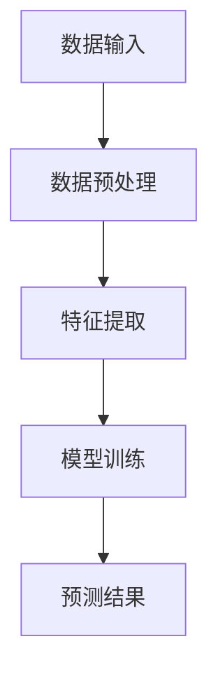
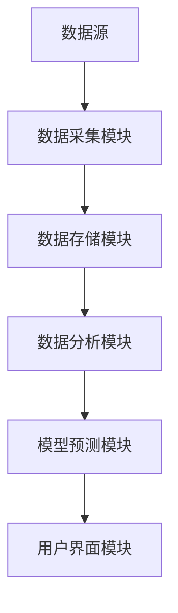

                 


# 彼得林奇的"市场机会"识别技巧

## 关键词：
彼得林奇，市场机会，投资策略，选股标准，市场分析，投资系统，数学模型

## 摘要：
彼得·林奇作为全球著名投资家，以其独特的市场机会识别技巧闻名。本文将深入分析彼得林奇的投资哲学、选股标准、市场分析方法，结合数学模型和系统架构，提供一套完整的市场机会识别系统，并通过实际案例展示其应用。

---

## 第一部分：背景介绍

### 第1章：彼得林奇与市场机会识别概述

#### 1.1 彼得林奇的背景与投资哲学
- **1.1.1 彼得林奇的生平简介**
  - 彼得·林奇的早期经历
  - 他的投资成就与声誉
- **1.1.2 彼得林奇的投资哲学**
  - 长期投资与价值发现
  - 避免短期波动，关注长期趋势
- **1.1.3 彼得林奇对市场的独特见解**
  - 市场波动中的机会捕捉
  - 行业趋势与公司基本面的结合

#### 1.2 市场机会识别的重要性
- **1.2.1 投资者为何需要识别市场机会**
  - 市场机会是投资收益的核心来源
  - 识别市场机会的能力决定投资成败
- **1.2.2 市场机会识别的基本概念**
  - 定义：市场机会是什么
  - 类型：行业机会、公司机会、宏观经济机会
  - 特性：可量化、可预测、可持续
- **1.2.3 识别市场机会的边界与外延**
  - 边界：市场机会的范围与限制
  - 外延：市场机会与其他投资策略的关系

---

## 第二部分：核心概念与联系

### 第2章：彼得林奇的选股标准

#### 2.1 彼得林奇选股的核心要素
- **2.1.1 公司基本面分析**
  - 财务状况：利润、负债、现金流
  - 管理团队：稳定性与能力
  - 市场地位：行业排名与竞争优势
- **2.1.2 行业地位与竞争优势**
  - 行业趋势：增长型与防御型行业
  - 市场份额：公司在行业中的位置
  - 技术创新：技术壁垒与竞争优势
- **2.1.3 财务健康状况评估**
  - 盈利能力：净利润率与ROE
  - 偿债能力：负债率与流动比率
  - 成长能力：收入增长率与净利润增长率

#### 2.2 彼得林奇的选股标准对比分析
- **2.2.1 核心要素对比表格**
  | 标准       | 影响因素               | 重要性权重 |
  |------------|------------------------|------------|
  | 财务状况   | 利润、负债、现金流     | 高          |
  | 管理团队   | 稳定性与能力           | 中          |
  | 市场地位   | 份额与技术创新         | 高          |
- **2.2.2 实体关系图（ER图）**
  ```mermaid
  graph TD
  A[公司基本面] --> B[财务状况]
  A --> C[管理团队]
  A --> D[行业地位]
  D --> E[竞争优势]
  ```

---

### 第3章：彼得林奇的市场分析方法

#### 3.1 市场分析的核心原理
- **3.1.1 市场周期分析**
  - 经济周期与市场波动
  - 不同周期下的投资策略
- **3.1.2 行业趋势预测**
  - 行业生命周期理论
  - 增长行业与衰退行业的识别
- **3.1.3 宏观经济指标的影响**
  - 利率、通货膨胀、GDP增长对市场的综合影响

---

## 第三部分：算法原理讲解

### 第4章：彼得林奇选股模型的数学解析

#### 4.1 模型概述
- **模型目标**：基于彼得林奇的选股标准，构建一个数学模型，量化市场机会。
- **输入数据**：公司基本面数据、行业趋势数据、宏观经济指标。
- **输出结果**：预测的股票价值与投资建议。

#### 4.2 数学模型与公式
- **公式推导**：
  $$P = \alpha \times F + \beta \times T + \gamma \times C$$
  - $P$：预测的股票价值
  - $F$：财务指标加权
  - $T$：行业趋势加权
  - $C$：竞争优势加权
  - $\alpha, \beta, \gamma$：权重系数，根据数据拟合确定。
- **权重系数的确定**：
  - 使用回归分析法确定$\alpha, \beta, \gamma$的值。
  - 通过历史数据验证模型的准确性。

#### 4.3 算法流程图


---

## 第四部分：系统分析与架构设计

### 第5章：市场机会识别系统的架构设计

#### 5.1 问题场景介绍
- 投资者如何快速识别市场机会？
- 如何将彼得林奇的方法转化为可执行的系统？

#### 5.2 系统功能设计
- **数据采集模块**：实时采集市场数据。
- **数据分析模块**：执行财务分析、行业分析、趋势预测。
- **模型预测模块**：基于数学模型生成投资建议。
- **用户界面模块**：直观展示市场机会。

#### 5.3 系统架构设计


---

## 第五部分：项目实战

### 第6章：基于彼得林奇方法的市场机会识别系统实现

#### 6.1 环境安装
- **工具安装**：Python、Pandas、NumPy、Scikit-learn、Matplotlib。
- **数据源**：获取股票数据（如Yahoo Finance）。

#### 6.2 核心代码实现
```python
import pandas as pd
import numpy as np
from sklearn.linear_model import LinearRegression

# 数据预处理
data = pd.read_csv('stock_data.csv')
X = data[['revenue', 'profit_margin', 'market_share']]
y = data['stock_price']

# 训练模型
model = LinearRegression()
model.fit(X, y)

# 预测
new_data = pd.DataFrame({
    'revenue': [1000000],
    'profit_margin': [20],
    'market_share': [30]
})
predicted_price = model.predict(new_data)
print(predicted_price)
```

#### 6.3 案例分析
- **案例背景**：假设分析一家科技公司的股票。
- **数据输入**：收入、利润率、市场份额。
- **模型预测**：生成股票价格预测。
- **结果解读**：根据预测结果给出投资建议。

#### 6.4 项目小结
- 项目目标：实现市场机会识别系统。
- 项目成果：基于彼得林奇方法的数学模型。
- 项目意义：为投资者提供科学的市场机会识别工具。

---

## 第六部分：最佳实践与小结

### 第7章：彼得林奇方法的实战应用与优化

#### 7.1 最佳实践
- **持续学习**：关注市场动态，更新模型。
- **风险管理**：分散投资，降低风险。
- **避免误区**：不要盲目跟风，注重基本面分析。

#### 7.2 小结
- 彼得林奇的市场机会识别方法是一种科学的投资策略。
- 通过数学模型和系统设计，可以将这种方法转化为可执行的投资工具。
- 投资者需要结合市场变化，不断优化自己的投资策略。

#### 7.3 注意事项
- 数据质量：确保数据来源可靠。
- 模型验证：通过历史数据验证模型的有效性。
- 风险提示：投资有风险，需谨慎操作。

#### 7.4 未来展望
- 结合人工智能技术，进一步优化市场机会识别系统。
- 开发更智能的投资辅助工具。

---

## 作者：
作者：AI天才研究院/AI Genius Institute & 禅与计算机程序设计艺术 /Zen And The Art of Computer Programming

