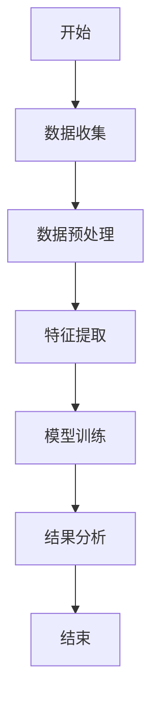

                 


# 彼得林奇的"市场适应能力"分析方法

> 关键词：彼得·林奇、市场适应能力、投资分析、技术方法、投资策略、金融市场

> 摘要：本文通过分析彼得·林奇的市场适应能力，探讨其投资理念与技术分析方法的结合，为投资者提供一种全新的视角来评估市场环境和投资机会。

---

## 第一章：背景介绍

### 1.1 彼得·林奇的背景与投资理念
彼得·林奇是美国著名的职业棒球运动员和投资专家，以其独特的市场适应能力分析方法闻名。他不仅是一位成功的投资者，还是一位善于总结投资经验的作家。他的投资理念强调市场适应能力的重要性，即在不同市场环境下，投资者需要具备灵活调整策略的能力。

### 1.2 市场适应能力的定义与特征
市场适应能力是指投资者在不同市场环境下，能够迅速调整投资策略，捕捉市场机会的能力。其特征包括：
- **灵活性**：根据市场变化快速调整策略。
- **洞察力**：准确识别市场趋势和潜在机会。
- **风险管理**：在市场波动中有效控制风险。

### 1.3 分析框架
市场适应能力的分析框架包括数据收集、数据预处理、特征提取、模型训练和结果分析五个步骤。

---

## 第二章：市场适应能力的核心概念与联系

### 2.1 核心概念原理
市场适应能力的核心在于通过数据分析和模型构建，识别市场的潜在变化趋势。其数学模型可以表示为：
$$
\text{市场适应能力} = \frac{\text{投资收益}}{\text{市场波动}}
$$
其中，投资收益和市场波动是关键指标。

### 2.2 算法原理讲解
#### 2.2.1 市场适应能力分析算法的mermaid流程图


#### 2.2.2 算法原理的Python源代码实现
```python
def market_adaptability_analysis(data):
    # 数据预处理
    processed_data = preprocess(data)
    # 特征提取
    features = extract_features(processed_data)
    # 模型训练
    model = train_model(features)
    # 结果分析
    result = analyze_result(model)
    return result
```

### 2.3 数学模型与公式
#### 2.3.1 市场适应能力的数学模型
$$
\text{市场适应能力} = \frac{\text{投资收益}}{\text{市场波动}}
$$

#### 2.3.2 市场适应能力的特征函数
$$
f(x) = \sum_{i=1}^{n} w_i x_i
$$

---

## 第三章：市场适应能力的系统架构设计

### 3.1 系统功能设计
市场适应能力分析系统包括数据采集模块、数据处理模块、模型训练模块和结果展示模块。

#### 3.1.1 数据采集模块
负责收集市场数据，如股票价格、交易量等。

#### 3.1.2 数据处理模块
对数据进行清洗和转换，确保数据质量。

#### 3.1.3 模型训练模块
基于特征提取和机器学习算法，构建市场适应能力模型。

#### 3.1.4 结果展示模块
将分析结果以可视化形式展示，便于投资者理解和决策。

### 3.2 系统架构设计


### 3.3 接口设计与交互流程
系统通过API接口与数据源对接，交互流程包括数据请求、处理、分析和结果返回。

---

## 第四章：市场适应能力分析的项目实战

### 4.1 环境安装
需要安装Python、Pandas、Scikit-learn等库。

### 4.2 核心代码实现
```python
import pandas as pd
from sklearn.model_selection import train_test_split
from sklearn.linear_model import LinearRegression

def preprocess(data):
    # 数据清洗和转换
    return data.dropna()

def extract_features(data):
    # 提取特征
    return data[['price', 'volume']]

def train_model(features):
    # 训练模型
    X_train, X_test, y_train, y_test = train_test_split(features, target, test_size=0.2)
    model = LinearRegression()
    model.fit(X_train, y_train)
    return model

def analyze_result(model):
    # 分析结果
    predictions = model.predict(X_test)
    return predictions
```

### 4.3 案例分析
以某股票为例，展示如何应用上述方法进行市场适应能力分析。

### 4.4 实际案例分析与结果解读
通过具体案例，分析模型的预测结果和实际市场表现，评估模型的有效性。

---

## 第五章：总结与展望

### 5.1 总结
彼得·林奇的市场适应能力分析方法结合了技术分析和投资策略，为投资者提供了全新的视角。

### 5.2 最佳实践 Tips
- 定期更新模型，适应市场变化。
- 结合多种分析方法，提高准确性。
- 注意风险管理，避免过度投资。

### 5.3 未来研究方向
- 探讨更多机器学习算法在市场适应能力分析中的应用。
- 研究如何结合市场情绪分析提高模型的准确性。

---

## 作者

作者：AI天才研究院/AI Genius Institute & 禅与计算机程序设计艺术/Zen And The Art of Computer Programming

---

通过以上步骤，我们可以系统地分析彼得·林奇的市场适应能力，结合技术方法，帮助投资者提升分析能力和投资决策能力。

