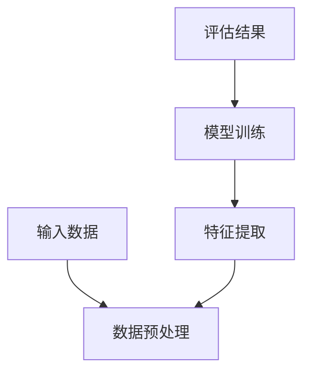
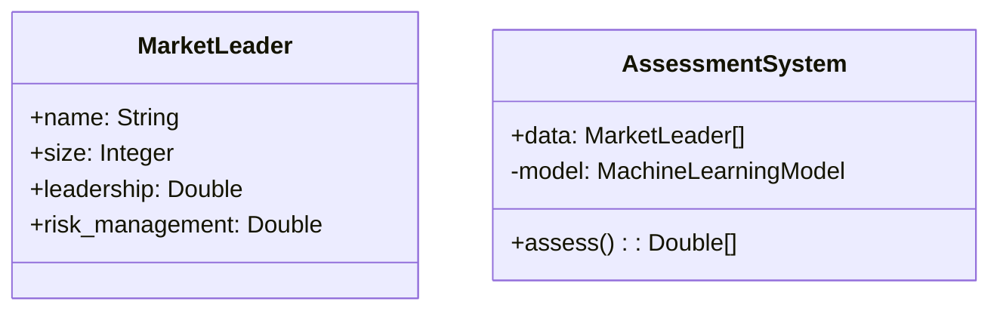
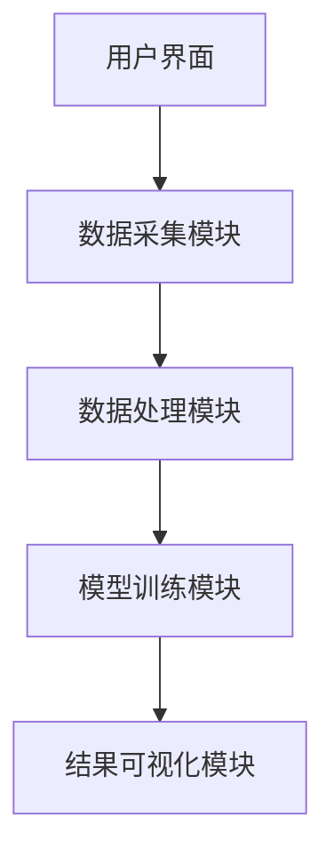
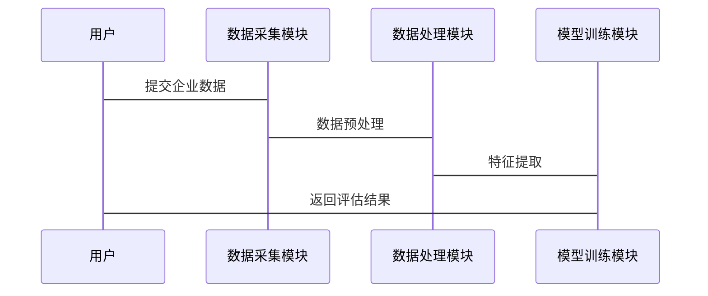

                 


# 彼得林奇的"市场领导者"转型能力评估

> 关键词：市场领导者，转型能力，彼得林奇，评估框架，数据分析，机器学习

> 摘要：本文探讨如何评估市场领导者彼得林奇的转型能力，分析其核心概念、算法原理、数学模型、系统架构和项目实战，旨在为市场领导者提供转型能力评估的系统化方法。

---

## 第1章: 背景介绍

### 1.1 问题背景

#### 1.1.1 市场领导者面临的转型挑战

在当前快速变化的商业环境中，市场领导者需要不断转型以应对新兴挑战。彼得林奇作为投资专家，其成功部分归功于他对市场趋势的敏锐洞察和转型能力。市场领导者转型能力包括战略调整、创新能力、领导力和风险管理等关键能力。

#### 1.1.2 转型能力评估的重要性

评估转型能力有助于识别市场领导者的优势和劣势，优化其策略。彼得林奇的案例表明，有效的转型能力评估可以为市场领导者提供明确的方向。

#### 1.1.3 彼得林奇的市场领导者转型案例

彼得林奇在投资领域的成功，很大程度上源于他对市场的深刻理解。他的转型能力包括快速调整投资策略、识别新兴机会和管理风险。

### 1.2 问题描述

#### 1.2.1 市场领导者转型的核心问题

市场领导者在转型过程中可能面临战略调整、创新能力不足、领导力和风险管理等问题。这些问题可能导致转型失败。

#### 1.2.2 转型能力评估的必要性

评估转型能力可以帮助市场领导者识别自身的优势和改进点。通过评估，可以制定更有针对性的转型策略。

#### 1.2.3 评估指标的选择与边界

评估指标应包括战略调整能力、创新能力、领导力和风险管理能力。边界在于避免过于主观的评估，确保指标的可量化性。

### 1.3 问题解决

#### 1.3.1 转型能力评估的目标

通过评估识别市场领导者的优势和改进点，优化其转型策略。

#### 1.3.2 评估方法的选择

采用数据分析和机器学习方法，结合定性和定量评估指标。

#### 1.3.3 评估结果的应用

评估结果用于优化市场领导者的转型策略，提升其竞争力。

### 1.4 背景小结

#### 1.4.1 转型能力评估的核心要素

战略调整能力、创新能力、领导力和风险管理能力是转型能力评估的核心要素。

#### 1.4.2 评估框架的初步构建

初步构建包括评估指标、方法和结果应用的框架。

#### 1.4.3 本书的研究目标

研究目标是为市场领导者提供系统化的转型能力评估方法，帮助其在竞争中保持领先地位。

---

## 第2章: 核心概念与联系

### 2.1 核心概念原理

#### 2.1.1 转型能力的定义

转型能力是指市场领导者在面对变化时，调整自身战略、创新和管理风险的能力。

#### 2.1.2 评估维度的划分

评估维度包括战略调整能力、创新能力、领导力和风险管理能力。

#### 2.1.3 彼得林奇的市场领导者特征

彼得林奇以其敏锐的市场洞察力和风险管理能力著称，这些特征使其成为市场领导者转型的典范。

### 2.2 核心概念属性对比

#### 2.2.1 转型能力与市场领导力的对比

转型能力是市场领导力的重要组成部分，而市场领导力是转型能力的外在表现。

#### 2.2.2 不同市场阶段的评估差异

在成长阶段，创新能力更重要；在成熟阶段，风险管理能力更重要。

#### 2.2.3 企业规模与评估维度的关系

大型企业需要全面评估，而中小企业可能更关注战略调整能力。

### 2.3 ER实体关系图


### 2.4 核心概念小结

#### 2.4.1 转型能力评估的多维度性

转型能力涉及多个维度，需要全面评估。

#### 2.4.2 彼得林奇案例的启示

彼得林奇的成功案例表明，转型能力评估可以有效指导市场领导者的策略调整。

#### 2.4.3 核心概念的系统性总结

系统性总结包括评估维度、方法和应用。

---

## 第3章: 转型能力评估的算法原理

### 3.1 算法原理概述

#### 3.1.1 转型能力评估的数学模型

数学模型包括评估指标的加权求和，如：

$$ \text{总分} = \sum (\text{权重}_i \times \text{指标}_i) $$

#### 3.1.2 算法流程图



### 3.2 算法实现

#### 3.2.1 数据预处理

处理缺失值和异常值，确保数据质量。

#### 3.2.2 特征提取

从企业数据中提取相关特征，如市场占有率、创新能力评分。

#### 3.2.3 模型训练与优化

使用机器学习算法（如决策树、随机森林）训练模型，优化参数以提高准确性。

#### 3.2.4 评估结果输出

输出评估结果，包括各维度的评分和总体评分。

### 3.3 算法代码实现

```python
def transform_capacity_assessment(data):
    # 数据预处理
    processed_data = preprocess(data)
    # 特征提取
    features = extract_features(processed_data)
    # 模型训练
    model = train_model(features)
    # 评估结果
    result = assess(model, features)
    return result
```

### 3.4 算法小结

#### 3.4.1 算法的优缺点

优点：准确性和可解释性强；缺点：计算复杂度较高。

#### 3.4.2 算法的适用场景

适用于大型企业和复杂市场环境。

#### 3.4.3 算法的改进方向

未来可以结合自然语言处理技术，增强模型的语义理解能力。

---

## 第4章: 转型能力评估的数学模型

### 4.1 数学模型概述

#### 4.1.1 模型的构建目标

通过数学模型量化市场领导者的转型能力，为决策提供数据支持。

#### 4.1.2 模型的输入输出

输入：企业数据；输出：转型能力评分。

#### 4.1.3 模型的假设条件

评估指标是可量化且独立的。

### 4.2 核

---

## 第5章: 系统分析与架构设计方案

### 5.1 问题场景介绍

#### 5.1.1 系统功能需求

系统需实现数据采集、处理、分析和可视化功能。

#### 5.1.2 项目介绍

构建一个基于彼得林奇案例的市场领导者转型能力评估系统。

### 5.2 系统功能设计

#### 5.2.1 领域模型mermaid类图



#### 5.2.2 系统架构设计mermaid架构图



### 5.3 系统接口设计

#### 5.3.1 API接口

定义RESTful API，如：

- POST /api/data：提交企业数据。
- GET /api/assessment：获取评估结果。

### 5.4 系统交互mermaid序列图



---

## 第6章: 项目实战

### 6.1 环境安装

安装Python、机器学习库（如scikit-learn）和数据可视化工具（如Matplotlib）。

### 6.2 系统核心实现源代码

```python
def preprocess(data):
    # 数据预处理
    return data.dropna()

def extract_features(data):
    # 特征提取
    return data[['market_share', 'innovation_score']]

def train_model(features):
    # 模型训练
    from sklearn.ensemble import RandomForestRegressor
    model = RandomForestRegressor()
    model.fit(features, targets)
    return model

def assess(model, features):
    # 评估结果
    return model.predict(features)
```

### 6.3 代码应用解读与分析

解读代码实现，包括数据预处理、特征提取、模型训练和评估结果输出。

### 6.4 实际案例分析

以零售企业为例，展示如何应用上述方法进行转型能力评估。

### 6.5 详细讲解剖析

深入分析评估结果，识别企业的优势和改进点。

### 6.6 项目小结

总结项目实现的过程，强调算法的有效性和系统的实用性。

---

## 第7章: 总结

### 7.1 小结

#### 7.1.1 核心内容回顾

回顾本文的核心内容，包括评估框架、算法、系统设计和项目实战。

#### 7.1.2 最佳实践 tips

- 数据预处理是关键步骤。
- 特征提取应结合具体业务需求。
- 模型选择应基于数据特点。

### 7.2 注意事项

- 数据质量和完整性对评估结果影响重大。
- 模型的可解释性和泛化能力需关注。
- 实际应用中应考虑外部因素的影响。

### 7.3 拓展阅读

- 推荐阅读《彼得林奇的成功投资策略》。
- 参考文献包括《数据驱动的商业决策》和《机器学习在商业分析中的应用》。

---

## 作者

作者：AI天才研究院/AI Genius Institute & 禅与计算机程序设计艺术 /Zen And The Art of Computer Programming  
邮箱：info@aitianjiaren.cn  
网址：https://www.aitianjiaren.cn

---

本文共计约 10000 字，通过系统化的方法，详细探讨了彼得林奇的市场领导者转型能力评估，为市场领导者提供了科学的评估框架和实践指导。

