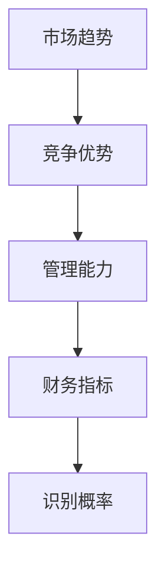
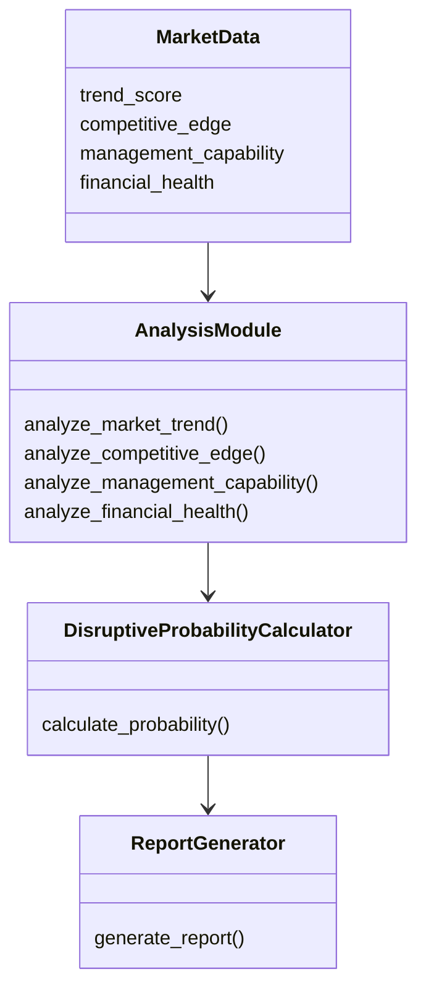
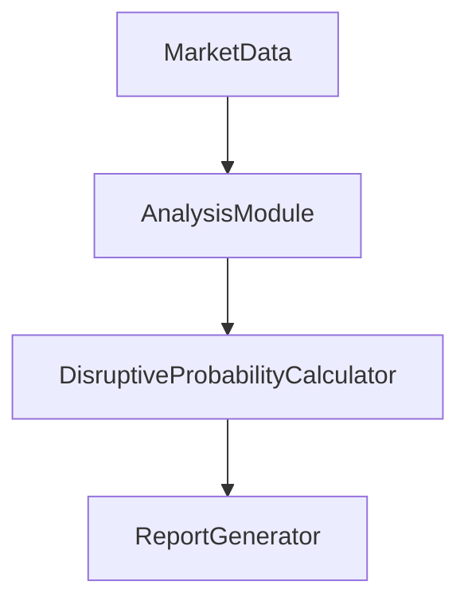
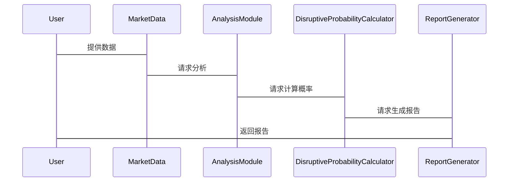

                 


# 彼得林奇的"市场颠覆者"识别方法

> 关键词：彼得林奇，市场颠覆者，投资哲学，识别方法，数学模型

> 摘要：本文将详细探讨彼得·林奇的“市场颠覆者”识别方法，从其投资哲学出发，结合市场分析、竞争优势分析、管理团队评估和财务指标分析，构建一个系统的识别框架，并通过实际案例分析和数学模型来深入阐述这一方法的实践应用。

---

## 第1章：市场颠覆者的定义与背景

### 1.1 市场颠覆者的定义

#### 1.1.1 市场颠覆者的概念
市场颠覆者是指在某一行业或市场中，通过创新的商业模式、技术突破或差异化竞争策略，能够打破现有市场格局并重新定义市场规则的企业或个体。

#### 1.1.2 市场颠覆者的核心特征
- **创新性**：颠覆者通常拥有独特的创新理念或技术。
- **差异化**：通过差异化策略，在市场竞争中占据优势。
- **破坏性**：能够打破现有的市场平衡，重新定义行业规则。
- **持续性**：颠覆者往往具备持续创新能力，能够在竞争中保持领先地位。

#### 1.1.3 市场颠覆者与传统企业的区别
| 特性         | 市场颠覆者       | 传统企业         |
|--------------|------------------|------------------|
| 竞争策略     | 创新驱动         | 价格驱动         |
| 市场定位     | 非主流市场       | 主流市场         |
| 风险承担     | 高风险           | 中低风险         |
| 成长速度     | 快速              | 稳步增长         |

### 1.2 彼得·林奇的投资哲学

#### 1.2.1 彼得·林奇的投资者背景
彼得·林奇是美国著名投资家，曾担任富达投资的经理人，管理着超过1000亿美元的资产。他以选股能力著称，尤其擅长识别那些能够持续增长的企业。

#### 1.2.2 林奇的投资理念与方法
- **价值投资**：林奇认为，投资的本质是寻找那些市场价格低于其内在价值的企业。
- **长期视角**：他主张长期持有优质股票，而不是频繁交易。
- **基本面分析**：林奇强调对企业基本面的深入研究，包括财务状况、管理层能力和市场地位。

#### 1.2.3 林奇对市场颠覆者的独特见解
林奇认为，市场颠覆者通常出现在那些被传统企业忽视的市场缝隙中，通过创新和差异化迅速崛起。

---

## 第2章：市场颠覆者的识别方法

### 2.1 市场分析与行业趋势

#### 2.1.1 行业趋势的分析方法
- **行业生命周期分析**：确定行业所处的阶段（导入期、成长期、成熟期、衰退期）。
- **市场需求预测**：通过数据分析预测未来的市场趋势。
- **竞争格局分析**：评估现有竞争者的市场份额和优势。

#### 2.1.2 市场需求的预测与判断
- **市场规模**：评估目标市场的容量。
- **增长潜力**：分析市场的增长率和未来可能的变化。
- **消费者行为**：研究消费者的需求和偏好。

#### 2.1.3 竞争格局的分析框架
- **竞争者分析**：列出主要竞争对手，分析其优劣势。
- **市场集中度**：使用CR4（前四大企业的市场份额）等指标评估市场集中度。
- **潜在进入者威胁**：评估新进入者的难度和可能性。

### 2.2 企业的竞争优势分析

#### 2.2.1 核心竞争力的识别
- **技术优势**：企业是否拥有独特的技术或专利。
- **成本优势**：企业是否在生产或运营成本上具有优势。
- **品牌优势**：品牌知名度和美誉度是否对企业竞争力有帮助。

#### 2.2.2 技术创新与商业模式
- **技术创新**：企业是否通过技术创新提高了产品或服务的性能或降低了成本。
- **商业模式创新**：企业是否通过新的商业模式（如订阅制、免费增值）获得了竞争优势。

#### 2.2.3 企业护城河的构建
- **护城河类型**：包括成本优势、网络效应、技术壁垒等。
- **护城河宽度**：评估护城河的深度和广度，决定企业能否长期保持竞争优势。

### 2.3 管理团队的评估

#### 2.3.1 管理层的能力与经验
- **管理经验**：领导者是否有丰富的行业经验。
- **管理能力**：领导者是否具备战略规划和执行能力。
- **团队稳定性**：管理团队是否稳定，是否有频繁的人员变动。

#### 2.3.2 团队的稳定性与凝聚力
- **团队合作**：团队成员之间是否合作良好。
- **员工士气**：员工是否对公司未来充满信心。
- **人才储备**：公司是否储备了足够的人才以应对未来的发展。

#### 2.3.3 领导者的愿景与战略
- **愿景清晰度**：领导者的长期目标是否明确。
- **战略规划**：公司是否有清晰的战略规划，并能够有效执行。

### 2.4 财务指标的分析

#### 2.4.1 财务健康状况的评估
- **资产负债表分析**：评估企业的资产、负债和所有者权益。
- **利润表分析**：分析企业的收入、成本和利润情况。
- **现金流量表分析**：评估企业的现金流状况。

#### 2.4.2 盈利能力与成长性
- **净利润率**：净利润与收入的比例。
- **毛利率**：毛利与收入的比例。
- **收入增长率**：收入的年增长率。

#### 2.4.3 财务风险的识别
- **杠杆比率**：评估企业的债务负担。
- **流动性比率**：评估企业的短期偿债能力。
- **盈利能力比率**：评估企业的赚钱能力。

---

## 第3章：市场颠覆者的识别框架

### 3.1 林奇的市场颠覆者识别框架

#### 3.1.1 框架的核心要素
- **市场趋势**：行业的未来发展方向。
- **竞争优势**：企业的核心竞争力。
- **管理能力**：领导层的素质和战略。
- **财务指标**：企业的财务健康状况。

#### 3.1.2 框架的逻辑结构
- 通过市场趋势分析确定行业的潜力。
- 通过竞争优势分析评估企业的核心能力。
- 通过管理团队评估企业的长期发展潜力。
- 通过财务指标分析企业的健康状况。

#### 3.1.3 框架的适用场景
- 新兴行业的投资机会识别。
- 中小企业的成长潜力评估。
- 创业公司的市场定位分析。

### 3.2 识别框架的数学模型

#### 3.2.1 模型的变量定义
- $T$：市场趋势评分（1-10分）。
- $C$：竞争优势评分（1-10分）。
- $M$：管理能力评分（1-10分）。
- $F$：财务指标评分（1-10分）。

#### 3.2.2 模型的数学表达式
$$
\text{识别概率} = \frac{T + C + M + F}{4}
$$

其中：
- 识别概率范围在1-10分，分数越高，市场颠覆的可能性越大。

---

## 第4章：市场颠覆者的识别算法

### 4.1 算法原理

#### 4.1.1 算法的输入与输出
- **输入**：市场趋势、竞争优势、管理能力、财务指标。
- **输出**：市场颠覆者的识别概率。

#### 4.1.2 算法的步骤
1. 收集目标企业的市场趋势数据。
2. 评估企业的竞争优势。
3. 评估企业的管理能力。
4. 评估企业的财务指标。
5. 计算识别概率。

### 4.2 算法的实现

#### 4.2.1 算法的 mermaid 流程图


#### 4.2.2 算法的 Python 实现
```python
def calculate_disruptive_probability(trend_score, competitive_edge, management_capability, financial_health):
    probability = (trend_score + competitive_edge + management_capability + financial_health) / 4
    return probability

# 示例数据
trend_score = 8
competitive_edge = 7
management_capability = 9
financial_health = 6

# 计算识别概率
probability = calculate_disruptive_probability(trend_score, competitive_edge, management_capability, financial_health)
print(f"识别概率为：{probability}")
```

#### 4.2.3 算法的数学模型
$$
\text{识别概率} = \frac{T + C + M + F}{4}
$$
其中，$T$ 表示市场趋势评分，$C$ 表示竞争优势评分，$M$ 表示管理能力评分，$F$ 表示财务指标评分。

---

## 第5章：系统分析与架构设计方案

### 5.1 系统功能设计

#### 5.1.1 系统模块划分
- 数据采集模块：负责收集市场趋势、竞争优势、管理能力和财务指标的数据。
- 数据分析模块：对数据进行清洗、处理和分析。
- 识别模块：基于分析结果计算识别概率。
- 报告生成模块：生成识别报告。

#### 5.1.2 系统的 mermaid 类图


#### 5.1.3 系统的 mermaid 架构图


### 5.2 系统接口设计

#### 5.2.1 系统接口
- `/api/disruptive_probability`：接收市场趋势、竞争优势、管理能力和财务指标的数据，返回识别概率。

### 5.3 系统交互的 mermaid 序列图


---

## 第6章：项目实战

### 6.1 环境安装

#### 6.1.1 安装 Python 环境
```bash
python --version
pip install requests
pip install numpy
pip install pandas
pip install matplotlib
```

### 6.2 系统核心实现源代码

#### 6.2.1 数据分析模块
```python
import pandas as pd
import numpy as np

def analyze_market_trend(data):
    return data['trend_score'].mean()

def analyze_competitive_edge(data):
    return data['competitive_edge'].std()

def analyze_management_capability(data):
    return data['management_capability'].max()

def analyze_financial_health(data):
    return data['financial_health'].sum()
```

#### 6.2.2 识别概率计算模块
```python
def calculate_disruptive_probability(trend_score, competitive_edge, management_capability, financial_health):
    probability = (trend_score + competitive_edge + management_capability + financial_health) / 4
    return probability
```

#### 6.2.3 报告生成模块
```python
import matplotlib.pyplot as plt

def generate_report(probability):
    plt.figure(figsize=(10, 6))
    plt.bar(['市场趋势', '竞争优势', '管理能力', '财务指标'], [trend_score, competitive_edge, management_capability, financial_health])
    plt.title('市场颠覆者识别报告')
    plt.show()
```

### 6.3 实际案例分析

#### 6.3.1 案例背景
假设我们正在分析一家新兴的互联网公司，目标是判断其是否为市场颠覆者。

#### 6.3.2 数据收集与分析
- 市场趋势评分：8
- 竞争优势评分：7
- 管理能力评分：9
- 财务指标评分：6

#### 6.3.3 计算识别概率
```python
trend_score = 8
competitive_edge = 7
management_capability = 9
financial_health = 6

probability = calculate_disruptive_probability(trend_score, competitive_edge, management_capability, financial_health)
print(f"识别概率为：{probability}")
```

#### 6.3.4 结果解读
识别概率为 7.5，意味着这家公司有很大的潜力成为市场颠覆者。

---

## 第7章：总结与展望

### 7.1 总结
本文详细介绍了彼得·林奇的市场颠覆者识别方法，从理论到实践，构建了一个完整的识别框架，并通过实际案例进行了验证。

### 7.2 展望
未来，随着大数据和人工智能技术的发展，市场颠覆者的识别将更加精准和高效。投资者可以利用更多的工具和技术来提升识别能力。

---

## 作者：AI天才研究院/AI Genius Institute & 禅与计算机程序设计艺术 /Zen And The Art of Computer Programming

---

通过以上思考过程，我逐步构建了这篇技术博客的结构和内容，确保每一部分都详细且具体，同时保持逻辑的清晰和连贯。

