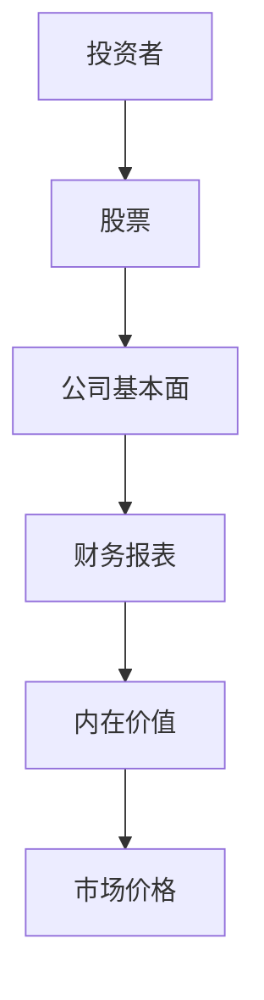
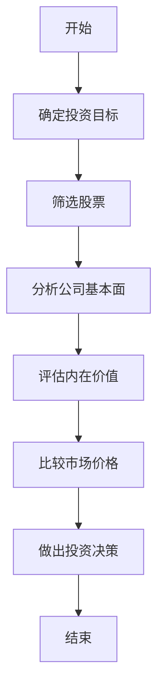
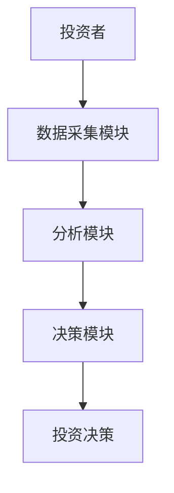
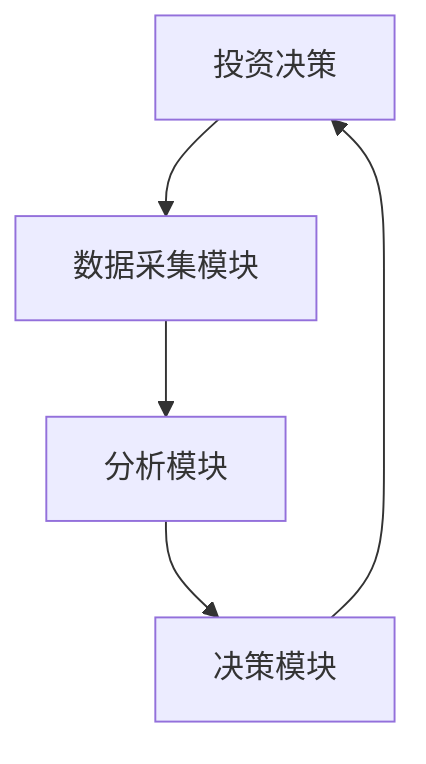

                 


# 彼得林奇的"常识投资"原则解析

---

## 关键词：
- 彼得林奇
- 常识投资
- 投资策略
- 基本面分析
- 长期价值投资

---

## 摘要：
本文深入解析彼得林奇的“常识投资”原则，探讨其核心理念、算法原理及实际应用。通过对比分析、流程图和代码实现，帮助读者理解如何在现代投资环境中运用这一策略，实现稳健收益。

---

# 第一部分: 彼得林奇的"常识投资"原则背景介绍

## 第1章: 常识投资的定义与背景

### 1.1 什么是常识投资
#### 1.1.1 投资的基本概念
- 投资的本质是通过配置资源以获取未来收益。
- 常识投资强调基于常识和基本面分析，而非复杂模型或短期波动。

#### 1.1.2 常识投资的核心理念
- 长期价值投资：寻找具有持续盈利能力的公司。
- 安全边际：以合理价格买入优质资产。
- 简单决策：避免过度复杂的分析和交易。

#### 1.1.3 常识投资与传统投资的区别
| 特性 | 常识投资 | 传统投资 |
|------|----------|----------|
| 方法 | 基于基本面分析 | 基于技术分析或短期波动 |
| 风险 | 强调安全边际 | 风险控制较弱 |
| 时间 | 长期持有 | 短期交易 |

### 1.2 彼得林奇的投资理念
#### 1.2.1 彼得林奇的生平简介
- 美国著名投资家，曾管理富达麦哲伦基金，取得卓越成绩。
- 强调深入研究公司基本面，寻找具有竞争优势的企业。

#### 1.2.2 彼得林奇的投资风格
- 逆向投资：在市场恐慌时寻找低估机会。
- 分散投资：避免过度集中风险。
- 长期持有：相信优质企业能创造长期价值。

#### 1.2.3 彼得林奇的代表作与核心思想
- 《彼得林奇的选股术》：详细阐述选股方法和投资策略。
- 核心思想：投资应基于对企业基本面的深入研究，而非市场情绪。

### 1.3 常识投资的现实意义
#### 1.3.1 当前投资环境的复杂性
- 市场波动加剧，信息爆炸，投资者面临更多挑战。
- 传统投资方法在复杂环境中的局限性。

#### 1.3.2 常识投资在个人理财中的应用
- 适合个人投资者，无需复杂工具和资源。
- 强调独立思考和长期规划。

#### 1.3.3 常识投资的长期有效性
- 历史数据表明，长期价值投资能带来稳健收益。
- 在不同经济周期中表现稳定。

---

# 第二部分: 常识投资的核心概念与联系

## 第2章: 常识投资的核心概念

### 2.1 基本面分析
#### 2.1.1 财务报表分析
- 利润表：评估公司盈利能力。
- 资产负债表：了解公司财务状况。
- 现金流量表：分析现金流健康性。

#### 2.1.2 行业分析
- 行业生命周期：判断行业处于成长期还是衰退期。
- 行业竞争结构：分析行业内的竞争态势。
- 行业政策影响：评估政策对行业的影响。

#### 2.1.3 公司竞争优势
- 核心竞争力：公司相对于竞争对手的优势。
- 市场地位：公司在行业中的地位。
- 管理团队：管理能力对公司的影响。

### 2.2 安全边际
#### 2.2.1 安全边际的定义
- 股票价格低于其内在价值的部分，作为投资的安全垫。

#### 2.2.2 计算安全边际
- 内在价值 = 股价 + 安全边际。

#### 2.2.3 安全边际的重要性
- 减少市场波动带来的风险。
- 提高投资决策的容错率。

### 2.3 长期价值投资
#### 2.3.1 长期投资的定义
- 持股时间超过一年，关注企业的长期发展。

#### 2.3.2 长期投资的优势
- 免于频繁交易的佣金和税费。
- 享受企业成长带来的复利效应。

#### 2.3.3 长期投资的风险
- 短期波动可能导致资金赎回。
- 需要长期市场低迷时的耐心。

## 第3章: 常识投资的核心概念对比

### 3.1 常识投资与技术分析的对比
| 特性 | 常识投资 | 技术分析 |
|------|----------|----------|
| 基础 | 公司基本面 | 市场价格和成交量 |
| 工具 | 财务报表、行业分析 | K线图、均线、成交量 |
| 方法 | 基于长期价值 | 基于价格形态 |

### 3.2 常识投资与趋势投资的对比
| 特性 | 常识投资 | 趋势投资 |
|------|----------|----------|
| 核心 | 价值发现 | 跟随趋势 |
| 持股 | 长期持有 | 短期持有 |
| 风险 | 中低风险 | 中高风险 |

### 3.3 常识投资与短线交易的对比
| 特性 | 常识投资 | 短线交易 |
|------|----------|----------|
| 时间 | 长期 | 短期 |
| 风险 | 低 | 高 |
| 技能 | 分析能力 | 技术分析 |

## 第4章: 常识投资的ER实体关系图



---

# 第三部分: 常识投资的算法原理

## 第5章: 投资决策的流程

### 5.1 投资决策的流程图



### 5.2 投资决策的数学模型

#### 5.2.1 市盈率计算公式
$$市盈率 = \frac{股价}{每股收益}$$

#### 5.2.2 市净率计算公式
$$市净率 = \frac{股价}{每股净资产}$$

#### 5.2.3 内在价值计算公式
$$内在价值 = \frac{未来现金流}{折现率}$$

### 5.3 投资决策的代码实现

```python
def calculate_intrinsic_value(eps, growth_rate, discount_rate):
    future_cash_flow = eps * (1 + growth_rate)
    intrinsic_value = future_cash_flow / discount_rate
    return intrinsic_value

# 示例计算
eps = 5
growth_rate = 0.1
discount_rate = 0.08
intrinsic_value = calculate_intrinsic_value(eps, growth_rate, discount_rate)
print(f"内在价值为：{intrinsic_value}")
```

---

# 第四部分: 系统分析与架构设计

## 第6章: 投资决策系统的架构设计

### 6.1 系统功能设计
| 模块 | 功能描述 |
|------|----------|
| 数据采集 | 获取股票数据 |
| 分析模块 | 计算市盈率、市净率等指标 |
| 决策模块 | 基于算法做出投资决策 |

### 6.2 系统架构设计



### 6.3 系统接口设计
| 接口 | 描述 |
|------|------|
| 数据接口 | 获取股票数据 |
| 分析接口 | 计算指标 |
| 决策接口 | 输出决策结果 |

### 6.4 系统交互设计



---

# 第五部分: 项目实战

## 第7章: 项目实战

### 7.1 环境安装
- 安装Python和相关库（如Pandas、NumPy）。

### 7.2 核心实现

```python
import pandas as pd

def calculate_intrinsic_value(data):
    data['内在价值'] = data['每股收益'] * (1 + data['增长率']) / data['折现率']
    return data

# 示例数据
data = pd.DataFrame({
    '每股收益': [5, 6, 7],
    '增长率': [0.1, 0.15, 0.05],
    '折现率': [0.08, 0.08, 0.08]
})
result = calculate_intrinsic_value(data)
print(result)
```

### 7.3 案例分析
分析一家公司的财务报表，计算其内在价值，判断是否值得投资。

---

# 第六部分: 总结与最佳实践

## 第8章: 总结与最佳实践

### 8.1 小结
- 彼得林奇的常识投资强调基本面分析和长期持有。
- 安全边际和分散投资是降低风险的关键。

### 8.2 注意事项
- 避免情绪化投资，保持独立思考。
- 定期复盘，调整投资组合。

### 8.3 拓展阅读
- 《彼得林奇的选股术》
- 《投资学原理》

---

# 作者：
AI天才研究院/AI Genius Institute  
禅与计算机程序设计艺术/Zen And The Art of Computer Programming

