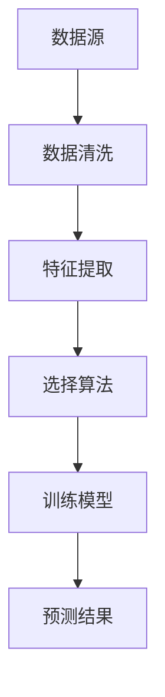
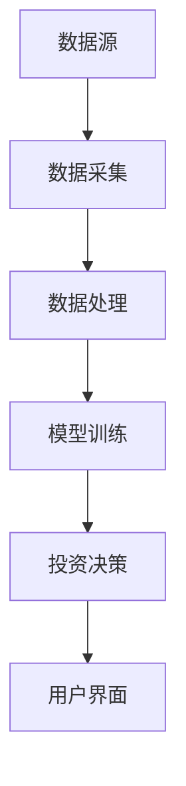

                 


# 彼得林奇的"常识投资"在人工智能时代的调整

> 关键词：常识投资，人工智能，彼得林奇，投资策略，机器学习，大数据分析

> 摘要：本文探讨了彼得·林奇的常识投资策略在人工智能时代的调整与应用，分析了AI技术如何改变投资方式，并通过系统架构设计和项目实战展示了如何利用AI优化投资决策。文章内容详实，涵盖背景介绍、核心概念、算法原理、系统设计和项目实战等部分，为投资者和AI技术爱好者提供了深刻的见解和实用的指导。

---

## 第一部分：背景介绍

### 第1章：常识投资的核心概念

#### 1.1 问题背景与问题描述

- **1.1.1 投资领域的传统方法与局限性**
  - 传统投资方法依赖于市场分析、财务指标和经验判断，但其局限性在于信息处理能力有限，难以应对海量数据和复杂市场环境。
  - 市场波动性和不确定性增加，传统方法难以捕捉所有投资机会。
  
- **1.1.2 常识投资的定义与核心要素**
  - 常识投资是指基于常识和经验的投资策略，强调对市场、行业和公司的深入了解。
  - 核心要素包括基本面分析、市场情绪和长期投资理念。

#### 1.2 问题解决与边界外延

- **1.2.1 常识投资的基本原理**
  - 通过分析公司财务状况、行业地位和管理层能力，识别具有长期增长潜力的公司。
  - 强调长期投资，避免短期波动的干扰。

- **1.2.2 投资策略的边界与适用范围**
  - 适用于对市场有一定了解的个人投资者，尤其是对特定行业有深入了解的投资者。
  - 适用于长期投资，不适用于高频交易和短期套利。

#### 1.3 核心概念的结构与组成

- **1.3.1 投资决策的关键因素**
  - 公司基本面：收入、利润、资产负债表等。
  - 行业趋势：行业增长潜力、竞争格局。
  - 市场情绪：投资者心理和市场波动。

- **1.3.2 常识投资的逻辑框架**
  - 识别优质公司：高ROE、稳定的收入增长、良好的资产负债表。
  - 评估市场估值：市盈率、市净率等指标。
  - 判断投资时机：市场低估时买入，高估时卖出。

---

### 第2章：AI技术对投资的影响

#### 2.1 AI在投资中的应用

- **2.1.1 大数据分析与预测**
  - 利用AI处理海量数据，发现传统方法难以察觉的模式和趋势。
  - 通过大数据分析预测市场走势和公司业绩。

- **2.1.2 自然语言处理在市场情绪分析中的应用**
  - 利用NLP技术分析新闻、社交媒体和财报，提取市场情绪指标。
  - 通过情绪分析预测市场波动。

#### 2.2 机器学习在投资决策中的作用

- **2.2.1 机器学习算法的优缺点**
  - 优点：高效处理数据、发现复杂模式。
  - 缺点：依赖数据质量，模型可能过拟合。

- **2.2.2 AI如何优化投资策略**
  - 利用机器学习模型优化资产配置。
  - 通过预测模型识别投资机会和风险。

---

## 第二部分：核心概念与联系

### 第3章：常识投资与AI技术的结合

#### 3.1 核心概念的属性特征对比

| 核心概念 | 传统投资 | 常识投资 | AI驱动投资 |
|----------|----------|----------|------------|
| 数据来源 | 财务报表 | 市场情绪 | 海量数据   |
| 分析方式 | 经验判断 | 基本面分析 | AI算法     |
| 决策速度 | 人工分析 | 较慢 | 实时处理    |
| 精准度 | 有限 | 较高 | 高       |

#### 3.2 实体关系图

```mermaid
erd
    管理层能力
    经营状况
    财务状况
    市场情绪
    投资决策
    市场走势

    管理层能力 --> 经营状况
    经营状况 --> 财务状况
    财务状况 --> 投资决策
    市场情绪 --> 投资决策
    投资决策 --> 市场走势
```

---

## 第三部分：算法原理讲解

### 第4章：基于AI的常识投资算法

#### 4.1 数据挖掘与预测模型

- **4.1.1 数据预处理与特征提取**
  - 清洗数据：处理缺失值、异常值。
  - 特征提取：选择对公司价值影响大的指标，如ROE、收入增长率。

- **4.1.2 算法流程图**



- **4.1.3 算法实现代码**

```python
import pandas as pd
from sklearn.model_selection import train_test_split
from sklearn.linear_model import LinearRegression

# 数据加载与预处理
data = pd.read_csv('投资数据.csv')
data = data.dropna()  # 删除缺失值
data['label'] = data['回报率'].apply(lambda x: 1 if x > 0 else 0)  # 二分类标签

# 特征提取与分割
features = data[['ROE', '收入增长率', '净利润率']]
labels = data['label']
X_train, X_test, y_train, y_test = train_test_split(features, labels, test_size=0.2)

# 算法实现
model = LinearRegression()
model.fit(X_train, y_train)
print("模型系数：", model.coef_)
print("模型截距：", model.intercept_)
```

---

### 第5章：AI驱动的投资策略优化

#### 5.1 机器学习模型实现

- **5.1.1 随机森林算法**

```python
from sklearn.ensemble import RandomForestClassifier

model = RandomForestClassifier(n_estimators=100)
model.fit(X_train, y_train)
print("模型准确率：", model.score(X_test, y_test))
```

- **5.1.2 算法优化与调参**

```python
from sklearn.model_selection import GridSearchCV

param_grid = {'n_estimators': [100, 200], 'max_depth': [None, 10]}
grid_search = GridSearchCV(RandomForestClassifier(), param_grid, cv=5)
grid_search.fit(X_train, y_train)
print("最佳参数：", grid_search.best_params_)
```

---

## 第四部分：系统架构设计

### 第6章：AI辅助投资系统架构

#### 6.1 系统模块设计

- **6.1.1 数据采集模块**
  - 从新闻网站、社交媒体和财报中抓取数据。

- **6.1.2 数据处理模块**
  - 清洗数据并提取特征。

- **6.1.3 模型训练模块**
  - 训练机器学习模型。

- **6.1.4 投资决策模块**
  - 根据模型预测结果生成投资建议。

#### 6.2 系统架构图



---

## 第五部分：项目实战

### 第7章：基于AI的常识投资策略实现

#### 7.1 环境配置

```bash
pip install pandas sklearn matplotlib
```

#### 7.2 核心实现代码

```python
import pandas as pd
from sklearn.ensemble import RandomForestClassifier
from sklearn.metrics import accuracy_score

# 数据加载
data = pd.read_csv('投资数据.csv')

# 数据预处理
data = data.dropna()
data['label'] = data['回报率'].apply(lambda x: 1 if x > 0 else 0)

# 特征提取
features = data[['ROE', '收入增长率', '净利润率']]
labels = data['label']

# 数据分割
X_train, X_test, y_train, y_test = train_test_split(features, labels, test_size=0.2)

# 模型训练
model = RandomForestClassifier(n_estimators=100)
model.fit(X_train, y_train)

# 模型预测
y_pred = model.predict(X_test)
print("模型准确率：", accuracy_score(y_test, y_pred))
```

---

## 第六部分：总结与展望

### 8.1 总结

- AI技术为常识投资提供了新的工具和方法，能够提高投资决策的效率和精准度。
- 基于AI的投资系统能够处理海量数据，发现传统方法难以察觉的机会。

### 8.2 展望

- 随着AI技术的不断发展，投资策略将更加智能化和个性化。
- 未来的投资将更多依赖于数据驱动的决策和自动化交易系统。

### 8.3 最佳实践 Tips

- **风险管理**：无论AI多么强大，风险管理始终是投资的核心。
- **持续学习**：技术不断进步，投资者需要持续学习和适应。
- **数据隐私**：在使用AI时，要注意数据隐私和合规性。

---

## 附录

### A.1 术语解释

- **AI驱动投资**：利用人工智能技术进行投资决策的过程。
- **随机森林**：一种基于决策树的集成学习算法。

### A.2 参考文献

- 彼得·林奇：《彼得·林奇的成功投资策略》
- 李海：《人工智能在金融领域的应用》

---

## 作者信息

作者：AI天才研究院 / AI Genius Institute & 禅与计算机程序设计艺术 / Zen And The Art of Computer Programming

---

本文通过详细分析彼得·林奇的常识投资策略在AI时代的调整，展示了如何利用人工智能技术优化投资决策。从背景介绍到系统设计，再到项目实战，文章为读者提供了全面的指导和深刻的见解。希望本文能够帮助投资者在人工智能时代取得更大的成功。

