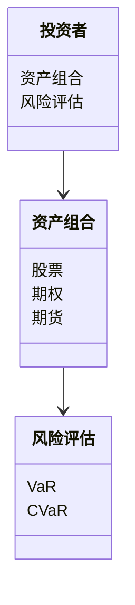
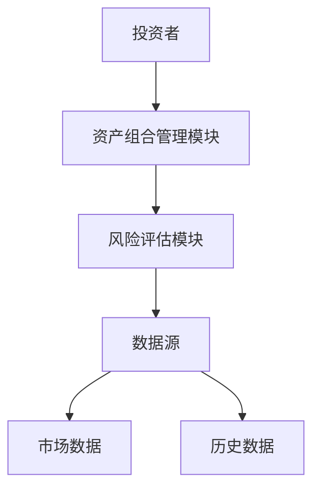

                 


# 彼得林奇的"常识投资"在复杂衍生品市场中的应用

> 关键词：常识投资、复杂衍生品、风险管理、算法模型、彼得林奇

> 摘要：本文深入探讨了彼得林奇的常识投资理念在复杂衍生品市场的应用，分析了其核心原理、算法模型，并通过具体案例展示了如何在实际操作中应用这些策略。文章从背景介绍、核心概念、算法原理到系统设计和项目实战，层层深入，为读者提供了全面的视角和实用的指导。

---

## 第一部分: 彼得林奇的"常识投资"概述

### 第1章: 常识投资的基本概念

#### 1.1 常识投资的定义与核心理念

##### 1.1.1 什么是常识投资
常识投资是一种基于基本面分析和长期价值投资的策略，强调以合理的价格投资于具有持续竞争优势的企业。其核心在于利用市场非有效性的机会，寻找被市场低估的投资标的。

##### 1.1.2 常识投资的核心理念
- **价值导向**：寻找具有持续盈利能力和良好管理的公司。
- **长期视角**：关注企业的长期增长潜力，而非短期价格波动。
- **分散投资**：通过多样化投资降低风险，避免过度集中。

##### 1.1.3 常识投资与传统投资的区别
| 方面       | 常识投资                | 传统投资                |
|------------|-------------------------|-------------------------|
| 投资策略   | 价值导向，长期持有      | 技术分析，短期交易      |
| 风险管理   | 分散投资，注重基本面    | 高杠杆，高风险         |
| 适用场景   | 稳定增长市场            | 波动性较大市场          |

#### 1.2 彼得林奇的投资风格

##### 1.2.1 彼得林奇的生平简介
彼得·林奇（Peter Lynch）是美国著名的投资经理，以其在麦哲伦基金的卓越表现而闻名。他主张通过深入研究和分析企业基本面，选择具有成长潜力的公司进行投资。

##### 1.2.2 彼得林奇的投资策略
- **价值发现**：寻找被市场低估的企业。
- **成长投资**：投资于具有持续增长潜力的公司。
- **分散投资**：通过多样化降低风险。

##### 1.2.3 彼得林奇的成功案例
彼得林奇在麦哲伦基金期间，年平均回报率超过29%，显著跑赢市场指数。

---

### 第2章: 复杂衍生品市场的基本概念

#### 2.1 衍生品市场的定义与特点

##### 2.1.1 什么是衍生品市场
衍生品市场是基于基础资产（如股票、债券、商品等）的衍生金融工具（如期权、期货、掉期）的交易市场。

##### 2.1.2 衍生品市场的基本特点
- **杠杆效应**：可以用较少的资金控制更大的头寸。
- **高风险性**：价格波动剧烈，风险较高。
- **复杂性**：涉及复杂的数学模型和金融工具。

##### 2.1.3 衍生品市场的参与者
- **机构投资者**：如基金、保险公司。
- **对冲基金**：利用衍生品进行套利和对冲。
- **个人投资者**：少量参与，风险较高。

#### 2.2 复杂衍生品的种类与风险

##### 2.2.1 期权、期货、掉期的基本概念
- **期权**：买方有权在特定时间内以特定价格买入或卖出标的资产。
- **期货**：在未来特定时间以约定价格买卖标的资产的合约。
- **掉期**：协议双方在特定时间交换资产或现金流。

##### 2.2.2 复杂衍生品的风险分析
- **市场风险**：价格波动导致的损失。
- **信用风险**：交易对手违约的风险。
- **流动性风险**：难以快速买卖资产的风险。

##### 2.2.3 复杂衍生品市场的波动性
衍生品市场的波动性通常高于基础市场，价格受多种因素影响，包括市场情绪、宏观经济指标等。

---

## 第二部分: 常识投资在复杂衍生品市场的应用原理

### 第3章: 常识投资的核心原理

#### 3.1 常识投资的核心原理

##### 3.1.1 市场的有效性假设
常识投资基于市场非有效性的假设，认为市场有时会低估或高估某些资产的价值，从而为投资者提供套利机会。

##### 3.1.2 投资者心理与市场行为
投资者的非理性行为（如过度乐观或恐慌）可能导致市场短期偏离内在价值，为长期投资者提供机会。

##### 3.1.3 价值投资与成长投资的结合
价值投资寻找低估资产，成长投资关注高增长企业，两者结合可以在复杂市场中平衡风险和收益。

#### 3.2 常识投资在衍生品市场的应用

##### 3.2.1 常识投资与衍生品市场的契合点
- 利用衍生品对冲风险。
- 通过衍生品捕捉市场波动带来的机会。

##### 3.2.2 常识投资在衍生品市场中的优势
- 通过期权和期货对冲市场风险。
- 利用衍生品放大收益或对冲下跌风险。

##### 3.2.3 常识投资在衍生品市场中的局限性
- 衍生品的复杂性可能导致策略失效。
- 高杠杆可能放大损失。

### 第4章: 复杂衍生品市场的分析框架

#### 4.1 复杂衍生品市场的分析框架

##### 4.1.1 市场结构分析
- 分析市场的参与者、交易量和价格波动。
- 理解市场的流动性、深度和广度。

##### 4.1.2 市场参与者分析
- 机构投资者的策略。
- 对冲基金的操作手法。

##### 4.1.3 市场波动性分析
- 分析市场波动的驱动因素，如宏观经济数据、政策变化、市场情绪等。

#### 4.2 复杂衍生品市场的风险管理

##### 4.2.1 风险管理的基本原则
- 分散投资，避免过度集中。
- 使用衍生品对冲风险。
- 设置止损点，限制损失。

##### 4.2.2 风险管理模型
- **VaR模型**：衡量投资组合的风险价值。
- **CVaR模型**：衡量在VaR基础上的条件风险。

---

## 第三部分: 算法原理与系统设计

### 第5章: 算法原理

#### 5.1 风险管理模型

##### 5.1.1 VaR模型
VaR（Value at Risk）是衡量投资组合潜在损失的指标，计算在特定置信水平下，投资组合的最大可能损失。

公式：
$$ VaR_{\alpha} = \text{最大损失使得} P(L \leq VaR_{\alpha}) \geq \alpha $$

##### 5.1.2 CVaR模型
CVaR（Conditional Value at Risk）是VaR的延伸，衡量在VaR基础上的平均损失。

公式：
$$ CVaR_{\alpha} = \frac{1}{n} \sum_{i=1}^{n} L_i \text{，其中} L_i \text{是VaR以上的损失} $$

##### 5.1.3 风险管理模型的实现
使用Python的pandas和numpy库进行数据分析，结合scipy库进行统计计算。

示例代码：
```python
import numpy as np
from scipy.stats import norm

def calculate VaR(data, confidence_level):
    data_sorted = np.sort(data)
    index = int(len(data_sorted) * (1 - confidence_level))
    return data_sorted[index]

data = [1.2, 1.3, 1.4, 1.5, 1.6]
VaR_95 = calculate VaR(data, 0.95)
print(f"VaR at 95% confidence level: {VaR_95}")
```

#### 5.2 投资组合优化

##### 5.2.1 基于常识投资的优化策略
- 选择具有低市盈率和高ROE的公司。
- 结合期权和期货进行对冲。

##### 5.2.2 数学模型
使用均值-方差优化模型，优化投资组合的风险和收益。

公式：
$$ \text{目标函数：} \min_w \sigma^2_w $$
$$ \text{约束条件：} \sum_{i=1}^{n} w_i = 1, \sum_{i=1}^{n} w_i r_i = \mu $$

---

## 第四部分: 系统分析与架构设计

### 第6章: 系统架构设计

#### 6.1 系统功能设计

##### 6.1.1 领域模型类图
使用mermaid绘制领域模型类图，展示系统中各实体及其关系。



#### 6.2 系统架构设计

##### 6.2.1 系统架构图
使用mermaid绘制系统架构图，展示系统的各个模块及其交互。



---

## 第五部分: 项目实战

### 第7章: 项目实战

#### 7.1 环境安装

##### 7.1.1 安装Python
使用Anaconda安装Python环境，包括必要的库如pandas、numpy、scipy等。

##### 7.1.2 安装Jupyter Notebook
用于数据可视化和算法实现。

#### 7.2 核心代码实现

##### 7.2.1 风险管理模型代码
实现VaR和CVaR的计算。

##### 7.2.2 投资组合优化代码
使用优化算法进行投资组合优化。

#### 7.3 案例分析

##### 7.3.1 数据收集
收集相关股票和期权的历史数据。

##### 7.3.2 数据分析
计算VaR和CVaR，评估投资组合风险。

##### 7.3.3 结果展示
通过图表展示分析结果，验证策略的有效性。

---

## 第六部分: 总结与展望

### 第8章: 总结

#### 8.1 核心观点回顾
- 常识投资在复杂衍生品市场中具有应用潜力。
- 需要结合风险管理模型和系统架构设计。

#### 8.2 最佳实践 tips
- 保持对市场的持续学习和研究。
- 结合技术分析和基本面分析。
- 定期评估和调整投资组合。

#### 8.3 展望
随着金融市场的复杂化，基于常识投资的算法模型将在衍生品市场中发挥更大作用。

---

## 作者信息

作者：AI天才研究院/AI Genius Institute & 禅与计算机程序设计艺术 /Zen And The Art of Computer Programming

---

通过以上结构，文章详细探讨了彼得林奇的常识投资理念在复杂衍生品市场中的应用，从理论到实践，为读者提供了全面的视角和实用的指导。

