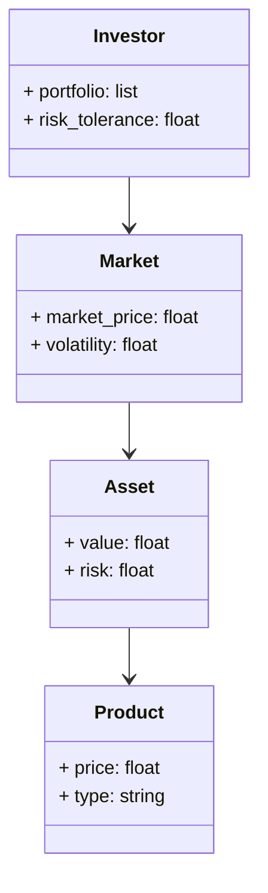
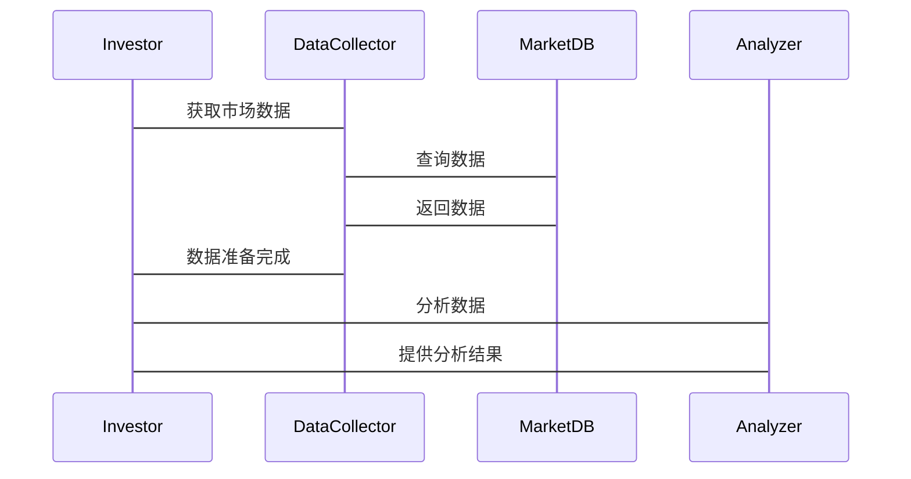

                 


# 彼得林奇的"常识投资"在复杂金融产品中的应用

## 关键词
- 彼得林奇
- 常识投资
- 复杂金融产品
- 投资策略
- 金融分析

## 摘要
本文深入探讨了彼得林奇的常识投资理念及其在复杂金融产品中的应用。通过分析复杂金融产品的特点、风险和估值方法，结合彼得林奇的投资策略，提供了系统的分析框架和实际应用案例。文章从理论基础、算法模型到系统架构，全面阐述了如何在复杂金融市场中应用常识投资，为投资者提供了实用的指导和最佳实践。

---

# 第一部分: 彼得林奇的"常识投资"基础

## 第1章: 常识投资与彼得林奇概述

### 1.1 常识投资的基本概念

#### 1.1.1 什么是常识投资
常识投资是一种基于基本面分析的投资策略，强调利用常识和逻辑分析来识别低估的优质资产。它不同于纯粹的市场趋势预测，更注重企业的内在价值和长期盈利能力。

#### 1.1.2 彼得林奇与常识投资的关联
彼得林奇是常识投资的代表人物，他通过深入研究企业的财务状况、行业地位和管理团队，寻找那些被市场低估的投资机会。他的投资策略强调长期持有和价值发现。

#### 1.1.3 常识投资的核心理念与原则
常识投资的核心理念是：市场波动反映短期情绪，而企业价值才是长期回报的关键。其原则包括分散投资、长期持有、避免追涨杀跌等。

### 1.2 彼得林奇的投资策略

#### 1.2.1 彼得林奇的投资风格概述
彼得林奇的投资风格以稳健和价值导向著称，他注重对企业基本面的分析，尤其是中小型企业，寻找那些具有持续竞争优势和合理估值的企业。

#### 1.2.2 彼得林奇的成功案例分析
彼得林奇管理的麦哲伦基金在任职期间取得了显著的业绩，通过投资低估的股票和谨慎的管理，实现了长期稳定的收益。

#### 1.2.3 彼得林奇投资策略的特点
- 价值导向：寻找被市场低估的企业。
- 中小企业偏好：关注具有增长潜力的中型企业。
- 长期持有：避免频繁交易，降低交易成本。

### 1.3 复杂金融产品中的常识投资

#### 1.3.1 复杂金融产品的定义与特点
复杂金融产品包括期权、期货、结构性产品等，具有高杠杆、高风险和复杂定价的特点。

#### 1.3.2 常识投资在复杂金融产品中的应用范围
常识投资可以帮助投资者识别复杂金融产品的潜在价值，尤其是在市场波动中发现定价错误的机会。

#### 1.3.3 常识投资与复杂金融产品的结合方式
通过基本面分析和市场情绪分析，结合复杂金融产品的特性，找到定价合理的投资机会。

---

## 第2章: 常识投资的理论基础

### 2.1 价值投资理论

#### 2.1.1 价值投资的核心思想
价值投资认为市场的短期波动掩盖了企业的内在价值，投资者应寻找那些市场价格低于内在价值的企业。

#### 2.1.2 彼得林奇对价值投资的贡献
彼得林奇通过深入的企业分析和市场研究，将价值投资理念应用于实际投资操作，取得了显著成效。

#### 2.1.3 价值投资在复杂金融产品中的应用
通过分析复杂金融产品的基础资产价值，识别其市场定价的合理性。

### 2.2 安全边际概念

#### 2.2.1 安全边际的定义与作用
安全边际是指市场价格与内在价值之间的差距，提供了在市场波动中保护投资者免受损失的缓冲区。

#### 2.2.2 彼得林奇如何运用安全边际
彼得林奇在投资决策中，注重企业内在价值与市场价格的差异，确保投资的安全性。

#### 2.2.3 安全边际在复杂金融产品中的重要性
复杂金融产品的高风险要求更高的安全边际，通过深入分析基础资产和产品结构，确保投资的安全性。

### 2.3 市场情绪与投资者心理

#### 2.3.1 市场情绪对投资决策的影响
市场情绪影响投资者的决策，导致市场的过度反应或反应不足，为理性投资者提供了机会。

#### 2.3.2 投资者心理在复杂金融产品中的表现
投资者在面对复杂金融产品时，可能因缺乏理解而产生从众心理或过度恐慌，影响投资决策。

#### 2.3.3 如何利用市场情绪进行投资决策
通过分析市场情绪，识别市场的非理性波动，寻找投资机会。

---

## 第3章: 复杂金融产品分析方法

### 3.1 金融产品的分类与特点

#### 3.1.1 传统金融产品与复杂金融产品的区别
传统金融产品如股票、债券，而复杂金融产品如期权、期货、结构性产品，具有更高的风险和复杂性。

#### 3.1.2 复杂金融产品的主要类型
包括衍生品、结构性产品、杠杆产品等。

#### 3.1.3 各类复杂金融产品的特点
高杠杆、高风险、复杂定价、非线性收益。

### 3.2 复杂金融产品的风险分析

#### 3.2.1 复杂金融产品的风险来源
市场风险、流动性风险、信用风险、操作风险等。

#### 3.2.2 如何评估复杂金融产品的风险
通过风险模型和压力测试，评估产品的潜在风险。

#### 3.2.3 常识投资在风险管理中的应用
通过基本面分析和市场情绪分析，识别和管理风险。

### 3.3 金融产品的定价与估值

#### 3.3.1 金融产品的定价方法
基于基础资产的定价模型，如Black-Scholes模型。

#### 3.3.2 如何进行金融产品的估值
通过分析基础资产的价值和市场因素，确定产品的合理价格。

#### 3.3.3 彼得林奇的估值方法在复杂金融产品中的应用
通过基本面分析和市场比较，识别定价错误的产品。

---

## 第4章: 常识投资的算法与数学模型

### 4.1 投资组合优化的数学模型

#### 4.1.1 投资组合优化的基本概念
通过优化投资组合的收益和风险，实现最佳投资效果。

#### 4.1.2 常见的投资组合优化算法
包括均值-方差优化、风险平价优化等。

#### 4.1.3 投资组合优化的数学公式
$$ \text{目标函数：} \text{Maximize } \mu w - \lambda \frac{1}{2}w^T \sigma w $$
其中，\( \mu \) 是收益向量，\( \sigma \) 是波动率矩阵，\( \lambda \) 是风险厌恶系数，\( w \) 是权重向量。

### 4.2 金融产品定价的数学模型

#### 4.2.1 期权定价的Black-Scholes模型
$$ C = S_0 N(d_1) - K e^{-rT} N(d_2) $$
其中，\( d_1 = \frac{\ln(S_0/K) + (r + \sigma^2/2)T}{\sigma \sqrt{T}} \)，
\( d_2 = d_1 - \sigma \sqrt{T} \)。

#### 4.2.2 如何应用这些模型于复杂金融产品
通过分析基础资产的波动性和市场条件，计算产品的理论价格，识别定价错误的机会。

### 4.3 市场情绪分析的算法

#### 4.3.1 市场情绪的指标构建
使用市场情绪指标如恐慌指数、波动率指数等。

#### 4.3.2 基于自然语言处理的市场情绪分析
利用文本挖掘技术分析新闻和社交媒体，判断市场情绪。

#### 4.3.3 市场情绪分析的Python代码示例
```python
import pandas as pd
from sklearn.feature_extraction.text import TfidfVectorizer
from sklearn.decomposition import NMF

# 加载新闻数据
news_data = pd.read_csv('market_news.csv')

# 文本预处理
vectorizer = TfidfVectorizer(max_features=100)
tfidf = vectorizer.fit_transform(news_data['content'])

# 主题建模
model = NMF(n_components=5, random_state=42)
components = model.fit_transform(tfidf)

# 分析主题
for topic_idx, topic in enumerate(model.components_):
    print(f"Topic {topic_idx}:")
    print(" ".join([vectorizer.get_feature_names()[i] for i in topic.argsort()[-5:]]))
```

---

## 第5章: 系统分析与架构设计方案

### 5.1 问题场景介绍

#### 5.1.1 复杂金融产品的特点
高杠杆、非线性收益、复杂结构。

#### 5.1.2 投资者需求
识别投资机会，评估风险，制定投资策略。

### 5.2 系统功能设计

#### 5.2.1 领域模型


#### 5.2.2 系统架构设计


#### 5.2.3 系统接口设计


---

## 第6章: 项目实战

### 6.1 环境安装

#### 6.1.1 安装Python环境
使用Anaconda安装Python 3.9及以上版本。

#### 6.1.2 安装必要的库
```bash
pip install pandas numpy scikit-learn matplotlib
```

### 6.2 系统核心实现源代码

#### 6.2.1 数据处理代码
```python
import pandas as pd
import numpy as np

# 加载数据
data = pd.read_csv('financial_products.csv')

# 数据清洗
data = data.dropna()
data = data[ data['price'] > 0 ]
```

#### 6.2.2 模型实现代码
```python
from sklearn.ensemble import RandomForestRegressor
from sklearn.metrics import mean_squared_error

# 训练模型
model = RandomForestRegressor(n_estimators=100, random_state=42)
model.fit(X_train, y_train)

# 评估模型
y_pred = model.predict(X_test)
print(mean_squared_error(y_test, y_pred))
```

### 6.3 实际案例分析

#### 6.3.1 案例分析
分析某复杂金融产品的历史数据，评估其内在价值和市场定价。

#### 6.3.2 结果展示
通过图表展示分析结果，识别投资机会。

#### 6.3.3 项目小结
总结分析过程和结果，提出投资建议。

---

## 第7章: 最佳实践与总结

### 7.1 最佳实践 tips

#### 7.1.1 投资前做好充分研究
了解产品的基本结构和风险因素。

#### 7.1.2 分散投资降低风险
避免过度集中，分散投资以降低风险。

#### 7.1.3 定期评估和调整投资组合
根据市场变化和个人风险承受能力，定期评估和调整投资组合。

### 7.2 小结

通过本文的分析，我们了解了彼得林奇的常识投资理念在复杂金融产品中的应用，掌握了相关的分析方法和实战技巧。

### 7.3 注意事项

- 风险提示：复杂金融产品具有高风险，需谨慎投资。
- 合规性：遵守相关法律法规，确保投资行为的合法性。

### 7.4 拓展阅读

- 《彼得林奇的投资之道》
- 《期权、期货和其他衍生产品》

---

# 作者
作者：AI天才研究院/AI Genius Institute  
合著者：禅与计算机程序设计艺术 /Zen And The Art of Computer Programming

