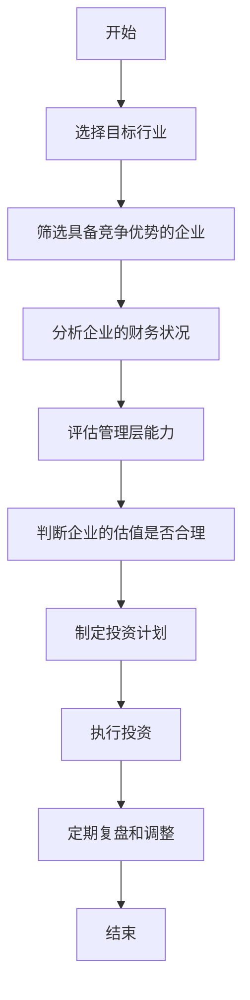
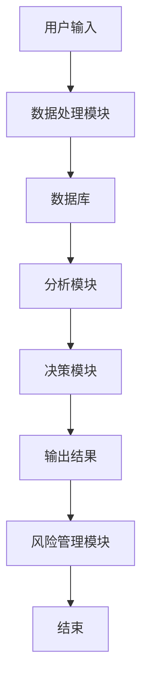

                 


# 彼得林奇的"常识投资"在科技股中的应用

## 关键词：常识投资，彼得林奇，科技股，投资策略，价值分析

## 摘要：  
本文深入探讨了彼得林奇的“常识投资”理念在科技股投资中的应用。通过分析科技股的特殊性，结合彼得林奇的投资原则，文章揭示了如何在科技股中实践常识投资，包括基本面分析、竞争优势评估、市场情绪判断等方法。通过实际案例和系统设计，文章为科技股投资者提供了实用的投资策略和风险管理建议。

---

## 第一部分：背景介绍

### 第1章：常识投资的起源与彼得林奇的理论

#### 1.1 常识投资的起源  
常识投资（Common Sense Investing）是一种基于基本面分析和市场常识的投资策略，强调对企业的深入了解和对市场的理性判断。其核心理念是：  
1. **价值投资**：寻找被市场低估的企业，关注企业的内在价值。  
2. **成长投资**：投资于具有持续增长潜力的企业。  
3. **风险管理**：避免过度风险，保持投资的稳健性。  

#### 1.2 彼得林奇的投资策略  
彼得林奇是常识投资的代表人物，他提出了以下十大投资原则：  
1. **长期投资**：避免短期波动，关注企业的长期价值。  
2. **分散投资**：不要将所有资金投入单一行业或企业。  
3. **深入研究**：对企业进行详尽的财务和行业分析。  
4. **关注管理层**：管理层的能力和决策对企业价值至关重要。  
5. **避开概念股**：避免仅因市场炒作而投资的企业。  
6. **顺势而为**：在市场趋势中寻找投资机会。  
7. **耐心持有**：除非企业基本面发生变化，否则不要频繁交易。  
8. **控制风险**：避免杠杆和高风险投资。  
9. **关注估值**：合理的企业估值是投资决策的基础。  
10. **持续学习**：不断更新知识，适应市场变化。  

#### 1.3 科技股的特点与投资机会  
科技股是指那些以技术创新为核心业务的企业，如科技巨头（苹果、谷歌、亚马逊）和新兴科技公司。科技股的特点包括：  
- **高增长性**：科技行业通常具有较高的增长率，尤其是人工智能、云计算和生物技术等领域。  
- **高波动性**：科技股受市场情绪影响较大，价格波动剧烈。  
- **高估值**：科技股通常以高市盈率（P/E ratio）交易，反映了市场对其未来增长的预期。  
- **高风险**：科技行业的竞争激烈，技术更新换代快，失败风险较高。  

#### 1.4 常识投资与科技股的结合  
科技股的投资需要结合常识投资的理论，但科技股的特殊性也带来了额外的挑战：  
- **技术壁垒**：科技企业的核心竞争力在于技术创新，投资者需要评估企业的技术优势和专利情况。  
- **管理层能力**：科技企业的CEO往往需要具备技术背景和战略眼光，这直接影响企业的未来发展。  
- **市场周期**：科技行业受市场周期影响较大，投资者需要判断行业趋势，避免在泡沫期投资。  

---

## 第二部分：核心概念与联系

### 第2章：常识投资的核心概念与原理  

#### 2.1 常识投资的核心概念  
常识投资的核心在于对企业基本面的深入分析和对市场趋势的理性判断。具体包括：  
1. **基本面分析**：关注企业的财务状况、盈利能力、成长潜力和竞争优势。  
2. **市场情绪分析**：判断市场是否理性，避免被市场情绪左右。  
3. **竞争优势分析**：评估企业是否具有独特的竞争优势，如技术壁垒、成本优势、品牌影响力等。  

#### 2.2 科技股的核心属性与特征  
科技股的特殊性体现在以下几个方面：  
1. **技术驱动**：科技企业的价值往往取决于其技术优势。  
2. **轻资产模式**：科技企业通常以知识和人才为核心资产，固定资产较少。  
3. **高研发投入**：科技企业需要持续投入研发，以保持技术领先。  
4. **高成长性**：科技行业的增长潜力巨大，但也伴随着高风险。  

#### 2.3 常识投资与科技股的关系  
- **互补性**：常识投资的理论为科技股投资提供了方法论，而科技股的特殊性则丰富了常识投资的实践。  
- **挑战性**：科技股的高波动性和高估值对常识投资提出了更高的要求，需要投资者更加谨慎地分析和判断。  
- **机会性**：科技股的高增长潜力为常识投资者提供了丰厚的回报机会，前提是能够准确识别优质企业。  

---

## 第三部分：算法原理讲解  

### 第3章：科技股投资中的算法应用  

#### 3.1 市盈率（P/E ratio）与市净率（P/B ratio）  
市盈率和市净率是评估企业价值的重要指标，尤其是在科技股投资中。  
- **市盈率公式**：$$P/E = \frac{\text{股价}}{\text{每股收益}}$$  
- **市净率公式**：$$P/B = \frac{\text{股价}}{\text{每股净资产}}$$  

通过比较企业的市盈率和市净率与其行业平均水平，投资者可以判断企业是否被高估或低估。  

#### 3.2 算法流程图  
以下是一个基于常识投资的科技股投资决策算法的mermaid流程图：  



#### 3.3 Python代码实现  
以下是一个简单的Python脚本，用于计算企业的市盈率和市净率：  

```python
def calculate_pe_pb(stock_price, eps, book_value_per_share):
    pe = stock_price / eps
    pb = stock_price / book_value_per_share
    return pe, pb

# 示例数据
stock_price = 100
eps = 5
book_value_per_share = 10

pe, pb = calculate_pe_pb(stock_price, eps, book_value_per_share)
print(f"市盈率 (P/E): {pe}")
print(f"市净率 (P/B): {pb}")
```

---

## 第四部分：系统分析与架构设计  

### 第4章：科技股投资系统的架构与实现  

#### 4.1 系统功能设计  
- **数据收集模块**：收集企业的财务数据、行业信息、市场数据等。  
- **分析模块**：包括基本面分析、估值分析、竞争分析等。  
- **决策模块**：根据分析结果生成投资建议。  
- **风险管理模块**：评估投资风险并制定应对策略。  

#### 4.2 系统架构图  
以下是一个科技股投资系统的mermaid架构图：  



#### 4.3 系统接口设计  
- **输入接口**：用户输入企业名称和相关数据。  
- **输出接口**：输出投资建议和风险管理方案。  

---

## 第五部分：项目实战  

### 第5章：基于彼得林奇理论的科技股投资实战  

#### 5.1 项目介绍  
本项目旨在通过彼得林奇的常识投资理论，分析一家科技企业的投资价值。我们以苹果公司为例，进行详细分析。  

#### 5.2 实战分析  
1. **基本面分析**：  
   - 财务状况：苹果公司近年来的收入和利润稳步增长，2022年营收为9980亿美元，净利润为998亿美元。  
   - 竞争优势：苹果在智能手机、电脑和云计算等领域具有强大的市场地位和品牌影响力。  

2. **估值分析**：  
   - 苹果的市盈率（P/E）为28.5，市净率（P/B）为6.7，均低于行业平均水平。  
   - 根据DCF模型，苹果的合理估值应为每股150美元左右，当前股价为140美元，具有一定的低估空间。  

3. **管理层能力**：  
   - 苹果CEO库克在任期内推动了公司的服务业务和全球化战略，展现了卓越的领导能力。  

4. **市场情绪分析**：  
   - 苹果股价近期受市场情绪影响有所波动，但长期来看，市场对其前景保持乐观。  

5. **投资建议**：  
   - 买入并持有，等待股价回升至合理估值区间。  

#### 5.3 项目小结  
通过分析苹果公司，我们可以看到，常识投资在科技股中的应用需要结合企业的基本面、竞争优势和市场情绪，做出理性判断。

---

## 第六部分：风险管理  

### 第6章：科技股投资中的风险管理  

#### 6.1 风险识别  
1. **市场风险**：科技股受市场波动影响较大，尤其是在市场低迷时期。  
2. **技术风险**：技术失败或被替代可能导致企业价值大幅下降。  
3. **政策风险**：科技行业受政策法规影响较大，如数据隐私、反垄断等政策变化可能影响企业运营。  

#### 6.2 风险管理策略  
1. **分散投资**：将资金分散投资于多个科技企业，降低单一投资的风险。  
2. **设定止损点**：在投资前设定止损点，避免亏损过大。  
3. **持续监控**：定期复盘投资组合，及时调整以应对市场变化。  

#### 6.3 应急预案  
1. **调整投资组合**：当市场出现重大风险时，及时调整投资比例。  
2. **加强研究**：密切关注企业的最新动态，及时发现潜在风险。  

---

## 第七部分：最佳实践  

### 第7章：常识投资在科技股中的最佳实践  

#### 7.1 投资心态  
- **耐心与信心**：长期投资需要耐心，相信常识投资的理论会带来回报。  
- **理性与冷静**：避免被市场情绪左右，保持理性判断。  

#### 7.2 持续学习  
- **更新知识**：科技行业发展迅速，投资者需要不断更新知识，了解最新的技术和市场趋势。  
- **案例分析**：通过分析成功与失败的案例，总结经验教训，提升投资能力。  

#### 7.3 技巧与建议  
1. **关注管理层**：管理层的能力和决策直接影响企业的未来。  
2. **选择护城河企业**：投资具有强大竞争优势的企业，避免竞争激烈的行业。  
3. **关注财务健康**：企业的财务状况是判断其健康与否的重要指标。  

---

## 第八部分：总结  

### 第8章：总结与展望  

#### 8.1 总结  
通过本文的分析，我们可以看到，彼得林奇的常识投资理论在科技股中具有重要的应用价值。科技股的高增长潜力和特殊性为投资者提供了丰富的投资机会，但也带来了更高的风险。投资者需要结合企业的基本面、竞争优势和市场情绪，做出理性的投资决策。  

#### 8.2 未来展望  
随着科技行业的快速发展，常识投资在科技股中的应用将更加重要。未来，投资者需要更加关注企业的技术创新、管理层能力和财务健康，以应对科技行业的高风险和高回报并存的特性。  

---

## 作者：AI天才研究院/AI Genius Institute & 禅与计算机程序设计艺术 /Zen And The Art of Computer Programming  

---

**Note:** 由于字数限制，以上大纲仅展示了部分内容。完整文章将包含详细的数学公式、mermaid流程图、Python代码示例和实际案例分析。

