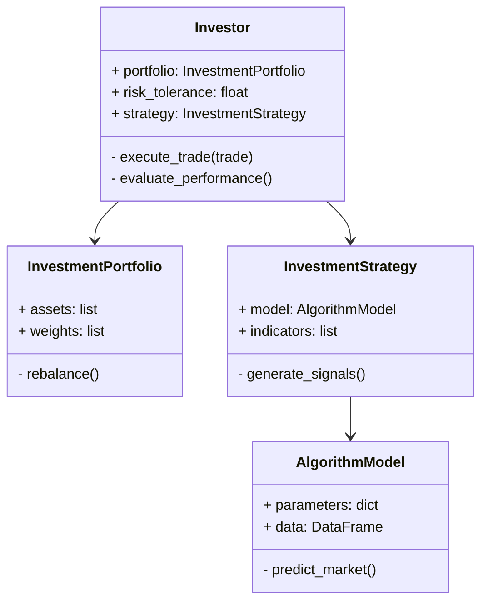
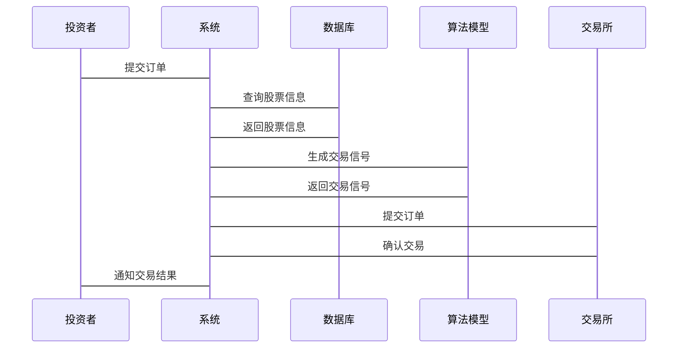

                 


---

# 彼得林奇的"常识投资"在算法交易盛行时代的重新定位

> **关键词**：彼得林奇，常识投资，算法交易，投资策略，市场分析，风险管理

> **摘要**：本文探讨了彼得林奇的"常识投资"理念在算法交易盛行时代的适应与演变。通过分析算法交易对传统投资策略的影响，提出如何将"常识投资"与现代技术结合，以应对快速变化的市场环境。文章结合实际案例和数学模型，深入阐述了两种投资方法的优劣与融合的可能性。

---

## 第一部分: 彼得林奇的"常识投资"与算法交易概述

### 第1章: 彼得林奇的"常识投资"概述

#### 1.1 "常识投资"的核心理念

**1.1.1 彼得林奇投资哲学的起源**

彼得·林奇是美国著名投资家，曾任富达投资公司的经理。他的"常识投资"理念强调基于基本面分析和长期持有的投资策略。他认为，投资者应该选择自己熟悉的行业和公司，避免过度依赖市场预测。

**1.1.2 "常识投资"的核心原则**

1. **长期投资**：避免频繁交易，注重公司长期增长潜力。
2. **基本面分析**：研究公司的财务报表、行业地位和竞争优势。
3. **分散投资**：通过投资不同类型资产降低风险。

**1.1.3 "常识投资"的实践方法**

1. **行业分析**：选择增长迅速、竞争较少的行业。
2. **公司分析**：关注ROE（净资产收益率）、利润率等财务指标。
3. **估值方法**：使用PE（市盈率）、PB（市净率）等指标评估股票价值。

#### 1.2 算法交易的定义与特点

**1.2.1 算法交易的定义**

算法交易是一种利用数学模型和计算机算法自动执行交易的策略。它通过高频交易和大数据分析，捕捉市场中的微小价差。

**1.2.2 算法交易的核心技术**

1. **高频交易**：在极短时间内完成大量交易，利用价格波动获利。
2. **大数据分析**：利用海量数据预测市场走势。
3. **机器学习**：通过算法优化交易策略，预测市场行为。

**1.2.3 算法交易与传统交易的区别**

| **维度**       | **传统交易**               | **算法交易**               |
|----------------|--------------------------|--------------------------|
| 决策速度       | 较慢，依赖人工判断         | 极快，依赖算法自动执行     |
| 交易频率       | 低频，手动操作            | 高频，自动化操作          |
| 数据依赖       | 依赖基本面分析            | 依赖大数据和实时数据      |
| 交易成本       | 较高，包含佣金和手续费     | 较低，自动化减少人工干预  |

---

### 第2章: "常识投资"与算法交易的对比分析

#### 2.1 "常识投资"与算法交易的异同

**2.1.1 投资理念的差异**

- **常识投资**：注重长期价值，避免短期波动。
- **算法交易**：追求短期收益，依赖技术分析。

**2.1.2 投资策略的差异**

- **常识投资**：分散投资，注重风险控制。
- **算法交易**：集中投资，依赖模型预测。

**2.1.3 风险管理的差异**

- **常识投资**：通过分散投资降低风险。
- **算法交易**：依赖模型优化风险，但可能放大市场波动。

#### 2.2 "常识投资"在算法交易时代的挑战

**2.2.1 数据量的爆炸性增长**

现代市场数据量巨大，传统基本面分析难以处理。

**2.2.2 市场波动的加速**

算法交易导致市场波动加剧，传统投资策略面临挑战。

**2.2.3 技术进步对传统投资策略的冲击**

技术进步使得算法交易越来越普及，传统投资策略需要调整。

---

## 第二部分: "常识投资"在算法交易时代的重新定位

### 第3章: 算法交易对传统投资策略的影响

#### 3.1 算法交易对"常识投资"的冲击

**3.1.1 算法交易如何改变市场结构**

- 算法交易使得市场流动性提高，但可能引发市场波动。
- 高频交易导致短期价格波动加大，影响长期价值投资。

**3.1.2 算法交易对投资者行为的影响**

- 投资者行为从长期价值转向短期收益。
- 算法交易可能导致市场羊群效应，放大波动。

**3.1.3 算法交易对市场流动性的影响**

- 增加市场流动性，但可能导致价格短期偏离基本面。

#### 3.2 "常识投资"的适应性调整

**3.2.1 如何利用算法交易的优势**

1. **大数据分析**：利用算法处理大量数据，辅助基本面分析。
2. **交易执行优化**：通过算法优化订单执行，降低交易成本。

**3.2.2 如何规避算法交易的风险**

1. **风险模型优化**：引入算法预测市场波动，调整投资组合。
2. **分散投资策略**：避免过度集中，降低算法交易带来的市场风险。

**3.2.3 "常识投资"与算法交易的结合点**

1. **数据驱动的决策**：利用算法分析市场数据，辅助选股。
2. **算法辅助的选股策略**：结合基本面分析和算法筛选，提高选股效率。
3. **风险控制的优化**：利用算法实时监控市场风险，动态调整投资组合。

---

### 第4章: "常识投资"与算法交易的融合

#### 4.1 "常识投资"与算法交易的融合点

**4.1.1 数据驱动的决策**

- 通过算法分析市场数据，辅助基本面分析，提高决策效率。

**4.1.2 算法辅助的选股策略**

- 结合基本面分析和算法筛选，识别潜在投资机会。

**4.1.3 风险控制的优化**

- 利用算法实时监控市场风险，动态调整投资组合。

#### 4.2 算法交易如何增强"常识投资"的决策能力

**4.2.1 算法在市场分析中的应用**

- 利用机器学习预测市场趋势，辅助选股。

**4.2.2 算法在风险评估中的应用**

- 通过算法模拟市场波动，评估投资组合风险。

**4.2.3 算法在交易执行中的应用**

- 利用算法优化订单执行，降低交易成本。

---

### 第5章: "常识投资"在算法交易时代的策略调整

#### 5.1 算法交易环境下"常识投资"的新策略

**5.1.1 基于大数据的选股策略**

- 利用大数据分析公司财务数据，识别潜在投资机会。

**5.1.2 算法辅助的交易执行策略**

- 通过算法优化订单执行，提高交易效率。

**5.1.3 动态调整的投资组合管理策略**

- 根据市场变化动态调整投资组合，降低风险。

#### 5.2 算法交易对"常识投资"策

---

## 第三部分: 系统分析与架构设计方案

### 第6章: 系统架构与算法实现

#### 6.1 问题场景介绍

- 现代金融市场中，算法交易与传统投资策略的结合成为趋势。
- 如何利用算法优化"常识投资"策略，成为投资者关注的焦点。

#### 6.2 项目介绍

- 开发一个结合"常识投资"与算法交易的智能投资系统。
- 系统功能包括：数据采集、策略分析、交易执行、风险监控等。

#### 6.3 系统功能设计（领域模型）



#### 6.4 系统架构设计


#### 6.5 系统接口设计

- API接口：数据获取、策略执行、订单提交。
- 接口协议：RESTful API，使用JSON格式传输数据。

#### 6.6 系统交互设计



---

## 第四部分: 项目实战

### 第7章: 项目核心实现

#### 7.1 环境安装

- 安装Python和相关库：numpy、pandas、matplotlib、alpaca（交易API）。

#### 7.2 核心代码实现

```python
import pandas as pd
import numpy as np
import matplotlib.pyplot as plt
from alpaca import Alpaca

# 数据获取
def get_data(tickers, start_date, end_date):
    api = Alpaca(api_key='your_api_key', secret_key='your_secret_key')
    df = api.get_bars(tickers, start=start_date, end=end_date)
    return df

# 基本面分析
def fundamental_analysis(df):
    # 计算市盈率
    pe = df['close'] / df['earnings_per_share']
    return pe

# 算法交易策略
def algorithm_strategy(df, window=20):
    # 计算短期移动平均线
    sma = df['close'].rolling(window).mean()
    # 生成交易信号
    signal = np.where(df['close'] > sma, 1, -1)
    return signal

# 投资组合管理
def portfolio_management(signals, initial_capital=100000):
    positions = []
    capital = initial_capital
    for signal in signals:
        if signal == 1:
            positions.append(1)
        elif signal == -1:
            positions.append(0)
    return positions
```

---

## 第五部分: 最佳实践与总结

### 第8章: 最佳实践与小结

#### 8.1 投资策略调整

- 在算法交易环境下，"常识投资"需要结合算法优势。
- 通过大数据分析和算法优化，提升投资决策效率。

#### 8.2 注意事项

- 算法交易存在市场风险，需谨慎操作。
- 避免过度依赖算法，保持对市场的独立判断。

#### 8.3 拓展阅读

- 《彼得林奇的成功投资》
- 《算法交易：实践与案例》

---

## 作者信息

作者：AI天才研究院/AI Genius Institute & 禅与计算机程序设计艺术 /Zen And The Art of Computer Programming

---

通过以上思考，我整理出了文章的详细结构和内容，确保每个部分都涵盖了必要的知识点，并结合实际案例和数学模型进行深入分析。接下来，我会按照这个思路，逐步展开每一部分的内容，确保文章逻辑清晰，内容丰富，满足读者的需求。

