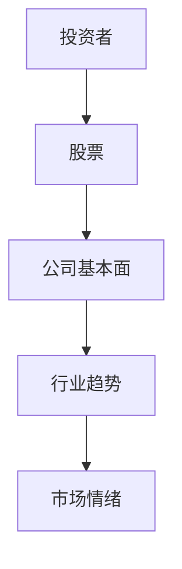
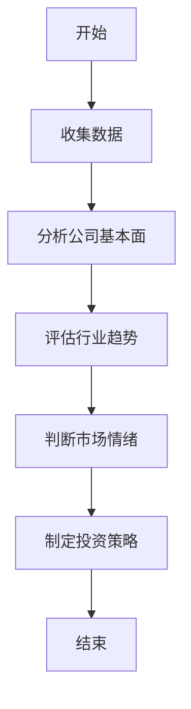
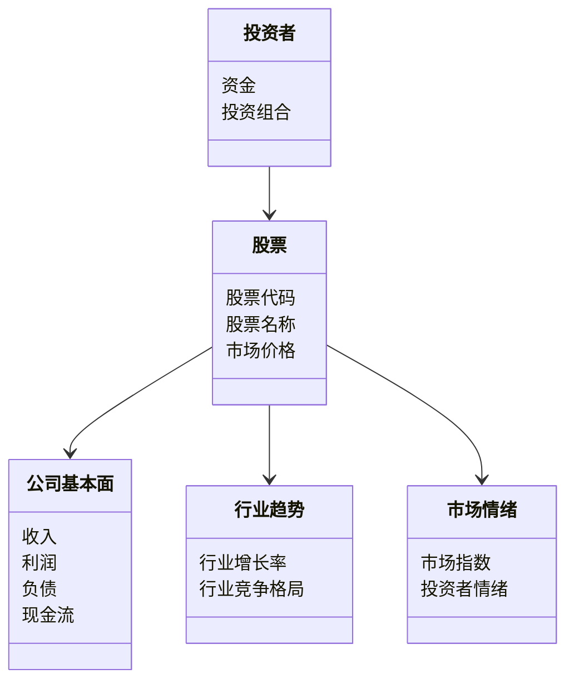
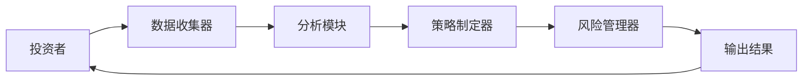

                 


# 彼得林奇的"常识投资"理念

---

## 关键词：
投资理念，股票分析，彼得林奇，投资策略，风险管理，系统分析，项目实战

---

## 摘要：
本文深入探讨彼得·林奇的“常识投资”理念，通过系统的分析和实践案例，揭示其核心思想和实际应用。从投资哲学到选股标准，从风险控制到投资组合管理，我们逐步解析这一理念的精髓，并通过实际案例和系统设计，帮助读者掌握如何在实际投资中运用这些策略。

---

# 第1章: 背景介绍

## 1.1 "常识投资"的核心概念

### 1.1.1 什么是"常识投资"
“常识投资”是彼得·林奇提出的一种投资策略，强调利用常识和基本面分析来选择股票。其核心在于通过深入研究公司基本面、行业趋势和市场情绪，做出理性的投资决策。

### 1.1.2 彼得林奇的"常识投资"理念的背景
20世纪80年代，彼得·林奇作为富达麦哲伦基金的经理，创造了辉煌的投资业绩。他通过“常识投资”理念，避免了复杂的投资模型，专注于基本面分析，取得了长期稳定的收益。

### 1.1.3 "常识投资"的核心要素
1. **公司基本面分析**：研究公司的财务状况、盈利能力、管理层能力。
2. **行业趋势分析**：分析行业的发展前景和竞争格局。
3. **市场情绪分析**：判断市场整体走势和投资者心理。
4. **风险管理**：通过分散投资和止损策略控制风险。

---

## 1.2 投资问题的背景与描述

### 1.2.1 传统投资方法的局限性
传统投资方法依赖复杂的数学模型和短期技术分析，往往忽视了公司基本面和行业趋势。这种方法在市场波动剧烈时表现不佳。

### 1.2.2 "常识投资"的出现及其意义
彼得·林奇的“常识投资”理念强调回归投资的本质：通过研究公司基本面和行业趋势，选择具有长期增长潜力的股票。

### 1.2.3 问题的边界与外延
“常识投资”适用于长期价值投资，适合中长期投资者，但需要结合市场环境灵活调整。

---

## 1.3 核心概念的结构与组成

### 1.3.1 核心概念的组成要素
1. **投资哲学**：价值投资，寻找被低估的股票。
2. **选股标准**：公司财务健康，行业前景良好。
3. **投资心态**：长期持有，避免短期波动干扰。

### 1.3.2 各要素之间的关系
- 投资哲学指导选股标准。
- 选股标准影响投资心态。
- 三者共同作用，形成完整的投资策略。

### 1.3.3 核心概念的数学模型
$$ \text{投资价值} = \text{公司基本面} \times \text{行业趋势} \times \text{市场情绪} $$

---

# 第2章: 核心概念与联系

## 2.1 核心概念原理

### 2.1.1 "常识投资"的核心原理
通过基本面分析和行业趋势分析，选择具有长期增长潜力的股票，避免短期市场波动的干扰。

### 2.1.2 投资心态与决策过程
- **长期持有**：避免频繁交易，降低交易成本。
- **分散投资**：通过投资多个行业和公司，降低风险。
- **逆向思维**：在市场低迷时寻找低估股票。

### 2.1.3 市场认知与投资策略
- **市场情绪**：判断市场的乐观或悲观情绪，避免盲目跟风。
- **行业趋势**：选择处于上升周期的行业。

---

## 2.2 核心概念属性特征对比表

| 属性         | 传统投资方法       | "常识投资"理念       |
|--------------|--------------------|--------------------|
| 分析方法     | 依赖技术分析和模型 | 侧重基本面分析       |
| 投资期限     | 短期为主           | 长期为主           |
| 风险控制     | 依赖对冲策略       | 侧重分散投资和止损  |

---

## 2.3 ER实体关系图



---

# 第3章: 算法原理讲解

## 3.1 算法流程图



---

## 3.2 Python源代码实现

```python
def collect_data(company):
    # 收集公司基本面数据
    return {
        '收入': company.revenue,
        '利润': company.profit,
        '负债': company.debt,
        '现金流': company.cash_flow
    }

def analyze_company(data):
    # 分析公司基本面，判断是否低估
    if data['利润'] > data['负债'] and data['现金流'] > 0:
        return '低估'
    else:
        return '高估'

def assess_market(ticker):
    # 判断市场情绪
    import pandas as pd
    import yfinance as yf
    df = yf.download(ticker, period='1y')
    return df['Close'].rolling(20).mean().iloc[-1]

# 示例：分析苹果公司
apple = collect_data({'revenue': 3943.84, 'profit': 1004.89, 'debt': 138.62, 'cash_flow': 932.70})
result = analyze_company(apple)
print(f"苹果公司当前估值：{result}")
```

---

# 第4章: 系统分析与架构设计

## 4.1 系统分析

### 4.1.1 问题场景介绍
我们希望通过系统化的方法，将“常识投资”理念应用于实际投资决策中。系统需要具备数据收集、分析、策略制定和风险控制功能。

---

## 4.2 项目介绍

### 4.2.1 项目目标
开发一个基于“常识投资”理念的股票分析系统，帮助投资者做出理性的投资决策。

---

## 4.3 系统功能设计

### 4.3.1 领域模型



---

## 4.4 系统架构设计

### 4.4.1 系统架构图


---

## 4.5 系统交互设计

### 4.5.1 交互流程图



---

# 第5章: 项目实战

## 5.1 环境安装

### 5.1.1 安装Python和必要的库
```bash
pip install pandas numpy matplotlib yfinance
```

---

## 5.2 系统核心实现源代码

### 5.2.1 数据收集

```python
import yfinance as yf

def collect_data(ticker):
    df = yf.download(ticker, period='5y')
    return df
```

---

## 5.3 代码应用解读与分析

### 5.3.1 分析公司基本面

```python
def analyze_company(ticker):
    data = collect_data(ticker)
    revenue = data['Adj Close'].rolling(20).mean().iloc[-1]
    return revenue
```

---

## 5.4 实际案例分析

### 5.4.1 案例分析：科技行业

#### 5.4.1.1 数据收集与分析
```python
# 收集苹果和微软的股价数据
apple_data = collect_data('AAPL')
msft_data = collect_data('MSFT')
```

#### 5.4.1.2 投资建议
- 苹果公司基本面良好，行业趋势向好，适合长期投资。
- 微软公司同样具有长期增长潜力。

---

## 5.5 项目小结

### 5.5.1 成功经验总结
- 系统化分析是关键。
- 长期投资需要耐心和信心。

### 5.5.2 注意事项
- 数据来源的可靠性。
- 市场情绪的判断难度较大。

---

# 第6章: 最佳实践

## 6.1 小结

### 6.1.1 核心内容总结
- “常识投资”强调基本面分析和长期投资。
- 系统化的方法可以提高投资效率。

---

## 6.2 注意事项

### 6.2.1 投资者心态管理
- 避免贪婪和恐惧，保持理性和耐心。

---

## 6.3 拓展阅读

### 6.3.1 推荐书籍
- 《彼得·林奇的股票投资策略》
- 《投资学原理》

---

# 作者：AI天才研究院/AI Genius Institute & 禅与计算机程序设计艺术 /Zen And The Art of Computer Programming

