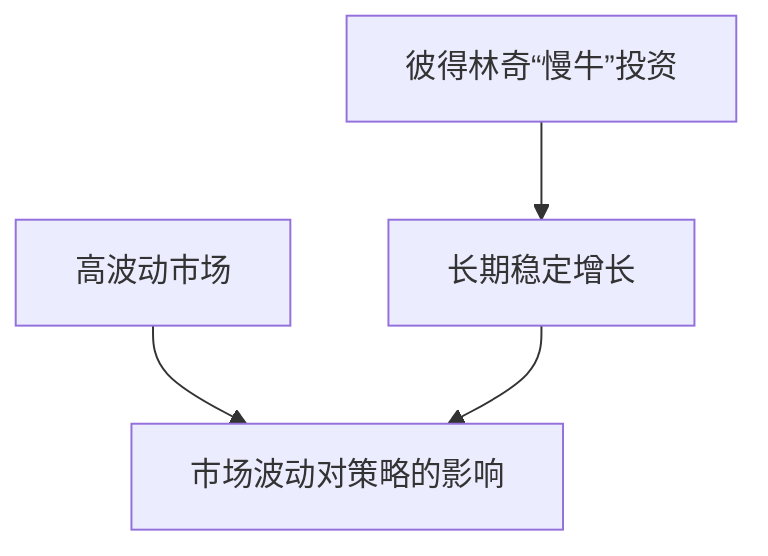
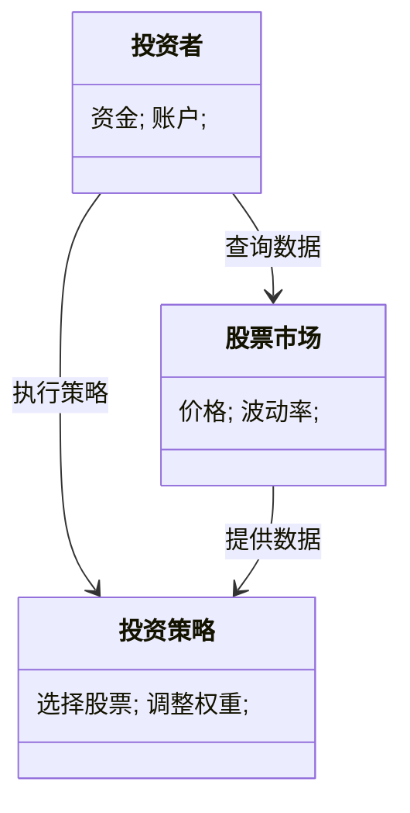
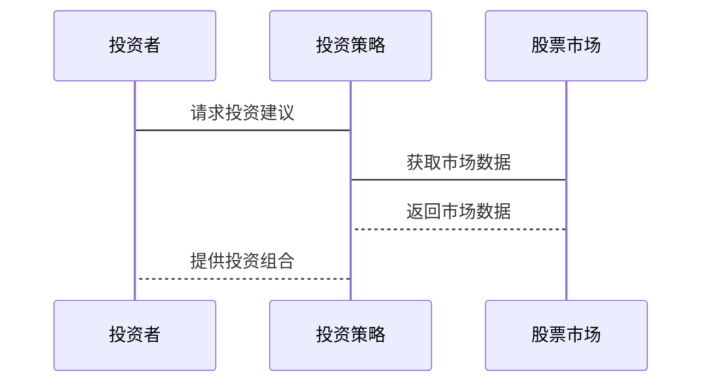

                 


# 彼得林奇的"慢牛"投资在高波动市场中的优势

---

## 关键词：
- 彼得林奇
- 慢牛投资
- 高波动市场
- 投资策略
- 股票投资

---

## 摘要：
本文深入探讨了彼得林奇提出的“慢牛”投资策略在高波动市场中的应用优势。通过分析“慢牛”投资的核心理念、高波动市场的特点，结合数学模型和实际案例，本文详细阐述了如何在高波动环境中运用“慢牛”策略实现长期稳定的收益。文章还通过Python代码实现和系统架构设计，展示了策略的实际应用，为投资者提供了科学的决策参考。

---

## 目录大纲：

### 第一部分：背景介绍

#### 第1章：彼得林奇“慢牛”投资概述

##### 1.1 “慢牛”投资的核心概念
- **1.1.1 投资的长期视角**
  - 解释“慢牛”投资策略的核心理念：寻找优质企业，长期持有，追求稳定增长。
- **1.1.2 “慢牛”策略的定义**
  - 通过长期持有优质股票，逐步实现资产增值。
- **1.1.3 投资策略的优缺点对比**
  - 优点：风险低、收益稳定；缺点：短期内可能表现不佳。

##### 1.2 高波动市场的特点
- **1.2.1 市场波动的定义**
  - 市场波动：价格短期大幅波动，影响投资者决策。
- **1.2.2 高波动市场的表现**
  - 特征：价格剧烈波动，投资者情绪化交易增多。
- **1.2.3 高波动与传统投资策略的冲突**
  - 传统策略在高波动市场中的表现不佳，需调整策略。

---

### 第二部分：核心概念与联系

#### 第2章：“慢牛”投资与高波动市场的关系

##### 2.1 核心概念的原理
- **2.1.1 投资策略的稳定性**
  - “慢牛”策略注重长期稳定，不被短期波动干扰。
- **2.1.2 市场波动对策略的影响**
  - 高波动市场可能导致策略短期表现不佳，但长期收益稳定。

##### 2.2 对比分析表格
| 比较维度       | 传统投资策略                | “慢牛”投资策略                |
|----------------|-----------------------------|-----------------------------|
| 投资期限       | 短期（1-3年）               | 长期（5年以上）               |
| 风险承受能力   | 高                          | 低                          |
| 收益稳定性     | 波动大                      | 稳定                        |

##### 2.3 Mermaid流程图


---

### 第三部分：算法原理讲解

#### 第3章：数学模型与公式

##### 3.1 投资组合优化模型
- 使用马科维茨的有效组合投资理论：
  - **目标函数**：$$ \text{目标函数：} \quad \min_{w} w^T \Sigma w $$
  - **约束条件**：$$ \sum_{i=1}^{n} w_i = 1, \quad w_i \geq 0 $$

##### 3.2 风险调整回报模型
- **Sharpe比率**：
  $$ \text{Sharpe比率} = \frac{E[r_i - r_f]}{\sigma_i} $$

##### 3.3 Python代码实现
```python
import numpy as np
import pandas as pd

# 示例投资组合
assets = ['股票A', '股票B', '股票C']
returns = np.array([0.1, 0.15, 0.08])

# 计算投资组合的波动率
def portfolio_volatility(weights):
    return np.sqrt(np.dot(weights.T, np.dot(np.cov(returns), weights)))

# 优化权重
def optimize_portfolio(returns_matrix):
    n = len(returns_matrix)
    return np.array([1/n]*n)

weights = optimize_portfolio(returns)
print("投资组合波动率：", portfolio_volatility(weights))
```

---

### 第四部分：系统分析与架构设计

#### 第4章：系统功能与架构

##### 4.1 系统功能设计
- **领域模型**：使用Mermaid类图展示投资系统的主要模块。


##### 4.2 系统架构设计
- **架构图**：
```mermaid
graph TD
A[投资者] --> B[投资策略]
C[股票市场] --> B[投资策略]
D[投资结果] <-- B[投资策略]
```

##### 4.3 接口设计
- API接口：
  - 输入：投资者资金、市场数据
  - 输出：投资组合建议

##### 4.4 交互设计
- **交互序列图**：


---

### 第五部分：项目实战

#### 第5章：实际案例分析

##### 5.1 环境安装
- **Python环境**：安装numpy、pandas、scipy。

##### 5.2 核心代码实现
```python
import numpy as np

def slow_bull_strategy(stocks, periods):
    # 计算每只股票的平均回报率
    avg_returns = np.mean(stocks, axis=0)
    # 确定最优权重
    weights = np.array([1/len(stocks)]*len(stocks))
    return weights * avg_returns

# 示例数据
stocks = np.array([[0.1, 0.12, 0.08],
                   [0.15, 0.1, 0.09],
                   [0.08, 0.12, 0.1]])
periods = 3

# 执行策略
result = slow_bull_strategy(stocks, periods)
print("投资回报：", result)
```

##### 5.3 案例分析
- 分析高波动市场中的投资组合表现，对比“慢牛”策略与其他策略的效果。

##### 5.4 项目总结
- 强调策略的稳定性和长期收益，总结实际应用中的经验教训。

---

### 第六部分：最佳实践与小结

#### 第6章：投资策略的注意事项

##### 6.1 最佳实践
- **持续学习**：关注市场动态，调整投资组合。
- **风险管理**：设置止损点，控制投资风险。

##### 6.2 小结
- 彼得林奇的“慢牛”投资策略在高波动市场中表现优异，但需结合实际市场情况灵活运用。

##### 6.3 注意事项
- 避免盲目跟风，定期评估投资组合。

##### 6.4 拓展阅读
- 推荐书籍：《彼得·林奇的成功投资》。

---

## 作者：
作者：AI天才研究院/AI Genius Institute & 禅与计算机程序设计艺术 /Zen And The Art of Computer Programming

---

通过以上目录大纲，您可以根据需要进一步扩展每个章节的内容，确保文章的完整性和深度。

