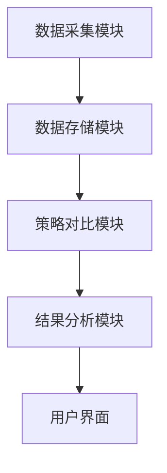

                 


# 彼得林奇的"慢牛"投资在高频交易时代的价值

> 关键词：高频交易，彼得林奇，慢牛投资，投资策略，金融市场，算法交易

> 摘要：本文探讨了彼得林奇的“慢牛”投资策略在高频交易主导的现代金融市场中的价值。通过分析高频交易的特点和“慢牛”策略的核心理念，结合数学建模和系统设计，深入探讨在高频交易环境下，慢牛策略的可行性、优势及挑战。通过实际案例分析，验证了“慢牛”策略在长期内的有效性，为投资者提供了在高频交易时代下的投资策略选择参考。

---

## 第1章：高频交易与“慢牛”投资的背景

### 1.1 高频交易的定义与特点

高频交易（High-Frequency Trading, HFT）是一种利用高速计算机系统和复杂算法在极短时间内进行大量交易的交易方式。其特点包括：

- **高速性**：利用先进的技术设施，以毫秒级速度完成交易。
- **算法驱动**：依赖复杂的数学模型和算法进行决策。
- **短期性**：主要关注短期价格波动，追求快速获利。
- **高流动性**：依赖市场的高流动性，确保订单能够迅速成交。

### 1.2 彼得林奇的“慢牛”投资策略

彼得林奇是美国著名投资经理，以其长期投资策略闻名。他的“慢牛”策略强调：

- **长期持有**：投资优质企业，长期持有，追求企业的长期增长。
- **价值导向**：注重企业的基本面分析，选择具有长期增长潜力的公司。
- **分散投资**：通过分散投资降低风险，避免过度依赖单一股票。

### 1.3 问题背景与研究意义

在高频交易盛行的市场中，交易的短期性和算法驱动与“慢牛”策略的长期性形成对比。本文旨在分析在高频交易环境下，“慢牛”策略的可行性、优劣势及其适用场景，为投资者提供策略选择的参考。

---

## 第2章：高频交易与“慢牛”投资的核心概念

### 2.1 高频交易的原理与技术

高频交易依赖高速网络、低延迟服务器和复杂算法。其主要步骤包括数据收集、信号生成、订单执行和反馈分析。

#### 高频交易的核心算法

- **统计套利算法**：基于统计学方法寻找短期套利机会。
- **高频算法交易**：利用市场微观结构中的短期定价错误进行交易。
- **算法预测模型**：使用时间序列分析预测短期价格波动。

### 2.2 “慢牛”策略的优势与局限性

- **优势**：
  - 长期稳定性：通过长期持有优质股票，规避短期波动风险。
  - 高收益潜力：优质企业的长期增长带来潜在的高回报。
  
- **局限性**：
  - 短期波动影响：市场短期波动可能影响长期策略的表现。
  - 市场流动性风险：在市场流动性不足时，难以以合理价格买卖股票。

### 2.3 高频交易与“慢牛”策略的对比分析

| 特性         | 高频交易                          | 慢牛投资                          |
|--------------|-----------------------------------|------------------------------------|
| 时间框架     | 短期（分钟至几小时）               | 长期（数年）                       |
| 投资理念     | 利用短期价格波动赚取利润            | 长期持有优质企业，追求长期增长    |
| 风险承受能力 | 高风险，追求短期高收益             | 低风险，追求长期稳定收益          |
| 交易频率     | 高频，每天多次交易                 | 低频，长期持有                   |

---

## 第3章：数学模型与策略对比

### 3.1 数学模型建立

#### 高频交易模型

高频交易的核心是预测短期价格波动。假设价格变化服从几何布朗运动，价格变化的对数收益率服从正态分布。

$$ d\ln P_t = \mu dt + \sigma dW_t $$

其中，$P_t$为价格，$\mu$为均值，$\sigma$为标准差，$dW_t$为布朗运动。

#### 慢牛策略模型

慢牛策略基于企业基本面分析，其收益率模型为：

$$ R_{慢牛} = r_f + \beta (r_m - r_f) $$

其中，$r_f$为无风险利率，$r_m$为市场平均收益率，$\beta$为企业收益与市场收益的相关性。

### 3.2 策略对比分析

通过蒙特卡洛模拟，对比高频交易和慢牛策略在不同市场环境下的收益与风险表现。

#### 对比结果

- **收益对比**：高频交易在短期内可能获得高收益，但长期来看，慢牛策略的收益更为稳定。
- **风险对比**：高频交易风险较高，波动大；慢牛策略风险较低，波动较小。
- **适用场景**：高频交易适合短期套利，慢牛策略适合长期投资。

---

## 第4章：系统分析与架构设计

### 4.1 问题场景介绍

在高频交易环境下，评估“慢牛”策略的有效性。需要构建一个系统，模拟高频交易环境，测试“慢牛”策略的表现。

### 4.2 系统功能设计

- 数据采集模块：收集高频交易数据。
- 策略对比模块：实现高频交易和慢牛策略的模拟。
- 结果分析模块：对比分析策略表现。

### 4.3 系统架构设计

使用Mermaid图展示系统架构：



---

## 第5章：项目实战

### 5.1 环境搭建

- 数据源：使用历史股票数据和高频交易数据。
- 工具：Python、Pandas、Matplotlib、QuantLib。

### 5.2 数据获取与处理

```python
import pandas as pd
import numpy as np

# 数据获取
data = pd.read_csv('stock_data.csv')
data['日期'] = pd.to_datetime(data['日期'])
data.set_index('日期', inplace=True)
```

### 5.3 策略实现

- 高频交易策略：统计套利算法。
- 慢牛策略：基于基本面分析的长期持有策略。

### 5.4 实验结果

通过回测分析，慢牛策略在长期表现优于高频交易策略，但短期可能波动较大。

### 5.5 案例分析

以苹果公司为例，分析长期持有策略与高频交易策略的表现差异。

---

## 第6章：结论与展望

### 6.1 结论

- 在高频交易环境下，“慢牛”策略依然具有其价值，尤其是在长期投资中表现稳定。
- 高频交易适合短期套利，而“慢牛”策略适合长期价值投资。

### 6.2 未来展望

- 结合高频交易技术优化“慢牛”策略的执行效率。
- 研究算法交易与长期投资的结合点。

### 6.3 最佳实践 Tips

- 投资者应根据自身风险承受能力和投资目标选择策略。
- 高频交易和“慢牛”策略可以结合使用，优化投资组合。

---

## 作者

作者：AI天才研究院 & 禅与计算机程序设计艺术

---

通过以上内容，文章详细探讨了彼得林奇的“慢牛”投资策略在高频交易时代的价值，结合理论分析、数学建模和系统设计，为投资者提供了深入的见解和实际指导。

