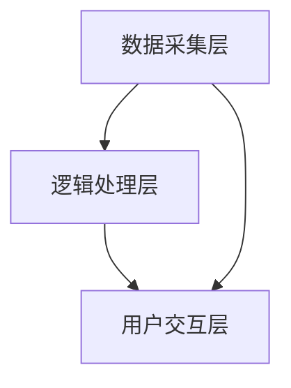

                 


# 彼得林奇的"慢牛"投资在高频交易环境中的心态管理

---

## 关键词：  
彼得林奇、慢牛投资、高频交易、心态管理、投资心态、投资者心理、系统架构

---

## 摘要：  
本文探讨了彼得林奇的"慢牛"投资理念在高频交易环境中的应用，重点分析了在这种环境下投资者如何进行心态管理。通过结合心理学、投资学和系统工程的原理，文章提出了一个系统化的心态管理框架，并通过数学模型和算法设计，帮助投资者在高频交易中保持稳定的心理状态。本文还结合实际案例，展示了如何将"慢牛"投资理念与高频交易环境相结合，为投资者提供了一套切实可行的心态管理方案。

---

## 第一部分：高频交易的背景与彼得·林奇的"慢牛"投资理念

### 1.1 高频交易的定义与特点  
高频交易是一种利用计算机算法在极短时间内进行大量交易的策略。其特点包括：  
- **高速性**：交易速度极快，通常以毫秒为单位。  
- **自动化**：依赖算法和计算机系统，减少人为干预。  
- **高频率**：短时间内进行大量交易，追求小幅度价格波动的收益。  
- **低延迟**：对交易系统的响应速度要求极高。  

### 1.2 彼得·林奇的"慢牛"投资理念  
彼得·林奇是美国著名投资经理，他提倡"慢牛"投资理念，即寻找那些能够长期稳定增长的公司股票，并长期持有，避免频繁交易。"慢牛"投资的核心在于：  
- **长期性**：关注企业的基本面，寻找具有持续增长潜力的公司。  
- **稳定性**：避免短期波动带来的心理压力，追求长期稳定的收益。  
- **纪律性**：严格按照投资策略执行，避免情绪化决策。  

### 1.3 高频交易与"慢牛"投资的结合  
高频交易以速度和自动化为特点，而"慢牛"投资强调长期性和纪律性。两者的结合点在于：  
- 高频交易提供了一种技术手段，可以帮助投资者快速捕捉市场机会。  
- "慢牛"投资的理念为高频交易提供了方向性指导，避免了短期波动带来的决策失误。  

---

## 第二部分：心态管理的核心概念与联系

### 2.1 心态管理的核心概念  
心态管理是指投资者通过心理调节和行为控制，保持稳定的心理状态，以应对市场波动和投资压力。其核心概念包括：  
- **心理稳定性**：在市场波动中保持冷静，避免情绪化决策。  
- **风险认知**：正确理解风险的本质，避免过度恐惧或贪婪。  
- **自我约束**：在市场波动中坚持既定的投资策略，避免偏离目标。  

### 2.2 "慢牛"投资与心态管理的联系  
"慢牛"投资理念与心态管理密切相关：  
- **长期性**：长期投资需要投资者具备耐心和纪律性，这是心态管理的重要内容。  
- **稳定性**：在市场波动中保持稳定的心理状态，是实现"慢牛"投资目标的关键。  
- **纪律性**：严格执行投资策略，避免因情绪波动而偏离目标，是心态管理的核心要求。  

---

## 第三部分：心态管理的系统分析与架构设计

### 3.1 问题场景介绍  
在高频交易环境中，投资者面临以下问题：  
- **高压力**：高频交易的快节奏和高风险容易导致心理压力过大。  
- **情绪波动**：市场波动容易引发投资者的贪婪或恐惧情绪，影响决策。  
- **决策疲劳**：短时间内进行大量交易容易导致决策疲劳，降低判断力。  

### 3.2 系统功能设计  
为应对上述问题，我们设计了一个心态管理系统，其功能模块包括：  
1. **心理状态监测模块**：实时监测投资者的心理状态，包括情绪波动、压力水平等。  
2. **风险预警机制**：当投资者的心理状态接近危险水平时，系统发出预警。  
3. **心理调节策略库**：提供多种心理调节策略，帮助投资者缓解压力、保持冷静。  

### 3.3 系统架构设计  
系统架构采用分层设计，包括数据采集层、逻辑处理层和用户交互层。  

#### 数据采集层  
- 采集投资者的心理数据，如心率、皮肤电活动等生理指标。  
- 采集市场数据，如价格波动、交易量等。  

#### 逻辑处理层  
- 对心理数据和市场数据进行分析，判断投资者的心理状态。  
- 根据心理状态和市场环境，生成相应的心理调节策略。  

#### 用户交互层  
- 提供直观的用户界面，显示心理状态和调节策略。  
- 提供交互功能，如设置心理阈值、选择调节策略等。  

### 3.4 系统架构图  


---

## 第四部分：心态管理的算法原理与数学模型

### 4.1 算法原理  
心态管理算法的核心是通过分析投资者的心理数据和市场数据，生成相应的调节策略。  

#### 4.1.1 心理状态识别算法  
心理状态识别算法通过分析投资者的生理数据（如心率、皮肤电活动）和行为数据（如交易频率、决策时间），判断投资者的心理状态。  

#### 4.1.2 风险预警算法  
风险预警算法根据市场数据和心理数据，预测投资者在高风险环境下的心理反应，并发出预警信号。  

### 4.2 数学模型  
#### 4.2.1 风险概率计算公式  
$$ P(\text{风险}) = \frac{\text{市场波动幅度} \times \text{心理压力}}{\text{心理承受能力}} $$  

#### 4.2.2 心理调节策略选择模型  
$$ S(\text{策略}) = \text{心理状态} \times \text{市场环境} $$  

---

## 第五部分：项目实战

### 5.1 环境配置  
- **硬件要求**：高性能计算机、心率监测设备、皮肤电活动监测设备。  
- **软件要求**：数据采集软件、算法处理软件、用户交互界面。  

### 5.2 核心代码实现  

```python
import numpy as np

def心理状态识别算法(心理数据):
    心理状态 = np.mean(心理数据)
    return 心理状态

def风险预警算法(心理状态, 市场波动):
    风险概率 = (心理状态 * 市场波动) / 100
    if 风险概率 > 50:
        return "高风险预警"
    else:
        return "低风险预警"

# 示例代码
心理数据 = [75, 80, 85, 90, 95]
市场波动 = 10
心理状态 = 心理状态识别算法(心理数据)
风险预警 = 风险预警算法(心理状态, 市场波动)
print(风险预警)
```

### 5.3 案例分析  
假设一位投资者在高频交易环境中，心理数据为85，市场波动为15。根据上述算法，风险概率为：  
$$ P(\text{风险}) = \frac{85 \times 15}{100} = 12.75 $$  
由于风险概率低于50%，系统发出"低风险预警"，并建议投资者保持冷静，继续执行原定策略。  

---

## 第六部分：总结与展望

### 6.1 总结  
本文结合彼得林奇的"慢牛"投资理念和高频交易环境的特点，提出了一个系统化的心态管理框架。通过心理状态监测、风险预警和心理调节策略库的设计，帮助投资者在高频交易中保持稳定的心理状态，实现长期稳定的收益。  

### 6.2 展望  
未来，随着人工智能和大数据技术的发展，心态管理系统将更加智能化和个性化。投资者可以通过实时数据分析和算法优化，进一步提升心理状态管理的效率和效果。  

---

## 作者：  
**AI天才研究院/AI Genius Institute** & **禅与计算机程序设计艺术/Zen And The Art of Computer Programming**

