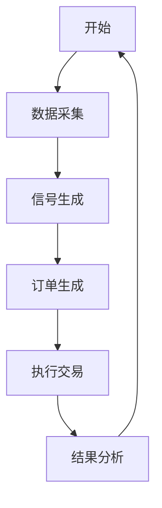
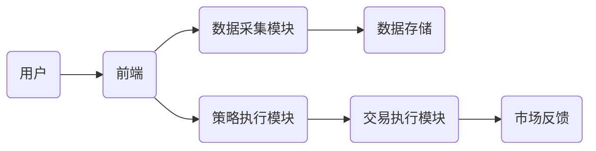

                 


# 彼得林奇的"慢牛"投资在高频交易环境中的执行策略

> 关键词：高频交易，彼得林奇，慢牛投资，算法交易，统计套利

> 摘要：本文探讨了彼得林奇的“慢牛”投资策略在高频交易环境中的执行策略。通过分析高频交易的特点、算法交易的实现、统计套利的应用，以及将彼得林奇的投资理念算法化，提出了一种结合长期价值投资和高频交易的策略。文章详细讲解了算法原理、系统架构设计和项目实战，并给出了最佳实践建议。

---

## 第一部分：背景介绍

### 第1章：高频交易的基本概念与特点

#### 1.1 高频交易的定义与特点
- **定义**：高频交易是指通过计算机算法在极短时间内进行大量交易的策略。
- **特点**：高频交易依赖高速数据处理、低延迟网络和复杂算法，通常在 milliseconds 级别完成交易。
- **市场影响**：高频交易增加了市场的流动性和价格波动性，但也可能导致闪崩等极端情况。

#### 1.2 高频交易的技术基础
- **高速数据处理技术**：使用分布式系统处理大量实时数据。
- **算法交易的实现**：基于数学模型和统计套利的算法。
- **低延迟网络与硬件**：使用专用硬件和网络减少交易延迟。

### 第2章：彼得林奇的"慢牛"投资策略

#### 2.1 彼得林奇投资理念概述
- **定义**：寻找具有持续增长潜力的公司，长期持有，追求稳定的收益增长。
- **特点**：注重基本面分析，寻找低估的股票，长期持有，避免短期波动。

#### 2.2 "慢牛"投资的核心要素
- **价值投资**：寻找基本面良好、估值合理的公司。
- **长期投资**：不因短期波动改变投资决策，耐心等待价值实现。
- **风险管理**：分散投资，控制仓位，避免过度集中。

### 第3章：高频交易环境中的"慢牛"投资策略

#### 3.1 高频交易与"慢牛"投资的结合
- **结合方式**：在高频交易环境中，利用算法快速执行彼得林奇的选股策略。
- **市场互动**：高频交易的短期波动与长期投资的稳定性相互影响。

#### 3.2 高频交易环境中的市场分析
- **市场波动性分析**：高频交易加剧市场波动，影响"慢牛"策略的实施。
- **参与者行为分析**：机构投资者和高频交易算法的交互影响市场走势。
- **数据处理**：实时处理市场数据，快速识别交易机会。

---

## 第二部分：核心概念与联系

### 第4章：高频交易与"慢牛"投资的联系

#### 4.1 核心概念原理
- **高频交易**：依赖算法快速执行交易，追求短期收益。
- **"慢牛"投资**：依赖基本面分析，追求长期收益。

#### 4.2 概念属性对比
| 特性 | 高频交易 | "慢牛"投资 |
|------|----------|------------|
| 时间框架 | 短期内（秒/分钟） | 长期内（月/年） |
| 风险 | 高 | 中等 |
| 收益 | 高波动 | 稳定 |

#### 4.3 实体关系图
```mermaid
erd
actor: 投资者
strategy: 策略模块
data: 数据源
execution: 交易执行
market: 市场
```

---

## 第三部分：算法原理讲解

### 第5章：高频交易环境下的算法交易

#### 5.1 统计套利算法
- **定义**：利用资产价格的统计相关性进行套利。
- **步骤**：识别相关资产，计算价差，建立头寸。
- **数学模型**：使用协方差矩阵和均值回归模型。

#### 5.2 算法交易模型


#### 5.3 彼得林奇策略的算法化
- **量化指标**：将基本面分析转化为量化指标，如市盈率、ROE等。
- **交易信号**：当指标满足条件时触发交易。

---

## 第四部分：系统分析与架构设计方案

### 第6章：系统架构设计

#### 6.1 系统功能设计
- **数据采集**：实时采集市场数据。
- **策略执行**：运行彼得林奇策略和高频交易算法。
- **交易执行**：快速下单和成交处理。

#### 6.2 系统架构图


---

## 第五部分：项目实战

### 第7章：高频交易环境下的"慢牛"策略实现

#### 7.1 环境安装
- **工具**：Python、Pandas、NumPy、Matplotlib、QuantLib。

#### 7.2 核心代码实现
```python
import pandas as pd
import numpy as np

def slow_bull_strategy(prices, volumes, days=20):
    # 计算20日均线
    ma = prices.rolling(days).mean()
    # 计算波动率
    volatility = prices.rolling(days).std()
    # 生成信号：价格低于均线且波动率低
    signal = (prices < ma) & (volatility < np.mean(volatility))
    return signal
```

#### 7.3 案例分析
- **案例**：某股票的历史数据。
- **结果**：策略在特定时间段内表现稳定，但需结合高频交易算法优化。

---

## 第六部分：最佳实践 tips

### 7.4 小结
- 结合高频交易和“慢牛”投资的策略需要深入理解两者的优缺点，找到平衡点。

### 7.5 注意事项
- 风险控制：避免过度依赖算法，定期审查策略。
- 数据质量：确保数据源准确可靠。
- 系统稳定性：保证交易系统的低延迟和高可用性。

### 7.6 拓展阅读
- 推荐书籍：《彼得林奇的选股术》、《高频交易算法》。

---

## 作者：AI天才研究院 & 禅与计算机程序设计艺术

---

**本文由AI天才研究院的AI助手创作，旨在分享技术知识和投资策略。如需转载请注明出处。**

