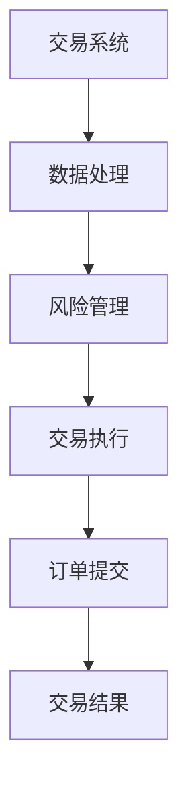

                 


# 彼得林奇的"慢牛"投资在高频交易环境中的风险控制

## 关键词：彼得林奇，慢牛投资，高频交易，风险控制，金融投资，算法交易

## 摘要：  
本文探讨了彼得林奇的“慢牛”投资理念在高频交易环境中的应用与风险控制。传统投资策略与高频交易的结合是一个充满挑战的领域，本文通过分析高频交易的特点、风险以及“慢牛”投资的核心理念，提出了在高频交易环境下如何有效控制风险的具体策略。通过数学模型、系统架构设计和项目实战案例的分析，本文为投资者提供了在高频交易中实现稳健投资的理论支持和实践指导。

---

## 第一部分：彼得林奇的"慢牛"投资概述

### 第1章：彼得林奇"慢牛"投资的核心理念

#### 1.1 投资的长期视角  
- 1.1.1 长期投资的基本原理：投资的复利效应与时间的价值。  
- 1.1.2 "慢牛"投资的核心理念：寻找具有持续增长潜力的优质企业，长期持有，避免频繁交易。  
- 1.1.3 长期投资与短期波动的平衡：如何在市场波动中保持投资纪律。

#### 1.2 彼得林奇投资策略的特点  
- 1.2.1 价值投资与成长投资的结合：寻找被低估的优质成长股。  
- 1.2.2 风险控制在投资中的重要性：分散投资、严格选股。  
- 1.2.3 投资组合的分散化策略：降低单一资产的风险集中度。

### 第2章：高频交易环境的特点与挑战

#### 2.1 高频交易的基本概念  
- 2.1.1 高频交易的定义与特点：算法驱动、高频次交易、微利交易。  
- 2.1.2 高频交易的技术实现：低延迟交易系统、算法策略开发。  
- 2.1.3 高频交易的市场影响：市场流动性、价格波动、市场操纵的风险。

#### 2.2 高频交易环境中的风险  
- 2.2.1 市场风险：市场价格波动对高频交易策略的影响。  
- 2.2.2 涨跌幅度风险：高频交易中微利交易的累积效应与潜在损失。  
- 2.2.3 交易成本风险：高频交易中的佣金、滑点成本。  
- 2.2.4 技术风险：系统故障、网络延迟对交易的影响。

### 第3章：彼得林奇投资理念与高频交易的结合

#### 3.1 "慢牛"投资在高频交易中的应用  
- 3.1.1 长期投资理念与高频交易的结合：如何在高频交易中实现长期收益。  
- 3.1.2 风险控制在高频交易中的重要性：避免过度杠杆、控制仓位。  
- 3.1.3 高频交易环境下的投资策略调整：算法交易与基本面分析的结合。

#### 3.2 高频交易中的风险管理模型  
- 3.2.1 风险管理的基本原理：VaR（在险价值）、CVaR（条件在险价值）的定义与应用。  
- 3.2.2 高频交易中的风险管理模型：基于算法的实时风险监控。  
- 3.2.3 风险控制的具体实施策略：动态调整头寸、设置止损点。

---

## 第二部分：高频交易环境中的风险控制

### 第4章：高频交易中的风险分析

#### 4.1 高频交易中的常见风险  
- 4.1.1 市场风险：如何量化高频交易中的市场波动风险。  
- 4.1.2 涨跌幅度风险：高频交易中对价格波动的敏感性。  
- 4.1.3 交易成本风险：高频交易中的佣金、滑点成本。  
- 4.1.4 技术风险：系统故障对高频交易的影响。

#### 4.2 风险的量化与评估  
- 4.2.1 风险的量化方法：VaR、CVaR的计算公式与应用场景。  
- 4.2.2 风险评估的具体步骤：数据收集、模型建立、风险监控。  
- 4.2.3 风险评估的工具与技术：实时数据流处理、算法模型的应用。

### 第5章：高频交易中的风险管理策略

#### 5.1 风险管理的基本原则  
- 5.1.1 风险管理的目标：保护投资本金、实现稳健收益。  
- 5.1.2 风险管理的组织架构：团队分工、技术与策略的结合。  
- 5.1.3 风险管理的流程：事前、事中、事后的全过程管理。

#### 5.2 高频交易中的具体风险管理策略  
- 5.2.1 风险对冲策略：利用衍生品对冲市场风险。  
- 5.2.2 风险分散策略：多策略、多资产的组合投资。  
- 5.2.3 风险预警机制：实时监控、异常交易的识别。  
- 5.2.4 风险应对措施：快速调整策略、控制仓位。

### 第6章：彼得林奇投资理念在高频交易中的应用

#### 6.1 "慢牛"投资理念的高频交易环境适应性  
- 6.1.1 长期投资理念与高频交易的结合：如何在高频交易中实现长期价值。  
- 6.1.2 风险控制在高频交易中的重要性：避免短期波动对长期收益的影响。  
- 6.1.3 高频交易环境下的投资策略调整：算法交易与基本面分析的结合。

---

## 第三部分：数学模型与系统架构设计

### 第7章：高频交易中的数学模型

#### 7.1 波动率的计算  
- 波动率的定义：$$\sigma = \sqrt{\frac{1}{n}\sum_{i=1}^{n}(x_i - \mu)^2}$$  
- 常见的波动率模型：GARCH模型、ARCH模型。  

#### 7.2 VaR（在险价值）与CVaR（条件在险价值）  
- VaR的定义：$$VaR_{\alpha} = \inf\{x | P(L \leq x) \geq \alpha\}$$  
- CVaR的定义：$$CVaR_{\alpha} = \frac{1}{\alpha} \int_{-\infty}^{VaR_{\alpha}} (x - VaR_{\alpha}) dF(x)$$  

#### 7.3 算法交易中的风险管理模型  
- 基于VaR的交易策略调整：$$\text{调整头寸} = \text{初始头寸} \times \frac{\text{VaR}_{\text{目标}}}{\text{VaR}_{\text{当前}}}$$  

### 第8章：系统架构设计

#### 8.1 高频交易系统的功能设计  
- 数据处理模块：实时数据采集、清洗、转换。  
- 交易执行模块：算法策略生成、订单提交、交易执行。  
- 风险管理模块：实时风险监控、风险预警、策略调整。  

#### 8.2 系统架构图  


---

## 第四部分：项目实战与总结

### 第9章：项目实战

#### 9.1 环境安装与配置  
- 安装高频交易框架：QuantLib、Backtrader。  
- 数据源：接入实时市场数据API（如Kafka、RabbitMQ）。  

#### 9.2 核心代码实现  
```python
# 示例代码：基于VaR的风险管理模型
import numpy as np
from scipy.stats import norm

def calculate_VaR(returns, confidence_level=0.95):
    mu = np.mean(returns)
    sigma = np.std(returns)
   VaR = norm.ppf(1 - confidence_level) * sigma
    return VaR

# 示例数据：假设returns是一个数组
returns = np.random.normal(0, 1, 1000)
VaR = calculate_VaR(returns, 0.95)
print(f"VaR at 95% confidence level: {VaR}")
```

#### 9.3 系统测试与优化  
- 压力测试：模拟极端市场环境下的系统表现。  
- 性能优化：降低交易延迟、提高数据处理效率。  

#### 9.4 实际案例分析  
- 案例1：某高频交易系统在市场波动中的表现。  
- 案例2：基于彼得林奇理念的交易策略在高频环境中的应用。  

### 第10章：总结与展望

#### 10.1 总结  
- 彼得林奇的“慢牛”投资理念在高频交易环境中的应用价值。  
- 高频交易中的风险管理是实现稳健投资的关键。  

#### 10.2 展望  
- 高频交易与人工智能的结合：深度学习在交易策略中的应用。  
- 风险管理的进一步优化：动态调整策略、实时监控技术的提升。  

---

## 作者：AI天才研究院/AI Genius Institute & 禅与计算机程序设计艺术 /Zen And The Art of Computer Programming  

---

以上是文章的完整目录大纲，具体内容可以根据以上结构逐步展开编写。

