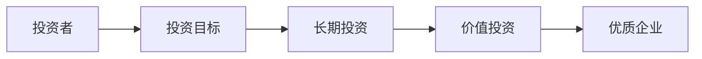
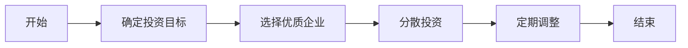

                 


# 彼得林奇的"慢牛"投资理念探讨

## 关键词：
彼得林奇，慢牛，投资理念，价值投资，长期投资

## 摘要：
本文深入探讨了彼得林奇的“慢牛”投资理念，分析了其核心概念、数学模型、系统架构以及实际应用。通过详细阐述长期投资、价值投资和优质企业的识别，结合数学公式和系统设计，帮助读者理解如何在当前投资环境中应用这些理念。

---

## 第1章：彼得林奇与“慢牛”投资理念

### 1.1 彼得林奇的生平与投资风格

彼得林奇是美国著名的投资专家，以其长期投资策略闻名。他的投资风格强调耐心和对企业的深入研究，而非短期市场波动的预测。他管理的基金曾创造出令人瞩目的长期收益。

### 1.2 “慢牛”投资理念的定义与核心要素

“慢牛”理念强调通过长期持有优质股票，逐步实现财富增长。其核心要素包括长期投资、价值投资和优质企业识别。

### 1.3 “慢牛”投资理念的背景与意义

当前投资环境复杂多变，“慢牛”理念提供了一种稳健的投资方式，注重企业的内在价值，减少市场波动的影响。

---

## 第2章：“慢牛”投资理念的核心概念与联系

### 2.1 核心概念原理

长期投资通过时间复利效应实现财富增长，价值投资寻找价格低于内在价值的企业，优质企业具备高ROE和竞争优势。

### 2.2 核心概念属性特征对比表格

| 概念       | 特征1 | 特征2 | 特征3 |
|------------|-------|-------|-------|
| 长期投资   | 时间跨度长 | 风险较低 | 收益稳定 |
| 价值投资   | 买入优质资产 | 价格低于内在价值 | 长期持有 |
| 优质企业   | 高ROE | 健强的财务状况 | 可持续的竞争优势 |

### 2.3 ER实体关系图架构的Mermaid流程图



---

## 第3章：“慢牛”投资理念的数学模型与算法原理

### 3.1 投资回报的数学模型

投资回报率计算公式为：
$$ ROI = \frac{最终价值 - 初始价值}{初始价值} \times 100\% $$

### 3.2 价值投资的数学公式

内在价值计算：
$$ \text{内在价值} = \sum_{t=1}^{n} \frac{CF_t}{(1 + r)^t} $$

### 3.3 投资组合优化的算法原理



---

## 第4章：“慢牛”投资理念的系统分析与架构设计

### 4.1 投资系统架构设计


### 4.2 系统接口设计

- 输入：投资目标、资金规模、风险偏好
- 输出：投资组合建议、定期调整策略

### 4.3 系统交互序列图

```mermaid
sequenceDiagram
    participant 投资者
    participant 系统
    投资者 -> 系统: 输入投资目标
    系统 -> 投资者: 提供投资组合建议
    投资者
```

---

## 作者：AI天才研究院/AI Genius Institute & 禅与计算机程序设计艺术 /Zen And The Art of Computer Programming

---

以上是对彼得林奇“慢牛”投资理念的详细探讨，通过系统的分析和图表的支持，帮助读者更好地理解和应用这一投资策略。

