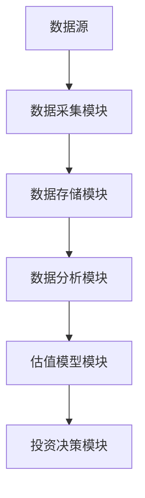
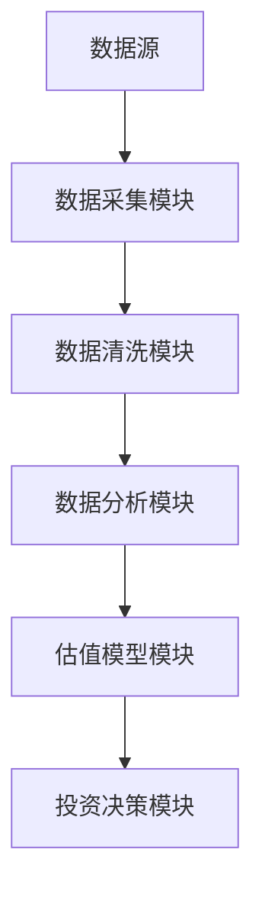
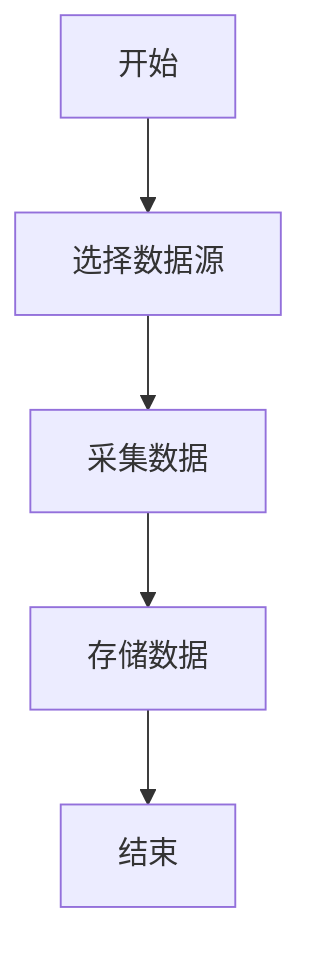
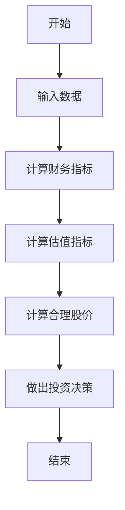

                 


# 彼得林奇的"成长型价值股"估值方法

> 关键词：彼得·林奇，成长型价值股，估值方法，股票投资，投资策略

> 摘要：本文详细介绍了彼得·林奇的“成长型价值股”估值方法，包括其核心概念、算法原理、系统架构和项目实战等内容。通过理论与实践相结合的方式，帮助读者理解如何在股票投资中应用这一方法，实现长期稳定的收益。

---

## 第1章：成长型价值股的定义与背景

### 1.1 成长型价值股的核心概念

#### 1.1.1 成长型投资的定义与特点
成长型投资是指选择那些收入和利润持续增长的公司进行投资。其特点包括：
- **收入增长**：公司收入逐年增长，且增速高于行业平均水平。
- **利润增长**：净利润持续增长，且盈利能力逐步提升。
- **高成长性**：公司处于快速成长期，未来有较大的增长空间。

#### 1.1.2 价值投资的定义与特点
价值投资是指选择那些市场价格低于其内在价值的公司进行投资。其特点包括：
- **低估值**：市盈率、市净率等估值指标低于行业平均水平。
- **安全边际**：市场价格与内在价值之间存在较大的差距，提供足够的安全边际。
- **长期持有**：投资者长期持有优质股票，等待市场重新定价。

#### 1.1.3 成长型价值股的结合与平衡
成长型价值股是成长投资和价值投资的结合，强调在成长性和估值之间找到平衡点。其特点包括：
- **成长性优先**：公司具有持续的收入和利润增长能力。
- **估值合理**：市场价格低于公司的内在价值。
- **长期投资**：注重公司的长期增长潜力，而非短期波动。

### 1.2 彼得·林奇的成长型价值股理念

#### 1.2.1 彼得·林奇的投资哲学
彼得·林奇是美国著名的基金经理，被誉为“最伟大的股票投资者之一”。他主张投资那些具有强大基本面和成长潜力的公司，尤其是那些被市场低估的成长股。

#### 1.2.2 成长型价值股的选股标准
彼得·林奇认为，成长型价值股应具备以下特征：
- **收入和利润持续增长**：公司过去几年的收入和利润均保持稳定增长。
- **估值合理**：市盈率、市净率等估值指标低于行业平均水平。
- **行业地位稳固**：公司在行业中具有竞争优势，市场占有率高。
- **管理团队优秀**：公司管理团队具有丰富的经验和良好的声誉。

#### 1.2.3 成长型价值股的长期投资策略
彼得·林奇主张长期持有成长型价值股，等待公司成长带来的股价上涨。他认为，短期市场波动不应影响长期投资决策，应专注于公司的基本面和长期增长潜力。

### 1.3 成长型价值股与传统投资方法的区别

#### 1.3.1 与纯成长股投资的区别
纯成长股投资仅关注公司的成长性，忽视估值因素。而成长型价值股投资在关注成长性的同时，也注重估值的合理性。

#### 1.3.2 与纯价值股投资的区别
纯价值股投资仅关注公司的估值，忽视成长性。而成长型价值股投资在关注估值的同时，也注重公司的成长潜力。

#### 1.3.3 成长型价值股的独特优势
成长型价值股投资兼顾成长性和估值因素，能够在成长性和安全性之间找到平衡点，降低投资风险，提高投资收益。

### 1.4 本章小结
本章介绍了成长型价值股的核心概念和彼得·林奇的投资理念，明确了成长型价值股的定义、特点和选股标准。通过与传统投资方法的对比，突出了成长型价值股的独特优势。

---

## 第2章：成长型价值股的核心要素分析

### 2.1 成长型价值股的财务指标分析

#### 2.1.1 收入增长率
收入增长率是衡量公司成长性的重要指标。计算公式为：
$$ 收入增长率 = \frac{\text{本期收入} - \text{上期收入}}{\text{上期收入}} \times 100\% $$

#### 2.1.2 净利润增长率
净利润增长率是衡量公司盈利能力的重要指标。计算公式为：
$$ 净利润增长率 = \frac{\text{本期净利润} - \text{上期净利润}}{\text{上期净利润}} \times 100\% $$

#### 2.1.3 股东权益增长率
股东权益增长率是衡量公司资产增长的重要指标。计算公式为：
$$ 股东权益增长率 = \frac{\text{本期股东权益} - \text{上期股东权益}}{\text{上期股东权益}} \times 100\% $$

#### 2.1.4 财务健康性评估
财务健康性评估包括以下几个方面：
- **资产负债率**：资产负债率越低，公司的财务风险越小。
- **流动比率**：流动比率越高，公司的短期偿债能力越强。
- **净利润率**：净利润率越高，公司的盈利能力越强。

### 2.2 成长型价值股的行业分析

#### 2.2.1 行业生命周期分析
行业生命周期分为四个阶段：
1. **导入期**：行业刚刚起步，公司数量较少，市场潜力大。
2. **成长期**：行业快速发展，公司数量增加，市场竞争加剧。
3. **成熟期**：行业增长放缓，市场趋于饱和。
4. **衰退期**：行业增长停滞或下降，公司数量减少。

#### 2.2.2 行业竞争格局分析
行业竞争格局分析包括以下几个方面：
- **市场集中度**：市场集中度越高，行业的竞争越激烈。
- **竞争优势**：公司是否具有独特的竞争优势，如技术、品牌、成本等。
- **行业壁垒**：行业的进入壁垒越高，竞争越不激烈。

#### 2.2.3 行业增长潜力评估
行业增长潜力评估包括以下几个方面：
- **市场规模**：行业的市场规模越大，增长潜力越大。
- **增长率**：行业的年增长率越高，增长潜力越大。
- **政策支持**：行业是否受到政策支持，政策支持力度越大，增长潜力越大。

### 2.3 成长型价值股的公司治理分析

#### 2.3.1 管理团队稳定性
管理团队稳定性分析包括以下几个方面：
- **管理团队经验**：管理团队成员是否具有丰富的行业经验和管理经验。
- **管理团队声誉**：管理团队是否具有良好的声誉和信誉。
- **管理团队稳定性**：管理团队是否稳定，是否存在频繁的人员变动。

#### 2.3.2 公司治理结构
公司治理结构分析包括以下几个方面：
- **董事会结构**：董事会是否独立、专业，是否具有监督和决策能力。
- **股权结构**：股权结构是否合理，是否存在控股股东滥用职权的情况。
- **内部控制**：公司是否具有完善的内部控制制度，能否有效防范风险。

#### 2.3.3 企业创新能力和研发投入
企业创新能力和研发投入分析包括以下几个方面：
- **研发投入比例**：公司研发投入占收入的比例是否合理。
- **技术创新能力**：公司是否具有较强的技术创新能力，能否持续推出新产品。
- **研发团队**：公司是否具有强大的研发团队，能否支持技术创新。

### 2.4 本章小结
本章从财务指标、行业分析和公司治理三个方面，详细分析了成长型价值股的核心要素。通过财务指标分析，可以评估公司的成长性和财务健康性；通过行业分析，可以评估行业的增长潜力和竞争格局；通过公司治理分析，可以评估公司的管理团队和治理结构。

---

## 第3章：彼得·林奇的成长型价值股估值方法

### 3.1 估值方法的概述

#### 3.1.1 市盈率法
市盈率法是通过比较公司的市盈率与行业平均水平或目标公司的合理市盈率，来判断公司是否被低估或高估。计算公式为：
$$ 市盈率 = \frac{\text{股价}}{\text{每股收益}} $$

#### 3.1.2 市净率法
市净率法是通过比较公司的市净率与行业平均水平或目标公司的合理市净率，来判断公司是否被低估或高估。计算公式为：
$$ 市净率 = \frac{\text{股价}}{\text{每股净资产}} $$

#### 3.1.3 内在价值法
内在价值法是通过对公司未来现金流的折现，来估算公司的内在价值。计算公式为：
$$ 内在价值 = \sum_{t=1}^{n} \frac{\text{现金流}_t}{(1 + r)^t} $$
其中，\( r \) 是折现率，\( n \) 是预测的现金流期限。

#### 3.1.4 相对估值法
相对估值法是通过比较公司与行业可比公司的估值指标，来判断公司是否被低估或高估。常用的指标包括市盈率、市净率、EV/EBITDA等。

### 3.2 彼得·林奇的成长型价值股估值模型

#### 3.2.1 基本原理
彼得·林奇的估值模型基于成长性和估值的平衡，通过综合考虑公司的收入增长率、净利润增长率、市盈率、市净率等指标，来判断公司是否被低估或高估。

#### 3.2.2 估值公式
彼得·林奇的估值公式如下：
$$ 合理股价 = \frac{\text{收入增长率} + \text{净利润增长率}}{2} \times \text{行业平均市盈率} $$

#### 3.2.3 模型的优缺点分析
- **优点**：结合了成长性和估值因素，能够较好地平衡短期和长期投资目标。
- **缺点**：模型过于简化，忽略了市场的波动性和公司的具体情况。

### 3.3 估值模型的实现步骤

#### 3.3.1 数据收集与整理
需要收集以下数据：
- 公司的收入增长率、净利润增长率等财务指标。
- 行业平均市盈率、市净率等估值指标。
- 公司的管理团队、公司治理等非财务指标。

#### 3.3.2 指标计算与分析
根据收集的数据，计算公司与行业平均的市盈率、市净率等指标，分析公司的成长性和估值情况。

#### 3.3.3 估值结果与投资决策
根据估值结果，判断公司是否被低估或高估，结合公司的成长性和估值情况，做出投资决策。

### 3.4 本章小结
本章详细介绍了彼得·林奇的成长型价值股估值方法，包括市盈率法、市净率法、内在价值法和相对估值法等常用的估值方法，以及彼得·林奇的估值模型和实现步骤。

---

## 第4章：成长型价值股的选股策略

### 4.1 选股标准的制定

#### 4.1.1 收入与利润持续增长
公司过去几年的收入和利润均保持稳定增长，且增速高于行业平均水平。

#### 4.1.2 估值合理且有吸引力
公司的市盈率、市净率等估值指标低于行业平均水平，且具有一定的安全边际。

#### 4.1.3 公司基本面健康
公司财务健康，资产负债率低，流动比率高，净利润率高。

#### 4.1.4 行业前景广阔
公司所处行业具有较大的增长潜力，市场规模大，行业生命周期处于成长期或成熟期。

### 4.2 选股流程的详细步骤

#### 4.2.1 筛选候选股票
根据选股标准，筛选出符合成长型价值股特征的候选股票。

#### 4.2.2 财务指标分析
对候选股票的收入增长率、净利润增长率、股东权益增长率等财务指标进行详细分析，评估公司的成长性和财务健康性。

#### 4.2.3 估值模型计算
使用彼得·林奇的估值模型，计算候选股票的合理股价，判断公司是否被低估或高估。

#### 4.2.4 投资决策
结合公司的成长性和估值情况，做出投资决策，决定是否买入、卖出或持有。

### 4.3 选股策略的优化与调整

#### 4.3.1 动态调整策略
根据市场变化和公司基本面的变化，动态调整选股策略，及时更新候选股票。

#### 4.3.2 风险控制措施
设置止损点，控制投资风险，避免因市场波动导致的重大损失。

#### 4.3.3 长期与短期策略结合
在长期投资策略的基础上，适当结合短期投资策略，捕捉市场机会，提高投资收益。

### 4.4 本章小结
本章详细介绍了成长型价值股的选股策略，包括选股标准的制定和选股流程的详细步骤，以及选股策略的优化与调整。

---

## 第5章：成长型价值股投资的风险与挑战

### 5.1 投资风险的分类

#### 5.1.1 市场风险
市场风险是指由于市场波动导致股票价格下跌的风险。市场风险是不可避免的，但可以通过分散投资和风险控制来降低。

#### 5.1.2 个股风险
个股风险是指由于公司基本面变化或市场情绪变化导致的个股价格波动风险。个股风险可以通过分散投资和深入研究来降低。

#### 5.1.3 估值风险
估值风险是指由于公司估值偏离其内在价值导致的投资风险。估值风险可以通过合理估值和动态调整投资策略来降低。

#### 5.1.4 周期性风险
周期性风险是指由于经济周期波动导致的行业和公司业绩波动风险。周期性风险可以通过选择周期性较低的行业和公司来降低。

### 5.2 成长型价值股投资的主要挑战

#### 5.2.1 高估值风险
成长型价值股通常具有较高的估值，容易受到市场波动的影响。

#### 5.2.2 市场波动风险
成长型价值股的价格波动较大，容易受到市场情绪的影响。

#### 5.2.3 业绩不及预期风险
如果公司的业绩增长不及预期，股票价格可能会大幅下跌。

#### 5.2.4 行业风险
如果公司所处行业的增长潜力不足，或者行业竞争加剧，公司的业绩和股价可能会受到影响。

### 5.3 风险控制与投资策略

#### 5.3.1 分散投资
通过分散投资，降低个股和行业的集中度，降低投资风险。

#### 5.3.2 风险提示
定期评估投资组合的风险，及时调整投资策略，避免过度集中。

#### 5.3.3 长期持有
长期持有成长型价值股，避免频繁交易，降低交易成本和市场波动的影响。

### 5.4 本章小结
本章分析了成长型价值股投资的主要风险和挑战，包括市场风险、个股风险、估值风险和周期性风险等，并提出了相应的风险控制措施和投资策略。

---

## 第6章：成长型价值股投资的系统架构与实现

### 6.1 系统功能设计

#### 6.1.1 数据采集模块
数据采集模块负责采集股票的基本信息、财务数据、行业数据等。

#### 6.1.2 数据分析模块
数据分析模块负责对采集的数据进行分析，计算公司的财务指标、估值指标等。

#### 6.1.3 估值模型模块
估值模型模块负责根据彼得·林奇的估值模型，计算股票的合理股价，判断股票是否被低估或高估。

#### 6.1.4 投资决策模块
投资决策模块负责根据分析结果，做出投资决策，决定是否买入、卖出或持有。

### 6.2 系统架构设计

#### 6.2.1 系统架构图


#### 6.2.2 数据流图


### 6.3 系统接口设计

#### 6.3.1 数据接口
数据接口用于与其他系统或数据库交互，获取股票的基本信息、财务数据等。

#### 6.3.2 用户接口
用户接口用于与用户交互，展示分析结果和投资决策建议。

### 6.4 系统交互设计

#### 6.4.1 数据采集流程


#### 6.4.2 估值模型流程


### 6.5 本章小结
本章详细介绍了成长型价值股投资的系统架构与实现，包括系统功能设计、系统架构设计、系统接口设计和系统交互设计。

---

## 第7章：成长型价值股投资的项目实战

### 7.1 环境安装

#### 7.1.1 安装Python
```bash
# 安装Python
python --version
```

#### 7.1.2 安装第三方库
```bash
pip install pandas
pip install numpy
pip install matplotlib
```

### 7.2 系统核心实现源代码

#### 7.2.1 数据采集模块
```python
import pandas as pd
import requests

def get_stock_data(stock_code):
    url = f"https://api.example.com/stock/{stock_code}"
    response = requests.get(url)
    data = response.json()
    df = pd.DataFrame(data)
    return df
```

#### 7.2.2 数据分析模块
```python
def calculate_financial_indices(df):
    df['收入增长率'] = (df['收入'] - df['收入'].shift(1)) / df['收入'].shift(1) * 100
    df['净利润增长率'] = (df['净利润'] - df['净利润'].shift(1)) / df['净利润'].shift(1) * 100
    return df
```

#### 7.2.3 估值模型模块
```python
def calculate_reasonable_share_price(df, industry_avg_pe):
    df['合理股价'] = (df['收入增长率'] + df['净利润增长率']) / 2 * industry_avg_pe
    return df
```

#### 7.2.4 投资决策模块
```python
def make_investment_decision(df, current_price):
    df['投资建议'] = ''
    for index, row in df.iterrows():
        if row['合理股价'] > current_price:
            df.loc[index, '投资建议'] = '买入'
        elif row['合理股价'] < current_price:
            df.loc[index, '投资建议'] = '卖出'
        else:
            df.loc[index, '投资建议'] = '持有'
    return df
```

### 7.3 代码应用解读与分析
通过上述代码，我们可以实现成长型价值股的选股策略，包括数据采集、数据分析、估值模型计算和投资决策等步骤。

### 7.4 实际案例分析与详细讲解剖析
以苹果公司为例，假设当前股价为100美元，行业平均市盈率为15，苹果公司过去几年的收入增长率为10%，净利润增长率为15%。根据彼得·林奇的估值模型，苹果公司的合理股价为：
$$ 合理股价 = \frac{10\% + 15\%}{2} \times 15 = 12.5 \times 15 = 187.5 $$
由于当前股价为100美元，低于合理股价，因此建议买入。

### 7.5 项目小结
本章通过实际案例分析，详细讲解了成长型价值股投资的系统实现和项目实战，帮助读者更好地理解如何在实际操作中应用彼得·林奇的估值方法。

---

## 第8章：成长型价值股投资的小结与注意事项

### 8.1 本章小结
本章总结了成长型价值股投资的核心内容，包括估值方法、选股策略、系统实现和项目实战等。

### 8.2 投资注意事项

#### 8.2.1 风险提示
投资有风险，入市需谨慎。成长型价值股投资具有较高的风险和不确定性，投资者应充分了解投资风险，做好风险控制。

#### 8.2.2 长期投资
成长型价值股投资强调长期投资，投资者应耐心持有，避免因短期波动影响投资决策。

#### 8.2.3 持续学习
投资是一项终身学习的过程，投资者应不断学习和更新知识，提高自己的投资能力。

### 8.3 扩展阅读
- 彼得·林奇的《彼得·林奇的选股术》
- 《价值投资入门》
- 《股票投资实战技巧》

### 8.4 本章小结
本章总结了成长型价值股投资的注意事项和扩展阅读内容，帮助读者更好地理解和应用彼得·林奇的估值方法。

---

## 作者：AI天才研究院/AI Genius Institute & 禅与计算机程序设计艺术/Zen And The Art of Computer Programming

