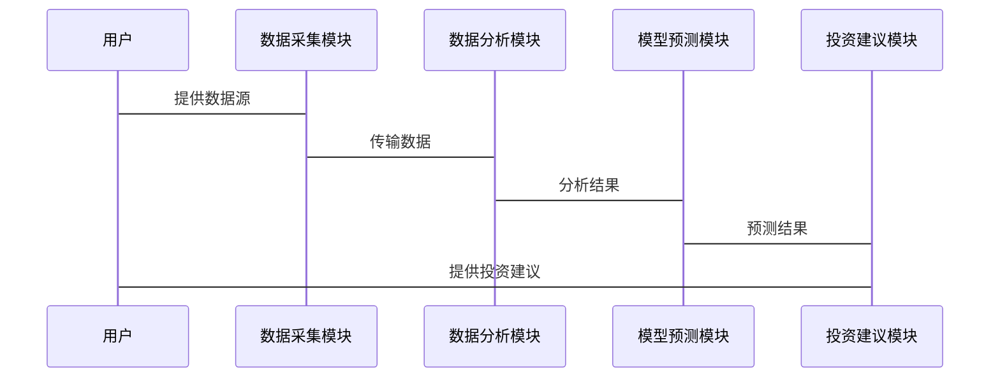

                 


# 彼得林奇的"成长型价值股"在不同利率周期中的表现分析

**关键词**: 彼得林奇, 成长型价值股, 利率周期, 股票投资, 股票分析

**摘要**: 本文深入分析了彼得林奇的“成长型价值股”在不同利率周期中的表现，探讨了成长型价值股的定义、核心属性，以及利率周期对股市的影响。通过量化分析和实例案例，展示了如何在不同利率环境下优化成长型价值股的投资策略。文章结构清晰，内容详实，适合对投资分析和金融市场感兴趣的读者阅读。

---

# 第一部分: 背景介绍

## 第1章: 彼得林奇与成长型价值股概述

### 1.1 彼得林奇的简介
彼得·林奇（Peter Lynch）是美国著名的投资经理，被誉为“成长股投资之父”。他在富达投资集团（Fidelity）的麦哲伦基金（Magellan Fund）管理期间，创造了年均29%的惊人回报率。林奇的投资理念强调寻找那些具有持续增长潜力、估值合理的成长型股票，即所谓的“成长型价值股”。

#### 1.1.1 成长型价值股的定义与特点
成长型价值股是指那些具有持续增长潜力，同时估值相对合理的企业股票。这类股票通常具有以下特点：
- **高成长性**：公司收入和利润持续增长，且增速高于行业平均水平。
- **合理估值**：市盈率（P/E）、市净率（P/B）等指标处于合理或低估区间。
- **竞争优势**：公司具备强大的护城河，能够在竞争中保持优势地位。

#### 1.1.2 利率周期的基本概念
利率周期是指利率水平在经济周期中的波动过程。利率的高低直接影响企业的融资成本、投资行为以及整体市场情绪。常见的利率周期包括上升周期和下降周期。

---

## 第1.2 利率周期对股市的影响
利率的变化对股市的影响是多方面的：
- **利率上升**：债券收益率上升，资金从股市流向债市，导致股票估值下降。
- **利率下降**：债券收益率下降，资金流入股市，推动股票价格上涨。
- **成长型股票的敏感性**：由于成长型股票的未来现金流不确定性较高，其估值对利率变化更为敏感。

---

# 第二部分: 核心概念与联系

## 第2章: 成长型价值股与利率周期的关系

### 2.1 成长型价值股的核心属性
#### 2.1.1 成长型价值股的财务特征
- **收入增长**：公司收入连续多年保持稳定增长。
- **利润率提升**：净利润率逐步提高，盈利能力增强。
- **低负债率**：公司负债较低，财务风险可控。

#### 2.1.2 成长型价值股的估值方法
- **市盈率（P/E）**：衡量股价与每股收益的比率。
- **市净率（P/B）**：衡量股价与每股净资产的比率。
- **PEG比率**：将市盈率与盈利增长率相结合。

#### 2.1.3 成长型价值股的风险与收益分析
- **收益**：长期来看，成长型股票的收益潜力高于市场平均水平。
- **风险**：短期波动较大，且对利率变化敏感，存在估值过高的风险。

### 2.2 利率周期的核心特征
#### 2.2.1 利率周期的波动规律
- **上升周期**：经济增长过热，通胀压力上升，央行加息。
- **下降周期**：经济放缓，央行通过降息刺激经济。

#### 2.2.2 利率周期对市场情绪的影响
- **利率上升**：市场情绪偏向谨慎，投资者更倾向于防御性资产。
- **利率下降**：市场情绪乐观，投资者风险偏好上升。

#### 2.2.3 利率周期对股票估值的影响
- **利率上升**：债券收益率上升，股票估值承压。
- **利率下降**：债券收益率下降，股票估值上升。

### 2.3 成长型价值股与利率周期的关系分析
#### 2.3.1 成长型价值股在利率上升周期中的表现
- **挑战**：利率上升导致债券收益率上升，资金从股市流向债市，成长型股票估值承压。
- **机遇**：利率上升周期通常伴随着经济过热，企业盈利增长加快，部分优质成长股仍能表现良好。

#### 2.3.2 成长型价值股在利率下降周期中的表现
- **优势**：利率下降通常对应经济放缓，央行通过降息刺激经济，成长型股票因其高增长特性，往往能够获得市场资金的青睐，估值上升。
- **风险**：部分成长股估值可能过高，存在回调风险。

#### 2.3.3 不同利率周期下成长型价值股的投资策略
- **利率上升周期**：选择那些盈利增长强劲、估值合理的成长股，同时警惕估值过高的股票。
- **利率下降周期**：积极配置成长型股票，尤其是那些具有强大竞争优势的龙头企业。

### 2.4 核心概念对比表
**表2.1 成长型价值股与周期性股票的对比**

| 属性               | 成长型价值股                   | 周期性股票                   |
|--------------------|--------------------------------|-------------------------------|
| 财务特征           | 收入和利润持续增长             | 收入和利润波动较大           |
| 估值方法           | 市盈率、市净率、PEG比率       | 市盈率、市净率               |
| 风险与收益         | 高收益，高风险               | 中低收益，中等风险           |
| 利率周期敏感性     | 高敏感性                     | 中低敏感性                   |

### 2.5 ER实体关系图


---

# 第三部分: 算法原理讲解

## 第3章: 成长型价值股在不同利率周期中的量化分析

### 3.1 算法原理概述
#### 3.1.1 算法目标
通过量化分析，确定在不同利率周期下，成长型价值股的表现差异，优化投资策略。

#### 3.1.2 算法输入
- **成长型价值股的财务数据**：收入、利润、市盈率、市净率等。
- **利率数据**：历史利率数据，包括短期和长期利率。
- **市场数据**：整体市场指数、行业指数等。

#### 3.1.3 算法输出
- **股票表现评分**：在不同利率周期下的表现评分。
- **投资建议**：基于评分的买入、持有或卖出建议。

### 3.2 算法流程
#### 3.2.1 数据清洗与预处理
- 确保数据完整性。
- 去除异常值。
- 数据标准化处理。

#### 3.2.2 特征提取
- 提取成长型价值股的关键财务指标。
- 计算估值指标（如PEG比率）。

#### 3.2.3 模型训练
- 使用历史数据训练模型，预测不同利率周期下的股票表现。

#### 3.2.4 模型评估
- 采用回测方法，评估模型的准确性和稳定性。

### 3.3 算法实现
#### 3.3.1 算法流程图


#### 3.3.2 Python代码实现
```python
import pandas as pd
from sklearn.linear_model import LinearRegression

# 数据清洗
data = pd.read_csv('growth_stocks.csv')
data.dropna(inplace=True)

# 特征提取
features = ['Revenue Growth', 'Net Profit Margin', 'PEG Ratio']
target = 'Stock Performance'

# 模型训练
model = LinearRegression()
model.fit(data[features], data[target])

# 模型评估
predictions = model.predict(data[features])
print('预测准确率:', model.score(data[features], data[target]))
```

### 3.4 数学模型
#### 3.4.1 线性回归模型
$$
\text{Performance} = \beta_0 + \beta_1 \times \text{Revenue Growth} + \beta_2 \times \text{Net Profit Margin} + \epsilon
$$

#### 3.4.2 PEG比率模型
$$
\text{PEG} = \frac{\text{Price}}{\text{Earnings Growth}}
$$

---

# 第四部分: 数学模型

## 第4章: 成长型价值股与利率周期的数学模型

### 4.1 CAPM模型
资本资产定价模型（CAPM）用于评估资产的预期收益：
$$
E(r_i) = r_f + \beta_i (r_m - r_f)
$$
其中：
- $r_f$：无风险利率。
- $r_m$：市场预期收益率。
- $\beta_i$：股票的贝塔系数。

### 4.2 套利定价理论（APT）
$$
E(r_i) = \sum_j \lambda_j x_{ij} + r_f
$$
其中：
- $\lambda_j$：风险溢价。
- $x_{ij}$：股票i在因子j上的暴露程度。

---

# 第五部分: 系统分析与架构设计

## 第5章: 成长型价值股与利率周期分析系统的架构设计

### 5.1 系统功能设计
- **数据采集模块**：采集成长型价值股和利率数据。
- **数据分析模块**：计算财务指标和估值指标。
- **模型预测模块**：基于历史数据预测股票表现。
- **投资建议模块**：根据预测结果生成投资建议。

### 5.2 系统架构设计


### 5.3 系统接口设计
- **输入接口**：接收成长型价值股和利率数据。
- **输出接口**：输出股票表现评分和投资建议。

### 5.4 系统交互流程


---

# 第六部分: 项目实战

## 第6章: 成长型价值股与利率周期分析的实战案例

### 6.1 项目环境安装
- 安装必要的Python库：pandas、numpy、scikit-learn。

### 6.2 核心代码实现
```python
import pandas as pd
from sklearn.linear_model import LinearRegression
from sklearn.metrics import mean_squared_error

# 加载数据
data = pd.read_csv('growth_stocks.csv')

# 数据清洗
data.dropna(inplace=True)

# 特征提取
features = ['Revenue Growth', 'Net Profit Margin', 'PEG Ratio']
target = 'Stock Performance'

# 划分训练集和测试集
train_data = data.sample(frac=0.8, random_state=42)
test_data = data.drop(train_data.index)

# 模型训练
model = LinearRegression()
model.fit(train_data[features], train_data[target])

# 模型预测
predictions = model.predict(test_data[features])
print('均方误差:', mean_squared_error(test_data[target], predictions))
```

### 6.3 实例分析
以某成长型价值股为例，分析其在不同利率周期中的表现。

#### 6.3.1 利率上升周期
- 股票表现：由于资金流向债券，股票估值承压。
- 投资建议：选择具有强劲盈利增长的股票，避免估值过高的股票。

#### 6.3.2 利率下降周期
- 股票表现：市场情绪乐观，股票估值上升。
- 投资建议：积极配置成长型股票，尤其是具有强大竞争优势的龙头企业。

---

# 第七部分: 最佳实践与总结

## 第7章: 最佳实践与总结

### 7.1 投资策略优化
- 定期监控利率变化。
- 根据利率周期调整投资组合。
- 保持对成长型价值股的关注，选择具有强大竞争优势的公司。

### 7.2 小结
本文通过量化分析和实例案例，展示了如何在不同利率环境下优化成长型价值股的投资策略。成长型价值股在利率下降周期中表现更优，但在利率上升周期中需谨慎选择。

### 7.3 注意事项
- 投资需谨慎，避免盲目跟风。
- 定期复盘和调整投资组合。
- 关注宏观经济环境和政策变化。

### 7.4 拓展阅读
- 《彼得林奇的投资策略》
- 《利率周期与股市投资》

---

# 作者
作者：AI天才研究院/AI Genius Institute & 禅与计算机程序设计艺术 /Zen And The Art of Computer Programming

