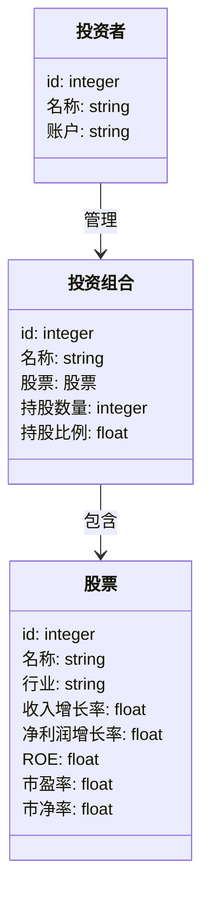
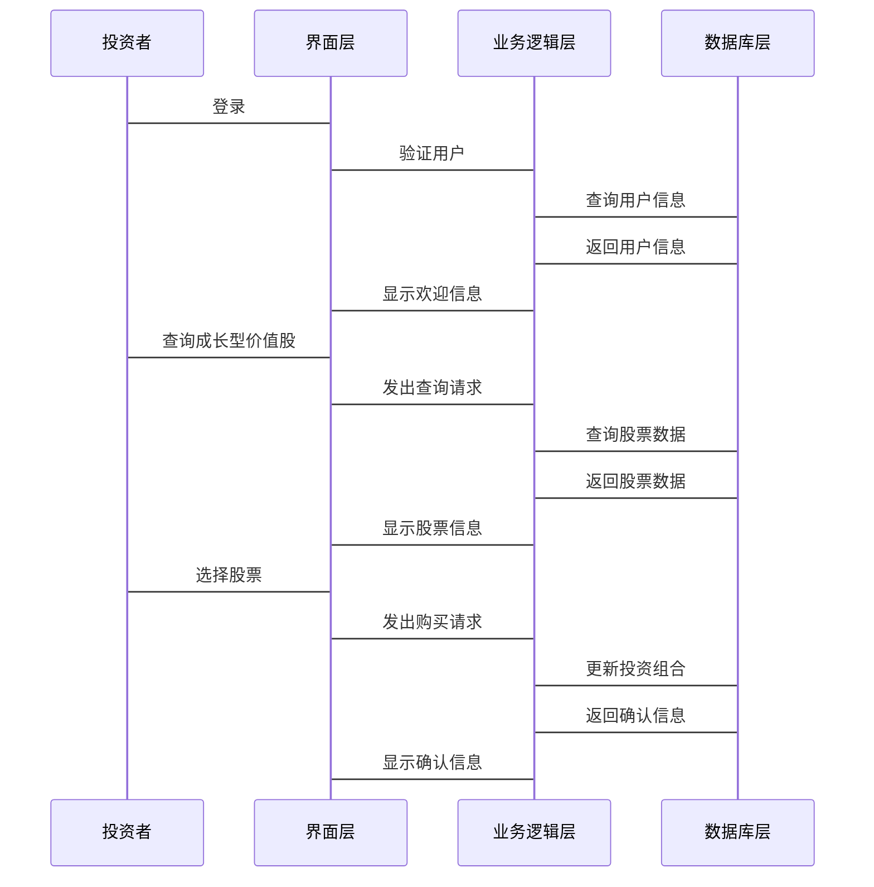

                 


# 彼得林奇的"成长型价值股"在不同行业的表现

> 关键词：成长型价值股，彼得林奇，行业表现，投资策略，风险管理

> 摘要：本文深入探讨彼得·林奇的“成长型价值股”投资理念，分析其在不同行业中的表现和应用。通过具体案例和系统架构设计，帮助读者理解如何在实际投资中识别和管理成长型价值股，以实现长期稳健的收益。

---

## 第1章: 彼得·林奇与成长型价值股概述

### 1.1 彼得·林奇的投资者背景

#### 1.1.1 彼得·林奇的生平简介
彼得·林奇是美国著名投资专家，曾任富达麦哲伦基金的经理，管理资产规模高达140亿美元。他的投资理念以注重基本面分析和长期成长潜力著称，尤其擅长挖掘那些具有持续增长能力的中小型企业。

#### 1.1.2 他的投资理念与风格
彼得·林奇的投资风格强调长期持有、分散投资和深入研究。他认为，成功的投资取决于对公司的深入了解，包括财务状况、行业地位和管理团队。

#### 1.1.3 成长型价值股的核心概念
成长型价值股是指那些具备持续增长潜力，同时估值合理的股票。这类股票通常属于成长型企业，具有较高的ROE和稳定的收入增长。

### 1.2 成长型价值股的定义与特点

#### 1.2.1 成长型股票的定义
成长型股票是指那些收入和利润增长率高于行业平均水平的公司股票。

#### 1.2.2 价值股的定义
价值股是指那些市场价格低于其内在价值的股票，通常因为市场忽视或低估了其价值。

#### 1.2.3 成长型价值股的结合与特点
成长型价值股结合了成长性和估值合理性，具有以下特点：
- 收入和利润持续增长
- 较低的市盈率或市净率
- 较高的ROE和ROA

#### 1.2.4 成长型价值股与其它类型股票的对比
- 与周期性股票相比，成长型价值股具有更强的持续增长性。
- 与防守型股票相比，成长型价值股具有更高的增长潜力。

### 1.3 彼得·林奇的成长型价值股投资策略

#### 1.3.1 理解公司的基本面
彼得·林奇强调对公司的财务状况、行业地位和管理团队进行深入分析。

#### 1.3.2 寻找具有持续增长潜力的企业
关注那些在行业中具有竞争优势，且能够持续增长的企业。

#### 1.3.3 估值与成长性的平衡
在选择成长型价值股时，需要在成长性和估值之间找到平衡点。

#### 1.3.4 投资组合的构建与管理
通过分散投资和定期调整投资组合，降低风险并保持收益。

---

## 第2章: 成长型价值股的核心要素分析

### 2.1 企业成长性的评估指标

#### 2.1.1 收入增长率
收入增长率是衡量企业成长性的关键指标，通常以年增长率计算。

#### 2.1.2 净利润增长率
净利润增长率反映了企业盈利能力的增长情况。

#### 2.1.3 资产回报率
资产回报率（ROA）衡量了企业利用资产创造利润的能力。

#### 2.1.4 现金流健康度
健康的现金流是企业持续增长的重要保障。

#### 2.1.5 行业地位与竞争优势
企业是否在行业中具有领先地位，是否拥有竞争优势。

### 2.2 企业价值的评估方法

#### 2.2.1 市盈率（P/E）分析
市盈率是股票价格与每股收益的比率，用于衡量股票的估值。

#### 2.2.2 市净率（P/B）分析
市净率是股票价格与每股净资产的比率，用于衡量股票的估值。

#### 2.2.3 市销率（P/S）分析
市销率是股票价格与每股收入的比率，用于衡量股票的估值。

#### 2.2.4 股息率分析
股息率是每股股息与股票价格的比率，用于衡量股票的分红能力。

#### 2.2.5 内在价值评估模型
使用DCF模型等方法评估企业的内在价值。

### 2.3 成长型价值股的筛选标准

#### 2.3.1 行业选择标准
选择具有增长潜力的行业，如科技、消费、医疗等。

#### 2.3.2 财务指标筛选
关注收入增长率、净利润增长率、ROE等指标。

#### 2.3.3 管理团队评估
考察管理团队的稳定性、能力和战略规划。

#### 2.3.4 行业周期分析
考虑行业周期对成长型价值股的影响。

---

## 第3章: 不同行业中的成长型价值股表现

### 3.1 科技行业

#### 3.1.1 科技行业的市场特点
科技行业具有高增长、高波动的特点，技术创新驱动行业发展。

#### 3.1.2 成长型价值股的表现
例如，苹果、微软等公司在成长期符合彼得·林奇的选股标准。

#### 3.1.3 成功案例分析
分析苹果公司的成长历程，探讨其如何成为成长型价值股的典范。

### 3.2 消费行业

#### 3.2.1 消费行业的市场特点
消费行业需求稳定，具有防御性，但增长潜力有限。

#### 3.2.2 成长型价值股的表现
例如，可口可乐、麦当劳等公司通过稳定的收益增长成为成长型价值股。

#### 3.2.3 成功案例分析
分析可口可乐的长期增长策略，探讨其如何实现持续增长。

### 3.3 医疗行业

#### 3.3.1 医疗行业的市场特点
医疗行业需求稳定，受政策影响较大，技术进步推动行业发展。

#### 3.2.2 成长型价值股的表现
例如，强生、辉瑞等公司通过技术创新和市场扩展成为成长型价值股。

#### 3.2.3 成功案例分析
分析强生的长期增长策略，探讨其如何实现持续增长。

### 3.4 金融行业

#### 3.4.1 金融行业的市场特点
金融行业受经济周期影响较大，具有较高的杠杆风险。

#### 3.4.2 成长型价值股的表现
例如，高盛、摩根士丹利等公司通过市场扩张和业务创新成为成长型价值股。

#### 3.4.3 成功案例分析
分析高盛的长期增长策略，探讨其如何实现持续增长。

### 3.5 制造业

#### 3.5.1 制造业的市场特点
制造业受经济周期影响较大，技术创新是行业增长的关键。

#### 3.5.2 成长型价值股的表现
例如，通用电气、西门子等公司通过技术创新和全球化扩展成为成长型价值股。

#### 3.5.3 成功案例分析
分析通用电气的长期增长策略，探讨其如何实现持续增长。

### 3.6 服务业

#### 3.6.1 服务业的市场特点
服务业需求多样化，受经济周期影响较小，但竞争激烈。

#### 3.6.2 成长型价值股的表现
例如，亚马逊、谷歌等公司通过技术创新和市场扩展成为成长型价值股。

#### 3.6.3 成功案例分析
分析亚马逊的长期增长策略，探讨其如何实现持续增长。

---

## 第4章: 风险管理与投资策略优化

### 4.1 成长型价值股的风险管理

#### 4.1.1 市场波动风险
市场波动对成长型价值股的影响及应对策略。

#### 4.1.2 行业周期风险
行业周期对成长型价值股的影响及应对策略。

#### 4.1.3 公司基本面变化风险
公司财务状况和管理团队变化对投资的影响及应对策略。

### 4.2 投资策略优化

#### 4.2.1 定期复盘与调整
定期检查投资组合，根据市场变化和公司基本面进行调整。

#### 4.2.2 分散投资与风险控制
通过分散投资降低风险，避免过度集中于某一行业或公司。

#### 4.2.3 长期投资与短期波动
坚持长期投资理念，避免因短期波动影响投资决策。

---

## 第5章: 系统分析与架构设计方案

### 5.1 问题场景介绍

#### 5.1.1 投资者需求分析
投资者希望通过彼得·林奇的成长型价值股策略实现稳健收益。

#### 5.1.2 系统目标
构建一个基于彼得·林奇策略的投资分析系统，帮助投资者识别和管理成长型价值股。

### 5.2 系统功能设计

#### 5.2.1 领域模型设计
使用mermaid绘制领域模型类图，展示系统中的核心实体及其关系。



#### 5.2.2 系统架构设计
使用mermaid绘制系统架构图，展示系统的分层结构和主要组件。


#### 5.2.3 系统接口设计
定义系统接口，如股票数据接口、投资组合管理接口等。

#### 5.2.4 系统交互设计
使用mermaid绘制序列图，展示投资者与系统之间的交互流程。



---

## 第6章: 项目实战

### 6.1 环境安装

#### 6.1.1 安装Python
安装Python 3.x，确保环境配置正确。

#### 6.1.2 安装相关库
安装pandas、numpy、matplotlib等库，用于数据处理和可视化。

#### 6.1.3 安装Jupyter Notebook
用于数据分析和建模。

### 6.2 系统核心实现源代码

#### 6.2.1 数据获取与处理
使用pandas库获取股票数据并进行清洗。

```python
import pandas as pd
import numpy as np

# 示例数据
data = {
    '股票名称': ['苹果', '微软', '亚马逊', '谷歌', '可口可乐'],
    '收入增长率': [20, 15, 25, 30, 10],
    '净利润增长率': [18, 12, 22, 28, 8],
    'ROE': [25, 18, 30, 35, 15],
    '市盈率': [15, 12, 20, 25, 10]
}

df = pd.DataFrame(data)
print(df)
```

#### 6.2.2 成长型价值股筛选算法
基于彼得·林奇的筛选标准，编写筛选算法。

```python
def is_growth_stocks(stock_data):
    # 筛选条件：收入增长率 > 15%，净利润增长率 > 10%，ROE > 20%，市盈率 < 20
    mask = (stock_data['收入增长率'] > 15) & \
           (stock_data['净利润增长率'] > 10) & \
           (stock_data['ROE'] > 20) & \
           (stock_data['市盈率'] < 20)
    return stock_data[mask]

# 示例筛选
selected_stocks = is_growth_stocks(df)
print(selected_stocks)
```

#### 6.2.3 可视化分析
使用matplotlib绘制股票表现图表。

```python
import matplotlib.pyplot as plt

plt.figure(figsize=(10, 6))
plt.plot(selected_stocks['股票名称'], selected_stocks['收入增长率'], 'b-', label='收入增长率')
plt.plot(selected_stocks['股票名称'], selected_stocks['净利润增长率'], 'r-', label='净利润增长率')
plt.title('成长型价值股的表现')
plt.xlabel('股票名称')
plt.ylabel('增长率 (%)')
plt.legend()
plt.show()
```

### 6.3 案例分析与解读

#### 6.3.1 案例背景
以科技行业为例，分析苹果公司作为成长型价值股的表现。

#### 6.3.2 数据分析
使用上述代码筛选出苹果公司，并分析其财务数据和市场表现。

#### 6.3.3 投资建议
基于分析结果，提出投资建议，如长期持有、定期复盘等。

### 6.4 项目小结

#### 6.4.1 成功经验总结
总结项目中的成功经验，如数据处理方法、算法设计思路等。

#### 6.4.2 遇到的问题与解决方法
列举项目中遇到的问题，并分享解决方法。

#### 6.4.3 项目的意义与价值
说明项目在理论和实践中的意义，为投资者提供参考。

---

## 第7章: 最佳实践与投资建议

### 7.1 长期投资的重要性
长期持有成长型价值股，避免短期波动影响投资决策。

### 7.2 分散投资的风险
通过分散投资降低行业和公司的特定风险。

### 7.3 持续学习与市场关注
保持对市场和行业的关注，及时调整投资策略。

### 7.4 定期复盘与优化
定期检查投资组合，根据市场变化和公司基本面进行优化。

---

## 第8章: 结论

彼得·林奇的“成长型价值股”策略在不同行业中表现各异，投资者需要结合行业特点和公司基本面进行选择。通过系统的分析和科学的管理，投资者可以在不同行业中找到合适的成长型价值股，实现长期稳健的收益。

---

## 作者：AI天才研究院/AI Genius Institute & 禅与计算机程序设计艺术 /Zen And The Art of Computer Programming

---

通过本文，您已经了解了彼得·林奇的“成长型价值股”在不同行业中的表现，并掌握了如何在实际投资中应用这些策略。希望这些内容能为您提供有价值的参考和启发。

