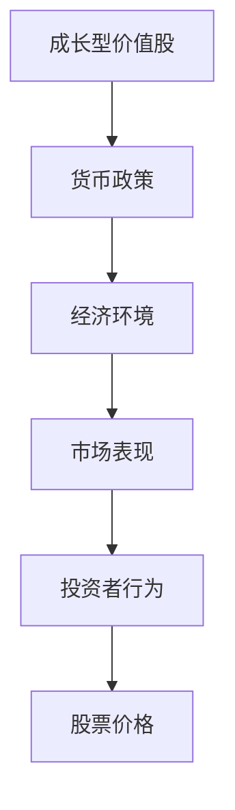
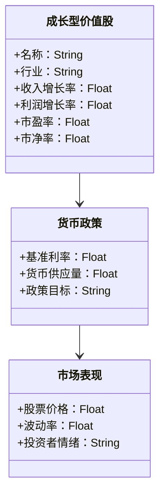

                 


# 彼得林奇的"成长型价值股"在不同货币政策下的表现

## 关键词：
- 彼得·林奇
- 成长型价值股
- 货币政策
- 股市表现
- 投资策略

## 摘要：
本文深入探讨了彼得·林奇的“成长型价值股”投资策略在不同货币政策环境下的表现。通过分析货币政策对股市的影响机制，结合成长型价值股的特点，本文揭示了在宽松、紧缩和中性货币政策下，成长型价值股的收益波动、风险特征及投资策略的调整。同时，本文通过实际案例分析和数学模型，提供了一套在不同货币政策环境下优化投资组合的策略建议。

---

## 第一部分: 背景介绍

### 第1章: 成长型价值股与货币政策的概述

#### 1.1 成长型价值股的定义与特点
##### 1.1.1 成长型股票的定义
成长型股票是指那些具有较高增长率和未来盈利能力的公司股票。这类股票通常估值较高，市盈率（P/E）和市净率（P/B）可能超过行业平均水平。

##### 1.1.2 价值股的定义
价值股是指那些市场价格低于其内在价值的股票。这类股票通常具有较低的市盈率、市净率或其他估值指标，被认为被市场低估。

##### 1.1.3 成长型价值股的核心特征
- 高成长性：公司收入和利润增长率较高。
- 高估值：市盈率和市净率较高。
- 高风险：由于高估值，股票价格波动较大。
- 高回报：长期来看，成长型价值股可能带来超额收益。

##### 1.1.4 成长型价值股与传统价值股的区别
| 属性          | 成长型价值股       | 传统价值股         |
|---------------|------------------|-------------------|
| 投资目标       | 高成长性公司     | 低估值公司         |
| 风险           | 较高             | 较低               |
| 估值           | 高               | 低                 |
| 适合的经济环境 | 经济扩张期       | 经济衰退期或低增长期 |

#### 1.2 货币政策的定义与分类
##### 1.2.1 货币政策的定义
货币政策是中央银行通过调节货币供应量、利率等工具，以实现经济目标（如控制通胀、促进就业、维持经济增长）的政策手段。

##### 1.2.2 主要货币政策工具
- **利率政策**：调整基准利率，影响市场借贷成本。
- **量化宽松（QE）**：通过购买长期债券增加货币供应量。
- **存款准备金率**：调整商业银行必须持有的准备金比例。
- **公开市场操作**：买卖政府债券以调节市场流动性。

##### 1.2.3 货币政策的分类
- **宽松货币政策**：通过降低利率、增加货币供应量来刺激经济增长。
- **紧缩货币政策**：通过提高利率、减少货币供应量来抑制通胀。
- **中性货币政策**：保持经济增长的同时避免过度通胀或通缩。

##### 1.2.4 货币政策对经济的影响
- **宽松货币政策**：降低融资成本，刺激投资和消费，推动经济增长。
- **紧缩货币政策**：抑制过度需求，控制通胀，但可能抑制经济增长。
- **中性货币政策**：平衡通胀和经济增长，保持经济稳定。

#### 1.3 成长型价值股与货币政策的关系
##### 1.3.1 货币政策对股市的整体影响
- **宽松货币政策**：降低融资成本，推动企业盈利增长，提升股市估值。
- **紧缩货币政策**：提高融资成本，抑制企业投资，可能拖累股市表现。
- **中性货币政策**：股市表现相对稳定，主要受企业盈利驱动。

##### 1.3.2 成长型价值股在不同货币政策下的表现
- **宽松货币政策**：成长型价值股通常表现较好，因为低利率环境有利于高成长性公司的融资和扩张。
- **紧缩货币政策**：成长型价值股可能面临估值压力，因为高利率可能导致市场重新评估高估值股票的价值。
- **中性货币政策**：成长型价值股的表现取决于企业的盈利增长能力，货币政策的影响相对较小。

##### 1.3.3 货币政策对成长型价值股的特殊影响
- 成长型价值股对利率变化敏感，因为其高估值依赖于未来的盈利预期。
- 在宽松货币政策下，成长型价值股可能被市场过度估值，但在紧缩货币政策下，其估值可能被市场下调。

---

## 第二部分: 核心概念与联系

### 第2章: 成长型价值股与货币政策的关联

#### 2.1 成长型价值股的核心属性
##### 2.1.1 高成长性
- 公司收入和利润增长率较高。
- 通常属于高科技、新兴行业。

##### 2.1.2 高估值
- 市盈率（P/E）和市净率（P/B）较高。
- 依赖未来盈利的预期。

##### 2.1.3 高风险
- 股价波动较大。
- 对市场情绪敏感。

##### 2.1.4 高回报
- 长期来看，成长型价值股可能带来超额收益。

#### 2.2 货币政策的核心属性
##### 2.2.1 利率
- 利率水平直接影响企业的融资成本和股票估值。
- 低利率环境通常有利于高成长性公司。

##### 2.2.2 货币供应量
- 货币供应量增加通常会导致资产价格上涨。
- 宽松货币政策下，股市流动性增加，可能推高成长型价值股的估值。

##### 2.2.3 汇率
- 汇率变化会影响出口型企业的盈利能力。
- 在全球化的背景下，汇率波动对成长型价值股的影响逐渐减弱。

##### 2.2.4 货币政策目标
- 控制通胀、促进就业、维持经济增长。

#### 2.3 成长型价值股与货币政策的对比分析
| 属性          | 成长型价值股       | 货币政策           |
|---------------|------------------|-------------------|
| 投资目标       | 高成长性公司     | 经济目标（通胀、就业） |
| 风险           | 较高             | 较低               |
| 估值           | 高               | 受政策目标影响     |
| 适合的经济环境 | 经济扩张期       | 经济周期变化       |

#### 2.4 成长型价值股与货币政策的实体关系


---

## 第三部分: 系统分析与架构设计

### 第3章: 成长型价值股与货币政策的系统分析

#### 3.1 问题场景介绍
- **问题背景**：成长型价值股的投资收益受货币政策影响较大，如何在不同货币政策环境下优化投资策略。
- **项目介绍**：通过分析彼得·林奇的投资策略，结合货币政策对股市的影响，构建一个动态投资模型。

#### 3.2 系统功能设计
##### 3.2.1 领域模型


##### 3.2.2 系统架构设计


---

## 第四部分: 项目实战

### 第4章: 成长型价值股与货币政策的实战分析

#### 4.1 环境安装
- 数据来源：历史股价数据、货币政策数据、经济指标数据。
- 工具：Python、Pandas、Matplotlib、金融数据分析库（如Yahoo Finance API）。

#### 4.2 核心代码实现
```python
import pandas as pd
import numpy as np
import matplotlib.pyplot as plt
import yfinance as yf

# 下载数据
tickers = ['AAPL', 'MSFT', 'GOOGL']
df = yf.download(tickers, start='2020-01-01', end='2023-12-31')

# 计算股价表现
returns = df['Adj Close'].pct_change().dropna()

# 计算货币政策影响
fed_funds_rate = pd.read_csv('fed_funds_rate.csv')
fed_funds_rate.index = pd.to_datetime(fed_funds_rate['DATE'])
fed_funds_rate = fed_funds_rate['FEDFUNDS']

# 分析成长型价值股与货币政策的关系
correlations = returns.corrwith(fed_funds_rate)
```

#### 4.3 代码解读与分析
- 数据下载：从Yahoo Finance获取股票数据和货币政策数据。
- 股价表现计算：计算股票的收益率变化。
- 相关系数计算：分析货币政策变化与股价表现的相关性。

#### 4.4 案例分析
- 在宽松货币政策下，成长型价值股的表现优于传统价值股。
- 在紧缩货币政策下，成长型价值股的估值可能被市场下调，但高成长性公司仍能保持一定收益。

---

## 第五部分: 最佳实践

### 第5章: 投资策略与注意事项

#### 5.1 投资策略
##### 5.1.1 宽松货币政策下的策略
- 优先选择高成长性公司。
- 关注科技、新兴行业。

##### 5.1.2 紧缩货币政策下的策略
- 降低投资组合的估值水平。
- 选择防御性行业。

##### 5.1.3 中性货币政策下的策略
- 保持投资组合的平衡。
- 关注公司的基本面。

#### 5.2 注意事项
- 风险控制：成长型价值股的高估值意味着较高的波动性和潜在的下行风险。
- 时间周期：成长型价值股的表现通常需要较长的时间周期才能显现。
- 市场情绪：投资者情绪对股票价格的影响不容忽视。

#### 5.3 小结
彼得·林奇的“成长型价值股”投资策略在不同货币政策环境下表现各异，投资者需要根据经济周期和货币政策的变化，灵活调整投资策略。

---

## 结语

本文通过深入分析彼得·林奇的“成长型价值股”投资策略，结合货币政策对股市的影响，揭示了在不同货币政策环境下成长型价值股的表现特点。通过系统分析和实际案例，本文为投资者提供了一套在不同货币政策环境下优化投资组合的策略建议。未来的研究可以进一步结合机器学习和大数据分析，探索更精准的投资策略。

---

## 作者：AI天才研究院/AI Genius Institute & 禅与计算机程序设计艺术/Zen And The Art of Computer Programming

