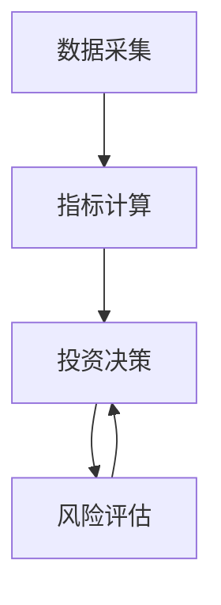
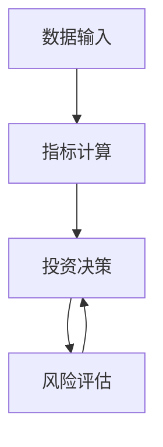

                 


# 彼得林奇的"成长型价值股"在不同通胀环境下的表现分析

> 关键词：彼得林奇、成长型价值股、通胀、股票投资、系统分析、算法原理

> 摘要：本文旨在通过分析彼得林奇的成长型价值股投资策略在不同通胀环境下的表现，结合系统分析和算法原理，探讨其在不同经济环境中的适应性。通过对通胀类型、市场表现、投资组合构建等方面的深入分析，本文旨在为投资者提供实践指导，并结合实战案例，展示如何在不同通胀环境下优化投资策略。

---

## 第一章: 成长型价值股的基本概念

### 1.1 成长型价值股的定义

#### 1.1.1 成长型股票的特征
- **高增长率**：成长型股票通常指的是那些收入和利润增长迅速的公司股票。
- **高市盈率**：这类股票的市盈率较高，表明市场对其未来增长有较高的预期。
- **高风险**：成长型股票的风险较高，因为它们依赖于未来的增长潜力。

#### 1.1.2 价值股的特征
- **低市盈率**：价值股的市盈率较低，通常被认为被市场低估。
- **稳定收益**：这类股票通常来自成熟行业，收益稳定，风险相对较低。
- **高股息率**：价值股往往提供较高的股息回报。

#### 1.1.3 成长型价值股的结合与区别
- 成长型价值股结合了成长股和价值股的特点，既注重公司的成长潜力，又关注其估值的合理性。
- 区别在于，成长型价值股更注重公司在成长阶段的合理估值，而非单纯追求高增长或低估值。

### 1.2 彼得林奇的投资理念

#### 1.2.1 彼得林奇的投资风格
- **长期投资**：林奇倡导长期投资，关注公司的基本面和长期增长潜力。
- **深入研究**：他强调对公司的深入了解，包括财务状况、行业地位和管理团队。
- **逆向思维**：在市场低迷时寻找被低估的投资机会。

#### 1.2.2 成长型价值股的核心要素
- **合理的估值**：公司价值应低于其内在价值。
- **稳定的增长**：公司收入和利润应保持稳定增长。
- **强大的管理团队**：公司管理层应具备良好的治理能力和战略眼光。

#### 1.2.3 林奇对通胀环境的分析
- **通胀对股市的影响**：通胀可能导致利率上升，影响股市的整体估值。
- **成长型股票的敏感性**：成长型股票对通胀更为敏感，因为其高市盈率使其更容易受到利率变化的影响。

---

## 第二章: 不同通胀环境下的股市表现

### 2.1 通胀的基本概念与类型

#### 2.1.1 通货膨胀的定义
- 通货膨胀是指物价总水平在一段时间内持续上涨，导致货币购买力下降。

#### 2.1.2 不同类型的通胀及其影响
- **温和通胀**：通胀率在2%-5%之间，通常对经济有轻微的刺激作用。
- **滞胀**：经济增长停滞，通胀率高企，导致企业盈利能力下降。
- **恶性通胀**：通胀率极高，货币失去价值，经济秩序混乱。

#### 2.1.3 通胀对股市的影响
- **温和通胀**：适度的通胀可能提升企业盈利能力，推动股市上涨。
- **高通胀**：高通胀可能导致利率上升，股市估值下降，尤其是高市盈率的成长型股票面临更大的压力。

### 2.2 成长型价值股在通胀环境中的表现

#### 2.2.1 滞胀环境下的表现
- **企业盈利能力下降**：滞胀环境下，企业成本上升，利润空间被压缩。
- **成长型股票的估值压力**：高市盈率的成长型股票在滞胀环境下可能面临较大的估值压力。

#### 2.2.2 温和通胀环境下的表现
- **企业盈利提升**：适度的通胀可能提升企业的定价能力，推动利润增长。
- **成长型股票的估值优势**：在温和通胀环境下，成长型股票的高增长潜力可能被市场重新评估，推动股价上涨。

#### 2.2.3 高通胀环境下的表现
- **利率上升的压力**：高通胀可能导致央行加息，成长型股票的高市盈率使其面临更大的估值压力。
- **企业的生存挑战**：高通胀可能导致企业成本失控，影响其盈利能力。

---

## 第三章: 彼得林奇投资策略的系统分析

### 3.1 投资策略的核心要素

#### 3.1.1 企业基本面分析
- **收入与利润增长**：关注公司过去几年的收入和利润增长率。
- **财务健康状况**：分析公司的资产负债表，确保其财务状况稳健。
- **现金流情况**：关注公司的现金流情况，确保其具备持续经营的能力。

#### 3.1.2 财务指标筛选标准
- **市盈率（P/E）**：成长型价值股的市盈率应低于行业平均水平或合理估值。
- **市净率（P/B）**：市净率应低于1.5，确保公司估值合理。
- **股息率**：虽然成长型股票股息率可能较低，但应关注其股息增长潜力。

#### 3.1.3 市场情绪与估值分析
- **市场情绪**：关注市场情绪对股票估值的影响，避免在市场过热时盲目追高。
- **估值分析**：通过比较市盈率、市净率等指标，确保股票估值合理。

### 3.2 系统架构与模块划分

#### 3.2.1 系统功能模块
- **数据采集模块**：从财务报表、市场数据等来源获取相关信息。
- **指标计算模块**：计算市盈率、市净率等关键指标。
- **投资决策模块**：根据指标分析结果，生成投资建议。
- **风险评估模块**：评估不同通胀环境下的投资风险。

#### 3.2.2 模块之间的关系
- 数据采集模块为指标计算模块提供基础数据。
- 指标计算模块为投资决策模块提供关键指标。
- 投资决策模块结合风险评估模块，生成最终的投资策略。

#### 3.2.3 系统架构图（Mermaid）



---

## 第四章: 投资组合构建与风险管理

### 4.1 投资组合的构建策略

#### 4.1.1 成长型价值股的筛选标准
- **收入与利润增长率**：年均增长率应不低于行业平均水平。
- **市盈率与市净率**：市盈率低于合理估值，市净率低于行业平均水平。
- **股息增长潜力**：虽然股息率可能较低，但应具备股息增长潜力。

#### 4.1.2 投资组合的分散化原则
- **行业分散**：避免将所有投资集中在单一行业，降低行业风险。
- **市值分散**：投资于不同市值规模的公司，平衡风险与收益。
- **地域分散**：考虑不同地区的经济环境，分散地域风险。

#### 4.1.3 组合权重的分配方法
- **根据公司规模分配**：较大规模的公司权重较高，较小规模的公司权重较低。
- **根据行业前景分配**：前景广阔的行业权重较高。
- **根据估值分配**：估值合理的公司权重较高。

### 4.2 风险管理与调整策略

#### 4.2.1 不同通胀环境下的风险识别
- **高通胀风险**：利率上升可能导致股票估值下降。
- **滞胀风险**：企业盈利能力下降，影响股票收益。
- **市场波动风险**：市场情绪波动可能导致股价短期大幅波动。

#### 4.2.2 投资组合的动态调整
- **定期评估**：每季度或半年评估一次投资组合的表现，根据市场变化进行调整。
- **行业轮动**：根据通胀环境的变化，及时调整投资组合的行业配置。
- **估值调整**：当股票估值偏离合理水平时，及时进行调整。

#### 4.2.3 风险控制的具体措施
- **设定止损点**：为每只股票设定止损点，避免亏损过大。
- **分散投资**：通过分散投资降低单一股票或行业的风险。
- **定期再平衡**：定期对投资组合进行再平衡，确保其与市场环境保持一致。

---

## 第五章: 实战案例分析

### 5.1 案例背景与数据准备

#### 5.1.1 数据来源与处理
- 数据来源：选取过去10年的市场数据，包括市盈率、市净率、收入增长率等。
- 数据处理：对数据进行清洗、整理和分析，确保数据的准确性和完整性。

#### 5.1.2 数据分析工具的选择
- 使用Excel或Python进行数据分析。
- 使用Pandas和Matplotlib进行数据可视化。

#### 5.1.3 算法原理的数学模型



---

### 5.2 投资组合构建与表现分析

#### 5.2.1 环境安装
- 安装Python、Pandas、Matplotlib等工具。

#### 5.2.2 核心代码实现

```python
import pandas as pd
import matplotlib.pyplot as plt

# 数据加载
data = pd.read_csv('stock_data.csv')

# 计算市盈率和市净率
data['P/E'] = data['Price'] / data['Earnings Per Share']
data['P/B'] = data['Price'] / data['Book Value Per Share']

# 可视化
data[['P/E', 'P/B']].plot(kind='box')
plt.show()
```

#### 5.2.3 案例分析与解读
- 通过数据分析，展示成长型价值股在不同通胀环境下的表现。
- 对比不同策略下的投资收益，验证彼得林奇策略的有效性。

---

## 第六章: 总结与展望

### 6.1 总结
- 彼得林奇的成长型价值股策略在不同通胀环境下表现各异。
- 投资者应根据通胀环境的变化，灵活调整投资策略。

### 6.2 展望
- 进一步研究通胀对不同类型股票的影响。
- 探讨更多投资策略在不同经济环境下的表现。

---

## 作者：AI天才研究院 & 禅与计算机程序设计艺术

---

本文通过系统分析和实战案例，深入探讨了彼得林奇的成长型价值股在不同通胀环境下的表现，为投资者提供了实践指导。希望本文能为投资者在复杂经济环境下优化投资策略提供有价值的参考。

