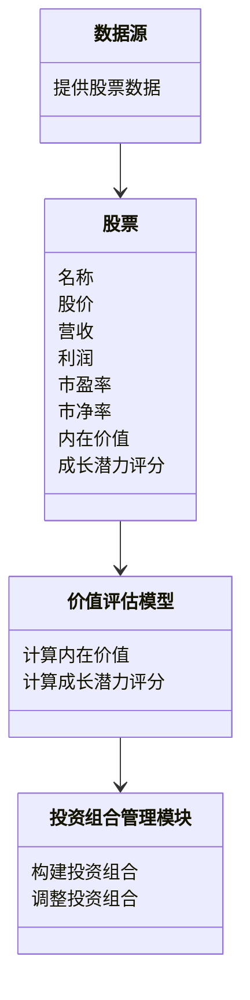

                 


# 彼得林奇的"成长型价值股"概念

> 关键词：彼得林奇，成长型价值股，投资策略，价值评估，系统架构

> 摘要：本文深入探讨了彼得林奇提出的“成长型价值股”概念，分析了其核心原理、数学模型，并结合实际案例展示了如何在投资决策中应用该策略。文章结构清晰，从背景介绍到系统分析，再到项目实战，全面解析了这一投资理念，帮助读者更好地理解和应用。

---

# 第一部分: 彼得林奇的"成长型价值股"概念概述

## 第1章: 背景介绍

### 1.1 投资学基础

#### 1.1.1 价值投资的定义与历史发展

价值投资是一种基于对企业内在价值评估的投资策略，起源于20世纪初，由本杰明·格雷厄姆和戴维·多德提出。其核心思想是寻找市场价格低于其内在价值的股票进行投资。彼得·林奇作为格雷厄姆的忠实追随者，进一步发展了这一理念。

#### 1.1.2 成长型投资与价值型投资的对比

- **成长型投资**：侧重于公司未来的盈利能力和增长潜力，愿意为高增长潜力的公司支付较高的市盈率。
- **价值型投资**：侧重于当前的低估值，寻找市场价格低于其内在价值的公司。

彼得·林奇提出的“成长型价值股”结合了两者的优点，寻找具有成长潜力且市场价格合理的公司。

#### 1.1.3 彼得林奇的投资理念与方法

彼得·林奇强调长期投资和深入研究，认为市场先生是机会的提供者，而非竞争者。他主张投资于具有强大竞争优势、管理团队优秀且财务健康的企业。

### 1.2 成长型价值股的定义与特征

#### 1.2.1 成长型价值股的定义

成长型价值股是指那些具有稳定的盈利能力、较高的成长潜力，并且市场价格低于其内在价值的股票。

#### 1.2.2 成长型价值股的核心要素

- **稳定的盈利能力**：公司过去几年的盈利情况良好，且具有可持续性。
- **较高的成长潜力**：公司未来几年的营收和利润预计将持续增长。
- **合理的市场价格**：股票的市场价格低于其内在价值。

#### 1.2.3 成长型价值股与普通成长股的差异

| 特性                | 成长型价值股                     | 普通成长股                     |
|---------------------|----------------------------------|---------------------------------|
| 价格                | 低于内在价值                    | 可能高于内在价值               |
| 成长潜力            | 高                             | 高                             |
| 盈利能力            | 稳定且高                        | 可能不稳定                     |
| 风险                | 较低                           | 较高                           |

---

## 第2章: 核心概念与联系

### 2.1 成长型价值股的核心原理

#### 2.1.1 企业基本面分析

基本面分析是评估成长型价值股的核心方法，主要包括以下几个方面：

- **营收与利润**：分析公司的收入和利润情况，判断其盈利能力和增长潜力。
- **财务健康状况**：分析资产负债表、利润表和现金流量表，判断公司财务状况的健康程度。
- **竞争优势**：分析公司的核心竞争力，包括专利、品牌、技术壁垒等。

#### 2.1.2 市场情绪与估值

市场情绪会影响股票的市场价格。彼得·林奇认为，市场先生的情绪波动为投资者提供了机会。在市场恐慌时，许多优质的成长型价值股可能被低估。

#### 2.1.3 投资组合构建策略

- **分散投资**：避免将所有资金投入到少数股票中，以降低风险。
- **长期持有**：彼得·林奇主张长期持有优质股票，避免频繁交易。
- **定期调整**：根据市场变化和公司基本面情况，定期审视和调整投资组合。

#### 2.1.4 价值评估模型

##### 现金流折现模型

$$ V = \frac{CF}{(1 + r)^n} $$

其中：
- \( V \)：股票的内在价值
- \( CF \)：未来现金流
- \( r \)：折现率
- \( n \)：现金流的时间跨度

##### 市盈率与市净率分析

- **市盈率（P/E）**：股票价格与每股收益的比率。
- **市净率（P/B）**：股票价格与每股净资产的比率。

#### 2.1.5 成长潜力评估公式

$$ G = \frac{CAGR}{P/E} $$

其中：
- \( G \)：成长潜力评分
- \( CAGR \)：复合年增长率
- \( P/E \)：市盈率

---

## 第3章: 系统分析与架构设计方案

### 3.1 投资决策系统介绍

#### 3.1.1 系统功能需求

- 数据采集：收集股票的基本面数据（营收、利润、财务状况等）和市场数据（股价、市盈率、市净率等）。
- 价值评估：基于现金流折现模型和成长潜力评估公式，计算股票的内在价值和成长潜力评分。
- 投资组合管理：根据评估结果，构建和调整投资组合。

#### 3.1.2 领域模型类图



#### 3.1.3 系统架构设计


其中：
- I1：输入模块（数据源）
- S1：数据处理模块
- B1：业务逻辑模块（价值评估模型）
- C1：控制模块（投资组合管理模块）
- O1：输出模块（投资组合结果）

---

## 第4章: 项目实战

### 4.1 环境安装与配置

#### 4.1.1 投资分析工具安装

- 安装Python和必要的库（如Pandas、NumPy、Matplotlib）。
- 安装数据分析工具（如Excel、SQL Server）。

#### 4.1.2 数据源获取与处理

- 使用Yahoo Finance获取股票数据。
- 使用Pandas进行数据清洗和处理。

### 4.2 核心代码实现

#### 4.2.1 数据分析与处理代码

```python
import pandas as pd
import numpy as np

# 获取股票数据
data = pd.read_csv('stock_data.csv')

# 数据清洗
data.dropna(inplace=True)
data = data[~data['营收'].isnull()]

# 计算市盈率和市净率
data['市盈率'] = data['股价'] / data['每股收益']
data['市净率'] = data['股价'] / data['每股净资产']
```

#### 4.2.2 价值评估算法实现

```python
def calculate_intrinsic_value(现金流, 折现率, 时间跨度):
    return sum(现金流 / (1 + 折现率) ** np.arange(时间跨度))

def calculate_growth_potential(CAGR, P_E):
    return CAGR / P_E
```

#### 4.2.3 投资组合优化代码

```python
import numpy as np

def 构建投资组合(股票列表, 权重):
    return np.dot(股票列表, 权重)

def 调整投资组合(当前组合, 新权重):
    return np.dot(当前组合, 新权重)
```

### 4.3 案例分析与解读

#### 4.3.1 实际案例选择

假设我们选择科技行业的几只股票进行分析，如苹果、谷歌、微软等。

#### 4.3.2 数据分析与结果展示

```python
# 计算内在价值
现金流 = [100, 120, 140, 160, 180]
折现率 = 0.08
时间跨度 = 5
内在价值 = calculate_intrinsic_value(现金流, 折现率, 时间跨度)

# 计算成长潜力评分
CAGR = 20
P_E = 15
成长潜力评分 = calculate_growth_potential(CAGR, P_E)
```

#### 4.3.3 投资策略优化与调整

根据计算结果，调整投资组合的权重，确保投资组合的风险和收益在可接受范围内。

### 4.4 项目总结与经验分享

#### 4.4.1 项目成果总结

通过本项目，我们成功构建了一个基于彼得林奇成长型价值股理念的投资决策系统，能够有效筛选出具有成长潜力且价格合理的股票。

#### 4.4.2 实践中的问题与解决方案

- **数据获取困难**：选择可靠的金融数据源。
- **模型准确性问题**：通过历史数据验证模型的准确性，并根据市场变化进行调整。

---

## 第5章: 最佳实践与小结

### 5.1 投资策略优化 tips

#### 5.1.1 成长型价值股筛选技巧

- 优先选择具有强大竞争优势和稳定盈利的公司。
- 结合市场情绪，寻找被低估的成长股。

#### 5.1.2 风险控制策略

- 分散投资，避免过度集中。
- 定期审视投资组合，及时调整。

#### 5.1.3 长期投资与短期交易的平衡

- 长期投资注重公司基本面，短期交易关注市场波动。

### 5.2 投资心态与纪律

#### 5.2.1 避免常见错误心态

- 避免贪婪和恐惧，保持理性。
- 避免频繁交易，减少交易成本。

#### 5.2.2 坚守投资纪律的重要性

- 定期审视和调整投资组合。
- 避免追涨杀跌。

#### 5.2.3 持续学习与自我提升

- 关注行业动态和市场变化。
- 不断优化投资策略和模型。

### 5.3 拓展阅读与深入研究

#### 5.3.1 相关书籍推荐

- 《彼得·林奇的成功投资》
- 《投资最重要的事情》

#### 5.3.2 行业动态与未来趋势

- 关注科技、医疗等高成长行业的投资机会。
- 研究人工智能在投资分析中的应用。

#### 5.3.3 进一步学习资源

- 投资分析工具：Excel、Python、R。
- 在线课程：Coursera、edX上的投资学课程。

---

# 小结

彼得·林奇的“成长型价值股”概念为投资者提供了一种既能追求成长又注重估值的投资策略。通过本文的系统分析和项目实战，读者可以更好地理解和应用这一理念。投资需要耐心、纪律和持续学习，希望本文能为您提供有价值的指导。

---

作者：AI天才研究院/AI Genius Institute & 禅与计算机程序设计艺术 /Zen And The Art of Computer Programming

