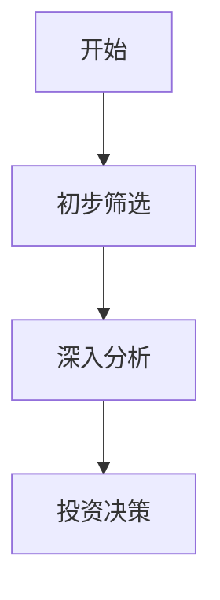
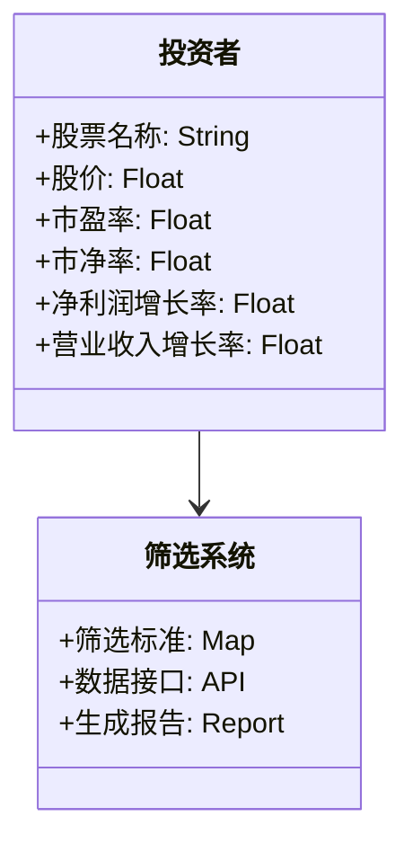
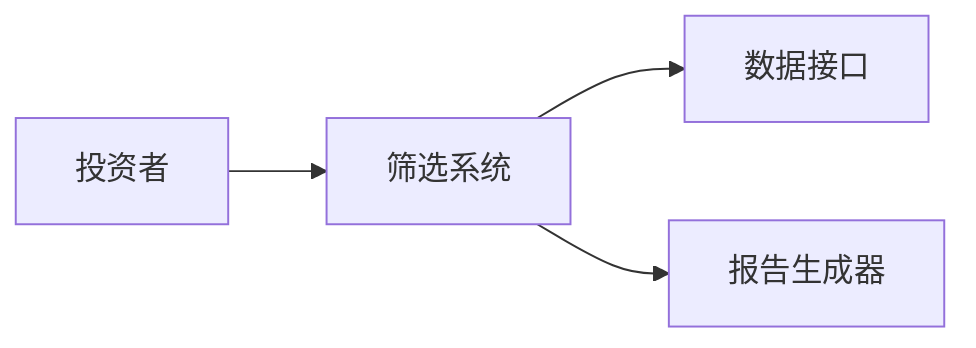

                 


# 彼得林奇的"成长型价值股"筛选方法

## 关键词：彼得林奇、成长型价值股、投资策略、股票筛选、价值投资

## 摘要：  
彼得·林奇是全球著名投资家，以其独特的成长型价值股筛选方法闻名。本文详细解析了彼得·林奇的投资理念，探讨其筛选方法的核心要素，并通过实际案例分析，展示了如何应用这些方法进行股票筛选。文章内容涵盖背景介绍、核心概念、算法原理、系统架构及项目实战，旨在为投资者提供清晰的指导和实用的工具。

---

## 第1章：引言

### 1.1 彼得·林奇及其投资理念
#### 1.1.1 彼得·林奇的生平简介
彼得·林奇是全球著名投资家，曾任富达投资集团麦哲伦基金的经理。他以卓越的投资业绩和独特的选股方法闻名，尤其擅长筛选成长型价值股。

#### 1.1.2 成长型投资的核心理念
彼得·林奇认为，成长型投资的核心在于寻找那些具有持续增长潜力的公司，这些公司不仅当前业绩良好，而且未来能够保持稳定的增长。

#### 1.1.3 本书的目的与读者对象
本文旨在通过系统化的方法，解析彼得·林奇的成长型价值股筛选策略，帮助投资者掌握科学的选股方法。

---

## 第2章：成长型投资的背景与基础

### 2.1 投资的基本概念
#### 2.1.1 投资的定义与分类
投资是指将资金投入到某种资产中，以期获得未来收益的行为。股票投资是其中的重要形式，分为成长型、价值型和红利型投资。

#### 2.1.2 股票市场的基本运作机制
股票市场是企业融资和投资者投资的场所，股票价格受多种因素影响，包括公司业绩、行业前景和宏观经济环境等。

#### 2.1.3 成长型投资与价值型投资的区别
成长型投资注重公司的未来增长潜力，而价值型投资关注其当前的市场价值是否被低估。

---

## 第3章：彼得·林奇的筛选方法概述

### 3.1 筛选方法的核心要素
#### 3.1.1 市场地位与竞争优势
彼得·林奇强调选择具有强大市场地位和竞争优势的公司，这些公司通常在行业中占据领先地位。

#### 3.1.2 财务健康状况
公司财务健康是选股的重要标准，包括盈利能力、资产负债情况和现金流等指标。

#### 3.1.3 管理层能力与战略
优秀的管理层和清晰的战略规划是公司持续增长的关键。

#### 3.1.4 行业前景与宏观经济环境
行业前景和宏观经济环境决定了公司的外部成长空间。

---

## 第4章：核心概念与联系

### 4.1 成长型价值股的筛选标准
#### 4.1.1 市盈率（P/E）分析
市盈率是衡量股票估值的重要指标，公式为：
$$ P/E = \frac{\text{股价}}{\text{每股收益}} $$

#### 4.1.2 市净率（P/B）分析
市净率是股价与每股净资产的比率，公式为：
$$ P/B = \frac{\text{股价}}{\text{每股净资产}} $$

#### 4.1.3 净利润增长率分析
净利润增长率反映了公司的盈利能力提升情况，公式为：
$$ \text{净利润增长率} = \frac{\text{本期净利润} - \text{上期净利润}}{\text{上期净利润}} \times 100\% $$

#### 4.1.4 营业收入增长率分析
营业收入增长率是衡量公司收入增长的重要指标，公式为：
$$ \text{营业收入增长率} = \frac{\text{本期营业收入} - \text{上期营业收入}}{\text{上期营业收入}} \times 100\% $$

### 4.2 筛选标准的对比分析
表1：不同筛选标准的对比

| 筛选标准   | 定义                               | 重要性 | 适用场景 |
|------------|------------------------------------|--------|----------|
| 市盈率     | 股价与每股收益的比率             | 高     | 评估估值 |
| 市净率     | 股价与每股净资产的比率           | 中     | 评估资产 |
| 净利润增长率 | 净利润同比增长率                 | 高     | 评估盈利 |
| 营业收入增长率 | 营业收入同比增长率               | 中     | 评估收入 |

图1：筛选标准的关系图


---

## 第5章：算法原理讲解

### 5.1 筛选流程的算法步骤
图2：筛选流程的算法步骤



### 5.2 数学模型与公式
公式1：市盈率计算
$$ \text{市盈率} = \frac{\text{股价}}{\text{每股收益}} $$

公式2：市净率计算
$$ \text{市净率} = \frac{\text{股价}}{\text{每股净资产}} $$

公式3：净利润增长率计算
$$ \text{净利润增长率} = \frac{\text{本期净利润} - \text{上期净利润}}{\text{上期净利润}} \times 100\% $$

---

## 第6章：系统分析与架构设计方案

### 6.1 问题场景介绍
投资者需要一个系统来辅助筛选成长型价值股，提高选股效率和准确性。

### 6.2 项目介绍
本系统旨在通过自动化筛选，帮助投资者快速识别符合彼得·林奇标准的股票。

### 6.3 系统功能设计
图3：领域模型类图



### 6.4 系统架构设计
图4：系统架构图



---

## 第7章：项目实战

### 7.1 环境安装
需要安装Python和相关库，如Pandas、Matplotlib。

### 7.2 核心实现代码
```python
import pandas as pd

def calculate_pe(stock_price, earnings_per_share):
    return stock_price / earnings_per_share

def calculate_pb(stock_price, book_value_per_share):
    return stock_price / book_value_per_share

def calculate_profit_growth(net_profit_current, net_profit_previous):
    return ((net_profit_current - net_profit_previous) / net_profit_previous) * 100

# 示例数据
data = {
    '股票名称': ['股票A', '股票B', '股票C'],
    '股价': [100, 80, 120],
    '每股收益': [20, 15, 30],
    '每股净资产': [50, 40, 60],
    '净利润同比增长率': [15, 10, 20],
    '营业收入同比增长率': [20, 25, 15]
}

df = pd.DataFrame(data)

# 计算市盈率和市净率
df['市盈率'] = df.apply(lambda x: calculate_pe(x['股价'], x['每股收益']), axis=1)
df['市净率'] = df.apply(lambda x: calculate_pb(x['股价'], x['每股净资产']), axis=1)
df['净利润增长率'] = df.apply(lambda x: calculate_profit_growth(x['净利润同比增长率'], x['净利润同比增长率']), axis=1)

print(df)
```

### 7.3 实际案例分析
以某公司为例，分析其是否符合彼得·林奇的筛选标准，并展示计算结果和结论。

---

## 第8章：最佳实践

### 8.1 小结
彼得·林奇的成长型价值股筛选方法提供了一套科学的投资策略，帮助投资者识别具有长期增长潜力的公司。

### 8.2 注意事项
投资者在实际操作中应结合市场变化和公司具体情况，动态调整筛选标准。

### 8.3 拓展阅读
推荐阅读彼得·林奇的著作，深入理解其投资理念和策略。

---

## 作者信息

作者：AI天才研究院 & 禅与计算机程序设计艺术

---

以上是《彼得林奇的"成长型价值股"筛选方法》的完整目录和内容框架。

