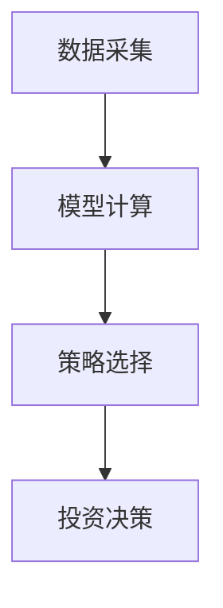

                 


# 彼得林奇的"成长股"vs"价值股"选择策略

---

## 关键词：
- 彼得·林奇
- 成长股
- 价值股
- 投资策略
- 股票分析
- 数学模型

---

## 摘要：
本文将深入探讨彼得·林奇的成长股和价值股投资策略，通过逻辑分析和数学模型，结合实际案例，帮助投资者理解这两种策略的核心思想、应用场景和优缺点。文章将从定义、策略选择、数学模型、系统架构等多维度进行详细分析，并结合实际投资场景，提供最佳实践建议。

---

## 第1章：成长股与价值股的定义与区别

### 1.1 成长股的定义与特点
成长股是指那些收入和利润快速增长，但当前估值较高的股票。这类股票通常属于新兴产业或高增长行业，具有较大的市场潜力。

#### 1.1.1 成长股的定义
成长股的核心在于“增长”，即公司收入和利润的持续增长。这类股票的市盈率（P/E）通常较高，因为市场预期其未来的盈利能力会显著提升。

#### 1.1.2 成长股的核心特征
- 高增长率：收入和利润的年增长率通常超过行业平均水平。
- 高市盈率：由于市场对未来的增长预期较高，股票的估值相对较高。
- 行业龙头：通常集中在科技、消费、医疗等高增长行业。

#### 1.1.3 成长股的潜在优势与风险
- **优势**：长期回报潜力大，适合长期投资者。
- **风险**：估值过高、市场波动大、受宏观经济影响较大。

---

### 1.2 价值股的定义与特点
价值股是指那些市场价格低于其内在价值，通常被市场低估的股票。这类股票通常属于传统行业或周期性行业。

#### 1.2.1 价值股的定义
价值股的核心在于“低估”，即股票的市场价格低于其内在价值。这类股票通常具有较低的市盈率和市净率。

#### 1.2.2 价值股的核心特征
- 低估值：市盈率、市净率等估值指标低于行业平均水平。
- 稳定的现金流：公司通常具有稳定的现金流。
- 高股息率：部分价值股会提供较高的股息回报。

#### 1.2.3 价值股的潜在优势与风险
- **优势**：估值安全边际高，适合风险厌恶型投资者。
- **风险**：公司基本面可能存在问题，行业周期性波动大。

---

### 1.3 成长股与价值股的对比分析

#### 1.3.1 核心概念对比表格
| 特性         | 成长股                | 价值股                |
|--------------|-----------------------|-----------------------|
| 核心目标     | 高增长                | 低估                  |
| 估值指标     | 高市盈率              | 低市盈率、低市净率    |
| 风险         | 市场波动大            | 周期性波动            |
| 适合市场     | 高增长市场            | 传统市场、周期性市场  |
| 代表行业     | 科技、消费、医疗      | 制造业、能源、金融    |

#### 1.3.2 投资目标与策略差异
- 成长股策略：注重长期增长，适合成长性市场。
- 价值股策略：注重短期低估，适合周期性市场。

#### 1.3.3 市场环境对两者的影响
- 成长股在高增长市场中表现优异，但在经济衰退时可能面临较大波动。
- 价值股在经济衰退时可能表现较好，但在高增长市场中可能被边缘化。

---

## 第2章：彼得·林奇的投资哲学与选股标准

### 2.1 彼得·林奇的投资哲学概述
彼得·林奇是全球著名的职业基金经理，他以成长股投资闻名，但也擅长挖掘价值股的机会。

#### 2.1.1 林奇的成长股投资理念
林奇认为，成长股的核心是公司的收入和利润的持续增长。他更倾向于投资那些具有稳定增长记录的公司。

#### 2.1.2 林奇的价值股投资理念
林奇也关注那些被市场低估的价值股，尤其是那些具有稳定现金流和低估值的公司。

#### 2.1.3 林奇选股的核心标准
- 公司具有稳定的收入和利润增长。
- 公司具有强大的竞争优势。
- 公司具有良好的财务状况。

---

### 2.2 林奇选股的具体标准

#### 2.2.1 公司基本面分析
- 收入和利润增长：过去5年的年均增长率。
- 财务状况：低债务、高现金流。
- 行业地位：市场占有率。

#### 2.2.2 财务指标评估
- 净利润增长率：$$ 净利润增长率 = \frac{\text{当年净利润} - \text{上一年净利润}}{\text{上一年净利润}} \times 100\% $$
- 营收增长率：$$ 营收增长率 = \frac{\text{当年营收} - \text{上一年营收}}{\text{上一年营收}} \times 100\% $$

#### 2.2.3 行业地位与竞争优势
- 公司是否具有独特的竞争优势（如品牌、技术）。
- 行业前景是否光明。

---

### 2.3 林奇投资策略的优缺点分析

#### 2.3.1 成长股策略的优势
- 长期回报潜力大。
- 适合高增长市场。

#### 2.3.2 价值股策略的优势
- 安全边际高。
- 适合周期性市场。

#### 2.3.3 策略的局限性与风险
- 成长股波动大，估值过高时可能回调。
- 价值股可能因行业周期性而表现不佳。

---

## 第3章：成长股与价值股的投资策略分析

### 3.1 成长股投资策略

#### 3.1.1 成长股的识别方法
- 选择具有稳定收入和利润增长的公司。
- 关注高增长行业的龙头企业。

#### 3.1.2 成长股的投资时机
- 在市场上涨周期中投资成长股。
- 避免在市场下跌周期中追高。

#### 3.1.3 成长股的风险管理
- 设置止损点。
- 分批建仓，避免集中投资。

---

### 3.2 价值股投资策略

#### 3.2.1 价值股的识别方法
- 选择低估值的公司。
- 关注具有稳定现金流的公司。

#### 3.2.2 价值股的投资时机
- 在市场下跌周期中寻找低估的价值股。
- 在市场上涨周期中避免追高。

#### 3.2.3 价值股的风险管理
- 设置止损点。
- 分批建仓，避免集中投资。

---

### 3.3 成长股与价值股的结合策略

#### 3.3.1 灵活运用两种策略的场景
- 在高增长市场中以成长股为主。
- 在周期性市场中以价值股为主。

#### 3.3.2 根据市场环境调整策略
- 经济繁荣期：成长股占主导。
- 经济衰退期：价值股占主导。

#### 3.3.3 策略结合的案例分析
- 案例1：科技行业（成长股主导）。
- 案例2：传统制造业（价值股主导）。

---

## 第4章：彼得·林奇策略的数学模型与公式

### 4.1 成长股投资的数学模型

#### 4.1.1 成长股的预期增长率公式
$$ 预期增长率 = \frac{\text{净利润增长率} + \text{营收增长率}}{2} $$

#### 4.1.2 成长股的估值模型
$$ 估值 = P/E \times 净利润增长率 $$

---

### 4.2 价值股投资的数学模型

#### 4.2.1 价值股的内在价值公式
$$ 内在价值 = \frac{\text{未来现金流的现值}}{\text{折现率}} $$

#### 4.2.2 价值股的安全边际计算
$$ 安全边际 = 内在价值 - 市场价格 $$

---

### 4.3 策略选择的数学优化

#### 4.3.1 策略选择的优化模型
$$ 最优化选择 = \max_{x} \{ \text{成长股收益} - \text{价值股风险} \} $$

---

## 第5章：系统分析与架构设计方案

### 5.1 投资策略选择的系统架构

#### 5.1.1 系统功能模块设计
- 数据采集模块：收集公司基本面数据。
- 模型计算模块：计算成长股和价值股的估值。
- 策略选择模块：根据市场环境选择最优策略。

#### 5.1.2 系统架构图（Mermaid）


---

## 第6章：项目实战与案例分析

### 6.1 环境安装与配置
- 数据来源：使用金融数据API（如Yahoo Finance）。
- 工具安装：Python、Pandas、Matplotlib。

### 6.2 核心实现源代码
```python
import pandas as pd
import numpy as np

# 示例：计算成长股的预期增长率
def calculate_growth(revenue_growth, net_profit_growth):
    return (revenue_growth + net_profit_growth) / 2

# 示例：计算价值股的安全边际
def calculate_margin(intrinsic_value, market_price):
    return intrinsic_value - market_price
```

### 6.3 实际案例分析
- 案例1：科技公司（成长股）。
- 案例2：传统制造公司（价值股）。

---

## 第7章：总结与最佳实践

### 7.1 小结
- 成长股适合长期投资者，价值股适合风险厌恶型投资者。
- 根据市场环境灵活调整策略。

### 7.2 注意事项
- 避免单一策略，结合成长股和价值股的优点。
- 定期评估投资组合，及时调整。

### 7.3 拓展阅读
- 《彼得·林奇的成功投资》。
- 《价值投资：从格雷厄姆到巴菲特》。

---

## 作者：
作者：AI天才研究院/AI Genius Institute  
联合作者：禅与计算机程序设计艺术/Zen And The Art of Computer Programming

