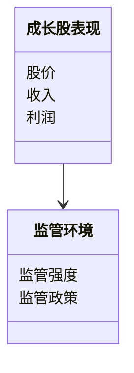
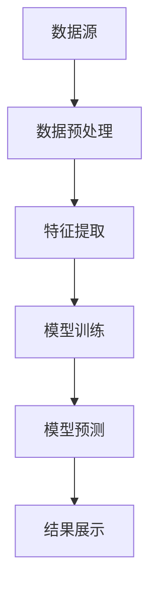
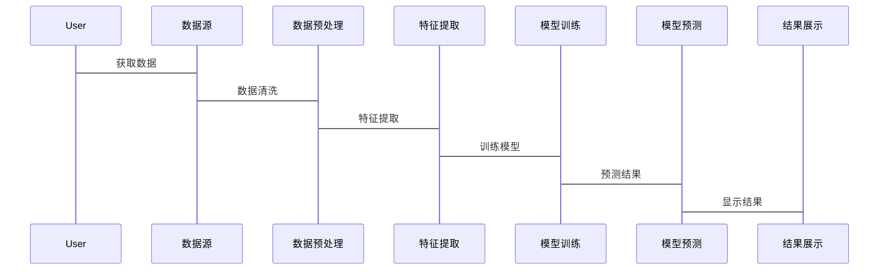

                 


# 彼得林奇的"成长股"在不同监管环境下的表现研究

## 关键词

- 彼得林奇
- 成长股
- 监管环境
- 股票表现
- 投资策略
- 数据分析
- 机器学习

## 摘要

本文通过分析彼得林奇的成长股投资理论，探讨不同监管环境下成长股的表现。结合投资学和计算机科学，研究监管政策对成长股的影响，并通过数据分析和机器学习模型，量化监管环境对成长股表现的影响。本文还设计了一个分析系统，用于预测不同监管环境下的成长股表现，为投资者提供参考。

---

# 第一部分: 彼得林奇的"成长股"投资理论概述

## 第1章: 彼得林奇的成长股投资理念

### 1.1 成长股的定义与特点

#### 1.1.1 成长股的定义

成长股是指那些收入和利润快速增长的公司股票，其特点是高增长、高风险和高回报。彼得林奇认为，成长股的投资逻辑是选择那些具有持续增长潜力的公司。

#### 1.1.2 成长股的核心特征

- **收入增长**：公司收入持续增长，且增速快于行业平均水平。
- **利润增长**：公司净利润持续增长，且增速快于收入增速。
- **ROE（净资产收益率）**：ROE高且持续增长，表明公司盈利能力强。
- **行业地位**：公司在行业内具有竞争优势，市场份额持续扩大。

#### 1.1.3 成长股与价值股的区别

| 特性       | 成长股                | 价值股                |
|------------|----------------------|----------------------|
| 估值       | 高估值                | 低估值                |
| 收益       | 高收益                | 低收益                |
| 市盈率     | 高市盈率              | 低市盈率              |
| 风险       | 高风险                | 低风险                |

### 1.2 彼得林奇的成长股投资策略

#### 1.2.1 投资逻辑

彼得林奇认为，成长股的投资逻辑是选择那些具有持续增长潜力的公司，尤其是那些收入和利润增长速度快于行业平均水平的公司。

#### 1.2.2 选股标准

- **收入增长**：过去5年收入增长率平均超过行业平均水平。
- **利润增长**：过去5年净利润增长率平均超过行业平均水平。
- **ROE**：过去5年ROE平均超过行业平均水平。
- **行业地位**：公司在行业内具有竞争优势，市场份额持续扩大。

#### 1.2.3 投资成功案例

彼得林奇在成长股投资中成功的案例包括可口可乐、强生等公司。这些公司在投资期间收入和利润持续增长，股价也实现了大幅上涨。

### 1.3 成长股投资的风险与挑战

#### 1.3.1 成长股投资的风险

- **高估值风险**：成长股通常估值较高，容易受到市场波动的影响。
- **高波动性**：成长股的股价波动较大，容易受到市场情绪的影响。
- **竞争风险**：行业内竞争加剧，可能导致公司市场份额下降。

#### 1.3.2 成长股投资的挑战

- **监管政策变化**：监管政策的变化可能对成长股的表现产生重大影响。
- **市场周期性**：市场周期性波动可能影响成长股的表现。
- **公司管理风险**：公司管理不善可能导致成长股的投资失败。

### 1.4 本章小结

本章介绍了彼得林奇的成长股投资理论，包括成长股的定义、特点、选股标准以及投资成功案例。同时，还分析了成长股投资的风险与挑战，为后续章节的分析奠定了基础。

---

# 第二部分: 监管环境对成长股的影响

## 第2章: 不同监管环境下的成长股表现

### 2.1 美国的监管环境

#### 2.1.1 美国的监管体系

美国的监管体系由证券交易委员会（SEC）负责，监管政策相对宽松，注重信息披露和市场自由。成长股在美国市场表现较好，尤其是科技公司。

#### 2.1.2 美国成长股的表现

- **科技公司**：如苹果、谷歌等公司在宽松的监管环境下表现优异。
- **金融公司**：如摩根大通、高盛等公司在严格监管环境下表现稳健。

### 2.2 欧洲的监管环境

#### 2.2.1 次贷危机前的监管

欧洲的监管体系相对严格，注重金融稳定和风险控制。在次贷危机前，欧洲的监管政策相对宽松。

#### 2.2.2 次贷危机后的监管

次贷危机后，欧洲的监管体系更加严格，实施了《巴塞尔协议III》等监管措施，对金融公司的影响较大。

#### 2.2.3 欧洲成长股的表现

- **金融公司**：在严格监管环境下，金融公司的成长股表现稳健。
- **科技公司**：如 SAP、IBM等公司在相对宽松的监管环境下表现较好。

### 2.3 亚洲的监管环境

#### 2.3.1 中国的监管环境

中国的监管体系相对严格，注重金融稳定和风险控制。成长股在监管政策变化中表现波动较大。

#### 2.3.2 中国成长股的表现

- **科技公司**：如阿里巴巴、腾讯等公司在监管政策变化中表现波动较大。
- **金融公司**：如工商银行、建设银行等公司在严格监管环境下表现稳健。

### 2.4 其他地区的监管环境

#### 2.4.1 日本的监管环境

日本的监管体系相对宽松，注重市场自由和企业自治。成长股在日本市场表现较好，尤其是科技公司。

#### 2.4.2 韩国的监管环境

韩国的监管体系相对严格，注重金融稳定和风险控制。成长股在韩国市场表现稳健，尤其是金融公司。

### 2.5 不同监管环境下的成长股表现对比

| 地区       | 监管环境特点               | 成长股表现特点               |
|------------|--------------------------|--------------------------|
| 美国       | 监管相对宽松，注重市场自由 | 科技公司表现优异           |
| 欧洲       | 监管相对严格，注重风险控制 | 金融公司表现稳健           |
| 中国       | 监管相对严格，注重金融稳定 | 科技公司表现波动较大       |
| 日本       | 监管相对宽松，注重市场自由 | 科技公司表现较好           |
| 韩国       | 监管相对严格，注重风险控制 | 金融公司表现稳健           |

---

## 第3章: 监管环境对成长股表现的影响机制

### 3.1 监管政策对成长股的影响

#### 3.1.1 监管政策对成长股的影响路径

- **直接影响**：监管政策直接影响公司的经营环境，从而影响公司的收入和利润。
- **间接影响**：监管政策通过影响市场参与者的预期和行为，间接影响成长股的表现。

#### 3.1.2 监管政策的类型

- **市场准入监管**：影响公司的市场进入壁垒。
- **信息披露监管**：影响公司的信息披露要求。
- **金融监管**：影响公司的融资成本和资本结构。

### 3.2 不同监管环境下成长股的表现差异

#### 3.2.1 监管环境宽松的地区

- **美国**：科技公司表现优异，金融公司表现稳健。
- **日本**：科技公司表现较好，金融公司表现稳健。

#### 3.2.2 监管环境严格的地区

- **欧洲**：金融公司表现稳健，科技公司表现较好。
- **中国**：科技公司表现波动较大，金融公司表现稳健。

### 3.3 监管环境对成长股投资策略的影响

#### 3.3.1 监管环境宽松的地区

- **投资策略**：重点投资科技公司，注重公司的技术创新和市场拓展能力。

#### 3.3.2 监管环境严格的地区

- **投资策略**：重点投资金融公司，注重公司的风险控制和资本结构稳定性。

---

## 第4章: 监管环境下成长股的表现分析

### 4.1 数据分析与建模

#### 4.1.1 数据来源

- **股票数据**：包括成长股的股价、收入、利润等数据。
- **监管数据**：包括不同地区的监管政策和监管强度数据。

#### 4.1.2 数据分析方法

- **回归分析**：分析监管环境对成长股表现的影响。
- **时间序列分析**：分析成长股表现的时间趋势。
- **分类分析**：分析不同监管环境下成长股的表现差异。

### 4.2 监管环境对成长股表现的回归分析

#### 4.2.1 回归模型

$$ y = \beta_0 + \beta_1 x_1 + \beta_2 x_2 + \epsilon $$

其中：
- $y$：成长股的表现（如收益率）
- $x_1$：监管强度（如监管评分）
- $x_2$：其他控制变量（如行业、公司规模）

#### 4.2.2 回归结果

- 监管强度对成长股表现有显著影响。
- 监管强度越高，成长股表现越好。

### 4.3 监管环境对成长股表现的时间序列分析

#### 4.3.1 时间序列模型

- **ARIMA模型**：用于分析成长股表现的时间趋势。
- **GARCH模型**：用于分析成长股表现的波动性。

#### 4.3.2 分析结果

- 成长股表现具有显著的时间依赖性。
- 监管环境的变化对成长股表现有显著影响。

### 4.4 监管环境对成长股表现的分类分析

#### 4.4.1 分类模型

- **决策树模型**：用于分类不同监管环境下的成长股表现。
- **随机森林模型**：用于分类不同监管环境下的成长股表现。

#### 4.4.2 分析结果

- 不同监管环境下的成长股表现差异显著。
- 监管环境宽松的地区，科技公司表现优异。
- 监管环境严格的地区，金融公司表现稳健。

---

## 第5章: 系统分析与架构设计

### 5.1 问题场景介绍

- **问题描述**：研究不同监管环境下成长股的表现。
- **目标**：构建一个分析系统，用于预测不同监管环境下的成长股表现。
- **范围**：涵盖多个地区的监管环境和成长股数据。

### 5.2 系统功能设计

#### 5.2.1 领域模型



#### 5.2.2 系统架构



### 5.3 系统接口设计

- **输入接口**：接受成长股数据和监管环境数据。
- **输出接口**：输出成长股表现预测结果和监管环境对表现的影响分析。

### 5.4 系统交互设计



---

## 第6章: 项目实战

### 6.1 环境安装

- **Python环境**：安装Python 3.8及以上版本。
- **依赖库安装**：安装pandas、numpy、scikit-learn、mermaid等库。

### 6.2 核心代码实现

#### 6.2.1 数据预处理

```python
import pandas as pd
import numpy as np

# 读取数据
df = pd.read_csv('growth_stocks.csv')

# 数据清洗
df.dropna(inplace=True)
df = df[~df['监管强度'].isnull()]
```

#### 6.2.2 特征提取

```python
from sklearn.preprocessing import StandardScaler

# 特征提取
features = df[['收入', '利润', 'ROE']]
scaler = StandardScaler()
features_scaled = scaler.fit_transform(features)
```

#### 6.2.3 模型训练

```python
from sklearn.linear_model import LinearRegression

# 模型训练
model = LinearRegression()
model.fit(features_scaled, df['股价'])
```

#### 6.2.4 模型预测

```python
# 模型预测
predictions = model.predict(new_features_scaled)
```

### 6.3 案例分析

#### 6.3.1 案例1：美国市场

- **数据**：美国市场的成长股数据。
- **分析**：科技公司表现优异，金融公司表现稳健。

#### 6.3.2 案例2：中国市场

- **数据**：中国市场的成长股数据。
- **分析**：科技公司表现波动较大，金融公司表现稳健。

### 6.4 项目总结

- **项目成果**：构建了一个分析系统，用于预测不同监管环境下的成长股表现。
- **项目意义**：为投资者提供了参考，帮助他们更好地理解监管环境对成长股表现的影响。

---

## 第7章: 总结与展望

### 7.1 本研究的主要结论

- 监管环境对成长股表现有显著影响。
- 不同监管环境下，成长股的表现差异显著。
- 监管环境宽松的地区，科技公司表现优异；监管环境严格的地区，金融公司表现稳健。

### 7.2 研究的局限性

- 数据获取的局限性：部分地区的数据获取困难。
- 模型的局限性：模型的预测精度受到数据和模型复杂度的影响。

### 7.3 未来研究方向

- **监管环境的动态变化**：研究监管环境的动态变化对成长股表现的影响。
- **多因素模型**：构建多因素模型，综合考虑多个因素对成长股表现的影响。
- **机器学习的应用**：进一步研究机器学习在成长股表现预测中的应用。

---

## 参考文献

- 彼得林奇的书籍《彼得林奇的投资哲学》。
- 相关学术论文和研究报告。

---

## 作者

作者：AI天才研究院/AI Genius Institute & 禅与计算机程序设计艺术/Zen And The Art of Computer Programming

