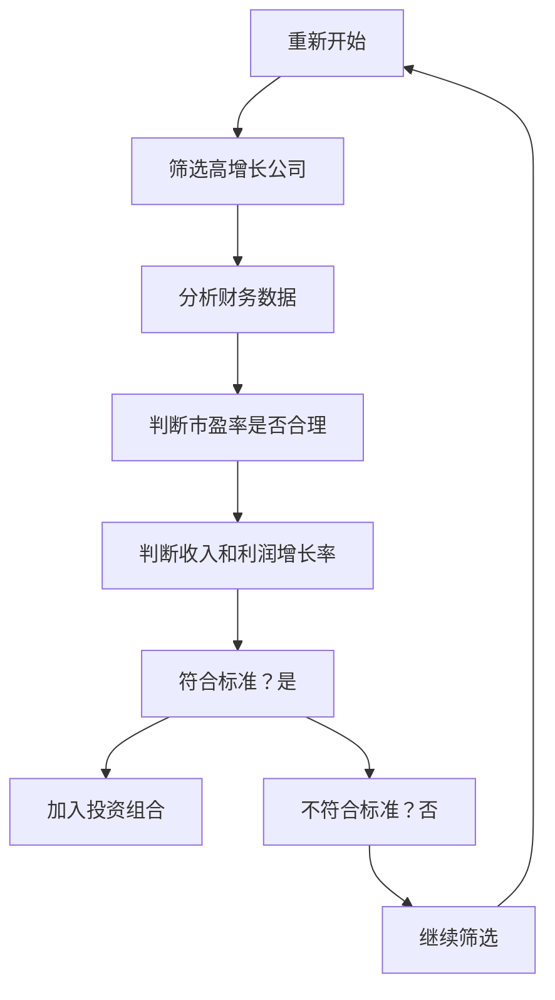
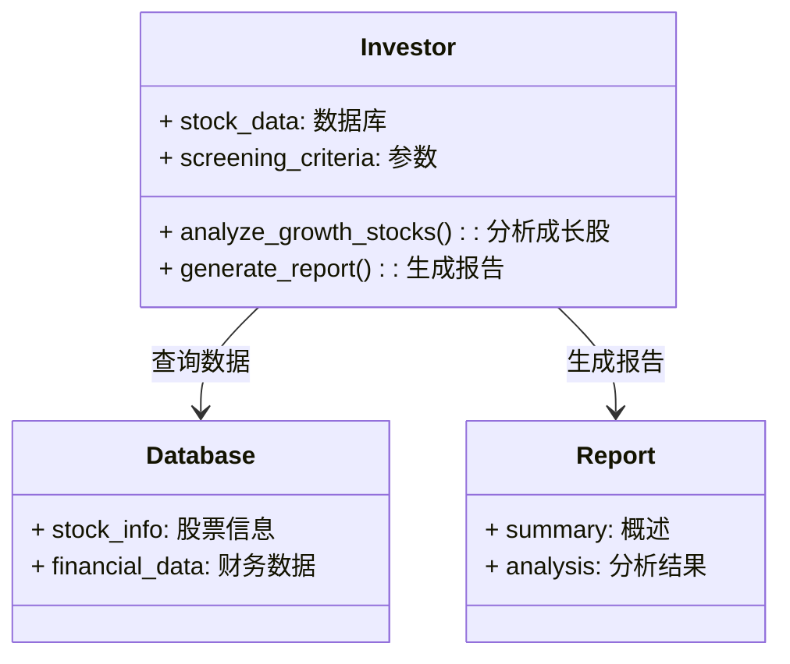

                 


# 彼得林奇的"成长股"在不同经济周期的表现

**关键词**：彼得·林奇、成长股、经济周期、投资策略、股票分析、风险管理

**摘要**：本文深入分析彼得·林奇的成长股投资策略在不同经济周期中的表现。通过背景介绍、核心概念、算法原理、数学模型、系统设计、项目实战和最佳实践等多维度展开，揭示成长股在经济波动中的投资机会与风险。文章结合理论与实践，为投资者提供科学的分析方法和决策依据。

---

## 第一部分：成长股与经济周期的背景介绍

### 第1章：成长股与经济周期概述

#### 1.1 成长股的定义与特征
- **1.1.1 成长股的定义**：成长股是指那些预期收入和利润能够持续快速增长的公司的股票。这类公司通常处于成长期，市场占有率逐步提高，盈利能力强。
- **1.1.2 成长股的核心特征**：
  - 高增长潜力：收入和利润增长率高于行业平均水平。
  - 较高的市盈率：通常高于市场平均水平，反映市场对其未来增长的预期。
  - 高风险高回报：成长股的价格波动较大，但长期回报可能高于其他类型的股票。
- **1.1.3 成长股与价值股的对比**：通过对比表格展示两者的区别。

| 特性        | 成长股             | 价值股             |
|-------------|------------------|------------------|
| 估值标准     | 市盈率较高         | 市盈率较低         |
| 利润增长率   | 高                | 低或负            |
| 投资逻辑     | 未来增长潜力       | 当前低估的价值       |
| 适合经济周期 | 经济复苏和扩张期   | 经济衰退期         |

---

#### 1.2 经济周期的基本概念
- **1.2.1 经济周期的定义**：经济周期是指经济活动的波动过程，通常包括衰退、复苏、扩张和衰退四个阶段。
- **1.2.2 经济周期的阶段划分**：
  - 衰退期：经济活动收缩，企业盈利下降。
  - 复苏期：经济逐步恢复，企业盈利开始回升。
  - 扩张期：经济快速增长，企业盈利持续上升。
  - 衰退期：经济再次收缩，企业盈利下降。
- **1.2.3 经济周期对投资的影响**：不同经济周期阶段，成长股的表现存在显著差异。

---

#### 1.3 彼得·林奇的投资理念
- **1.3.1 彼得·林奇的成长股投资策略**：
  - 专注于寻找具有高增长潜力的公司。
  - 偏好那些收入和利润持续增长的公司。
  - 通过深入研究公司基本面，选择具有竞争优势的企业。
- **1.3.2 林奇的成长股筛选标准**：
  - 股票价格波动大，但长期趋势向上。
  - 公司收入和利润增长率稳定。
  - 市盈率合理，但高于市场平均水平。
- **1.3.3 林奇对成长股长期表现的分析**：通过历史数据分析，成长股在经济扩张期表现优于其他类型股票。

---

#### 1.4 成长股在经济周期中的表现
- **1.4.1 不同经济周期中成长股的表现**：
  - 经济衰退期：成长股表现较差，但龙头企业可能逆势增长。
  - 经济复苏期：成长股开始复苏，但波动较大。
  - 经济扩张期：成长股表现优异，股价上升明显。
  - 经济平稳期：成长股表现取决于公司的基本面。
- **1.4.2 经济周期波动对成长股的影响**：
  - 经济衰退期：成长股面临较大的下行压力，但优质成长股可能成为抄底机会。
  - 经济扩张期：成长股表现最佳，股价涨幅显著。
- **1.4.3 成长股在经济衰退中的防御性**：优质成长股在经济衰退期间可能表现出较强的防御性，因为它们具有持续的盈利能力。

---

## 第二部分：成长股的核心概念与联系

### 第2章：成长股的核心概念

#### 2.1 成长股的属性特征对比
- 使用对比表格展示成长股与价值股的特征差异。

| 特性        | 成长股             | 价值股             |
|-------------|------------------|------------------|
| 估值标准     | 市盈率较高         | 市盈率较低         |
| 利润增长率   | 高                | 低或负            |
| 投资逻辑     | 未来增长潜力       | 当前低估的价值       |
| 适合经济周期 | 经济复苏和扩张期   | 经济衰退期         |

---

#### 2.2 彼得·林奇的成长股筛选模型
- 使用ER实体关系图展示筛选过程。

```mermaid
erDiagram
    customer[投资者] --> invests[投资] --> stock[股票]
    stock --> company[公司]
    company --> has[具备] --> growth_metric[增长指标]
    growth_metric --> satisfies[满足] --> selection_criteria[筛选标准]
    selection_criteria --> results[筛选结果]
```

---

## 第三部分：算法原理讲解

### 第3章：彼得·林奇的成长股筛选模型

#### 3.1 筛选模型的步骤
- 使用Mermaid流程图展示筛选过程。



---

#### 3.2 算法实现
- 使用Python代码示例展示筛选标准。

```python
import pandas as pd

# 假设data是一个包含股票数据的DataFrame
def screen_growth_stocks(data):
    # 筛选收入增长率大于10%的公司
    data = data[data['收入增长率'] > 10]
    # 筛选净利润增长率大于15%的公司
    data = data[data['净利润增长率'] > 15]
    # 筛选市盈率小于行业平均水平的公司
    industry_avg_pe = data['行业市盈率'].mean()
    data = data[data['市盈率'] < industry_avg_pe]
    return data

# 示例数据
data = {
    '股票代码': ['A', 'B', 'C', 'D'],
    '收入增长率': [20, 8, 15, 5],
    '净利润增长率': [18, 5, 20, 10],
    '市盈率': [25, 18, 20, 15],
    '行业市盈率': [20, 20, 20, 20]
}
data = pd.DataFrame(data)
result = screen_growth_stocks(data)
print(result)
```

---

## 第四部分：数学模型与公式

### 第4章：成长股的数学模型

#### 4.1 成长股的估值指标
- 使用LaTeX公式展示市盈率、市净率等指标。

$$\text{市盈率} = \frac{\text{股价}}{\text{每股净利润}}$$

$$\text{市净率} = \frac{\text{股价}}{\text{每股净资产}}$$

---

#### 4.2 投资策略模型
- 使用LaTeX公式展示投资组合的构建方法。

$$\text{投资组合收益} = \sum_{i=1}^{n} w_i \times r_i$$

其中，$w_i$ 是第 $i$ 只股票的投资权重，$r_i$ 是第 $i$ 只股票的预期收益率。

---

## 第五部分：系统分析与架构设计

### 第5章：系统分析与架构设计

#### 5.1 问题场景介绍
- 成长股分析系统的构建：设计一个基于彼得·林奇成长股筛选模型的自动化分析系统，用于在不同经济周期中筛选成长股。

#### 5.2 系统功能设计
- 使用Mermaid类图展示系统功能模块。



---

#### 5.3 系统架构设计
- 使用Mermaid架构图展示系统架构。

```mermaid
archi
    部署节点 投资者应用 --> Web服务器
    Web服务器 --> 数据库
    数据库 --> 第三方数据源
    Web服务器 --> 报告生成器
```

---

## 第六部分：项目实战

### 第6章：项目实战

#### 6.1 环境安装与数据准备
- 安装Python、Pandas、Mermaid等工具。
- 数据来源：使用Yahoo Finance或类似的数据接口获取股票数据。

#### 6.2 核心代码实现
- 使用Python代码实现成长股筛选。

```python
import pandas as pd
import yfinance as yf

# 下载股票数据
def get_growth_stocks(tickers):
    data = {}
    for ticker in tickers:
        stock = yf.Ticker(ticker)
        info = stock.info
        data[ticker] = {
            '收入增长率': info.get('revenue_growth', 0),
            '净利润增长率': info.get('net_income_growth', 0),
            '市盈率': info.get('pe_ratio', 0)
        }
    return pd.DataFrame(data).T

tickers = ['AAPL', 'MSFT', 'GOOGL', 'AMZN']
df = get_growth_stocks(tickers)
print(df)
```

---

#### 6.3 代码解读与分析
- 代码实现了一个简单的成长股筛选函数，根据收入增长率和净利润增长率筛选股票。
- 使用Yahoo Finance接口获取实时数据，展示如何在实际项目中应用这些筛选标准。

---

#### 6.4 案例分析
- 分析科技行业中的成长股，如苹果（AAPL）、微软（MSFT）等。
- 展示在不同经济周期中这些股票的表现。

---

## 第七部分：最佳实践与总结

### 第7章：最佳实践

#### 7.1 投资策略
- 灵活调整投资组合，根据经济周期变化及时调整。
- 重视风险管理，避免过度集中投资。

#### 7.2 风险管理
- 设置止损点，避免重大损失。
- 定期复盘，评估投资组合的表现。

#### 7.3 长期投资的重要性
- 成长股投资需要耐心和长期视角。
- 坚持价值投资，避免短期波动干扰。

#### 7.4 对读者的建议
- 深入学习彼得·林奇的投资理念。
- 结合实际市场情况，灵活运用筛选模型。
- 持续关注经济周期变化，优化投资策略。

---

## 第八部分：总结

### 第8章：总结

- 彼得·林奇的成长股投资策略在不同经济周期中表现各异，投资者需要根据市场环境灵活调整。
- 通过系统化的分析和模型构建，可以更科学地筛选成长股，降低投资风险。
- 结合理论与实践，投资者可以在复杂多变的市场中找到优质成长股，实现长期收益。

---

**作者：AI天才研究院/AI Genius Institute & 禅与计算机程序设计艺术 /Zen And The Art of Computer Programming**

