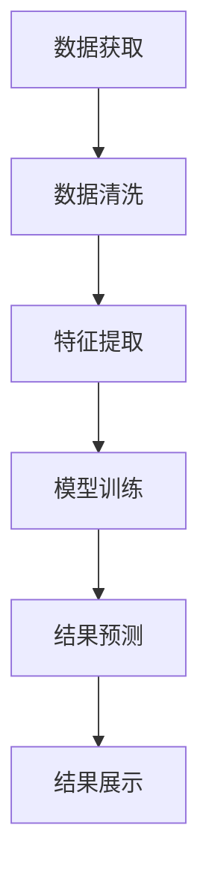
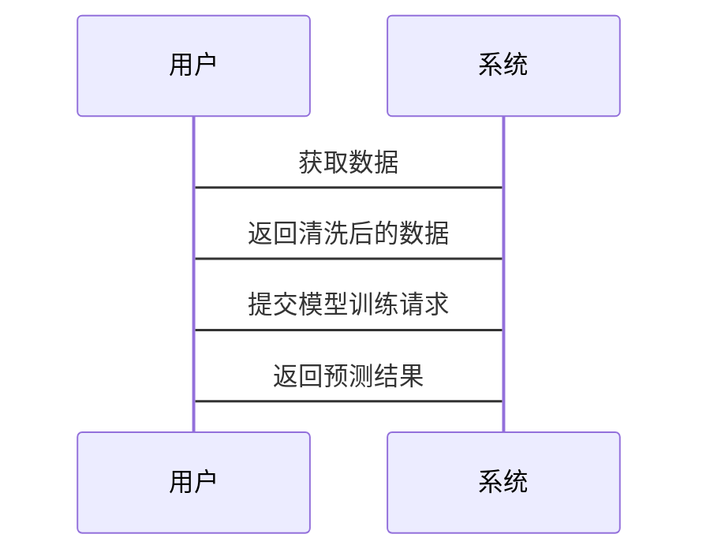

                 


# 彼得林奇的"成长股"在不同货币环境下的表现

---

## 关键词：
- 彼得林奇
- 成长股
- 货币环境
- 投资策略
- 股市分析

---

## 摘要：
彼得·林奇是全球著名投资专家，其成长股投资理念强调长期稳定的收益。然而，货币环境的变化对成长股的表现有着重要影响。本文从成长股的核心概念、货币环境的分类、彼得林奇的投资策略、量化分析模型的构建、实证分析与案例研究、系统架构设计等方面展开，深入探讨成长股在不同货币环境下的表现。通过分析通胀、紧缩和稳定环境下的策略调整，结合数学模型和系统架构，提出有效的投资策略和风险管理方法，为投资者提供实用指导。

---

# 第一部分: 引言

## 1.1 彼得林奇的成长股投资理念

### 1.1.1 彼得林奇的投资者背景
彼得·林奇是美国著名投资家，曾管理富达麦哲伦基金，创造了卓越的投资业绩。他主张长期投资，专注于基本面良好的成长股，强调深入研究和长期持有。

### 1.1.2 成长股的定义与特点
成长股是指收入和利润持续增长的公司的股票，通常具有高市盈率和高增长潜力。彼得林奇认为，成长股的核心在于公司持续的增长能力。

### 1.1.3 货币环境对成长股的影响
货币环境的变化会影响利率、通货膨胀和市场流动性，从而影响成长股的估值和表现。不同货币环境下，成长股的投资策略需要相应调整。

---

## 1.2 本书的研究背景与意义

### 1.2.1 当前货币环境的多样性
当前全球经济面临通胀、紧缩和稳定等多种货币环境，这对成长股的投资策略提出了新的挑战。

### 1.2.2 成长股投资的现实挑战
成长股投资面临市场波动、估值风险和宏观经济不确定性等挑战，特别是在货币环境变化时。

### 1.2.3 研究彼得林奇投资策略的必要性
彼得林奇的成功经验为投资者提供了宝贵的借鉴，研究其策略在不同货币环境下的表现具有重要的现实意义。

---

## 1.3 本书的结构与内容概览

### 1.3.1 各章节的核心内容
- 第一部分：引言，介绍彼得林奇的成长股理念和货币环境的基本概念。
- 第二部分：成长股与货币环境的背景介绍，分析不同货币环境对成长股的影响。
- 第三部分：彼得林奇的成长股投资策略。
- 第四部分：构建成长股的量化分析模型。
- 第五部分：实证分析与案例研究。
- 第六部分：系统架构设计与项目实战。
- 第七部分：总结与展望。

### 1.3.2 本书的创新点
结合彼得林奇的投资策略，构建量化模型，分析不同货币环境下的成长股表现。

### 1.3.3 本书的适用读者群体
适合投资专业人士、金融研究人员和对成长股投资感兴趣的读者。

---

# 第二部分: 成长股与货币环境的背景介绍

## 2.1 成长股的核心概念

### 2.1.1 成长股的定义与分类
成长股分为高速成长股和稳定成长股，分别对应高增长和稳定增长的公司。

### 2.1.2 成长股的财务指标分析
- 收入增长率
- 净利润增长率
- 毛利率
- 资产回报率

### 2.1.3 成长股的市场表现特征
- 高波动性
- 高估值
- 长期收益潜力

---

## 2.2 货币环境的基本类型

### 2.2.1 通货膨胀环境
- 物价上涨
- 利率上升
- 货币购买力下降

### 2.2.2 通货紧缩环境
- 物价下降
- 利率下降
- 货币购买力上升

### 2.2.3 货币稳定环境
- 物价稳定
- 利率稳定
- 经济增长平稳

---

## 2.3 货币环境与股市的关系

### 2.3.1 货币政策对股市的影响
- 货币宽松政策推动股市上涨
- 货币紧缩政策导致股市下跌

### 2.3.2 利率变化对股市的影响
- 利率上升增加融资成本，抑制股市
- 利率下降降低融资成本，推动股市

### 2.3.3 通货膨胀对股市的影响
- 高通胀可能导致股市泡沫
- 中低通胀有助于股市稳定

---

## 2.4 成长股在不同货币环境下的表现特征

### 2.4.1 通货膨胀环境下的成长股表现
- 收益率高，但估值风险大
- 利率上升可能抑制估值

### 2.4.2 通货紧缩环境下的成长股表现
- 估值上升，收益稳定
- 利率下降有助于公司融资

### 2.4.3 货币稳定环境下的成长股表现
- 市场波动小，收益稳定
- 适合长期投资

---

# 第三部分: 彼得林奇的成长股投资策略

## 3.1 彼得林奇的成长股选股标准

### 3.1.1 收入和利润持续增长
- 选择收入和利润连续增长的公司
- 重点关注ROE和ROA

### 3.1.2 行业地位
- 选择行业龙头或具有竞争优势的公司
- 避免夕阳行业

### 3.1.3 财务健康状况
- 低债务，高现金流
- 良好的盈利能力和财务稳定性

---

## 3.2 彼得林奇的成长股投资周期

### 3.2.1 短期投资
- 适应性策略：根据市场变化调整持仓
- 风险管理：严格控制仓位

### 3.2.2 长期投资
- 长期持有优质成长股
- 通过复利效应实现收益最大化

---

## 3.3 彼得林奇的成长股风险管理策略

### 3.3.1 风险分散
- 通过投资组合分散风险
- 避免过度集中

### 3.3.2 定期复盘
- 定期评估持仓公司基本面
- 及时调整投资策略

### 3.3.3 资金管理
- 合理分配资金，避免过度杠杆

---

## 3.4 不同货币环境下的策略调整

### 3.4.1 通货膨胀环境下的调整
- 偏好高收益成长股
- 注意控制估值风险

### 3.4.2 通货紧缩环境下的调整
- 选择估值上升的成长股
- 关注低利率环境下的融资优势

### 3.4.3 货币稳定环境下的调整
- 长期持有优质成长股
- 通过复利效应实现收益

---

# 第四部分: 构建成长股的量化分析模型

## 4.1 数据获取与清洗

### 4.1.1 数据来源
- 股票数据：Yahoo Finance
- 宏观经济数据：美联储、世界银行

### 4.1.2 数据清洗
- 去除缺失值
- 处理异常值

---

## 4.2 特征提取与选择

### 4.2.1 成长股特征
- 收入增长率（revenue growth rate）
- 净利润增长率（net profit growth rate）
- 毛利率（gross margin）
- 资产回报率（ROA）

### 4.2.2 货币环境特征
- 消费者价格指数（CPI）
- 利率水平（Federal Funds Rate）
- 货币供应量（M2）

---

## 4.3 模型构建与训练

### 4.3.1 机器学习模型
- 使用随机森林回归模型预测成长股的表现

### 4.3.2 时间序列模型
- 使用ARIMA预测宏观经济指标

### 4.3.3 评价指标
- 平均绝对误差（MAE）
- R平方值（R²）

---

## 4.4 模型验证与优化

### 4.4.1 交叉验证
- 使用K折交叉验证评估模型性能

### 4.4.2 超参数调优
- 使用网格搜索优化模型参数

### 4.4.3 模型部署
- 将模型部署到量化交易系统中

---

## 4.5 系统架构设计

### 4.5.1 数据流设计
```
数据来源 -> 数据清洗 -> 特征提取 -> 模型训练 -> 预测 -> 输出结果
```

### 4.5.2 模块划分
- 数据模块：数据获取与清洗
- 特征模块：特征提取与选择
- 模型模块：模型训练与预测
- 输出模块：结果展示与分析

---

# 第五部分: 实证分析与案例研究

## 5.1 实证分析

### 5.1.1 数据分析
- 选取美国市场1980-2020年的成长股数据
- 分析不同货币环境下的表现

### 5.1.2 模型验证
- 验证模型在不同货币环境下的预测准确性

### 5.1.3 结果展示
- 绘制不同货币环境下的成长股收益曲线

---

## 5.2 案例研究

### 5.2.1 通胀环境下的成长股投资
- 案例：20世纪70年代的通胀时期
- 成长股表现：高收益但估值风险大

### 5.2.2 紧缩环境下的成长股投资
- 案例：2008年金融危机后的紧缩时期
- 成长股表现：估值上升，收益稳定

### 5.2.3 稳定环境下的成长股投资
- 案例：2010-2020年经济稳定时期
- 成长股表现：长期收益稳定

---

## 5.3 投资策略与风险管理

### 5.3.1 不同货币环境下的策略调整
- 通胀环境：关注高收益成长股，控制估值风险
- 紧缩环境：选择估值上升的成长股，关注低利率环境
- 稳定环境：长期持有优质成长股，通过复利效应实现收益

### 5.3.2 风险管理
- 分散投资，避免过度集中
- 定期复盘，及时调整持仓
- 合理分配资金，避免过度杠杆

---

## 5.4 项目实战

### 5.4.1 环境安装
- 安装Python、Pandas、Scikit-learn、Matplotlib

### 5.4.2 核心代码实现

```python
import pandas as pd
from sklearn.ensemble import RandomForestRegressor
from sklearn.metrics import mean_absolute_error
from sklearn.model_selection import train_test_split

# 数据加载
data = pd.read_csv('growth_stocks.csv')

# 特征选择
features = ['revenue_growth', 'net_profit_growth', 'gross_margin', 'roa']
target = 'stock_return'

# 数据分割
X = data[features]
y = data[target]
X_train, X_test, y_train, y_test = train_test_split(X, y, test_size=0.2, random_state=42)

# 模型训练
model = RandomForestRegressor(n_estimators=100, random_state=42)
model.fit(X_train, y_train)

# 模型预测
y_pred = model.predict(X_test)

# 模型评估
mae = mean_absolute_error(y_test, y_pred)
print(f"MAE: {mae}")
```

### 5.4.3 代码应用解读
- 数据加载：从CSV文件中加载成长股数据
- 特征选择：选择收入增长率、净利润增长率等特征
- 数据分割：将数据分为训练集和测试集
- 模型训练：使用随机森林回归模型训练
- 模型预测：对测试集进行预测
- 模型评估：计算平均绝对误差

---

## 5.5 案例分析

### 5.5.1 案例背景
- 选取某成长股在不同货币环境下的表现
- 分析其收入增长率、净利润增长率等指标

### 5.5.2 分析结果
- 不同货币环境下的成长股收益表现
- 模型预测结果与实际结果对比

### 5.5.3 投资建议
- 根据模型预测结果调整投资策略
- 结合实际市场情况制定投资计划

---

# 第六部分: 系统架构设计与项目实战

## 6.1 系统架构设计

### 6.1.1 系统功能设计
- 数据获取与清洗模块
- 特征提取与选择模块
- 模型训练与预测模块
- 结果展示与分析模块

### 6.1.2 系统架构图


---

## 6.2 系统接口设计

### 6.2.1 API接口
- GET /data 获取数据
- POST /model 提交模型训练请求
- GET /result 获取预测结果

---

## 6.3 系统交互设计

### 6.3.1 用户与系统的交互流程
1. 用户提交数据请求
2. 系统返回清洗后的数据
3. 用户提交模型训练请求
4. 系统返回预测结果

### 6.3.2 交互流程图


---

## 6.4 项目实战

### 6.4.1 环境安装
- 安装Python、Flask、Pandas、Scikit-learn

### 6.4.2 核心代码实现

```python
from flask import Flask, request, jsonify

app = Flask(__name__)

@app.route('/data', methods=['GET'])
def get_data():
    data = pd.read_csv('growth_stocks.csv')
    return jsonify(data.to_dict())

@app.route('/model', methods=['POST'])
def train_model():
    # 获取数据
    data = pd.read_csv('growth_stocks.csv')
    # 特征选择
    features = ['revenue_growth', 'net_profit_growth', 'gross_margin', 'roa']
    target = 'stock_return'
    # 数据分割
    X = data[features]
    y = data[target]
    X_train, X_test, y_train, y_test = train_test_split(X, y, test_size=0.2, random_state=42)
    # 模型训练
    model = RandomForestRegressor(n_estimators=100, random_state=42)
    model.fit(X_train, y_train)
    # 模型预测
    y_pred = model.predict(X_test)
    # 返回结果
    return jsonify({'mae': mean_absolute_error(y_test, y_pred)})

if __name__ == '__main__':
    app.run(debug=True)
```

### 6.4.3 代码应用解读
- 数据获取接口：从CSV文件中获取数据
- 模型训练接口：训练随机森林回归模型
- 结果返回接口：返回模型预测结果和评估指标

---

## 6.5 项目小结

### 6.5.1 项目目标
- 构建成长股的量化分析模型
- 分析不同货币环境下的成长股表现

### 6.5.2 项目成果
- 成功构建量化分析模型
- 提供有效的投资策略和风险管理建议

---

# 第七部分: 总结与展望

## 7.1 总结

### 7.1.1 本书的核心内容
- 彼得林奇的成长股投资理念
- 不同货币环境下的投资策略
- 成长股的量化分析模型

### 7.1.2 本书的主要结论
- 成长股在不同货币环境下的表现差异显著
- 投资者需要根据货币环境调整投资策略
- 量化分析模型为投资决策提供科学依据

---

## 7.2 展望

### 7.2.1 未来的研究方向
- 结合更多宏观经济指标优化模型
- 研究不同行业成长股的差异表现
- 探讨人工智能在投资策略中的应用

### 7.2.2 未来投资建议
- 持续关注宏观经济环境变化
- 灵活调整投资策略
- 利用技术手段优化投资决策

---

## 作者：AI天才研究院/AI Genius Institute & 禅与计算机程序设计艺术 /Zen And The Art of Computer Programming

---

**注意：** 本文为基于彼得林奇的成长股投资理念和技术分析的理论探讨，实际投资需结合市场实际情况，谨慎操作，本文不构成投资建议。

