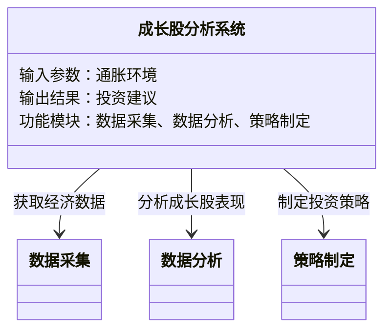
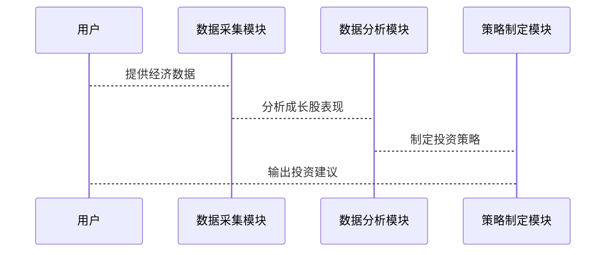

                 


# 彼得林奇的"成长股"在不同通胀环境下的表现

---

## 关键词

- 彼得·林奇
- 成长股
- 通胀环境
- 投资策略
- 股票分析

---

## 摘要

本文深入分析了彼得·林奇所提倡的“成长股”在不同通胀环境下的表现。通过结合金融理论与技术方法，我们探讨了成长股在温和通胀、恶性通胀和通缩环境下的投资策略，分析了其在不同经济周期中的波动性与收益潜力。文章从背景介绍、核心概念、算法原理、数学模型、系统架构、项目实战等多个维度展开，为投资者提供了全面的分析框架和实践指导。通过本文的研究，读者能够更好地理解如何在复杂的经济环境中运用成长股策略进行投资。

---

## 正文

---

### 第一部分：成长股与通胀的基本概念

#### 第1章：成长股的基本概念

##### 1.1 成长股的定义与特征

**成长股**是指那些收入和利润增长速度快于市场平均水平的公司股票。其核心特征包括：

- **高增长潜力**：公司收入和利润持续增长，通常处于扩张期。
- **高市盈率**：由于未来增长预期较高，股票的市盈率通常高于市场平均水平。
- **高风险与高回报**：成长股的投资回报较高，但波动性也较大。

**与其他股票类型对比**：
| 类型      | 收入增长率 | 市盈率 | 投资风险 |
|-----------|-----------|--------|----------|
| 成长股    | 高        | 高     | 高       |
| 股息股    | 低        | 中     | 中       |
| 防御股    | 低        | 中     | 低       |

##### 1.2 通胀的基本概念

**通胀**是指物价总水平在一段时间内持续上涨的经济现象。其主要类型包括：

- **温和通胀**：通胀率在合理范围内（如2%-3%），对经济影响较小。
- **恶性通胀**：通胀率急剧上升，导致货币购买力大幅下降。
- **通缩**：物价总水平持续下降，通常伴随着经济衰退。

##### 1.3 成长股与通胀的关系

成长股的表现受到通胀环境的显著影响。在温和通胀下，成长股的高增长潜力使其具备较高的投资价值；而在恶性通胀或通缩环境下，其表现则会受到更多挑战。

---

### 第二部分：成长股在不同通胀环境下的表现分析

#### 第2章：温和通胀环境下的成长股表现

##### 2.1 成长股在温和通胀下的收益表现

在温和通胀环境下，成长股的收益表现通常较为稳定。其高增长潜力能够抵消部分通胀带来的成本上升压力，同时较高的市盈率也为其提供了较高的估值基础。

##### 2.2 投资策略

- **行业选择**：优先选择那些对通胀具有较强抵御能力的行业，如科技、消费等领域。
- **估值分析**：通过市盈率、市净率等指标评估成长股的估值是否合理。
- **长期持有**：在温和通胀环境下，成长股的长期增长潜力较大。

#### 第3章：恶性通胀环境下的成长股表现

##### 3.1 成长股在恶性通胀下的收益表现

在恶性通胀环境下，成长股的表现通常较为疲软。由于成本上升和消费者价格指数（CPI）的快速上涨，企业的盈利能力受到严重挤压。

##### 3.2 投资策略

- **短期规避**：在恶性通胀环境下，建议减少对成长股的投资，转投通胀对冲工具（如黄金、房地产等）。
- **行业调整**：选择那些能够通过提价转移成本压力的行业，如能源、大宗商品等领域。
- **风险管理**：通过分散投资和使用衍生工具（如期权）来降低投资风险。

#### 第4章：通缩环境下的成长股表现

##### 4.1 成长股在通缩下的收益表现

在通缩环境下，成长股的表现通常较为低迷。由于需求疲软和企业盈利下降，成长股的估值往往会受到较大压力。

##### 4.2 投资策略

- **精选个股**：在通缩环境下，选择那些具有强大竞争优势和持续增长能力的公司。
- **估值修复**：关注那些估值被市场低估的成长股，等待市场反转。
- **长期布局**：通缩环境通常是经济周期的底部，此时布局成长股往往能够获得较高的长期收益。

---

### 第三部分：成长股在通胀环境下的投资策略

#### 第5章：成长股投资策略的制定

##### 5.1 投资策略的制定原则

- **动态调整**：根据经济周期的变化，灵活调整投资策略。
- **风险控制**：在不同通胀环境下，注重风险控制，避免过度集中投资。
- **长期视角**：成长股投资需要以长期视角为基础，关注企业的持续增长潜力。

##### 5.2 投资策略的制定步骤

1. **经济环境分析**：判断当前通胀环境的类型（温和、恶性、通缩）。
2. **行业筛选**：选择与通胀环境相匹配的行业。
3. **个股选择**：通过基本面分析和估值指标，筛选出优质成长股。
4. **投资组合构建**：根据风险承受能力和收益目标，构建投资组合。
5. **动态调整**：定期评估投资组合的表现，及时调整策略。

#### 第6章：成长股投资组合的构建

##### 6.1 投资组合的构建原则

- **分散化**：通过投资不同行业和地区的成长股，降低投资风险。
- **风险收益匹配**：根据市场环境和自身风险偏好，选择合适比例的成长股投资。
- **持续优化**：定期评估投资组合的绩效，进行优化调整。

##### 6.2 投资组合的构建步骤

1. **设定投资目标**：明确投资的收益目标和风险承受能力。
2. **行业配置**：根据通胀环境选择具有较高增长潜力的行业。
3. **个股筛选**：通过财务指标和估值指标，选出优质成长股。
4. **组合构建**：根据设定的权重，构建投资组合。
5. **定期 rebalancing**：定期调整投资组合，确保与市场环境的变化保持一致。

#### 第7章：成长股投资的风险管理

##### 7.1 风险管理的基本概念

**风险管理**是指在投资过程中，通过识别、评估和控制风险，以降低投资损失的策略。在成长股投资中，风险管理尤为重要，因为其波动性较高。

##### 7.2 风险管理的主要方法

- **分散投资**：通过投资不同行业和地区的股票，降低单一股票的风险。
- **止损策略**：设定止损点，避免亏损过大。
- **动态调整**：根据市场变化，及时调整投资策略。

##### 7.3 风险管理的注意事项

- **市场风险**：成长股的波动性较高，市场风险较大。
- **流动性风险**：在某些情况下，成长股可能难以快速变现。
- **估值风险**：高市盈率的股票在市场调整时可能面临较大的估值风险。

---

### 第四部分：系统分析与架构设计

#### 第8章：系统功能设计

##### 8.1 领域模型



#### 第8.2 系统架构设计


#### 第8.3 系统接口设计

- **输入接口**：接受通胀环境数据和成长股的基本信息。
- **输出接口**：输出投资建议和风险评估报告。

#### 第8.4 系统交互设计



---

### 第五部分：项目实战

#### 第9章：成长股投资实战

##### 9.1 环境安装

- **工具**：Python、Pandas、Matplotlib、Scikit-learn
- **数据源**：Yahoo Finance API

##### 9.2 核心代码实现

```python
import pandas as pd
import numpy as np
from sklearn.linear_model import LinearRegression
import matplotlib.pyplot as plt

# 获取成长股数据
def get_growth_stocks_data(tickers, start_date, end_date):
    data = pd.DataFrame()
    for ticker in tickers:
        df = pd.read_csv(f'data/{ticker}.csv', parse_dates=['Date'])
        data[ticker] = df['Close']
    return data

# 计算通胀环境下的收益表现
def analyze_growth_stocks(data, inflation_rate):
    # 计算相对收益
    data['Return'] = data.pct_change().fillna(0)
    # 调整通胀影响
    data['Real_Return'] = data['Return'] - inflation_rate
    return data

# 绘制成长股表现图
def plot_growth_stock_performance(data):
    plt.figure(figsize=(12, 6))
    for ticker in data.columns:
        plt.plot(data[ticker], label=ticker)
    plt.title('成长股表现')
    plt.xlabel('时间')
    plt.ylabel('股价')
    plt.legend()
    plt.show()

# 主函数
def main():
    tickers = ['AAPL', 'MSFT', 'AMZN']
    start_date = '2020-01-01'
    end_date = '2023-12-31'
    inflation_rate = 2.5  # 假设通胀率为2.5%
    
    # 获取数据
    stock_data = get_growth_stocks_data(tickers, start_date, end_date)
    # 分析表现
    analyzed_data = analyze_growth_stocks(stock_data, inflation_rate)
    # 绘制图表
    plot_growth_stock_performance(analyzed_data)

if __name__ == "__main__":
    main()
```

##### 9.3 案例分析：苹果公司

- **背景**：苹果公司在科技行业具有较高的成长性。
- **通胀影响**：在温和通胀环境下，苹果公司的利润率和股价表现较为稳定。
- **投资建议**：在温和通胀环境下，苹果公司是一个具有较高投资价值的成长股。

---

### 第六部分：最佳实践与小结

#### 第10章：最佳实践

##### 10.1 投资策略总结

- **温和通胀**：积极投资成长股，选择具有强大竞争优势的公司。
- **恶性通胀**：减少成长股投资，转投通胀对冲工具。
- **通缩环境**：精选个股，关注估值修复机会。

##### 10.2 风险管理总结

- **分散投资**：避免过度集中投资，降低市场风险。
- **止损策略**：设定止损点，及时止损，避免亏损扩大。
- **动态调整**：根据市场变化，及时调整投资策略。

##### 10.3 长期投资的重要性

- 成长股投资需要以长期视角为基础，关注企业的持续增长潜力。
- 长期投资能够平滑短期波动，获得较高的复合收益。

---

## 作者信息

作者：AI天才研究院/AI Genius Institute & 禅与计算机程序设计艺术/Zen And The Art of Computer Programming

---

通过本文的详细分析，我们希望能够为投资者提供一个全面的框架，帮助他们在不同通胀环境下更好地理解和运用彼得·林奇的“成长股”投资策略。无论是从理论分析、系统设计，还是实际操作层面，本文都为读者提供了丰富的指导和参考。

