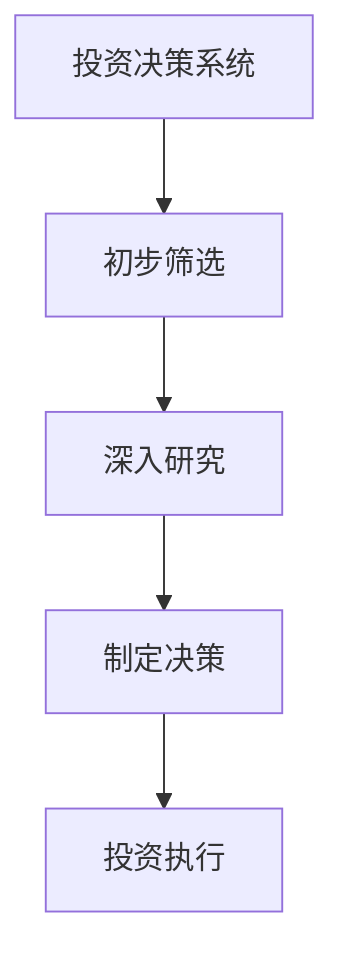
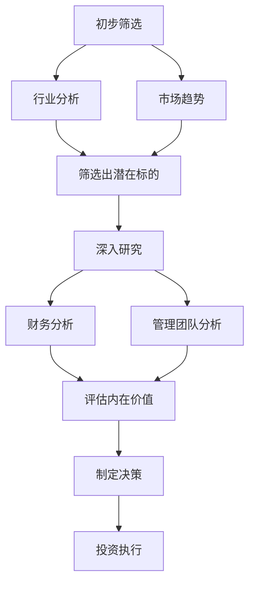
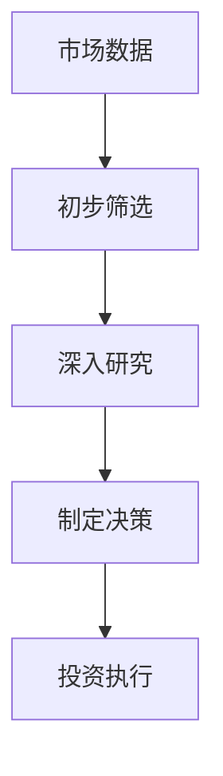
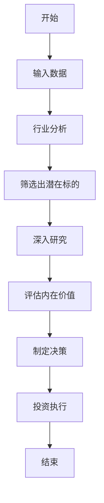

                 


# 彼得林奇的投资纪律

> 关键词：投资纪律、彼得林奇、价值投资、系统架构、算法实现、实战案例

> 摘要：彼得林奇是全球著名投资专家，他的投资纪律是投资成功的关键。本文将从彼得林奇的投资理念出发，详细阐述其投资纪律的核心要素，包括研究驱动、价值导向、长期思维等，并通过系统架构、数学模型和实战案例等技术手段，深入分析这些纪律的实施过程和应用效果。文章最后将总结投资纪律的最佳实践，为读者提供实用的指导。

---

# 第1章: 彼得林奇与投资纪律概述

## 1.1 彼得林奇的背景与投资理念

### 1.1.1 彼得林奇的生平简介

彼得·林奇（Peter Lynch）是全球最著名、也是最有影响力的股票投资专家之一。他是美国富达投资公司的前主席，管理着麦哲伦基金（Fidelity Magellan Fund），在任职期间取得了令人瞩目的投资业绩。林奇的投资风格以研究驱动、价值导向和长期思维为核心，他的投资纪律被认为是投资成功的关键。

### 1.1.2 彼得林奇的投资哲学

彼得林奇的投资哲学强调“买股票不是买公司”的理念，他认为投资者应该以公司的基本面为依据，选择那些具有竞争优势、管理优秀且估值合理的公司进行投资。他的投资哲学还包括以下几点：

- **长期思维**：投资不是短期的博弈，而是长期的财富积累。
- **研究驱动**：深入研究是投资成功的基石。
- **价值导向**：寻找被市场低估的投资标的。

### 1.1.3 彼得林奇的投资风格

彼得林奇的投资风格以“基本面分析”和“深度研究”为核心，他注重对公司财务状况、行业地位、管理团队和市场前景的全面分析。他的投资风格还包括以下几点：

- **分散投资**：避免过度集中于单一行业或公司。
- **灵活调整**：根据市场变化和公司基本面的变化，及时调整投资组合。
- **耐心持有**：长期持有优质股票，避免频繁交易。

---

## 1.2 投资纪律的核心概念

### 1.2.1 投资纪律的定义

投资纪律是指投资者在投资过程中，为了实现投资目标而制定的一系列规则和约束。这些规则包括投资策略、研究方法、决策流程、风险控制等，是投资者在复杂市场环境中保持理性和纪律的关键。

### 1.2.2 投资纪律与投资成功的关系

投资纪律是投资成功的重要保障。没有纪律的投资行为往往会导致情绪化决策、过度交易和盲目跟风，从而增加投资风险并降低投资收益。彼得林奇的成功证明了投资纪律的重要性，他的投资纪律不仅帮助他取得了卓越的投资业绩，也为全球投资者提供了宝贵的经验。

### 1.2.3 彼得林奇投资纪律的独特性

彼得林奇的投资纪律具有以下独特性：

- **研究驱动**：他的投资决策基于对公司基本面的深入研究。
- **价值导向**：他注重寻找被市场低估的优质股票。
- **长期思维**：他强调长期投资，避免短期市场的波动干扰。

---

## 1.3 本书的核心目标与结构

### 1.3.1 本书的目标

本书旨在通过分析彼得林奇的投资纪律，帮助读者掌握投资成功的关键要素。我们将从投资纪律的核心概念出发，结合系统架构、算法实现和实战案例，深入分析彼得林奇投资纪律的实施过程和应用效果。

### 1.3.2 本书的章节安排

本书将分为以下几个部分：

1. 彼得林奇与投资纪律概述
2. 投资纪律的核心要素
3. 投资纪律的系统架构
4. 投资纪律的数学模型与算法
5. 投资纪律的实战案例
6. 投资纪律的最佳实践

### 1.3.3 本书的适用读者

本书适用于所有对投资感兴趣的人士，包括投资者、金融从业者、学生和对投资纪律感兴趣的读者。无论您是投资新手还是资深投资者，都能从本书中获得宝贵的经验和启示。

---

## 2.1 研究驱动的投资决策

### 2.1.1 研究的重要性

研究是投资决策的核心，彼得林奇的成功离不开他对公司基本面的深入研究。他认为，只有通过对公司财务状况、行业地位和管理团队的全面了解，才能做出明智的投资决策。

### 2.1.2 研究的方法与步骤

彼得林奇的研究方法包括以下几个步骤：

1. **行业分析**：了解公司的行业地位、竞争优势和市场前景。
2. **财务分析**：研究公司的财务报表，评估其盈利能力、资产负债状况和现金流情况。
3. **管理团队分析**：了解公司管理层的背景、经验和战略规划。
4. **估值分析**：通过市盈率、市净率等指标，评估公司的估值是否合理。

### 2.1.3 研究的成果与应用

彼得林奇的研究成果主要体现在以下几个方面：

- **投资决策**：研究结果是投资决策的依据。
- **风险控制**：通过研究发现潜在风险，避免投资失误。
- **长期规划**：研究帮助制定长期投资策略，实现财富的持续增长。

---

## 2.2 价值导向的投资策略

### 2.2.1 价值投资的定义

价值投资是一种投资策略，旨在寻找那些市场价格低于其内在价值的股票。彼得林奇的价值投资策略注重对公司基本面的分析，寻找那些被市场低估的优质公司。

### 2.2.2 价值投资的核心要素

价值投资的核心要素包括：

- **内在价值**：公司的内在价值是其未来现金流的现值。
- **市场价格**：市场价格与内在价值的差异是投资机会的来源。
- **安全边际**：通过购买市场价格低于内在价值的股票，确保投资的安全性。

### 2.2.3 价值投资的实施步骤

价值投资的实施步骤包括：

1. **筛选公司**：寻找那些具有竞争优势、管理优秀且估值合理的公司。
2. **深入研究**：对公司基本面进行详细分析，评估其内在价值。
3. **制定投资计划**：根据研究结果，制定投资计划并执行。

---

## 2.3 长期思维与投资纪律

### 2.3.1 长期思维的重要性

长期思维是彼得林奇投资纪律的核心要素之一。他认为，投资是长期的过程，短期市场的波动不应影响长期的投资决策。

### 2.3.2 长期思维与短期决策的冲突

在实际投资中，长期思维与短期决策之间常常存在冲突。例如，市场的短期波动可能导致投资者情绪化决策，从而偏离长期投资目标。彼得林奇的经验表明，投资者必须坚持长期思维，避免被短期市场的波动所干扰。

### 2.3.3 如何培养长期思维

培养长期思维的方法包括：

- **明确投资目标**：制定长期投资目标，并坚持执行。
- **避免短期干扰**：忽略短期市场的波动，专注于长期投资策略。
- **持续学习**：通过不断学习和研究，提升自己的投资能力。

---

## 3.1 投资决策的系统架构

### 3.1.1 系统化流程的定义

系统化流程是指将投资决策过程分解为多个步骤，并通过系统化的流程进行管理和实施。彼得林奇的投资决策流程包括以下几个步骤：

1. **初步筛选**：根据市场趋势和行业前景，筛选出潜在的投资标的。
2. **深入研究**：对公司基本面进行详细分析，评估其内在价值。
3. **制定决策**：根据研究结果，制定投资计划并执行。

### 3.1.2 系统化流程的步骤

系统化流程的步骤如下：

- **初步筛选**：通过行业分析和市场趋势，筛选出潜在的投资标的。
- **深入研究**：对公司财务状况、管理团队和市场前景进行详细分析。
- **制定决策**：根据研究结果，制定投资计划并执行。

### 3.1.3 系统化流程的优化

系统化流程的优化包括：

- **自动化工具**：利用自动化工具提高研究效率。
- **数据驱动决策**：通过数据分析优化投资决策。
- **持续改进**：根据市场变化和投资结果，不断优化投资流程。

---

## 3.2 投资决策的关键节点

### 3.2.1 初步筛选阶段

初步筛选阶段是投资决策的第一步，主要通过行业分析和市场趋势筛选出潜在的投资标的。彼得林奇的经验表明，初步筛选阶段的关键是选择具有竞争优势和良好前景的行业。

### 3.2.2 深度分析阶段

深度分析阶段是投资决策的核心，主要通过对公司基本面的详细分析，评估其内在价值。彼得林奇强调，深度分析阶段的关键是研究公司的财务状况、管理团队和市场前景。

### 3.2.3 投资决策阶段

投资决策阶段是投资决策的最后一步，主要根据研究结果制定投资计划并执行。彼得林奇的经验表明，投资决策阶段的关键是制定合理的投资策略并严格执行。

---

## 3.3 系统架构的可视化

### 3.3.1 系统架构图



### 3.3.2 关键节点的流程图



### 3.3.3 信息流的可视化



---

## 4.1 投资决策的数学模型与算法

### 4.1.1 模型的定义与假设

彼得林奇的投资模型基于以下假设：

- 投资者的决策基于对公司基本面的深入研究。
- 市场价格与内在价值的差异是投资机会的来源。
- 投资者应坚持长期思维，避免短期市场的波动干扰。

### 4.1.2 模型的输入变量

模型的输入变量包括：

- 行业分析数据
- 公司财务数据
- 管理团队信息
- 市场趋势数据

### 4.1.3 模型的输出结果

模型的输出结果包括：

- 投资标的筛选结果
- 公司内在价值评估
- 投资决策建议

---

## 4.2 投资决策的算法实现

### 4.2.1 算法的逻辑流程



### 4.2.2 算法的代码实现

```python
def peter_lynch_investment():
    # 初步筛选
    industry_data = get_industry_data()
    market_trend = get_market_trend()
    potential_stocks = filter_potential_stocks(industry_data, market_trend)

    # 深入研究
    company_profiles = get_company_profiles(potential_stocks)
    intrinsic_values = calculate_intrinsic_value(company_profiles)

    # 制定决策
    investment_recommendations = generate_recommendations(intrinsic_values)
    execute_investment(investment_recommendations)

peter_lynch_investment()
```

### 4.2.3 算法的优化与改进

算法的优化与改进包括：

- **数据优化**：通过引入更多的数据源，提高研究的准确性。
- **模型优化**：通过改进模型的算法，提高投资决策的准确性。
- **执行优化**：通过优化投资执行流程，提高投资效率。

---

## 4.3 数学公式的详细推导

### 4.3.1 关键公式的定义

彼得林奇的投资模型中，内在价值的计算公式为：

$$
\text{内在价值} = \frac{\text{未来现金流}}{\text{折现率}}
$$

### 4.3.2 公式的推导过程

内在价值的计算过程如下：

1. **预测未来现金流**：根据公司的财务状况和市场前景，预测未来现金流。
2. **确定折现率**：根据市场利率和风险偏好，确定折现率。
3. **计算内在价值**：将未来现金流折现，计算出公司的内在价值。

### 4.3.3 公式的实际应用

假设某公司未来现金流为$1000，折现率为5%，则其内在价值为：

$$
\text{内在价值} = \frac{1000}{0.05} = 20000
$$

如果该公司的市场价格低于20000，则具有投资价值。

---

## 5.1 实战案例的选择与分析

### 5.1.1 案例的背景介绍

假设我们选择一家科技公司进行投资分析，该公司具有良好的财务状况和竞争优势，但市场价格低于其内在价值。

### 5.1.2 案例的分析过程

1. **初步筛选**：通过行业分析和市场趋势，筛选出该科技公司。
2. **深入研究**：对公司财务状况、管理团队和市场前景进行详细分析。
3. **制定决策**：根据研究结果，制定投资计划并执行。

### 5.1.3 案例的结论与启示

通过案例分析，我们得出以下结论：

- **投资标的筛选**：初步筛选阶段筛选出具有竞争优势的公司。
- **深入研究**：通过财务分析和管理团队分析，评估公司的内在价值。
- **投资决策**：根据研究结果，制定投资计划并执行。

---

## 5.2 投资决策的系统实现

### 5.2.1 系统的环境配置

系统环境配置包括：

- **数据源**：行业数据、财务数据、市场趋势数据。
- **工具**：数据分析工具、投资管理系统。
- **算法**：彼得林奇投资模型。

### 5.2.2 系统的核心代码

```python
def get_industry_data():
    # 获取行业数据
    pass

def get_market_trend():
    # 获取市场趋势数据
    pass

def filter_potential_stocks(industry_data, market_trend):
    # 筛选出潜在标的
    pass

def get_company_profiles(potential_stocks):
    # 获取公司基本面数据
    pass

def calculate_intrinsic_value(company_profiles):
    # 计算内在价值
    pass

def generate_recommendations(intrinsic_values):
    # 生成投资建议
    pass

def execute_investment(recommendations):
    # 执行投资
    pass
```

### 5.2.3 系统的运行结果

系统的运行结果包括：

- **潜在标的筛选结果**：筛选出具有竞争优势的公司。
- **内在价值评估结果**：评估出公司的内在价值。
- **投资决策建议**：生成投资建议并执行。

---

## 5.3 实战经验的总结与反思

### 5.3.1 成功经验的总结

彼得林奇的成功经验总结如下：

- **研究驱动**：深入研究是投资成功的基石。
- **价值导向**：寻找被市场低估的优质公司。
- **长期思维**：坚持长期投资，避免短期市场的波动干扰。

### 5.3.2 失败教训的反思

失败的教训包括：

- **研究不足**：忽视对公司基本面的深入研究，可能导致投资失败。
- **短期决策**：过度关注短期市场波动，可能导致投资失误。
- **缺乏纪律**：没有坚持投资纪律，可能导致投资失败。

### 5.3.3 经验总结的启示

经验总结的启示包括：

- **坚持纪律**：投资纪律是投资成功的保障。
- **持续学习**：通过不断学习和研究，提升自己的投资能力。
- **优化流程**：通过优化投资流程，提高投资效率。

---

## 6.1 投资纪律的注意事项

### 6.1.1 投资纪律的常见误区

投资纪律的常见误区包括：

- **过度集中**：过度集中于单一行业或公司，增加投资风险。
- **盲目跟风**：盲目跟风市场热点，导致投资失败。
- **情绪化决策**：根据情绪做出投资决策，增加投资风险。

### 6.1.2 投资纪律的执行难点

投资纪律的执行难点包括：

- **研究不足**：缺乏深入研究，导致投资决策失误。
- **短期干扰**：短期市场的波动干扰长期投资决策。
- **缺乏纪律**：没有坚持投资纪律，导致投资失败。

### 6.1.3 投资纪律的维护与更新

投资纪律的维护与更新包括：

- **持续学习**：通过不断学习和研究，提升自己的投资能力。
- **优化流程**：根据市场变化和投资结果，不断优化投资流程。
- **坚持纪律**：坚持投资纪律，避免短期市场的波动干扰。

---

## 6.2 投资纪律的优化与提升

### 6.2.1 投资纪律的优化方法

投资纪律的优化方法包括：

- **引入自动化工具**：利用自动化工具提高研究效率。
- **数据驱动决策**：通过数据分析优化投资决策。
- **持续改进**：根据市场变化和投资结果，不断优化投资流程。

### 6.2.2 投资纪律的提升策略

投资纪律的提升策略包括：

- **加强研究能力**：通过加强研究能力，提高投资决策的准确性。
- **优化投资流程**：通过优化投资流程，提高投资效率。
- **培养长期思维**：通过培养长期思维，避免短期市场的波动干扰。

### 6.2.3 投资纪律的持续改进

投资纪律的持续改进包括：

- **定期回顾**：定期回顾投资结果，总结经验教训。
- **优化模型**：根据市场变化，不断优化投资模型。
- **加强纪律**：通过加强纪律，确保投资决策的正确性。

---

## 6.3 投资纪律的未来发展

### 6.3.1 投资纪律的未来趋势

投资纪律的未来趋势包括：

- **自动化投资**：随着人工智能和大数据技术的发展，自动化投资将成为未来的趋势。
- **智能化决策**：通过智能化决策工具，提高投资决策的准确性。
- **全球化投资**：随着全球经济的全球化，投资纪律也将更加注重全球化布局。

### 6.3.2 人工智能在投资纪律中的应用

人工智能在投资纪律中的应用包括：

- **自动化研究**：利用人工智能技术，自动化完成公司基本面研究。
- **智能化决策**：通过人工智能技术，优化投资决策流程。
- **实时监控**：利用人工智能技术，实时监控市场变化，及时调整投资策略。

### 6.3.3 未来投资纪律的挑战与机遇

未来投资纪律的挑战与机遇包括：

- **技术挑战**：随着技术的发展，投资纪律将面临更多的技术挑战。
- **市场变化**：市场的快速变化将对投资纪律提出更高的要求。
- **投资机会**：随着全球经济的发展，投资纪律将面临更多的投资机会。

---

## 小结

彼得林奇的投资纪律是投资成功的关键，他的研究驱动、价值导向和长期思维的投资理念为全球投资者提供了宝贵的经验。通过系统架构、数学模型和实战案例的分析，我们可以更好地理解彼得林奇投资纪律的实施过程和应用效果。未来，随着技术的发展和市场的变化，投资纪律将面临更多的挑战和机遇，我们需要不断优化和提升投资纪律，以应对未来的投资挑战。

---

## 作者

作者：AI天才研究院/AI Genius Institute & 禅与计算机程序设计艺术 /Zen And The Art of Computer Programming

