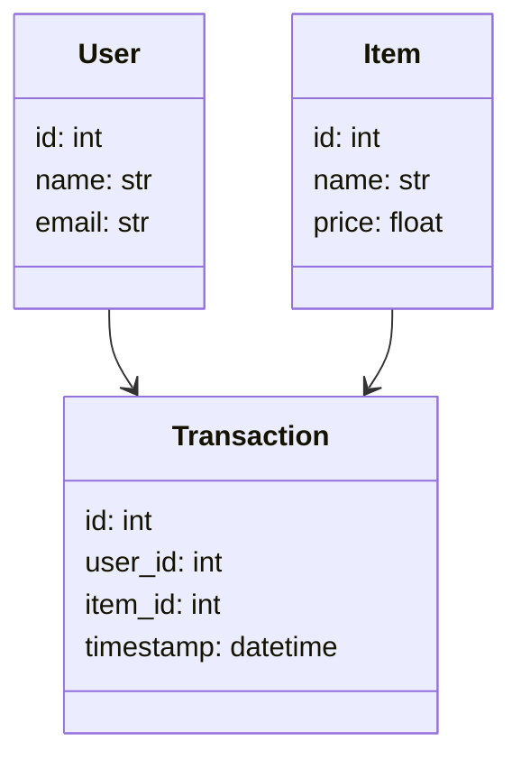
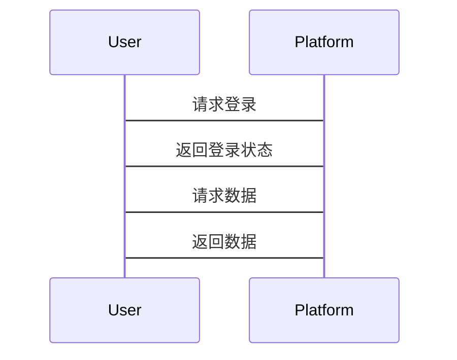

                 


# 彼得林奇的"护城河"理论在平台经济中的应用

> 关键词：护城河理论、平台经济、数据驱动、网络效应、竞争优势

> 摘要：本文深入探讨彼得林奇的“护城河”理论在平台经济中的应用，分析护城河理论的核心要素及其在平台经济中的具体表现形式。通过对比平台经济与传统经济的差异，结合实际案例，详细阐述护城河在平台经济中的构建策略，包括数据驱动、网络效应、品牌与用户粘性等方面。本文还从算法原理、系统架构、项目实战等角度，全面解析护城河理论在平台经济中的实践应用，为企业构建可持续的竞争优势提供理论支持和实践指导。

---

# 第1章: 彼得林奇"护城河"理论的核心概念

## 1.1 护城河理论的起源与背景

### 1.1.1 传统企业竞争优势的定义

护城河理论由投资大师彼得·林奇提出，旨在帮助企业识别和构建可持续的竞争优势。传统企业的竞争优势通常来源于成本优势、资源垄断、技术壁垒或品牌影响力。这些竞争优势帮助企业抵御竞争对手的侵蚀，确保长期盈利能力。

### 1.1.2 彼得林奇对护城河理论的贡献

彼得·林奇将护城河理论系统化，提出了护城河的四大类型：成本优势、网络效应、品牌忠诚度和用户粘性、数据驱动的优势。他强调，企业必须通过构建这些护城河来确保其商业模式的可持续性。

### 1.1.3 护城河理论的核心要素与边界

护城河的核心要素包括：  
1. **成本优势**：通过规模经济或技术优势降低生产成本。  
2. **网络效应**：用户数量的增加会增强平台的价值。  
3. **品牌忠诚度**：强大的品牌影响力能够吸引并留住用户。  
4. **数据驱动**：通过数据分析优化运营并创造新的价值。

护城河的边界在于：  
- 过度依赖单一类型的护城河可能面临风险。  
- 护城河的构建需要与企业的商业模式和战略目标紧密结合。

---

## 1.2 平台经济的基本概念与特点

### 1.2.1 平台经济的定义与模式

平台经济是指通过平台连接供需双方，提供撮合交易或增值服务的商业模式。其核心在于通过双边市场实现价值创造，典型的平台包括电商平台、社交媒体、搜索引擎等。

### 1.2.2 平台经济的核心特征与优势

平台经济的特征包括：  
1. **双边市场**：连接供需双方，实现价值交换。  
2. **网络效应**：用户数量的增加会增强平台的价值。  
3. **数据驱动**：通过数据分析优化平台运营。  
4. **灵活性**：能够快速适应市场变化。

平台经济的优势在于其能够通过数据和网络效应快速扩大市场规模，降低交易成本，创造新的价值点。

### 1.2.3 平台经济的双边市场与网络效应

平台经济的双边市场模型可以通过以下公式表示：

$$
\text{平台价值} = f(\text{用户数量}, \text{用户参与度}, \text{数据质量})
$$

网络效应的强度可以通过以下公式衡量：

$$
\text{网络效用} = \frac{1}{2} \left( \frac{N}{K} \right)
$$

其中，$N$ 是用户数量，$K$ 是关键节点数量。

---

# 第2章: 护城河理论与平台经济的结合

## 2.1 护城河理论在平台经济中的适用性

### 2.1.1 护城河理论与平台经济的契合点

平台经济的核心在于通过数据和网络效应构建护城河。护城河理论为平台经济提供了理论支持，帮助企业在激烈的市场竞争中建立可持续的竞争优势。

### 2.1.2 平台经济中的核心竞争力

平台经济的核心竞争力来源于：  
1. **数据驱动**：通过数据分析优化运营并创造新价值。  
2. **网络效应**：用户数量和参与度的提升增强平台价值。  
3. **用户粘性**：通过优质服务和个性化体验留住用户。

### 2.1.3 护城河理论与平台经济的结合策略

平台经济可以通过以下方式结合护城河理论：  
1. **数据驱动**：通过数据分析优化运营并创造新价值。  
2. **网络效应**：通过用户增长和互动增强平台价值。  
3. **品牌与用户粘性**：通过品牌建设和用户体验优化提升用户忠诚度。

---

## 2.2 平台经济中的护城河类型

### 2.2.1 数据驱动的护城河

数据驱动的护城河是平台经济中最重要的一种。通过收集和分析用户数据，平台可以优化运营策略、提升用户体验并创造新的商业机会。例如，亚马逊通过分析用户行为数据，优化推荐算法并提升用户购买转化率。

### 2.2.2 网络效应的护城河

网络效应的护城河是平台经济的核心竞争力。通过构建双边市场，平台可以实现用户数量和参与度的快速增长。例如，微信通过连接用户和商家，构建了强大的社交网络效应。

### 2.2.3 品牌与用户粘性的护城河

品牌与用户粘性的护城河是平台经济的长期竞争优势。通过打造强大的品牌形象和提供优质服务，平台可以提升用户忠诚度并抵御竞争对手的侵蚀。

---

# 第3章: 护城河理论在平台经济中的应用案例分析

## 3.1 典型平台经济企业的护城河构建

### 3.1.1 亚马逊的护城河构建

亚马逊通过以下方式构建护城河：  
1. **数据驱动**：通过分析用户行为数据优化推荐算法。  
2. **网络效应**：通过Prime会员服务构建用户粘性。  
3. **品牌与用户粘性**：通过优质的客户服务和物流体系提升品牌影响力。

### 3.1.2 谷歌的护城河构建

谷歌通过以下方式构建护城河：  
1. **数据驱动**：通过分析搜索数据优化搜索引擎算法。  
2. **网络效应**：通过构建开放的生态系统吸引开发者和用户。  
3. **品牌与用户粘性**：通过优质的产品和服务提升品牌影响力。

### 3.1.3 Facebook的护城河构建

Facebook通过以下方式构建护城河：  
1. **数据驱动**：通过分析用户行为数据优化广告投放。  
2. **网络效应**：通过连接用户和商家构建社交网络。  
3. **品牌与用户粘性**：通过个性化内容推荐提升用户参与度。

---

## 3.2 护城河理论在平台经济中的成功与失败案例

### 3.2.1 成功案例分析

以阿里巴巴为例，阿里巴巴通过以下方式构建护城河：  
1. **数据驱动**：通过分析用户行为数据优化推荐算法。  
2. **网络效应**：通过构建淘宝和支付宝平台吸引用户和商家。  
3. **品牌与用户粘性**：通过优质的客户服务和物流体系提升品牌影响力。

### 3.2.2 失败案例分析

以MySpace为例，MySpace由于未能有效构建护城河，最终被Facebook取代。原因在于：  
1. **数据驱动**：未能有效利用用户数据优化运营。  
2. **网络效应**：未能通过用户增长和互动增强平台价值。  
3. **品牌与用户粘性**：未能通过优质服务和个性化体验提升用户忠诚度。

---

## 3.3 案例总结与启示

成功案例表明，护城河理论在平台经济中的应用需要结合企业的实际情况，通过数据驱动、网络效应和品牌建设等多种方式构建可持续的竞争优势。失败案例则提醒我们，未能有效构建护城河的企业难以在激烈的市场竞争中生存。

---

# 第4章: 平台经济中的护城河构建策略

## 4.1 数据驱动的护城河构建

### 4.1.1 数据收集与分析

通过收集用户行为数据、交易数据和市场数据，平台可以优化运营策略并提升用户体验。例如，亚马逊通过分析用户行为数据优化推荐算法，提升用户购买转化率。

### 4.1.2 数据驱动的决策优化

通过数据驱动的决策优化，平台可以实现精准营销、个性化推荐和风险控制。例如，通过分析用户数据，平台可以预测用户的购买偏好并推荐相关产品。

### 4.1.3 数据安全与隐私保护

数据驱动的护城河需要依赖数据安全和隐私保护。平台必须通过加密技术、访问控制和数据脱敏等手段保护用户数据。

---

## 4.2 网络效应的护城河构建

### 4.2.1 网络效应的定义与实现

网络效应是指用户数量的增加会增强平台的价值。例如，微信通过连接用户和商家，构建了强大的社交网络效应。

### 4.2.2 平台双边市场的网络效应设计

平台可以通过以下方式设计网络效应：  
1. **用户增长**：通过营销和推广吸引更多的用户。  
2. **用户互动**：通过社交功能和互动活动提升用户参与度。  
3. **网络效应的强化**：通过优化平台功能和服务提升用户粘性。

---

## 4.3 品牌与用户粘性的护城河构建

### 4.3.1 品牌价值的提升

品牌价值的提升需要通过优质的产品和服务、精准的市场推广和持续的创新。例如，苹果通过创新的产品设计和优质的客户服务，提升了品牌影响力。

### 4.3.2 用户粘性的提升

用户粘性的提升可以通过以下方式实现：  
1. **个性化体验**：通过数据分析提供个性化服务。  
2. **优质服务**：通过优质的客户服务提升用户满意度。  
3. **用户忠诚度计划**：通过会员体系和奖励机制提升用户忠诚度。

---

# 第5章: 护城河理论在平台经济中的算法实现

## 5.1 数据驱动的护城河算法

### 5.1.1 数据分析算法

通过Python实现用户行为数据分析：

```python
import pandas as pd

# 读取用户行为数据
data = pd.read_csv('user_behavior.csv')

# 统计用户活跃度
user_activity = data.groupby('user_id')['action'].count()

# 分析用户偏好
user_preference = data.groupby('user_id')['item_id'].unique().apply(len)
```

### 5.1.2 个性化推荐算法

通过协同过滤算法实现个性化推荐：

```python
from sklearn.metrics.pairwise import cosine_similarity

# 计算用户相似性
user_similarity = cosine_similarity(user_activity_matrix)

# 推荐相似用户的商品
recommendations = user_similarity * item_features
```

### 5.1.3 数据驱动的护城河算法总结

数据驱动的护城河算法通过分析用户行为数据，优化推荐算法并提升用户体验。其核心在于通过数据分析和机器学习技术，实现精准营销和个性化推荐。

---

## 5.2 网络效应的护城河算法

### 5.2.1 网络效应的检测算法

通过社交网络分析检测网络效应：

```python
import networkx as nx

# 构建社交网络图
G = nx.from_pandas_edgelist(edges, 'user_id', 'connected_user')

# 计算网络效应
network_effect = nx.betweenness_centrality(G)
```

### 5.2.2 网络效应的优化算法

通过优化算法提升网络效应：

```python
import numpy as np

# 计算节点影响力
node_influence = np.argsort(network_effect)[-10:]
```

---

## 5.3 品牌与用户粘性的护城河算法

### 5.3.1 用户忠诚度分析算法

通过分析用户行为数据，计算用户忠诚度：

```python
user_retention = data.groupby('user_id')['purchase_frequency'].mean()
```

### 5.3.2 用户粘性的提升算法

通过优化算法提升用户粘性：

```python
from sklearn.cluster import KMeans

# 用户分群
clusters = KMeans(n_clusters=5).fit(user_behavior_matrix)
```

---

# 第6章: 护城河理论在平台经济中的系统架构设计

## 6.1 系统功能设计

### 6.1.1 领域模型设计

平台经济的领域模型可以通过以下Mermaid图表示：



### 6.1.2 系统架构设计

平台经济的系统架构可以通过以下Mermaid图表示：

```mermaid
archimate
title Platform Architecture
User-Actor (用户) --> Application (平台应用)
Application --> Database (数据库)
Application --> API Gateway (API网关)
API Gateway --> External System (外部系统)
Database --> Cache (缓存)
```

---

## 6.2 系统接口设计

### 6.2.1 用户登录接口

```python
def user_login(user_id, password):
    # 验证用户身份
    if user_id in users and users[user_id] == password:
        return True
    else:
        return False
```

### 6.2.2 用户注册接口

```python
def user_register(user_id, password):
    # 注册用户
    users[user_id] = password
```

---

## 6.3 系统交互设计

### 6.3.1 用户登录流程



---

# 第7章: 护城河理论在平台经济中的项目实战

## 7.1 项目背景介绍

以电商平台为例，本文将通过一个电商平台实战，展示护城河理论在平台经济中的具体应用。

---

## 7.2 系统核心实现

### 7.2.1 环境安装

需要安装以下工具：  
1. Python 3.x  
2. Pandas  
3. Scikit-learn  
4. Mermaid

### 7.2.2 核心实现代码

```python
import pandas as pd
from sklearn.cluster import KMeans

# 数据加载
data = pd.read_csv('user_behavior.csv')

# 用户分群
clusters = KMeans(n_clusters=5).fit(data)
```

---

## 7.2.3 代码解读与分析

通过上述代码，我们可以实现用户分群，从而优化推荐算法并提升用户体验。

---

## 7.3 案例分析与总结

通过电商平台实战，我们发现：  
1. 数据驱动的护城河可以通过用户行为分析优化推荐算法。  
2. 网络效应可以通过用户分群和社交功能提升用户参与度。  
3. 品牌与用户粘性可以通过优质服务和个性化推荐提升用户忠诚度。

---

# 第8章: 结论与展望

## 8.1 结论

本文通过深入分析彼得林奇的护城河理论在平台经济中的应用，提出了构建数据驱动、网络效应和品牌忠诚度的护城河的策略。通过案例分析和系统设计，展示了护城河理论在平台经济中的具体应用。

## 8.2 最佳实践 tips

1. 数据驱动是平台经济的核心竞争力，需要通过数据分析优化运营。  
2. 网络效应是平台经济的重要护城河，需要通过用户增长和互动增强平台价值。  
3. 品牌与用户粘性是平台经济的长期竞争优势，需要通过优质服务和个性化体验提升用户忠诚度。

## 8.3 注意事项

1. 护城河的构建需要与企业的商业模式和战略目标紧密结合。  
2. 数据驱动的护城河需要依赖数据安全和隐私保护。  
3. 网络效应的护城河需要通过用户增长和互动增强平台价值。

## 8.4 拓展阅读

1. 《彼得林奇选股艺术》  
2. 《平台经济：商业模式与创新》  
3. 《数据驱动的商业分析》  

---

# 作者：AI天才研究院/AI Genius Institute & 禅与计算机程序设计艺术 /Zen And The Art of Computer Programming

