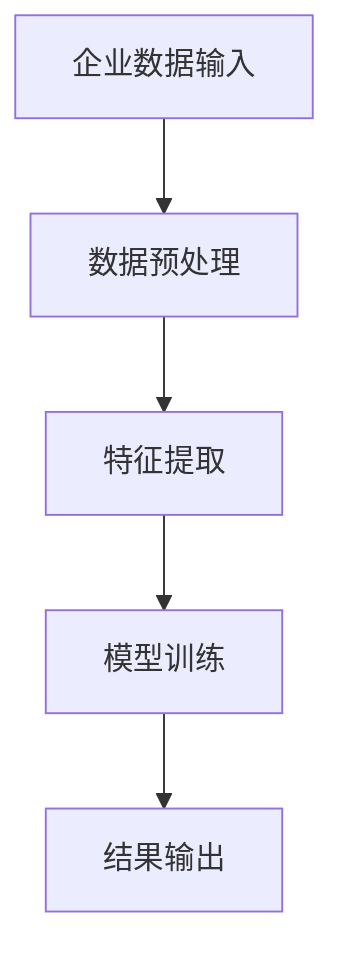

                 


# 彼得林奇的"护城河"理论在知识产权密集型企业中的应用

> 关键词：彼得林奇，护城河，知识产权，企业价值，竞争分析

> 摘要：本文探讨了彼得林奇的“护城河”理论在知识产权密集型企业中的应用。通过分析护城河的核心概念、知识产权作为核心资产的作用，以及护城河宽度与企业价值的关系，结合数学模型和算法实现，为知识产权密集型企业构建竞争优势提供理论支持和实践指导。

---

## 第1章：彼得林奇“护城河”理论的背景与核心概念

### 1.1 护城河理论的起源与核心思想

彼得林奇是美国著名投资家，他在《彼得林奇的成功投资》一书中提出了“护城河”理论，认为企业竞争优势的核心在于其难以被竞争对手复制的“护城河”。护城河可以是经济型的（如成本优势）、资源型的（如专利、专有技术）或品牌型的。对于知识产权密集型企业而言，护城河的核心往往在于其知识产权资产。

#### 护城河理论的核心思想
1. **竞争优势的持久性**：护城河使企业在长期内具有竞争优势。
2. **难以复制性**：竞争对手难以轻易复制企业的核心优势。
3. **经济价值的提升**：强大的护城河能够显著提高企业的估值。

---

### 1.2 知识产权密集型企业的特点

知识产权密集型企业是指那些在经营活动中依赖专利、商标、版权等知识产权资产，并通过这些资产获得核心竞争力的企业。这类企业通常集中在技术密集型行业，如半导体、制药、软件开发等。

#### 知识产权密集型企业的特点
1. **核心资产为无形资产**：企业的价值主要来源于知识产权。
2. **创新驱动**：企业通过持续创新来巩固和扩大竞争优势。
3. **法律保护的重要性**：知识产权的保护是企业护城河的重要组成部分。

---

## 第2章：护城河理论的核心概念与分析框架

### 2.1 护城河的类型与特征

护城河可以分为以下几种类型：

#### 2.1.1 经济型护城河
- **成本优势**：企业通过规模经济或流程优化降低成本，形成价格竞争优势。
- **网络效应**：用户数量增加时，产品或服务的价值也随之增加，例如社交媒体平台。

#### 2.1.2 资源型护城河
- **专利**：通过专利保护技术，防止竞争对手复制。
- **专有技术**：独特的生产工艺或配方，难以被复制。
- **品牌忠诚度**：强大的品牌形象和客户忠诚度。

#### 2.1.3 知识产权型护城河
- **专利布局**：通过申请大量专利形成技术壁垒。
- **商标价值**：强大的商标认知度和品牌影响力。

---

### 2.2 知识产权作为护城河的核心要素

在知识产权密集型企业中，知识产权是护城河的核心要素。以下是其主要作用：

#### 2.2.1 专利的保护作用
- **技术壁垒**：通过专利保护核心技术，防止竞争对手进入市场。
- **防御性策略**：通过积累专利资产，应对可能的侵权诉讼。

#### 2.2.2 商标的价值与影响力
- **品牌识别**：商标是企业品牌的象征，增强市场认知度。
- **品牌忠诚度**：强大的商标可以吸引并留住客户。

#### 2.2.3 版权的法律保护与商业应用
- **内容保护**：通过版权保护原创内容，防止盗版。
- **商业应用**：将版权资产转化为商业价值，例如软件 licensing。

---

## 第3章：护城河理论与知识产权密集型企业的结合

### 3.1 知识产权密集型企业中的护城河构建

#### 3.1.1 专利布局与护城河建设
- **专利申请策略**：围绕核心技术申请多领域的专利，形成技术壁垒。
- **专利组合管理**：通过组合不同类型的专利，增强防御能力。

#### 3.1.2 商标战略与品牌保护
- **商标注册与维护**：在全球范围内注册商标，确保品牌权益。
- **品牌推广**：通过营销和推广提升品牌知名度和影响力。

#### 3.1.3 版权管理与核心竞争力
- **版权登记与保护**：对原创内容进行版权登记，防止侵权。
- **版权商业化**：通过授权、许可等方式实现版权价值。

---

### 3.2 护城河的宽度与企业价值的关系

#### 3.2.1 护城河宽度的衡量标准
- **技术壁垒的强度**：专利的数量、质量和布局。
- **品牌的市场地位**：品牌认知度和客户忠诚度。
- **资源的独特性**：专有技术的独特性和难以复制性。

#### 3.2.2 护城河宽度与企业估值的正相关性
- **竞争优势的持久性**：强大的护城河使企业能够在长期内保持竞争优势。
- **投资价值的提升**：护城河宽度与企业估值呈正相关。

#### 3.2.3 护城河宽度对企业长期竞争优势的影响
- **防御能力的增强**：护城河使企业能够抵御竞争对手的进攻。
- **进攻能力的提升**：强大的护城河为企业拓展市场提供保障。

---

## 第4章：护城河评估的数学模型与算法实现

### 4.1 护城河评估模型的构建

#### 4.1.1 模型的输入变量
- 专利数量与质量
- 商标注册数量
- 品牌影响力
- 市场占有率

#### 4.1.2 模型的输出结果
- 护城河宽度评分
- 企业竞争优势分析
- 竞争风险评估

#### 4.1.3 模型的适用范围
- 知识产权密集型企业
- 技术创新型企业

---

### 4.2 护城河宽度的量化方法

#### 4.2.1 加权评分法
- 根据专利、商标、品牌等指标的权重，计算综合评分。

#### 4.2.2 综合指数法
- 将各项指标转化为指数，进行综合评估。

#### 4.2.3 对比分析法
- 将企业护城河宽度与行业平均水平进行对比。

---

### 4.3 护城河评估算法的Python实现

#### 4.3.1 数据读取与清洗
```python
import pandas as pd

data = pd.read_csv('patent_data.csv')
data = data.dropna()
```

#### 4.3.2 特征工程与模型训练
```python
from sklearn.preprocessing import StandardScaler
from sklearn.linear_model import LinearRegression

features = ['patent_count', '商标数量', '品牌影响力']
target = '护城河宽度'

scaler = StandardScaler()
X = scaler.fit_transform(data[features])
y = data[target]

model = LinearRegression()
model.fit(X, y)
```

#### 4.3.3 模型优化与结果分析
```python
from sklearn.metrics import mean_squared_error

y_pred = model.predict(X)
mse = mean_squared_error(y, y_pred)
print(f"均方误差：{mse}")
```

---

## 第5章：护城河系统分析与架构设计

### 5.1 系统功能设计

#### 5.1.1 企业评估模块
- 输入：企业知识产权数据
- 输出：护城河宽度评分

#### 5.1.2 知识产权分析模块
- 输入：专利、商标、版权数据
- 输出：知识产权价值评估

### 5.2 系统架构设计



---

## 第6章：项目实战与案例分析

### 6.1 项目实战

#### 6.1.1 环境安装
```bash
pip install numpy pandas scikit-learn
```

#### 6.1.2 核心代码实现
```python
import numpy as np
import pandas as pd
from sklearn.model_selection import train_test_split
from sklearn.metrics import accuracy_score

# 数据加载
data = pd.read_csv('intellectual_property.csv')

# 数据分割
X = data.drop('护城河宽度', axis=1)
y = data['护城河宽度']

X_train, X_test, y_train, y_test = train_test_split(X, y, test_size=0.2)

# 模型训练
from sklearn.ensemble import RandomForestClassifier
model = RandomForestClassifier()
model.fit(X_train, y_train)

# 模型预测
y_pred = model.predict(X_test)

# 模型评估
print("准确率：", accuracy_score(y_test, y_pred))
```

---

## 第7章：总结与最佳实践

### 7.1 小结

通过本文的分析，我们可以得出以下结论：
1. 知识产权密集型企业需要重视护城河的构建。
2. 专利、商标、版权是构建护城河的重要工具。
3. 通过数学模型和算法实现，可以量化护城河的宽度，为企业的价值评估提供依据。

---

### 7.2 注意事项

1. **数据质量**：确保输入数据的准确性和完整性。
2. **模型优化**：根据实际需求不断优化模型。
3. **法律保护**：加强知识产权的法律保护。

---

### 7.3 未来趋势

随着技术的不断进步，护城河的构建将更加依赖于人工智能和大数据分析。未来，企业可以通过智能化工具进一步提升护城河的构建和管理能力。

---

### 7.4 拓展阅读

1. 彼得林奇的《彼得林奇的成功投资》
2. 知识产权管理相关的书籍和论文

---

作者：AI天才研究院 & 禅与计算机程序设计艺术

