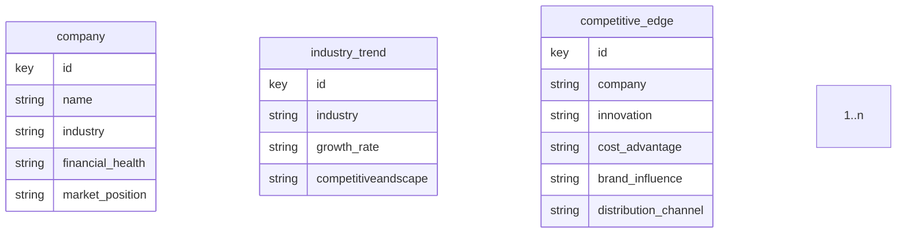
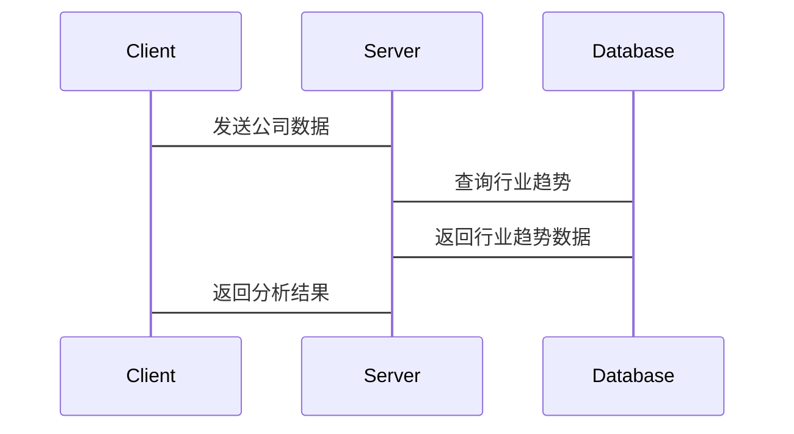

                 


# 彼得林奇的"未来增长潜力"分析法

> 关键词：彼得林奇，投资分析，增长潜力，SWOT分析，数学模型，系统架构

> 摘要：本文深入探讨了彼得·林奇的“未来增长潜力”分析法，分析了其核心概念、算法原理、数学模型以及系统架构。通过实际案例分析，展示了如何应用这些方法进行投资决策。文章最后总结了最佳实践和注意事项，为投资者提供了实用的指导。

---

# 第一部分：引言

## 第1章：彼得林奇及其投资理念概述

### 1.1 彼得林奇的背景与成就

#### 1.1.1 彼得林奇的生平简介
彼得·林奇（Peter Lynch）是美国著名的职业棒球运动员和投资家。他以其在棒球界和投资界的双重成就闻名。在棒球界，他被认为是历史上最伟大的投手之一，曾效力于红袜队和扬基队等球队。在投资界，他以其精准的市场分析和投资策略闻名，尤其擅长通过分析公司的基本面和市场趋势来预测其未来增长潜力。

#### 1.1.2 彼得林奇的投资哲学
彼得林奇的投资哲学强调长期增长和价值投资。他认为，成功的投资不仅仅依赖于市场的短期波动，而是需要深入分析公司的基本面、行业趋势和竞争优势。他主张投资者应关注公司的财务状况、管理团队、市场地位以及创新能力等因素，以确定其未来增长潜力。

#### 1.1.3 彼得林奇在投资界的地位
作为一位传奇人物，彼得林奇在投资界享有极高的声誉。他的投资策略和分析方法被广泛应用于学术研究和实际投资中，成为许多投资者的学习典范。他的分析法不仅帮助投资者在市场中获得超额收益，还为投资理论的发展做出了重要贡献。

### 1.2 未来增长潜力分析法的背景

#### 1.2.1 投资分析方法的演变
投资分析方法经历了从简单到复杂的演变过程。早期的方法主要依赖于市场趋势和技术分析，而随着市场的不断发展，投资者开始关注公司的基本面和长期增长潜力。彼得林奇的分析法正是在这一背景下应运而生，成为现代投资分析的重要组成部分。

#### 1.2.2 彼得林奇分析法的核心思想
彼得林奇的分析法强调对公司未来增长潜力的深入挖掘。他认为，只有通过全面分析公司的财务状况、行业地位和竞争优势，才能准确预测其未来的增长潜力。这种方法不仅考虑了公司的当前表现，还关注其未来的可持续发展能力。

#### 1.2.3 未来增长潜力分析法的现实意义
在当前竞争激烈的市场环境中，未来增长潜力分析法具有重要的现实意义。它帮助投资者在众多公司中筛选出具有长期增长潜力的企业，从而在投资中获得更高的回报。此外，该方法还可应用于企业的战略规划和风险管理，为企业提供科学的决策依据。

### 1.3 本书的目的与结构

#### 1.3.1 本书的核心目标
本书旨在深入探讨彼得林奇的“未来增长潜力”分析法，帮助读者掌握其核心概念、算法原理和实际应用。通过理论分析和案例研究，读者将能够准确评估公司的未来增长潜力，做出明智的投资决策。

#### 1.3.2 目录结构概述
本书分为七个主要部分：引言、核心概念、算法原理、数学模型、系统架构、项目实战和最佳实践。每一部分都详细讲解了相关的内容，确保读者能够全面理解并掌握分析方法。

#### 1.3.3 预备知识与读者对象
本书适合对投资分析感兴趣的投资新手和专业投资者阅读。读者应具备基本的财务知识和投资分析基础，以便更好地理解和应用本书的内容。

---

## 第2章：未来增长潜力分析法的核心概念

### 2.1 未来增长潜力的定义与特征

#### 2.1.1 什么是未来增长潜力
未来增长潜力是指公司在未来一段时间内实现收入和利润增长的能力。它不仅取决于公司的当前表现，还受到行业趋势、市场需求和竞争优势等因素的影响。

#### 2.1.2 增长潜力的核心要素
未来增长潜力的核心要素包括公司基本面、行业趋势、竞争优势、管理团队和市场地位等。这些要素共同决定了公司的未来增长能力。

#### 2.1.3 增长潜力的衡量标准
衡量增长潜力的标准包括收入增长率、净利润增长率、市场份额、研发投入和创新能力等。这些指标能够帮助投资者全面评估公司的增长潜力。

### 2.2 彼得林奇分析法的关键要素

#### 2.2.1 公司基本面分析
公司基本面分析是评估未来增长潜力的重要步骤。它包括对公司财务状况、盈利能力、资产负债情况和现金流的分析。通过这些分析，投资者可以了解公司的财务健康状况，判断其是否具备长期增长的潜力。

#### 2.2.2 行业趋势分析
行业趋势分析是评估未来增长潜力的另一个关键要素。投资者需要了解所在行业的市场规模、增长速度、竞争格局和未来发展趋势。通过分析行业趋势，投资者可以判断公司所处的行业环境，从而做出更明智的投资决策。

#### 2.2.3 竞争优势分析
竞争优势分析是评估公司未来增长潜力的重要组成部分。公司是否具备独特的竞争优势，如技术创新、成本优势、品牌影响力和渠道优势等，将直接影响其未来的增长能力。通过分析公司的竞争优势，投资者可以判断其在行业中的地位和未来发展潜力。

### 2.3 增长潜力分析的边界与外延

#### 2.3.1 分析的边界条件
在进行未来增长潜力分析时，需要考虑一些边界条件，如市场的周期性波动、政策变化、全球经济环境和突发事件等。这些因素可能会影响公司的未来增长潜力，因此在分析时需要充分考虑这些不确定性。

#### 2.3.2 分析的适用范围
未来增长潜力分析法适用于各种类型的公司和行业。无论是科技、金融、制造业还是服务业，都可以通过这种方法评估公司的增长潜力。然而，不同行业的分析重点可能有所不同，投资者需要根据具体情况调整分析方法。

#### 2.3.3 分析的局限性
尽管未来增长潜力分析法具有重要的应用价值，但它也存在一定的局限性。例如，分析结果可能受到数据质量和模型假设的影响，难以准确预测未来的市场变化。此外，分析过程中需要依赖大量的假设和判断，可能会导致结果的偏差。

### 2.4 核心概念之间的关系

#### 2.4.1 核心概念的属性对比表格
以下是未来增长潜力分析法中的核心概念及其属性对比表：

| 核心概念       | 定义与特征                                                                 |
|----------------|--------------------------------------------------------------------------|
| 公司基本面     | 公司的财务状况、盈利能力、资产负债情况和现金流等。                     |
| 行业趋势       | 行业的市场规模、增长速度、竞争格局和未来发展趋势。                     |
| 竞争优势       | 公司在技术创新、成本优势、品牌影响力和渠道优势等方面的竞争优势。         |
| 管理团队       | 公司的管理团队的能力、经验和战略决策能力。                             |
| 市场地位       | 公司在市场中的占有率、品牌影响力和客户忠诚度等。                         |

#### 2.4.2 ER实体关系图架构
以下是未来增长潜力分析法中的核心概念的ER实体关系图：



---

## 第3章：未来增长潜力分析法的算法原理

### 3.1 分析法的步骤与流程

#### 3.1.1 数据收集与初步筛选
首先，投资者需要收集与目标公司相关的各种数据，包括财务报表、行业报告、市场分析和公司公告等。然后，根据公司基本面、行业趋势和竞争优势等指标进行初步筛选，排除不符合条件的公司。

#### 3.1.2 关键指标的计算与评估
接下来，投资者需要计算一些关键指标，如收入增长率、净利润增长率、市场份额和研发投入等。这些指标能够帮助投资者更准确地评估公司的增长潜力。

#### 3.1.3 公司基本面分析
公司基本面分析是评估未来增长潜力的重要步骤。投资者需要分析公司的财务状况、盈利能力、资产负债情况和现金流等。通过这些分析，投资者可以了解公司的财务健康状况，判断其是否具备长期增长的潜力。

#### 3.1.4 行业趋势分析
行业趋势分析是评估未来增长潜力的另一个关键步骤。投资者需要了解所在行业的市场规模、增长速度、竞争格局和未来发展趋势。通过分析行业趋势，投资者可以判断公司所处的行业环境，从而做出更明智的投资决策。

#### 3.1.5 竞争优势分析
竞争优势分析是评估公司未来增长潜力的重要组成部分。投资者需要分析公司在技术创新、成本优势、品牌影响力和渠道优势等方面的竞争优势。通过分析公司的竞争优势，投资者可以判断其在行业中的地位和未来发展潜力。

#### 3.1.6 综合评估与决策
最后，投资者需要综合考虑以上各种因素，对目标公司的未来增长潜力进行综合评估，并做出投资决策。

### 3.2 算法的数学模型与公式

#### 3.2.1 收入增长率预测模型
收入增长率预测模型可以帮助投资者预测公司未来的收入增长情况。模型如下：

$$
\text{收入增长率} = \frac{\text{未来收入} - \text{当前收入}}{\text{当前收入}} \times 100\%
$$

#### 3.2.2 净利润增长率预测模型
净利润增长率预测模型可以帮助投资者预测公司未来的净利润增长情况。模型如下：

$$
\text{净利润增长率} = \frac{\text{未来净利润} - \text{当前净利润}}{\text{当前净利润}} \times 100\%
$$

#### 3.2.3 市场份额预测模型
市场份额预测模型可以帮助投资者预测公司在未来市场中的份额。模型如下：

$$
\text{市场份额} = \frac{\text{公司收入}}{\text{行业总收入}} \times 100\%
$$

### 3.3 算法的实现与优化

#### 3.3.1 数据预处理与清洗
在进行分析之前，投资者需要对收集到的数据进行预处理和清洗，确保数据的准确性和完整性。这包括去除重复数据、处理缺失值和异常值等。

#### 3.3.2 数据可视化与分析
通过数据可视化工具，投资者可以更直观地分析公司的基本面、行业趋势和竞争优势。常见的数据可视化方法包括柱状图、折线图和饼图等。

#### 3.3.3 算法优化与调参
为了提高分析的准确性，投资者可以对算法进行优化和调参。例如，可以尝试不同的预测模型和参数组合，找到最适合目标公司的分析方法。

### 3.4 算法的验证与测试

#### 3.4.1 回测分析
通过回测分析，投资者可以验证分析模型的准确性和有效性。回测分析是指使用历史数据对模型进行测试，评估其在不同市场环境下的表现。

#### 3.4.2 模型的稳定性测试
为了确保模型的稳定性，投资者需要进行模型的稳定性测试。这包括测试模型在不同市场环境和经济周期下的表现，评估其抗风险能力和适应性。

#### 3.4.3 模型的可解释性分析
模型的可解释性是投资者在选择分析方法时的重要考虑因素。投资者需要确保所选择的模型不仅准确，而且易于理解和解释，以便在实际投资中进行调整和优化。

---

## 第4章：未来增长潜力分析法的数学模型

### 4.1 预测模型的建立

#### 4.1.1 线性回归模型
线性回归模型是一种常用的预测模型。通过分析公司的历史数据，投资者可以建立一个线性回归模型，预测公司未来的收入和利润增长情况。模型如下：

$$
y = a + bx + \epsilon
$$

其中，\( y \) 是目标变量（如收入增长率），\( x \) 是自变量（如研发投入），\( a \) 是截距，\( b \) 是回归系数，\( \epsilon \) 是误差项。

#### 4.1.2 时间序列分析模型
时间序列分析模型是一种基于时间数据的预测模型。投资者可以使用ARIMA（自回归积分滑动平均）模型来预测公司未来的收入和利润增长情况。模型如下：

$$
\phi(B)(1 - B)Z_t = \theta(B)\epsilon_t
$$

其中，\( Z_t \) 是经过差分的序列，\( \phi(B) \) 和 \( \theta(B) \) 分别是自回归和滑动平均多项式。

### 4.2 预测模型的验证

#### 4.2.1 模型的拟合优度
模型的拟合优度是衡量模型预测能力的重要指标。投资者可以通过R平方值来评估模型的拟合优度。R平方值越接近1，模型的拟合效果越好。

#### 4.2.2 模型的预测误差
模型的预测误差是评估模型准确性的另一个重要指标。投资者可以通过均方误差（MSE）、平均绝对误差（MAE）和平均绝对百分比误差（MAPE）等指标来评估模型的预测误差。

#### 4.2.3 模型的稳定性测试
为了确保模型的稳定性，投资者需要进行模型的稳定性测试。这包括测试模型在不同市场环境和经济周期下的表现，评估其抗风险能力和适应性。

### 4.3 模型的优化与调参

#### 4.3.1 参数优化
通过参数优化，投资者可以提高模型的预测精度。例如，可以尝试不同的回归系数和多项式次数，找到最适合目标公司的模型。

#### 4.3.2 模型的集成
模型的集成是提高预测精度的有效方法。投资者可以将多个模型的结果进行集成，如使用投票法或加权平均法，得到更准确的预测结果。

#### 4.3.3 模型的解释性分析
模型的可解释性是投资者在选择分析方法时的重要考虑因素。投资者需要确保所选择的模型不仅准确，而且易于理解和解释，以便在实际投资中进行调整和优化。

---

## 第5章：未来增长潜力分析法的系统架构

### 5.1 系统设计概述

#### 5.1.1 问题场景介绍
在实际投资中，投资者需要面对大量复杂的分析任务。为了提高分析效率和准确性，投资者可以开发一个基于彼得林奇分析法的系统，帮助其快速评估公司的未来增长潜力。

#### 5.1.2 系统功能设计
系统功能设计包括数据采集、数据处理、模型预测和结果展示等模块。通过这些模块的协同工作，投资者可以高效地完成未来增长潜力分析任务。

### 5.2 领域模型设计

#### 5.2.1 领域模型的Mermaid类图
以下是未来增长潜力分析法的领域模型类图：

```mermaid
classDiagram
    class Company {
        id : Integer
        name : String
        industry : String
        financial_health : String
        market_position : String
    }
    class Industry_Trend {
        id : Integer
        industry : String
        growth_rate : Float
        competitive Landscape : String
    }
    class Competitive_Edge {
        id : Integer
        company : String
        innovation : String
        cost_advantage : String
        brand_influence : String
        distribution_channel : String
    }
    Company "1..n" Competitive_Edge
    Company "1..n" Industry_Trend
```

### 5.3 系统架构设计

#### 5.3.1 系统架构的Mermaid架构图
以下是未来增长潜力分析法的系统架构图：


### 5.4 系统接口设计

#### 5.4.1 系统接口描述
系统接口设计包括数据输入接口、模型预测接口和结果展示接口。通过这些接口，投资者可以与系统进行交互，完成分析任务。

#### 5.4.2 接口的交互流程
以下是接口的交互流程图：



### 5.5 系统的实现与优化

#### 5.5.1 系统的实现细节
系统的实现细节包括数据采集、数据处理、模型预测和结果展示等部分。投资者需要根据具体需求选择合适的技术和工具，如使用Python进行数据分析，使用Flask或Django进行Web开发。

#### 5.5.2 系统的优化建议
为了提高系统的性能和用户体验，投资者可以考虑以下优化措施：
- 数据预处理与清洗：确保数据的准确性和完整性。
- 模型优化与调参：提高模型的预测精度。
- 系统界面优化：提升用户体验。

---

## 第6章：项目实战

### 6.1 项目环境的安装与配置

#### 6.1.1 开发环境的安装
为了进行未来增长潜力分析，投资者需要安装必要的开发环境，如Python、Jupyter Notebook、Pandas、NumPy、Matplotlib和Scikit-learn等。

#### 6.1.2 数据源的获取
投资者需要获取目标公司的相关数据，如财务报表、行业报告和市场分析等。这些数据可以从公司官网、金融数据平台或政府公告等渠道获取。

### 6.2 项目核心代码的实现

#### 6.2.1 数据预处理与清洗
以下是数据预处理与清洗的代码示例：

```python
import pandas as pd
import numpy as np

# 读取数据
data = pd.read_csv('company_data.csv')

# 处理缺失值
data = data.dropna()

# 处理异常值
data = data[(data['收入增长率'] <= 100) & (data['收入增长率'] >= -100)]
```

#### 6.2.2 模型预测与分析
以下是模型预测与分析的代码示例：

```python
from sklearn.linear_model import LinearRegression
import matplotlib.pyplot as plt

# 建立线性回归模型
model = LinearRegression()

# 拟合模型
model.fit(data[['研发投入']], data['收入增长率'])

# 预测未来收入增长率
future_revenue_growth = model.predict(future_r

