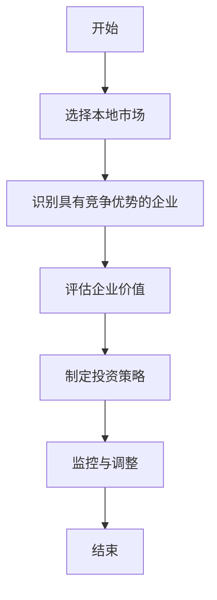
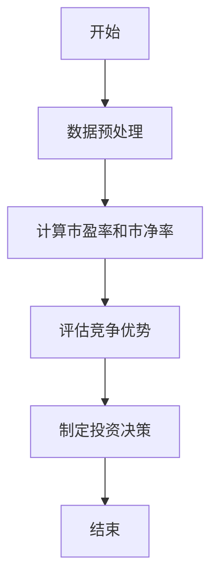

                 


# 彼得林奇的"本地优势"投资理念

## 关键词：彼得林奇，本地优势，投资理念，价值评估，竞争优势，数学模型

## 摘要：本文深入分析了彼得·林奇的“本地优势”投资理念，探讨了其核心概念、数学模型、系统架构及实际应用。通过详细讲解本地优势的定义、优势、应用场景，以及如何通过数学模型和算法实现本地优势投资，本文为读者提供了从理论到实践的全面指导。最后，结合实际案例，总结了本地优势投资的最佳实践和注意事项。

---

## 第一部分：背景介绍

### 第1章：彼得林奇与“本地优势”概述

#### 1.1 彼得林奇的背景与投资风格
彼得·林奇是全球最著名的职业股票投资者之一，被誉为“共同基金之父”。他管理的麦哲伦基金在20世纪80年代至90年代的表现尤为出色，年均回报率超过29%。林奇的投资哲学强调深入研究和理解投资对象，尤其是关注自己熟悉的本地市场。

#### 1.2 “本地优势”投资理念的定义
“本地优势”是指投资者通过专注于本地市场，利用对本地经济、文化和市场的深刻理解，寻找具有竞争优势的企业进行投资。这种策略的优势在于，投资者能够更准确地评估企业的内在价值，并捕捉到本地市场中的独特机会。

#### 1.3 本地优势投资的适用场景
- 当地市场存在独特竞争优势的企业。
- 投资者对本地市场有深入了解。
- 全球化投资难以覆盖的细分市场。

---

## 第二部分：本地优势投资的核心概念与原理

### 第2章：本地优势的核心概念与原理

#### 2.1 本地优势的核心概念
- **本地市场的竞争优势**：本地企业可能在特定领域（如供应链、成本控制、客户关系）具有独特优势。
- **本地企业与全球企业的对比**：本地企业可能更灵活，能够快速响应市场变化。
- **本地优势的长期价值**：本地市场中的企业可能在长期发展中更具稳定性。

#### 2.2 本地优势的数学模型与公式
- **企业价值评估模型**：
  $$ V = \frac{E}{k - g} $$
  其中，\( E \) 是企业的预期收益，\( k \) 是折现率，\( g \) 是收益增长率。
- **市盈率与市净率的比较**：
  - 市盈率（P/E）= 股价 / 每股收益
  - 市净率（P/B）= 股价 / 每股净资产
  通过对比这两个指标，可以评估企业的估值是否合理。

#### 2.3 本地优势投资的流程图


---

## 第三部分：本地优势投资的系统架构与算法

### 第3章：本地优势投资的系统架构

#### 3.1 系统架构设计
- **功能模块划分**：
  - 数据采集模块：收集本地市场的经济数据和企业信息。
  - 分析模块：评估企业的竞争优势和价值。
  - 决策模块：制定投资策略。
- **模块交互关系**：
  数据采集模块提供输入数据，分析模块处理数据并生成评估结果，决策模块基于评估结果制定投资策略。

#### 3.2 算法原理与流程图
- **本地优势评估算法**：
  1. 数据预处理：清洗和标准化数据。
  2. 竞争优势评估：计算市盈率、市净率等指标。
  3. 投资决策：根据评估结果决定是否投资。



---

## 第四部分：本地优势投资的项目实战

### 第5章：本地优势投资的项目实战

#### 5.1 项目环境与工具安装
- **工具选择**：使用Python的Pandas和Matplotlib进行数据分析和可视化。
- **数据源**：从本地交易所获取企业财务数据。

#### 5.2 核心算法实现
```python
import pandas as pd
import matplotlib.pyplot as plt

# 示例数据：本地企业的市盈率和市净率
data = {
    '公司': ['A', 'B', 'C'],
    '市盈率': [15, 20, 25],
    '市净率': [1.5, 2.0, 2.5]
}
df = pd.DataFrame(data)

# 可视化
plt.figure(figsize=(10, 6))
plt.plot(df['市盈率'], label='市盈率')
plt.plot(df['市净率'], label='市净率')
plt.legend()
plt.title('本地企业估值分析')
plt.show()
```

#### 5.3 实际案例分析
以某本地企业为例，分析其市盈率和市净率，评估其投资价值。通过数据可视化，发现该企业在本地市场中具有较低的市盈率和市净率，表明其估值较低，具有投资潜力。

---

## 第五部分：本地优势投资的最佳实践与总结

### 第6章：本地优势投资的最佳实践

#### 6.1 成功案例分析
- **案例背景**：某本地制造企业在本地供应链和成本控制方面具有显著优势。
- **投资决策**：通过分析市盈率和市净率，发现该企业估值低于行业平均水平，具有投资价值。

#### 6.2 投资策略的优化与调整
- 定期重新评估本地市场的变化。
- 根据经济环境调整投资策略。

---

## 结语

彼得·林奇的“本地优势”投资理念强调深入理解本地市场，寻找具有竞争优势的企业进行投资。通过数学模型和系统架构的分析，投资者可以更科学地评估企业价值，制定有效的投资策略。本文通过理论分析和实际案例，为读者提供了从理论到实践的全面指导。

---

## 作者：AI天才研究院 & 禅与计算机程序设计艺术

