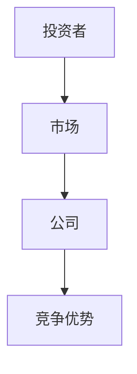
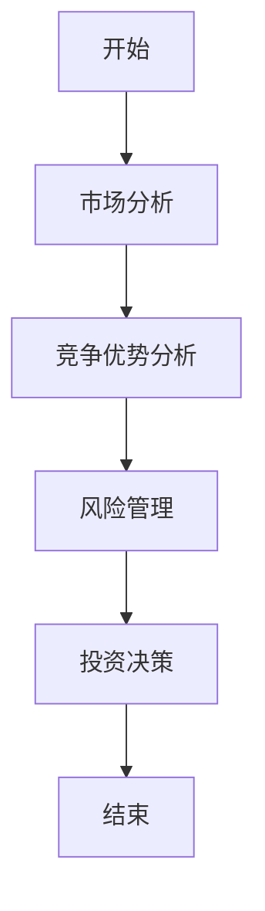
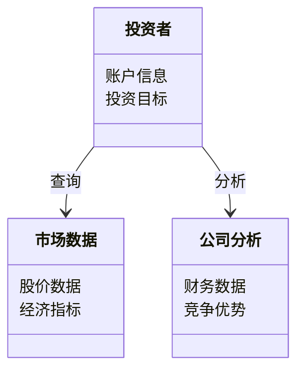

                 


# 彼得林奇的"本地化"投资理念

> 关键词：本地化投资，彼得林奇，投资策略，市场分析，竞争优势

> 摘要：本文详细探讨了彼得林奇的本地化投资理念，分析了其核心概念、算法原理、系统架构以及实际案例。通过技术方法，深入剖析了本地化投资的策略、优势与应用，为投资者提供实用的指导和建议。

---

## 第一部分: 本地化投资的背景与定义

### 第1章: 本地化投资的背景

#### 1.1 本地化投资的定义
本地化投资是指投资者在特定区域内，基于对当地市场环境、经济特征和竞争优势的深入分析，进行资产配置和投资决策的一种策略。与全球化投资相比，本地化投资更加注重区域市场的独特性。

#### 1.2 本地化投资的发展历史
本地化投资理念起源于20世纪70年代，随着全球经济一体化的深入，投资者开始意识到不同地区市场的差异性，从而逐渐形成了本地化投资的理论基础。

#### 1.3 本地化投资与全球化投资的对比
本地化投资强调区域市场的独特性，而全球化投资则注重跨国市场的协同性。两者在资产配置、风险管理和收益预期上存在显著差异。

### 第2章: 彼得林奇的本地化投资理念

#### 2.1 彼得林奇的背景与投资风格
彼得·林奇是美国著名投资家，以其对美国市场的深入研究和独特见解而闻名。他的投资理念注重长期价值，强调对公司基本面的分析。

#### 2.2 本地化投资的核心理念
彼得林奇认为，投资者应深入研究本地市场，关注公司的竞争优势和成长潜力，而非盲目追求全球化投资的短期收益。

---

## 第二部分: 本地化投资的核心概念与联系

### 第3章: 核心概念与联系

#### 3.1 本地化投资的核心要素
- **市场分析**：研究区域经济趋势、政策变化和行业动态。
- **竞争优势**：识别公司在本地市场的核心竞争力。
- **风险管理**：评估本地市场的独特风险，并制定应对策略。

#### 3.2 本地化与全球化的对比表格
| 特性             | 本地化投资           | 全球化投资           |
|------------------|--------------------|--------------------|
| 市场范围         | 本地市场           | 全球市场           |
| 风险管理         | 更注重区域风险      | 更注重全球风险      |
| 投资策略         | 基于本地竞争优势    | 基于全球配置        |

#### 3.3 实体关系图


---

## 第三部分: 本地化投资的算法原理

### 第4章: 算法原理

#### 4.1 投资决策算法


#### 4.2 Python代码示例
```python
def calculate_pe_ratio(ticker):
    import yfinance as yf
    data = yf.download(ticker, period='max')
    pe_ratio = data['Close'][-1] / data['Earnings Per Share'][-1]
    return pe_ratio

print(calculate_pe_ratio('AAPL'))
```

---

## 第四部分: 数学模型与公式

### 第5章: 数学模型

#### 5.1 PE比率公式
$$ PE = \frac{股价}{每股收益} $$

#### 5.2 净资产收益率（ROE）公式
$$ ROE = \frac{净利润}{净资产} $$

---

## 第五部分: 系统分析与架构设计

### 第6章: 系统分析

#### 6.1 问题场景
本地化投资系统需要解决如何基于区域市场数据，为投资者提供有效的投资建议。

#### 6.2 系统功能设计


---

## 第六部分: 项目实战

### 第7章: 项目实战

#### 7.1 环境配置
安装必要的Python库，如`yfinance`和`mermaid`。

#### 7.2 核心代码实现
```python
import yfinance as yf

def analyze_local_markets(countries):
    for country in countries:
        data = yf.download(country, period='max')
        print(f"{country}: {data['Close'][-1]}")
```

#### 7.3 案例分析
以美国和中国为例，分析本地化投资的策略和收益。

---

## 第七部分: 最佳实践与小结

### 第8章: 最佳实践

#### 8.1 小结
本地化投资强调对区域市场的深入理解，结合基本面分析和风险管理，能够有效提升投资收益。

#### 8.2 投资建议
- 深入研究本地市场
- 识别竞争优势
- 有效管理区域风险

#### 8.3 注意事项
- 避免过度集中
- 定期调整策略
- 保持长期视角

#### 8.4 拓展阅读
推荐书籍和资源，帮助读者进一步学习本地化投资的相关知识。

---

# 作者：AI天才研究院/AI Genius Institute & 禅与计算机程序设计艺术 /Zen And The Art of Computer Programming

