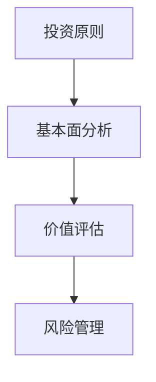

                 


# 彼得林奇的"知道你在买什么"原则

## 关键词：彼得林奇，价值投资，风险管理，基本面分析，投资策略，投资原则

## 摘要：  
彼得林奇是全球著名投资专家，他提出的"知道你在买什么"原则是价值投资的核心理念之一。本文从背景介绍、核心概念、算法原理、数学模型、系统架构、项目实战等多角度，详细阐述了彼得林奇的投资原则，帮助投资者理解和应用这一原则。

---

## 第一部分：背景介绍

### 第1章：彼得林奇原则概述

#### 1.1 问题背景  
在投资市场中，投资者常常面临信息过载和决策复杂性的问题。许多投资者在做出投资决策时，往往依赖短期市场波动或道听途说的信息，而忽视了对投资标的基本面的深入分析。这种决策方式容易导致投资损失，尤其是在市场波动加剧的情况下。

#### 1.2 问题描述  
彼得林奇指出，许多投资者在购买股票时，并不清楚自己到底在买什么。他们可能只关注股价的短期波动，而没有真正了解公司的财务状况、行业地位和发展前景。这种"盲目投资"的行为往往会导致长期亏损。

#### 1.3 问题解决  
彼得林奇提出的"知道你在买什么"原则，强调投资者在购买任何资产之前，必须对标的的基本面进行深入分析。这包括对公司财务状况、行业竞争地位、管理团队、盈利能力以及未来发展前景的全面了解。只有在充分了解的基础上，投资者才能做出明智的投资决策。

#### 1.4 边界与外延  
彼得林奇原则的适用范围主要集中在长期价值投资领域，特别适用于股票投资。然而，这一原则的核心思想——深入分析和理解投资标的价值——也可以扩展到其他类型的投资，如房地产、债券和其他金融资产。需要注意的是，这一原则并不适用于短期交易或基于市场情绪的投资决策。

#### 1.5 概念结构与核心要素  
彼得林奇原则的核心要素包括：  
1. **基本面分析**：通过对公司的财务报表、行业地位、管理团队等进行分析，评估其内在价值。  
2. **价值评估**：比较标的的内在价值与其市场价格，判断是否存在投资机会。  
3. **风险管理**：通过分散投资、设定止损点等方法，降低投资风险。  

---

## 第二部分：核心概念与联系

### 第2章：彼得林奇原则的核心要素

#### 2.1 核心概念解析  
彼得林奇原则的核心在于"知道你在买什么"。这不仅仅是对标的的表面了解，而是对标的的内在价值的深入挖掘。投资者需要通过基本面分析，评估标的的长期盈利能力、财务健康状况以及市场地位。  

#### 2.2 核心概念的联系  
彼得林奇原则与其他投资策略有显著区别。例如：  
- **价值投资**：与趋势投资不同，价值投资注重标的的内在价值，而非市场趋势。  
- **基本面分析**：与技术分析不同，基本面分析注重公司的财务数据和行业地位，而非价格走势和技术指标。  

#### 2.3 概念属性特征对比  
以下是彼得林奇原则与其他投资策略的核心特征对比：

| 比较维度             | 彼得林奇原则       | 其他投资策略（如技术分析） |
|----------------------|--------------------|-----------------------------|
| 投资理念             | 价值投资          | 短期趋势驱动               |
| 分析方法             | 基础面分析        | 技术指标分析               |
| 投资目标             | 长期价值增长       | 短期价格波动               |
| 风险管理             | 分散投资、价值偏离 | 价格形态、成交量分析       |

#### 2.4 ER实体关系图  


---

## 第三部分：算法原理讲解

### 第3章：基本面分析的数学模型

#### 3.1 现金流折现法  
现金流折现法是基本面分析的核心方法之一。其基本原理是将未来的现金流折现，以评估标的的内在价值。公式如下：  

$$ \text{内在价值} = \sum_{t=1}^{n} \frac{\text{现金流}_t}{(1 + r)^t} $$  

其中，\( r \) 是折现率，\( n \) 是预测的年数。  

#### 3.2 市盈率与市净率分析  
市盈率（P/E）和市净率（P/B）是常用的估值指标：  

- **市盈率**：$$ \text{市盈率} = \frac{\text{股价}}{\text{每股收益}} $$
- **市净率**：$$ \text{市净率} = \frac{\text{股价}}{\text{每股净资产}} $$  

#### 3.3 财务指标综合评估  
综合评估指标包括：  
- 营业收入增长率  
- 净利润率  
- 资产负债率  

---

## 第四部分：数学模型

### 第4章：彼得林奇原则的数学模型

#### 4.1 内在价值计算  
内在价值的计算公式：  

$$ \text{内在价值} = \frac{\text{净利润} \times (1 + g)}{r - g} $$  

其中，\( g \) 是净利润增长率，\( r \) 是折现率。  

#### 4.2 价值评估指标  
价值评估指标包括：  
- 市盈率低于行业平均水平  
- 市净率低于行业平均水平  
- 股息率合理  

---

## 第五部分：系统分析与架构设计方案

### 第5章：系统架构设计

#### 5.1 项目介绍  
我们设计一个基于彼得林奇原则的投资分析系统，帮助投资者快速评估标的的价值。  

#### 5.2 系统功能设计  
- 用户输入：公司财务数据、行业数据  
- 系统输出：内在价值、估值指标、投资建议  

#### 5.3 系统架构设计  


---

## 第六部分：项目实战

### 第6章：项目实战

#### 6.1 环境安装  
安装Python和相关库：  
```bash
pip install pandas numpy matplotlib
```

#### 6.2 核心代码实现  
```python
import pandas as pd
import numpy as np

def calculate_intrinsic_value(net_profit, growth_rate, discount_rate):
    return net_profit * (1 + growth_rate) / (discount_rate - growth_rate)

# 示例数据
net_profit = 100
growth_rate = 0.1
discount_rate = 0.12

iv = calculate_intrinsic_value(net_profit, growth_rate, discount_rate)
print(f"内在价值：{iv}")
```

#### 6.3 案例分析  
以某公司为例，计算其内在价值，并与市场价格进行对比，判断是否存在投资机会。

---

## 第七部分：最佳实践

### 第7章：最佳实践

#### 7.1 投资者小结  
彼得林奇原则的核心在于深入分析标的的基本面，避免盲目投资。投资者应始终坚持长期价值投资的理念，避免被短期市场波动所迷惑。

#### 7.2 注意事项  
- **分散投资**：避免过度集中  
- **持续学习**：市场环境不断变化  
- **风险管理**：设定止损点  

#### 7.3 拓展阅读  
推荐书籍：  
- 《彼得·林奇的投资哲学》  
- 《价值投资入门》  

---

## 作者：AI天才研究院 & 禅与计算机程序设计艺术

