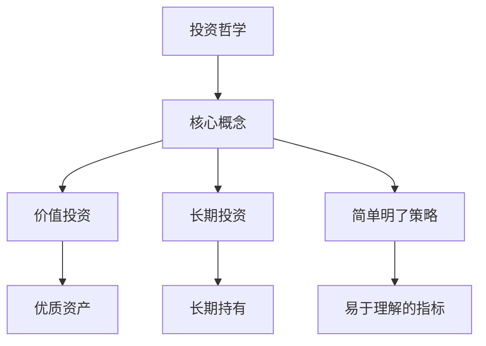
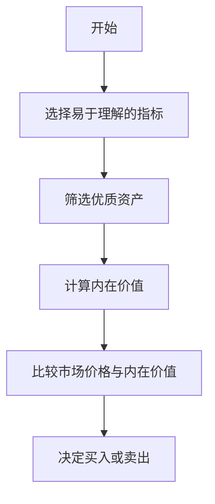
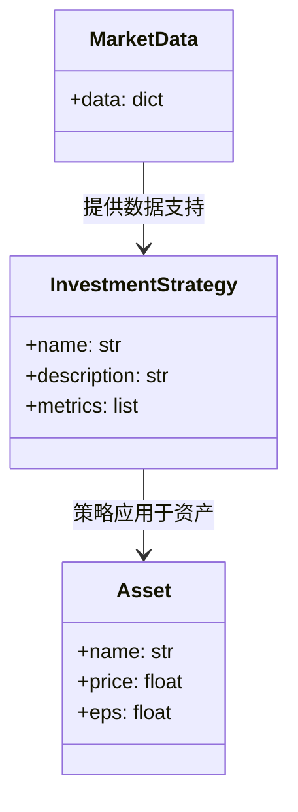
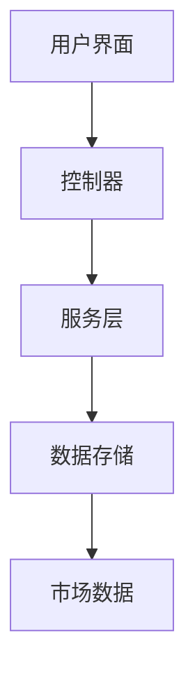

                 


# 彼得林奇的"简单明了"投资哲学

## 关键词
- 彼得·林奇
- 投资哲学
- 价值投资
- 简单明了
- 投资策略
- 投资系统
- 最佳实践

## 摘要
本文深入探讨了彼得·林奇的"简单明了"投资哲学，从其核心概念、算法原理到系统架构设计，再到项目实战，详细阐述了如何在技术领域应用这一投资策略。文章结构清晰，内容丰富，结合图表和代码示例，帮助读者全面理解和应用这一投资哲学。

---

## 第一部分: 投资哲学的背景与基础

### 第1章: 投资的基本概念与背景介绍

#### 1.1 投资的基本概念
- **1.1.1 什么是投资**  
  投资是指将资金投入到某个项目或资产中，以期望在未来获得收益或资本增值。投资的本质是通过资源配置实现财富增长。

- **1.1.2 投资的基本类型**  
  投资可以分为股票、债券、房地产、基金等多种类型，每种类型都有其独特的风险和收益特征。

- **1.1.3 投资的目标与意义**  
  投资的目标是实现财富增值，意义在于通过合理的资产配置和风险管理，实现长期稳定的收益。

#### 1.2 彼得·林奇与"简单明了"投资哲学的背景
- **1.2.1 彼得·林奇的生平简介**  
  彼得·林奇是美国著名投资家，以其独特的投资哲学闻名。他强调长期投资、价值投资和简单明了的策略。

- **1.2.2 "简单明了"投资哲学的提出背景**  
  在复杂多变的市场环境中，彼得·林奇提出了一种基于基本面分析和长期持有的投资策略，强调选择优质资产并长期持有。

- **1.2.3 投资哲学的核心要素与外延**  
  彼得·林奇的投资哲学包括价值投资、长期投资和简单明了的策略，其外延涵盖资产配置、风险管理等方面。

### 第2章: 投资的核心概念与联系

#### 2.1 核心概念原理
- **2.1.1 价值投资的定义与原理**  
  价值投资是指以低于资产内在价值的价格买入优质资产。其核心在于寻找市场低估的优质企业。

- **2.1.2 长期投资的逻辑与优势**  
  长期投资通过持有优质资产，避免短期市场波动的影响，实现长期稳定的收益。

- **2.1.3 简单明了投资策略的特点**  
  简单明了策略通过易于理解的指标（如市盈率、市净率）进行投资决策，避免过度复杂化。

#### 2.2 核心概念属性特征对比表格
| 概念       | 定义与特点                           |
|------------|------------------------------------|
| 价值投资   | 以低于内在价值的价格买入优质资产   |
| 长期投资   | 长期持有优质资产，避免频繁交易       |
| 简单明了   | 通过易于理解的指标进行投资决策       |

#### 2.3 ER实体关系图


---

## 第二部分: 投资哲学的算法原理

### 第3章: 投资哲学的算法原理

#### 3.1 简单明了投资策略的算法流程


#### 3.2 投资哲学的数学模型与公式
- **市盈率计算公式**  
  市盈率 = 股价 / 每股收益（EPS）

- **内在价值计算公式**  
  内在价值 = 股息率 / 投资收益率

#### 3.3 投资哲学的Python代码实现
```python
# 计算市盈率
def calculate_pe_ratio(price, eps):
    return price / eps

# 计算内在价值
def calculate_intrinsic_value(dividend_yield, required_return):
    return dividend_yield / required_return

# 示例计算
price = 50
eps = 5
pe_ratio = calculate_pe_ratio(price, eps)
intrinsic_value = calculate_intrinsic_value(0.05, 0.1)
print(f"市盈率: {pe_ratio}\n内在价值: {intrinsic_value}")
```

---

## 第三部分: 系统分析与架构设计

### 第4章: 系统分析与架构设计方案

#### 4.1 系统功能设计
- **领域模型类图**


- **系统架构图**


---

## 第四部分: 项目实战

### 第5章: 项目实战

#### 5.1 环境安装
- 安装Python和必要的库（如pandas、numpy）

#### 5.2 核心代码实现
```python
import pandas as pd
import numpy as np

def main():
    # 示例数据
    data = {
        '资产名称': ['股票A', '股票B'],
        '价格': [100, 80],
        '每股收益': [10, 8],
    }
    df = pd.DataFrame(data)
    
    # 计算市盈率
    df['市盈率'] = df['价格'] / df['每股收益']
    
    # 筛选市盈率低于行业平均水平的资产
    industry_avg_pe = df['市盈率'].mean()
    df['是否低估'] = df['市盈率'] < industry_avg_pe
    
    print(df)

if __name__ == "__main__":
    main()
```

#### 5.3 案例分析与解读
- 分析示例数据，筛选出市盈率低于行业平均水平的资产，说明其投资价值。

---

## 第五部分: 最佳实践与总结

### 第6章: 最佳实践与总结

#### 6.1 总结
彼得·林奇的"简单明了"投资哲学强调长期持有优质资产，通过基本面分析和易于理解的指标进行投资决策。这种策略在技术领域同样适用，可以通过系统架构和算法实现。

#### 6.2 注意事项
- 避免过度复杂化指标
- 定期复盘和调整策略
- 保持长期投资的耐心

#### 6.3 小结
通过本文的分析，读者可以理解并应用彼得·林奇的投资哲学，结合技术手段实现稳健的投资收益。

---

## 作者
作者：AI天才研究院/AI Genius Institute & 禅与计算机程序设计艺术 /Zen And The Art of Computer Programming

