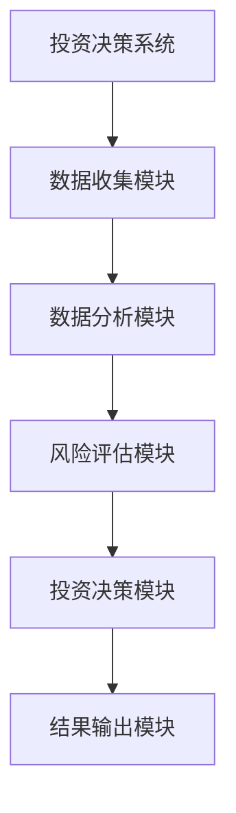

                 


# 彼得林奇的"简单明了"投资哲学解读

## 关键词：彼得林奇、投资哲学、价值投资、长期投资、风险管理、简单明了理念

## 摘要：本文深入解读彼得林奇的简单明了投资哲学，探讨其核心理念、数学模型、系统架构及实战应用，为投资者提供科学的投资指导。

---

## 正文

### 第一部分：彼得林奇投资哲学的背景介绍

#### 第1章：彼得林奇及其投资哲学概述

##### 1.1 彼得林奇的背景与成就

彼得·林奇（Peter Lynch）是投资界的一位传奇人物，曾管理富达麦哲伦基金，创造了令人瞩目的投资业绩。他的投资哲学强调基本面分析和长期持有优质资产。

##### 1.2 简单明了投资哲学的核心观点

简单明了投资理念倡导基于企业基本面的长期投资，强调避免过度复杂的投资策略，注重风险管理和长期收益。

### 第二部分：简单明了投资哲学的核心概念与联系

#### 第2章：简单明了投资哲学的核心要素

##### 2.1 价值投资的核心要素

价值投资强调分析企业的财务状况和竞争优势，寻找被市场低估的投资标的。

##### 2.2 长期投资的核心要素

长期投资通过持有优质资产，分散风险，获得稳定收益，避免短期市场波动的影响。

##### 2.3 简单明了投资理念与其他投资理念的对比

| 概念 | 定义 | 特点 | 适用场景 |
|------|------|------|----------|
| 价值投资 | 基于企业内在价值 | 强调基本面分析 | 长期投资者 |
| 长期投资 | 长期持有优质资产 | 风险低，收益稳定 | 稳健型投资者 |

### 第三部分：数学模型与算法原理

#### 第3章：投资决策中的数学模型

##### 3.1 资产配置公式

资产配置的数学模型可以表示为：

$$
\text{最优资产配置} = \sum_{i=1}^{n} w_i \times r_i
$$

其中，\( w_i \) 是资产 \( i \) 的权重，\( r_i \) 是其预期收益率。

##### 3.2 风险评估模型

风险调整后的收益可以用夏普比率衡量：

$$
\text{夏普比率} = \frac{r_p - r_f}{\sigma_p}
$$

其中，\( r_p \) 是投资组合的收益，\( r_f \) 是无风险利率，\( \sigma_p \) 是投资组合的波动性。

### 第四部分：系统架构设计

#### 第4章：投资决策系统的架构设计

##### 4.1 系统架构图



### 第五部分：项目实战

#### 第5章：基于彼得林奇理念的投资策略实现

##### 5.1 环境安装

安装必要的库：

```bash
pip install pandas numpy matplotlib
```

##### 5.2 数据收集与分析

使用Python收集并分析股票数据：

```python
import pandas as pd
import numpy as np

data = pd.read_csv('stock_data.csv')
# 计算平均收益率
average_return = np.mean(data['return'])
print(f'平均收益率为：{average_return}%')
```

##### 5.3 投资策略实现

实现价值投资策略：

```python
def value_investment(screening_data):
    # 筛选低市盈率和高ROE的股票
    selected_stocks = screening_data[
        (screening_data['PE'] < screening_data['PE'].mean()) &
        (screening_data['ROE'] > screening_data['ROE'].mean())
    ]
    return selected_stocks

selected = value_investment(data)
print(selected.head())
```

##### 5.4 结果分析

分析投资组合的收益与风险：

```python
import matplotlib.pyplot as plt

selected_returns = selected['return']
plt.hist(selected_returns, bins=10, alpha=0.5)
plt.title('投资组合收益分布')
plt.show()
```

### 第六部分：最佳实践与小结

#### 第6章：投资策略的总结与建议

##### 6.1 投资策略总结

简单明了的投资理念强调基本面分析和长期持有，通过分散投资降低风险，实现稳健收益。

##### 6.2 投资建议

- 定期审查投资组合，调整持仓。
- 保持长期视角，避免短期波动影响决策。
- 结合定量分析和定性判断，优化投资策略。

---

## 作者：AI天才研究院 & 禅与计算机程序设计艺术

