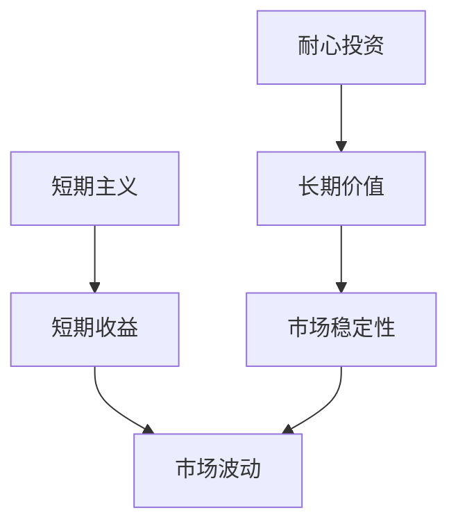
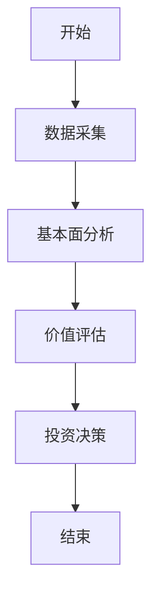
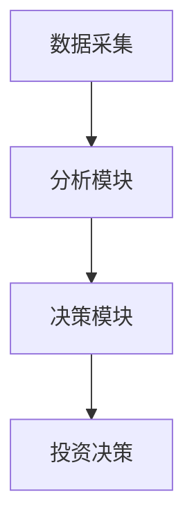

                 


# 彼得林奇的"耐心投资"在市场短期主义盛行时的价值

## 关键词：耐心投资、彼得林奇、短期主义、投资策略、价值投资

## 摘要：在当前金融市场中，短期主义盛行，投资者往往追求短期收益而忽视长期价值。本文通过分析彼得林奇的耐心投资理念，探讨其在市场波动中的稳定性与优势，为投资者提供长期价值投资的策略和方法。

---

# 第一部分: 背景介绍

## 第1章: 耐心投资与短期主义的背景

### 1.1 耐心投资的定义与核心理念
- **耐心投资**是指以长期价值为导向，专注于优质资产的投资策略。
- 核心理念包括：价值发现、长期持有、风险控制。

### 1.2 短期主义的现状与问题
- 短期主义导致市场波动加剧，忽视企业基本面。
- 投资者心理和机构考核机制推动短期行为。

### 1.3 耐心投资在当前市场中的价值
- 耐心投资能够稳定收益，抵御短期波动。
- 通过长期持有优质资产，实现财富增值。

## 第2章: 彼得林奇的投资理念与耐心投资

### 2.1 彼得林奇的投资哲学
- 价值投资的核心思想：寻找被低估的企业。
- 投资策略：分散投资、长期持有。

### 2.2 彼得林奇的成功案例分析
- 案例一：某公司投资分析，强调基本面分析的重要性。
- 案例二：另一公司投资分析，展示长期持有的效果。

## 第3章: 短期主义盛行的原因与影响

### 3.1 短期主义的驱动因素
- 市场波动加剧、投资者心理影响、机构考核机制。

### 3.2 短期主义对市场的负面影响
- 市场波动加剧、长期投资受抑、企业发展受干扰。

### 3.3 耐心投资与短期投资的对比分析
- 投资目标、投资期限、投资结果的对比。

---

# 第二部分: 核心概念与联系

## 第4章: 耐心投资的核心原理

### 4.1 耐心投资的原理
- 价值发现与长期持有、企业基本面分析、风险控制。

### 4.2 耐心投资与短期投资的对比
- 投资目标、策略、结果的对比。

## 第5章: 耐心投资的数学模型与公式

### 5.1 耐心投资的数学模型
- 价值评估模型、内在价值计算公式、股票估值公式。

### 5.2 短期投资的数学模型
- 技术分析指标、短期波动预测公式、短期收益计算公式。

## 第6章: 耐心投资与短期主义的关系图

### 6.1 关系图


---

# 第三部分: 算法原理与实战

## 第7章: 算法原理讲解

### 7.1 耐心投资的算法流程


## 第8章: 项目实战

### 8.1 环境安装
- 数据分析工具安装：Python、Pandas、Matplotlib。

### 8.2 核心实现代码
```python
import pandas as pd
import numpy as np

# 示例代码：价值评估模型
def calculate_intrinsic_value(fcf, discount_rate):
    return fcf / (1 + discount_rate)

# 示例代码：内在价值计算
cash_flow = 1000000
discount_rate = 0.1
intrinsic_value = calculate_intrinsic_value(cash_flow, discount_rate)
print(f"内在价值：{intrinsic_value}")
```

### 8.3 案例分析
- 某公司的数据分析与价值评估，展示耐心投资的实际应用。

---

# 第四部分: 系统分析与架构设计

## 第9章: 系统分析

### 9.1 系统功能设计
- 数据采集模块：收集市场数据。
- 分析模块：进行基本面分析。
- 决策模块：制定投资策略。

### 9.2 系统架构图


---

# 第五部分: 总结与拓展

## 第10章: 最佳实践与小结

### 10.1 最佳实践
- 定期评估投资组合。
- 保持耐心，避免短期波动干扰。

### 10.2 小结
- 耐心投资在短期主义盛行时的重要性。
- 通过长期持有优质资产实现稳健收益。

## 第11章: 注意事项与拓展阅读

### 11.1 注意事项
- 风险控制的重要性。
- 选择优质资产的重要性。

### 11.2 拓展阅读
- 推荐书籍：《彼得·林奇的成功投资策略》。
- 推荐文章：长期投资与短期波动的关系。

---

# 作者：AI天才研究院 & 禅与计算机程序设计艺术

