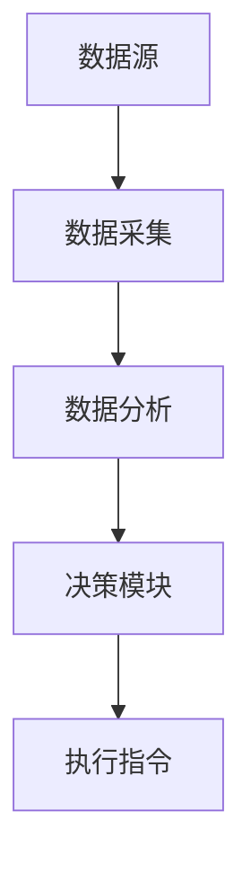

                 

# 彼得林奇的"耐心投资"在市场短期波动中的执行策略

## 关键词：耐心投资，彼得·林奇，市场波动，投资策略，风险管理

## 摘要：  
本文深入探讨了彼得·林奇的“耐心投资”策略在市场短期波动中的执行策略。通过分析林奇的投资理念、数学模型、系统架构和实战案例，结合技术语言的分析，详细解读了如何在短期波动中坚持长期投资策略，同时通过风险管理、系统设计和最佳实践来优化投资决策。本文适合投资专业人士、技术分析师以及对投资策略感兴趣的读者阅读。

---

## 第一部分：耐心投资与市场短期波动概述

### 第1章：耐心投资的核心理念

#### 1.1 耐心投资的定义与背景

耐心投资是一种长期投资策略，强调选择优质公司并长期持有，避免频繁交易。这种策略在市场短期波动中表现尤为突出，因为它避免了短期情绪化决策的负面影响。林奇的投资哲学基于以下几点：

1. **优质公司选择**：投资于基本面良好、管理层优秀、具有竞争优势的公司。
2. **长期视角**：关注企业的长期增长潜力，而非短期价格波动。
3. **价值发现**：通过深入研究找到被市场低估的投资标的。

#### 1.2 耐心投资与短期波动的关系

短期波动是市场不可避免的现象，通常由市场情绪、宏观经济变化或突发事件引发。耐心投资的核心在于通过长期持有优质资产，降低短期波动对投资组合的影响。林奇认为，短期波动是市场提供廉价买入机会的契机，而非恐慌卖出的理由。

---

### 第2章：彼得·林奇投资策略的核心要素

#### 2.1 彼得·林奇的投资理念

彼得·林奇的投资策略可以归纳为以下几点：

1. **高质量公司的选择标准**：
   - 公司具有强大的竞争优势（如专利、品牌、技术）。
   - 公司管理层具有高度的责任感和专业性。
   - 公司财务状况健康，盈利能力稳定。

2. **避免短期市场干扰的原则**：
   - 不受市场短期波动的影响，避免频繁交易。
   - 通过长期持有优质资产，实现复利效应。

3. **长期持有与价值发现的结合**：
   - 投资于具有长期增长潜力的公司。
   - 在市场恐慌时，寻找被低估的投资标的。

#### 2.2 林奇策略的数学模型

为了量化耐心投资的收益与风险，我们可以建立以下数学模型：

1. **投资组合的期望收益计算**：
   $$ E[R] = \sum p_i R_i $$
   其中，\( p_i \) 是资产 \( i \) 的权重，\( R_i \) 是资产 \( i \) 的期望收益。

2. **风险与波动的关系**：
   $$ \sigma = \sqrt{\sum p_i (R_i - E[R])^2} $$
   其中，\( \sigma \) 是投资组合的波动率。

通过以上公式，我们可以量化耐心投资的收益与风险，为投资决策提供数据支持。

---

### 第3章：短期波动中的执行策略

#### 3.1 短期波动的分类与影响

市场短期波动可以分为以下几类：

1. **市场情绪波动**：投资者情绪的变化可能导致市场短期波动。
2. **宏观经济因素**：如利率变化、经济政策等。
3. **行业-specific波动**：某些行业可能因季节性或行业特有因素出现短期波动。

#### 3.2 林奇策略的执行步骤

1. **确定投资目标**：
   - 明确投资目标（如长期收益、风险承受能力）。
   - 设定投资期限和收益目标。

2. **构建投资组合**：
   - 根据资产配置原则选择优质公司。
   - 分散投资，降低风险。

3. **制定风险管理计划**：
   - 设定止损点，避免重大损失。
   - 定期审视投资组合，调整持仓。

---

## 第二部分：系统架构与技术实现

### 第4章：林奇策略的系统架构设计

#### 4.1 系统功能模块

1. **数据采集模块**：
   - 收集市场数据（如股价、财务数据、宏观经济指标）。
   - 数据清洗与预处理。

2. **分析模块**：
   - 使用技术分析工具（如移动平均线、相对强弱指数）。
   - 量化分析模型（如回归分析、时间序列分析）。

3. **决策模块**：
   - 根据分析结果制定投资策略。
   - 输出投资建议（如买入、卖出、持有）。

#### 4.2 系统架构图

---

### 第5章：实战案例分析

#### 5.1 案例背景介绍

以某科技公司为例，假设该公司具有强大的技术优势和稳定的盈利能力，但近期因行业波动导致股价下跌。林奇策略的目标是通过长期持有该公司股票，实现长期收益。

#### 5.2 案例执行过程

1. **初始投资组合构建**：
   - 选择优质公司，设定初始持仓比例。

2. **短期波动中的调整**：
   - 面对市场波动，保持持仓，避免恐慌性卖出。

3. **投资组合监控**：
   - 定期审视投资组合，根据市场变化进行微调。

---

## 第三部分：最佳实践与小结

### 第6章：最佳实践与注意事项

1. **风险管理**：
   - 设定合理的止损点，避免重大损失。
   - 定期审视投资组合，及时调整。

2. **长期视角**：
   - 避免短期波动的干扰，坚持长期投资。
   - 关注公司基本面，选择优质资产。

3. **技术工具的应用**：
   - 利用技术分析工具辅助决策。
   - 通过量化模型优化投资策略。

### 第7章：小结

耐心投资是一种长期策略，通过选择优质公司并长期持有，避免短期波动的干扰。林奇策略的成功在于其对基本面的深入研究和长期视角的坚持。在实际操作中，投资者应结合技术分析和量化模型，优化投资决策，降低风险。

---

## 作者：AI天才研究院 & 禅与计算机程序设计艺术

感谢您的阅读！如需进一步探讨，请随时联系。

