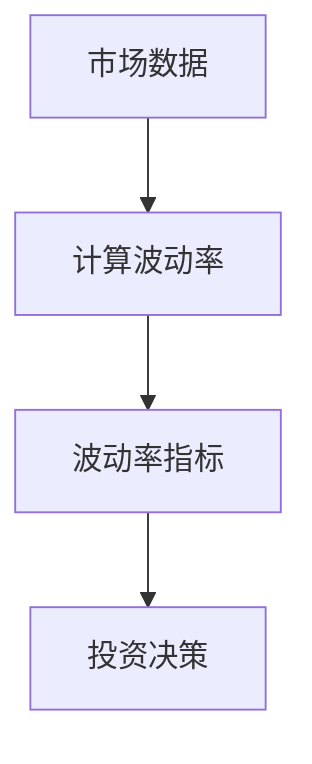
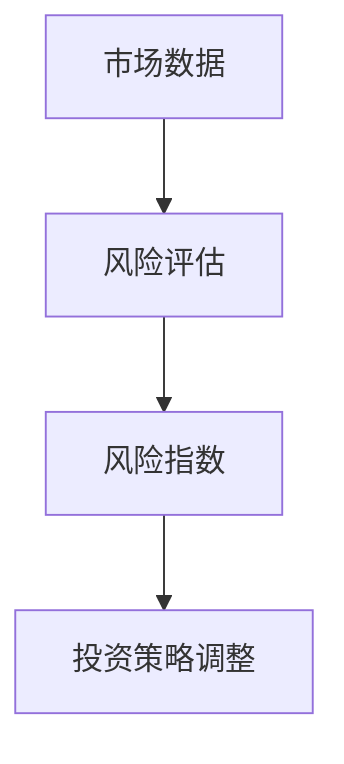
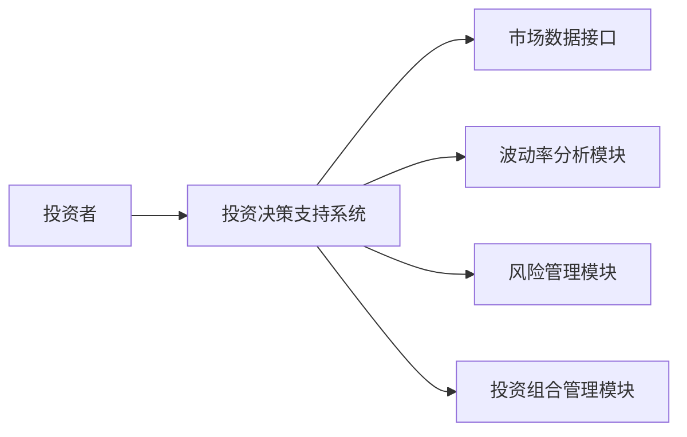

                 


# 彼得林奇的"耐心投资"在市场高波动期的执行策略优化

## 关键词：彼得林奇，耐心投资，高波动市场，投资策略，风险管理

## 摘要：本文深入分析了彼得林奇的耐心投资理念在高波动市场中的应用，探讨了如何通过优化执行策略来应对市场波动带来的挑战。文章从背景介绍、核心概念、算法原理、系统架构设计到实战案例，详细阐述了高波动市场中的投资策略优化方法，并提出了具体的实施建议。

---

# 第一部分: 背景介绍

## 第1章: 彼得林奇的"耐心投资"概述

### 1.1 投资背景与问题背景

#### 1.1.1 高波动市场的定义与特征
高波动市场是指金融市场中的价格波动剧烈，市场走势难以预测。这种市场的特点包括：
- **高波动性**：市场价格频繁波动，投资者难以预测短期走势。
- **不确定性**：市场走势受多种因素影响，包括经济数据、政策变化、突发事件等。
- **风险放大**：高波动性可能导致投资组合的价值大幅波动，增加了投资风险。

#### 1.1.2 高波动市场中的投资挑战
在高波动市场中，投资者面临的主要挑战包括：
- **短期波动干扰**：投资者容易受到短期波动的影响，做出非理性的投资决策。
- **风险管理困难**：高波动性使得风险管理更加复杂，需要更加精细的策略。
- **市场噪音干扰**：市场的不确定性增加了信息的噪声，投资者需要更加谨慎地筛选信息。

#### 1.1.3 彼得林奇投资理念的核心要素
彼得林奇是著名的投资专家，他的投资理念强调长期投资和耐心持有优质股票。其核心要素包括：
- **长期投资**：避免频繁交易，专注于长期价值。
- **基本面分析**：注重企业的基本面，选择具有竞争优势的公司。
- **分散投资**：通过分散投资降低风险。

### 1.2 彼得林奇投资策略的核心概念

#### 1.2.1 耐心投资的定义
耐心投资是指投资者在市场波动中保持冷静，不被短期波动干扰，专注于长期投资目标。

#### 1.2.2 长期投资与短期波动的平衡
长期投资需要平衡短期波动的影响，避免因为短期波动而做出错误的决策。

#### 1.2.3 投资组合管理的核心要素
投资组合管理的核心要素包括：
- **资产配置**：根据市场环境调整资产配置。
- **风险控制**：通过分散投资和风险管理工具降低风险。
- **定期审视**：定期审视投资组合，确保与投资目标一致。

### 1.3 高波动市场中的投资策略优化

#### 1.3.1 高波动市场的特点
高波动市场的特点包括：
- **价格波动剧烈**：市场价格频繁波动，短期内可能大幅上涨或下跌。
- **市场参与者的心理影响**：高波动性可能导致投资者情绪波动，影响决策。
- **信息不对称**：市场信息的不确定性和噪声增加了投资难度。

#### 1.3.2 投资者行为的常见误区
投资者在高波动市场中常见的误区包括：
- **过度交易**：频繁买卖，试图通过短期波动获利，反而增加了交易成本和风险。
- **情绪化决策**：受市场情绪影响，做出非理性决策。
- **忽视风险管理**：没有有效的风险管理策略，可能导致重大损失。

#### 1.3.3 优化投资策略的目标与边界
优化投资策略的目标是在高波动市场中实现稳定收益，同时降低风险。策略优化的边界包括：
- **风险承受能力**：根据投资者的风险承受能力调整策略。
- **市场环境**：根据市场环境调整策略。
- **投资目标**：根据长期投资目标调整策略。

---

# 第二部分: 核心概念与联系

## 第2章: 高波动市场中的投资策略优化

### 2.1 高波动市场中的投资策略优化原理

#### 2.1.1 投资策略优化的基本原理
投资策略优化的基本原理包括：
- **风险管理**：通过有效的风险管理降低投资风险。
- **资产配置**：根据市场环境调整资产配置。
- **长期视角**：保持长期投资视角，避免短期波动干扰。

#### 2.1.2 高波动市场中的策略优化关键点
高波动市场中的策略优化关键点包括：
- **波动率分析**：通过波动率分析识别市场波动性。
- **风险管理工具**：使用风险管理工具降低投资风险。
- **资产分散化**：通过资产分散化降低投资组合的波动性。

#### 2.1.3 彼得林奇策略在高波动市场的适用性分析
彼得林奇策略在高波动市场的适用性分析包括：
- **长期投资的有效性**：长期投资在高波动市场中仍然有效，但需要更加谨慎地选择投资标的。
- **风险管理的重要性**：在高波动市场中，风险管理尤为重要。
- **资产分散化的优势**：通过资产分散化降低投资组合的波动性。

### 2.2 投资策略优化的核心概念对比

#### 2.2.1 投资策略优化的核心概念对比表格
| 比较维度 | 传统投资策略 | 优化后的投资策略 |
|----------|--------------|-------------------|
| 投资视角 | 短期波动      | 长期价值          |
| 风险管理 | 事后管理      | 事前管理          |
| 资产配置 | 单一配置      | 多元化配置        |

#### 2.2.2 ER实体关系图架构


### 2.3 算法原理讲解

#### 2.3.1 波动率分析算法


```python
import numpy as np

def calculate_volatility(returns):
    variance = np.var(returns)
    volatility = np.sqrt(variance)
    return volatility

# 示例数据
returns = [0.01, -0.02, 0.03, -0.01, 0.02]
volatility = calculate_volatility(returns)
print(f"波动率: {volatility}")
```

#### 2.3.2 风险评估模型


---

# 第三部分: 系统分析与架构设计方案

## 第3章: 投资决策支持系统设计

### 3.1 问题场景介绍

#### 3.1.1 高波动市场中的投资决策问题
在高波动市场中，投资者需要解决的主要问题包括：
- **如何识别市场波动**：通过技术分析和基本面分析识别市场波动。
- **如何制定投资策略**：根据市场波动制定有效的投资策略。
- **如何执行投资策略**：在高波动市场中执行投资策略的挑战。

#### 3.1.2 投资者需求分析
投资者的需求包括：
- **实时市场数据**：获取实时市场数据。
- **波动率分析**：进行波动率分析。
- **风险管理工具**：使用风险管理工具降低投资风险。

#### 3.1.3 系统目标与范围
系统的目标是帮助投资者在高波动市场中制定和执行有效的投资策略，降低投资风险。

### 3.2 系统功能设计

#### 3.2.1 领域模型


### 3.3 系统架构设计

#### 3.3.1 系统架构图


---

# 第四部分: 项目实战

## 第4章: 实战案例分析

### 4.1 环境安装
安装必要的工具和软件，例如Python、数据分析库（Pandas、NumPy）、可视化工具（Matplotlib、Seaborn）等。

### 4.2 系统核心实现源代码

#### 4.2.1 波动率分析代码
```python
import numpy as np
import pandas as pd
import matplotlib.pyplot as plt

# 示例数据
data = pd.DataFrame({'价格': [100, 102, 98, 105, 101, 99, 103, 100, 97, 102]})
returns = data['价格'].pct_change().dropna()

# 计算波动率
volatility = calculate_volatility(returns)

# 可视化
plt.hist(returns, bins=20)
plt.title('收益分布')
plt.xlabel('收益率')
plt.ylabel('频数')
plt.show()
```

#### 4.2.2 风险管理模块代码
```python
import numpy as np
import pandas as pd

def calculate_volatility(returns):
    variance = np.var(returns)
    volatility = np.sqrt(variance)
    return volatility

# 示例数据
returns = [0.01, -0.02, 0.03, -0.01, 0.02]
volatility = calculate_volatility(returns)
print(f"波动率: {volatility}")
```

### 4.3 实际案例分析

#### 4.3.1 案例背景
假设我们有一个投资组合，包含多只股票和债券。在高波动市场中，我们需要调整投资组合以降低风险。

#### 4.3.2 投资组合调整步骤
1. **计算波动率**：首先计算投资组合的波动率。
2. **风险评估**：根据波动率评估投资组合的风险。
3. **资产配置调整**：根据风险评估结果调整资产配置，降低高波动资产的比例，增加低波动资产的比例。

### 4.4 项目小结
通过实际案例分析，我们可以看到，彼得林奇的耐心投资策略在高波动市场中仍然有效，但需要通过优化执行策略来应对市场波动带来的挑战。

---

# 第五部分: 最佳实践与小结

## 第5章: 最佳实践与小结

### 5.1 投资策略优化的最佳实践
1. **风险管理**：始终将风险管理放在首位。
2. **资产分散化**：通过资产分散化降低投资组合的波动性。
3. **长期视角**：保持长期投资视角，避免短期波动干扰。

### 5.2 小结
本文深入分析了彼得林奇的耐心投资理念在高波动市场中的应用，探讨了如何通过优化执行策略来应对市场波动带来的挑战。通过系统的分析和实际案例的分析，我们可以看到，彼得林奇的投资策略在高波动市场中仍然有效，但需要通过优化策略来应对市场波动带来的挑战。

### 5.3 注意事项
- **市场波动性**：在高波动市场中，市场波动性可能会影响投资组合的稳定性。
- **风险管理**：风险管理是投资策略优化的核心，必须始终重视风险管理。
- **长期视角**：保持长期视角，避免短期波动干扰。

### 5.4 拓展阅读
- 彼得林奇的《彼得林奇的成功投资》
- 《风险管理与投资组合优化》

---

# 作者：AI天才研究院/AI Genius Institute & 禅与计算机程序设计艺术 /Zen And The Art of Computer Programming

