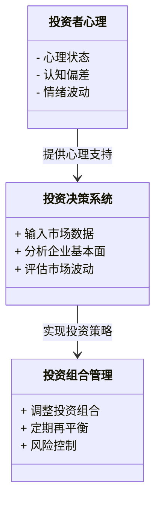
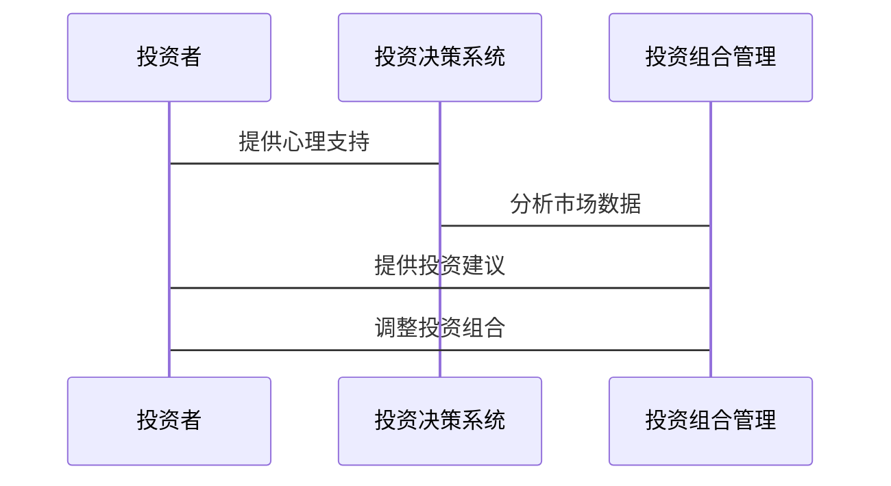

                 


# 彼得林奇的"耐心投资"心理建设

> 关键词：耐心投资，心理建设，彼得·林奇，投资策略，长期价值

> 摘要：本文深入探讨了彼得·林奇提出的耐心投资理念，分析了投资者心理因素在长期投资中的重要性，结合实际案例和系统架构，详细阐述了如何通过心理建设来实现稳健的投资回报。

---

## 第二部分: 耐心投资的心理建设与系统分析

### # 第2章: 耐心投资的定义与核心理念

#### 2.1 耐心投资的定义与特征

- **耐心投资**是指投资者在选择投资标的后，长期持有，不因短期市场波动而改变投资策略。

- **特征**包括：长期性、价值导向、抗波动性。

#### 2.2 耐心投资的核心理念

- **价值投资**：寻找具有持续竞争优势和良好财务状况的企业进行投资。

- **复利效应**：通过长期持有优质资产，实现财富的指数增长。

- **避免短期波动**：不因市场的短期波动而改变投资决策。

#### 2.3 耐心投资的长期收益模型

- **数学公式**：$$ FV = PV \times (1 + r)^n $$，其中FV为终值，PV为现值，r为年化收益率，n为投资期限。

- **案例分析**：通过历史数据，展示长期持有优质股票的表现优于短期交易。

---

### # 第3章: 投资者心理与耐心投资

#### 3.1 投资者心理分析

- **贪婪与恐惧**：投资者在市场上涨时容易产生贪婪，在市场下跌时容易产生恐惧。

- **认知偏差**：包括确认偏差、过度自信等，影响投资决策。

- **羊群效应**：投资者跟随市场潮流，而非基于理性分析。

#### 3.2 心理因素对投资决策的影响

- **情绪波动**：短期市场波动可能导致投资者做出非理性决策，如盲目追涨杀跌。

- **认知偏差**：投资者倾向于相信自己对市场的理解，忽略客观数据。

- **社会压力**：投资者可能因周围人的影响而改变投资策略。

#### 3.3 培养耐心投资的心理策略

- **建立长期目标**：明确投资目标，避免短期波动的干扰。

- **克服恐惧**：通过学习和经验积累，增强对市场的理解，减少恐惧情绪。

- **理性决策**：在市场波动时，保持冷静，避免情绪化决策。

---

### # 第4章: 市场波动与耐心投资

#### 4.1 市场波动的定义与特征

- **市场波动**：指市场价格的短期上下波动，通常由市场情绪和资金流动驱动。

- **波动来源**：包括宏观经济变化、企业业绩、政策调整等。

- **波动周期**：市场波动通常具有周期性，但长期趋势由基本面决定。

#### 4.2 耐心投资在市场波动中的应用

- **价值投资与波动**：市场波动为长期投资者提供了廉价买入优质资产的机会。

- **波动性与机会**：短期波动可能导致市场低估优质资产，为长期投资者提供买入机会。

- **投资组合调整**：在波动加剧时，调整投资组合以降低风险，保持长期策略。

#### 4.3 历史案例分析

- **2008年金融危机**：市场大幅下跌，但长期投资者通过持有优质资产，最终实现收益。

- **科技股泡沫**：市场波动剧烈，但长期持有优质科技企业的投资者获得丰厚回报。

---

### # 第5章: 优质企业的识别与长期投资

#### 5.1 优质企业的定义与特征

- **竞争优势**：企业在行业内具有独特的竞争优势，如品牌、技术、成本优势。

- **财务健康**：企业具有稳定的财务状况，低负债率，高利润率。

- **成长潜力**：企业具有持续增长的潜力，能够在未来市场中保持竞争力。

#### 5.2 财务指标分析

- **盈利能力**：如ROE（净资产收益率）和净利润增长率。

- **财务杠杆**：企业的负债与 equity 比例。

- **现金流**：企业产生的自由现金流，反映企业的财务健康状况。

#### 5.3 投资策略

- **长期持有**：选择优质企业，长期持有，分享企业成长的收益。

- **分散投资**：通过分散投资降低风险，避免单一投资的风险集中。

- **定期再平衡**：定期审视投资组合，根据市场变化进行调整。

---

### # 第6章: 系统分析与架构设计方案

#### 6.1 问题场景介绍

- **投资决策系统**：通过系统化的方法，帮助投资者做出理性决策。

- **目标**：构建一个能够长期持有优质资产的投资系统，抵御短期波动的影响。

#### 6.2 项目介绍

- **项目名称**：耐心投资心理建设系统。

- **目标**：通过系统化的方法，帮助投资者建立长期投资的心理素质和决策机制。

#### 6.3 系统功能设计（领域模型mermaid类图）



#### 6.4 系统架构设计（mermaid架构图）

```mermaid
archimate
title 耐心投资系统架构

布局: 单列

投资者心理 -> (投资决策系统) : 心理支持
投资决策系统 -> (投资组合管理) : 投资策略
投资组合管理 -> (市场数据) : 数据分析
```

#### 6.5 系统接口设计

- **输入接口**：市场数据、企业基本面信息。

- **输出接口**：投资建议、组合调整策略。

#### 6.6 系统交互（mermaid序列图）



---

### # 第7章: 项目实战

#### 7.1 环境安装

- **工具**：使用Python进行数据分析，使用Matplotlib进行数据可视化。

- **依赖库**：安装pandas、numpy、matplotlib。

#### 7.2 系统核心实现源代码

```python
import pandas as pd
import numpy as np
import matplotlib.pyplot as plt

# 示例数据：股票价格数据
data = pd.DataFrame({
    '日期': ['2020-01', '2020-02', '2020-03', '2020-04', '2020-05'],
    '价格': [100, 90, 110, 120, 105]
})

# 绘制股价走势图
plt.plot(data['日期'], data['价格'])
plt.title('股票价格走势图')
plt.xlabel('日期')
plt.ylabel('价格')
plt.show()
```

#### 7.3 代码应用解读与分析

- **数据加载**：使用pandas加载历史股价数据。

- **数据可视化**：绘制股价走势图，观察市场波动。

- **分析工具**：通过数据分析工具，识别优质企业。

#### 7.4 实际案例分析

- **案例**：分析某科技企业的历史股价，验证耐心投资的长期收益。

#### 7.5 项目小结

- **总结**：通过系统化的分析和实践，投资者可以更好地理解耐心投资的策略。

---

### # 第8章: 最佳实践 tips、小结、注意事项、拓展阅读

#### 8.1 小结

- 耐心投资需要投资者具备长期的心理建设，避免短期波动的影响。

- 优质企业的选择和长期持有是实现稳健收益的关键。

#### 8.2 注意事项

- **风险管理**：定期审视投资组合，降低市场波动带来的风险。

- **持续学习**：保持对市场的学习，及时调整投资策略。

- **心理调节**：通过心理建设，增强面对市场波动的抗压能力。

#### 8.3 拓展阅读

- **书籍推荐**：《彼得·林奇的成功投资》、《投资心理学》。

- **在线资源**：投资论坛、专业博客，获取最新的投资理念和策略。

---

作者：AI天才研究院/AI Genius Institute & 禅与计算机程序设计艺术 /Zen And The Art of Computer Programming

