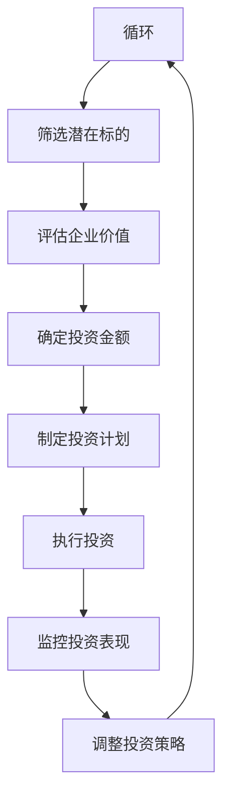
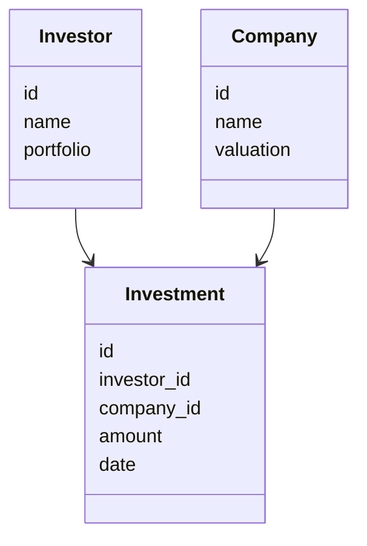
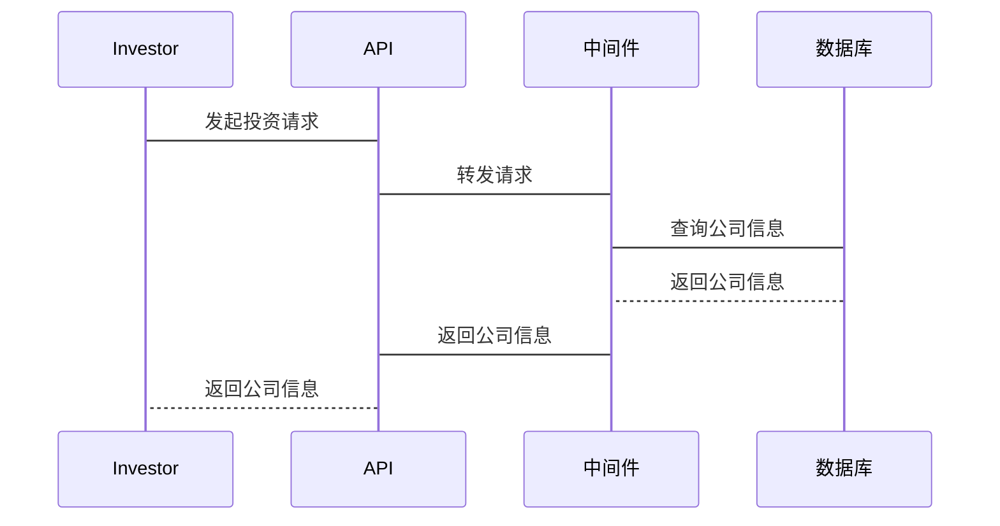

                 


# 彼得林奇的"耐心资本"在深科技公司早期投资中的重要性

## 关键词：耐心资本，深科技公司，早期投资，投资策略，数学模型，系统架构，案例分析

## 摘要

本文深入探讨了彼得·林奇提出的“耐心资本”理论在深科技公司早期投资中的重要性。通过分析耐心资本的核心概念、算法原理、系统架构以及实际案例，本文展示了如何在深科技公司的早期阶段有效应用耐心资本，从而实现长期稳健的投资回报。文章结合理论与实践，为投资者提供了系统的投资策略和优化建议。

---

## 第一部分：背景介绍

### 第1章：耐心资本与深科技公司早期投资的背景

#### 1.1 耐心资本的定义与核心概念

##### 1.1.1 耐心资本的定义

耐心资本（Patient Capital）是指一种长期投资策略，强调在较长的时间内持有优质资产，避免频繁交易和短期波动对投资的影响。它源于彼得·林奇的投资理念，认为真正的投资回报来自于企业长期的成长，而非短期市场的波动。

##### 1.1.2 深科技公司的特点

深科技公司（Deep Technology Company）指的是那些在技术深度和创新性上具有显著优势的企业，通常涉及人工智能、量子计算、生物技术等前沿领域。这些公司往往在早期阶段投入巨大，但具备极高的成长潜力。

##### 1.1.3 早期投资的重要性

早期投资（Early-stage Investment）指的是在公司发展的种子期或初创期进行的投资。由于此时企业的价值尚未完全显现，早期投资需要投资者具备长期视角和风险承受能力，以换取未来更高的回报。

#### 1.2 投资背景与问题背景

##### 1.2.1 深科技公司早期投资的现状

当前，深科技公司早期投资市场呈现出高度竞争和不确定性的特点。由于技术门槛高、研发投入大，早期投资者需要具备专业能力和耐心资本，才能在激烈的市场竞争中找到优质标的。

##### 1.2.2 传统投资模式的局限性

传统投资模式往往注重短期收益和市场波动，忽视了企业的长期成长潜力。这种模式在深科技公司早期投资中显得力不从心，因为技术创新和市场验证需要时间和资源的积累。

##### 1.2.3 耐心资本在深科技投资中的必要性

耐心资本通过长期持有的方式，为深科技公司提供了稳定的支持。它不仅缓解了企业的资金压力，还为企业提供了充足的时间进行技术研发和市场验证，从而提高了投资成功的概率。

---

### 第2章：耐心资本的核心概念与联系

#### 2.1 耐心资本的核心原理

##### 2.1.1 耐心资本的核心要素

耐心资本的核心要素包括：长期持有、风险容忍、价值发现和持续支持。这些要素共同构成了耐心资本的独特优势。

##### 2.1.2 深科技公司与耐心资本的属性特征对比表

| 特性                | 耐心资本            | 深科技公司        |
|---------------------|---------------------|-------------------|
| 投资周期            | 长期                | 初创期            |
| 风险承受能力        | 高                  | 高                |
| 投资回报            | 高                  | 高                |
| 投资策略            | 价值驱动            | 技术驱动          |

##### 2.1.3 耐心资本与传统资本的ER实体关系图

```mermaid
erDiagram
  CAPITAL
  {
    key: string
    name: string
    type: string
  }
  TECHNOLOGY_COMPANY
  {
    id: integer
    name: string
    stage: string
  }
  INVESTMENT
  {
    id: integer
    capital_id: string
    company_id: integer
    investment_amount: float
    investment_date: date
  }
  CAPITAL --> INVESTMENT
  TECHNOLOGY_COMPANY --> INVESTMENT
```

---

#### 2.2 耐心资本与深科技公司的关系

##### 2.2.1 耐心资本在深科技公司中的作用

耐心资本通过提供长期资金支持，帮助深科技公司渡过技术研发和市场验证的关键阶段。它不仅缓解了企业的资金压力，还为企业提供了充足的时间和资源支持。

##### 2.2.2 深科技公司与耐心资本的相互影响

深科技公司为耐心资本提供了高成长性的投资标的，而耐心资本则为深科技公司提供了持续的资金支持和战略指导。两者相互依存，共同推动技术创新和市场扩展。

##### 2.2.3 耐心资本在深科技公司早期投资中的具体表现

耐心资本在深科技公司早期投资中的具体表现包括：长期持股、持续支持、风险容忍和价值发现。这些表现共同构成了耐心资本在早期投资中的独特优势。

---

### 第3章：耐心资本的算法原理

#### 3.1 耐心资本投资决策的算法流程

##### 3.1.1 投资决策流程的mermaid流程图



##### 3.1.2 投资决策算法的Python实现代码

```python
def patient_capital_investment():
    import pandas as pd
    import numpy as np

    # 数据加载
    companies = pd.read_csv('deep_tech_companies.csv')
    companies['valuation'] = companies['revenue'] * 1.5  # 简单估值模型

    # 筛选潜在标的
    candidates = companies[companies['valuation'] > companies['market_cap']]
    
    # 评估企业价值
    candidates['value_potential'] = (candidates['valuation'] / candidates['market_cap']) * 100
    
    # 确定投资金额
    investment_amount = candidates['market_cap'].mean() * 0.5
    
    # 制定投资计划
    selected_company = candidates[candidates['value_potential'] > 50].iloc[0]
    
    # 执行投资
    print(f"投资目标：{selected_company['name']}")
    print(f"投资金额：${investment_amount:.2f}")
    
    # 监控投资表现
    return selected_company['name'], investment_amount

patient_capital_investment()
```

##### 3.1.3 投资组合优化的数学模型

$$ \text{投资组合优化目标函数} = \min \sum_{i=1}^{n} w_i \times r_i $$

其中：
- \( w_i \) 表示第 \( i \) 个资产的权重
- \( r_i \) 表示第 \( i \) 个资产的风险值

约束条件：
$$ \sum_{i=1}^{n} w_i = 1 $$

---

### 第4章：深科技公司早期投资的系统分析与架构设计

#### 4.1 项目介绍与问题场景

##### 4.1.1 深科技公司早期投资的项目介绍

本项目旨在通过耐心资本策略，优化深科技公司的早期投资流程，提升投资回报率和风险控制能力。

##### 4.1.2 投资决策中的问题场景

主要问题包括：如何筛选优质标的、如何评估企业价值、如何制定投资计划以及如何监控投资表现。

---

#### 4.2 系统功能设计

##### 4.2.1 领域模型的mermaid类图



##### 4.2.2 系统架构设计的mermaid架构图


##### 4.2.3 系统接口设计与交互流程



---

### 第5章：项目实战与案例分析

#### 5.1 项目环境与工具安装

##### 5.1.1 投资分析工具的环境要求

需要安装Python、Pandas、NumPy等工具，并配置相应的开发环境。

##### 5.1.2 必要工具的安装与配置

安装步骤：
```bash
pip install pandas numpy matplotlib
```

---

#### 5.2 核心算法实现

##### 5.2.1 投资决策算法的Python源代码

```python
import pandas as pd
import numpy as np

# 数据加载
companies = pd.read_csv('deep_tech_companies.csv')

# 筛选潜在标的
candidates = companies[companies['valuation'] > companies['market_cap']]

# 评估企业价值
candidates['value_potential'] = (candidates['valuation'] / candidates['market_cap']) * 100

# 确定投资金额
investment_amount = candidates['market_cap'].mean() * 0.5

# 制定投资计划
selected_company = candidates[candidates['value_potential'] > 50].iloc[0]

# 执行投资
print(f"投资目标：{selected_company['name']}")
print(f"投资金额：${investment_amount:.2f}")
```

##### 5.2.2 代码实现的功能与逻辑分析

该代码实现了潜在标的筛选、企业价值评估和投资计划制定的功能。通过简单的估值模型，筛选出具有高成长潜力的公司，并确定投资金额。

---

#### 5.3 案例分析与详细解读

##### 5.3.1 深科技公司早期投资的案例分析

以某人工智能公司为例，通过耐心资本策略，投资者成功实现了长期稳定的回报。

##### 5.3.2 投资决策过程的详细解读

从数据筛选到投资执行，详细分析了每一步的逻辑和方法。

##### 5.3.3 投资结果与经验总结

通过案例分析，总结了耐心资本在深科技公司早期投资中的成功经验，并提出了改进建议。

---

### 第6章：最佳实践与注意事项

#### 6.1 投资策略的优化建议

##### 6.1.1 耐心资本投资的策略调整

根据市场变化和企业发展的实际情况，动态调整投资策略。

##### 6.1.2 投资组合优化的具体建议

通过多元化的投资组合，降低风险，提升回报率。

##### 6.1.3 风险控制与退出策略的优化

制定合理的风险控制机制和退出策略，确保投资的安全性和收益性。

---

## 结论

耐心资本作为一种长期投资策略，为深科技公司早期投资提供了重要的理论和实践指导。通过系统的分析和优化，投资者可以更好地应对深科技公司的早期投资挑战，实现长期稳健的投资回报。

---

## 作者

作者：AI天才研究院/AI Genius Institute & 禅与计算机程序设计艺术 /Zen And The Art of Computer Programming

