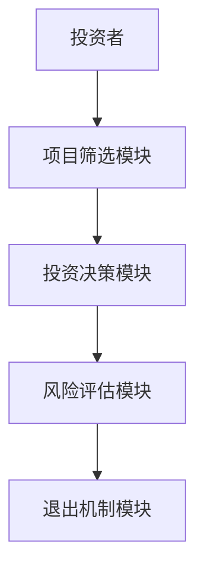

                 


# 彼得林奇的"耐心资本"在深科技初创公司中的角色

## 关键词：耐心资本，深科技，初创公司，投资策略，风险投资，长期投资，创新生态系统

## 摘要：  
彼得林奇的“耐心资本”理念强调长期投资和价值创造，特别是在深科技初创公司中，这种资本不仅为公司提供资金支持，还为其技术创新和市场扩展提供战略指导。本文通过分析耐心资本的核心概念、评估模型、系统架构以及实际案例，揭示其在深科技初创公司中的重要角色，并探讨如何通过耐心资本实现投资回报最大化和创新生态系统优化。

---

# 第一部分：引言

## 第1章：耐心资本与深科技初创公司的概述

### 1.1 耐心资本的定义与特征

#### 1.1.1 耐心资本的定义  
耐心资本（Patient Capital）是一种长期投资策略，强调在不追求短期收益的情况下，为初创公司提供持续的资金支持，以实现其技术创新和市场扩展目标。

#### 1.1.2 耐心资本的核心特征  
- **长期性**：投资期限较长，通常在5-10年以上。  
- **支持性**：不仅仅提供资金，还提供战略指导和资源支持。  
- **风险容忍度**：接受高风险，注重长期价值创造。  

#### 1.1.3 耐心资本与传统风投的区别  
- **投资期限**：耐心资本更注重长期，而传统风投追求短期回报。  
- **资金用途**：耐心资本支持技术创新和市场扩展，传统风投更关注快速退出。  
- **风险承担**：耐心资本对风险的容忍度更高。  

---

### 1.2 深科技初创公司的特点

#### 1.2.1 深科技的定义与范围  
深科技（Deep Technology）是指基于前沿技术（如人工智能、量子计算、生物技术等）的创新，具有高技术门槛和长期研发投入的特点。

#### 1.2.2 深科技初创公司的典型特征  
- **技术驱动**：依赖核心技术的突破。  
- **高风险高回报**：技术失败或市场验证困难可能导致失败，但成功则回报巨大。  
- **长周期**：从研发到商业化需要较长时间。  

#### 1.2.3 深科技初创公司的成功关键因素  
- **技术领先性**：核心技术必须具有独特性和先进性。  
- **市场需求**：技术必须能够解决实际问题并获得市场认可。  
- **团队能力**：创始人团队的技术能力和执行能力至关重要。  

---

### 1.3 耐心资本在深科技初创公司中的角色

#### 1.3.1 耐心资本对深科技初创公司的支持作用  
- **资金支持**：为技术研发和市场扩展提供资金。  
- **战略指导**：帮助公司制定长期发展战略。  
- **资源网络**：连接行业资源和合作伙伴。  

#### 1.3.2 耐心资本在深科技初创公司生命周期中的应用  
- **种子阶段**：支持技术验证和原型开发。  
- **成长阶段**：支持产品迭代和市场拓展。  
- **成熟阶段**：支持规模化和国际化发展。  

#### 1.3.3 耐心资本与其他资本形式的对比  
- **风险投资（VC）**：更注重短期回报，投资周期较短。  
- **私募股权（PE）**：主要投资成熟企业，关注重组和价值提升。  
- **天使投资**：通常由个人投资者提供，金额较小，风险较高。  

---

## 1.4 本章小结  
耐心资本作为一种长期投资策略，在深科技初创公司中扮演着关键角色，不仅为公司提供资金支持，还为其技术创新和市场扩展提供战略指导。与传统风投相比，耐心资本更注重长期价值创造，能够更好地支持深科技初创公司的高风险、长周期特点。

---

# 第二部分：耐心资本的核心概念与联系

## 第2章：耐心资本的核心原理

### 2.1 耐心资本的理论基础

#### 2.1.1 投资组合理论  
投资组合理论强调通过多样化投资降低风险，耐心资本通过长期持有不同类型资产，实现风险分散和价值积累。  

#### 2.1.2 长期投资与价值创造  
长期投资能够避免短期市场波动的影响，专注于企业的长期价值创造。  

#### 2.1.3 耐心资本与创新生态系统的关系  
耐心资本通过支持技术创新和企业成长，促进创新生态系统的良性发展。  

---

### 2.2 耐心资本的属性特征对比

#### 2.2.1 耐心资本与风险投资的对比  
| 特性                | 耐心资本           | 风险投资           |
|---------------------|-------------------|-------------------|
| 投资期限            | 长期（5-10年）     | 短期（3-5年）      |
| 资金用途            | 支持技术创新       | 追求快速退出       |
| 风险承担            | 高               | 中高             |

#### 2.2.2 耐心资本与私募股权的对比  
| 特性                | 耐心资本           | 私募股权           |
|---------------------|-------------------|-------------------|
| 投资对象            | 初创公司           | 成熟企业           |
| 投资策略            | 支持技术创新       | 重组和价值提升     |
| 投资周期            | 长期              | 中长期            |

#### 2.2.3 耐心资本与天使投资的对比  
| 特性                | 耐心资本           | 天使投资           |
|---------------------|-------------------|-------------------|
| 投资金额            | 较大              | 较小              |
| 投资阶段            | 中后期            | 早期              |
| 投资期限            | 长期              | 短期              |

---

### 2.3 耐心资本的ER实体关系图

```mermaid
er
actor(投资者) -|> 持股: 持股比例
actor(初创公司) -|> 项目: 项目阶段
actor(市场) -|> 退出机制: 退出策略
```

---

### 2.4 本章小结  
耐心资本的核心原理在于其长期性和支持性，通过与创新生态系统的互动，为深科技初创公司提供持续的资金和战略支持，从而实现技术创新和市场扩展的目标。

---

# 第三部分：耐心资本的算法原理

## 第3章：耐心资本的评估算法

### 3.1 耐心资本的评估模型

#### 3.1.1 项目潜力评估模型  
项目潜力评估模型基于技术创新性、市场需求和团队能力三个维度，对初创公司进行综合评分。  

- **技术创新性**：评分范围为1-10分，权重为40%。  
- **市场需求**：评分范围为1-10分，权重为30%。  
- **团队能力**：评分范围为1-10分，权重为30%。  

综合评分公式为：  
$$ 总分 = 0.4 \times 技术创新性 + 0.3 \times 市场需求 + 0.3 \times 团队能力 $$  

#### 3.1.2 投资回报率预测模型  
投资回报率预测模型基于项目的现金流和贴现率进行计算。  

- **现金流**：项目在生命周期内每年的现金流。  
- **贴现率**：根据项目风险确定的贴现率。  

投资回报率公式为：  
$$ ROI = \frac{\text{未来现金流现值} - 初始投资}{初始投资} $$  

#### 3.1.3 风险评估与缓解策略  
风险评估采用风险矩阵法，将风险分为高、中、低三个等级，并制定相应的缓解策略。  

---

### 3.2 耐心资本的决策流程

```mer

```  

---

## 3.3 本章小结  
耐心资本的评估算法通过项目潜力评估模型和投资回报率预测模型，帮助投资者科学地评估初创公司的潜力和风险，从而制定合理的投资决策。

---

# 第四部分：耐心资本的数学模型

## 第4章：耐心资本的数学模型

### 4.1 投资回报率模型

#### 4.1.1 投资回报率公式  
$$ ROI = \frac{\text{最终价值} - \text{投资额}}{\text{投资额}} $$  

#### 4.1.2 现金流贴现模型  
$$ \text{现值} = \sum_{t=1}^{n} \frac{\text{现金流}_t}{(1 + r)^t} $$  
其中，$r$为贴现率，$n$为项目周期。  

---

### 4.2 风险评估模型

#### 4.2.1 风险矩阵  
| 风险概率 | 低风险 | 中风险 | 高风险 |
|---------|--------|--------|--------|
| 影响程度 | 低     | 中     | 高     |

#### 4.2.2 风险缓解策略  
根据风险矩阵结果，制定相应的缓解策略：  
- **低风险**：持续监控。  
- **中风险**：制定应对计划。  
- **高风险**：重新评估项目可行性。  

---

## 4.3 本章小结  
通过数学模型，投资者可以更科学地评估耐心资本的投资回报率和风险，从而制定更合理的投资策略。

---

# 第五部分：耐心资本的系统架构

## 第5章：耐心资本的系统架构设计

### 5.1 系统功能设计

#### 5.1.1 项目筛选模块  
功能：根据技术创新性、市场需求和团队能力对项目进行筛选。  
流程：  
1. 收集项目信息。  
2. 评估技术创新性、市场需求和团队能力。  
3. 确定是否符合投资条件。  

#### 5.1.2 投资决策模块  
功能：基于项目潜力评估模型和现金流贴现模型，制定投资决策。  
流程：  
1. 输入项目信息。  
2. 计算项目潜力评分和投资回报率。  
3. 制定投资策略。  

---

### 5.2 系统架构设计



---

## 5.3 本章小结  
耐心资本的系统架构设计为投资者提供了一个科学的决策框架，通过模块化设计和流程优化，提高了投资效率和准确性。

---

# 第六部分：耐心资本的项目实战

## 第6章：耐心资本的项目实战

### 6.1 环境安装

#### 6.1.1 系统要求  
- 操作系统：Windows/Mac/Linux。  
- 开发工具：Python、Jupyter Notebook、Mermaid工具。  

#### 6.1.2 安装步骤  
1. 安装Python和Jupyter Notebook。  
2. 安装Mermaid CLI或在线工具。  

---

### 6.2 核心实现

#### 6.2.1 项目潜力评估模型实现  
```python
def project_potential(technology, market, team):
    return 0.4 * technology + 0.3 * market + 0.3 * team
```

#### 6.2.2 投资回报率预测模型实现  
```python
def roi(final_value, investment):
    return (final_value - investment) / investment
```

---

### 6.3 实际案例分析

#### 6.3.1 案例背景  
某人工智能初创公司，技术领先，市场需求大，团队能力优秀。  

#### 6.3.2 评估过程  
1. 技术创新性：9分。  
2. 市场需求：8分。  
3. 团队能力：7分。  
综合评分：$$ 0.4 \times 9 + 0.3 \times 8 + 0.3 \times 7 = 8.2 $$  

#### 6.3.3 投资决策  
投资金额：100万美元。  
预计最终价值：200万美元。  
投资回报率：$$ (200 - 100) / 100 = 100\% $$  

---

## 6.4 本章小结  
通过实际案例分析，验证了耐心资本的评估模型和决策流程的有效性，为投资者提供了可参考的实战经验。

---

# 第七部分：耐心资本的最佳实践

## 第7章：耐心资本的最佳实践

### 7.1 小结

耐心资本作为一种长期投资策略，通过支持深科技初创公司的技术创新和市场扩展，为其成长提供了重要的资金和战略支持。本文从理论基础、算法原理、系统架构和实际案例四个方面，全面分析了耐心资本在深科技初创公司中的角色和应用。

---

### 7.2 注意事项

1. **风险控制**：投资者需高度重视风险评估和缓解策略。  
2. **长期视角**：耐心资本的本质是长期投资，需避免短期市场波动的干扰。  
3. **团队能力**：初创公司的团队能力是决定项目成功的关键因素。  

---

### 7.3 扩展阅读

- 彼得林奇的《投资学入门：清醒思考的艺术》。  
- 《深科技：技术创新与投资策略》。  
- 《创新生态系统：构建可持续发展的创新环境》。

---

## 作者：AI天才研究院/AI Genius Institute & 禅与计算机程序设计艺术/Zen And The Art of Computer Programming

---

通过以上内容，本文全面探讨了彼得林奇的耐心资本在深科技初创公司中的角色和应用，为投资者和初创公司提供了有价值的理论和实践指导。

