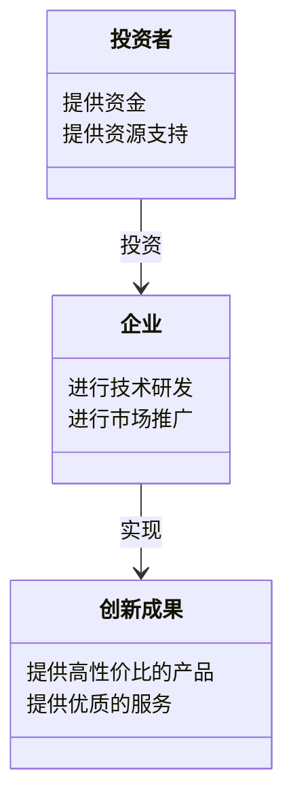

                 


# 彼得林奇的"耐心资本"在颠覆性创新中的角色

---

## 关键词

- 耐心资本
- 颠覆性创新
- 投资策略
- 彼得林奇
- 创新管理

---

## 摘要

本文探讨了彼得·林奇的“耐心资本”理念在颠覆性创新中的关键作用。文章首先介绍了耐心资本的核心概念及其与颠覆性创新的关系，然后分析了彼得林奇的耐心资本理论及其在实践中的应用。通过详细阐述耐心资本在创新周期中的角色、对颠覆性创新的支持作用以及实际案例，本文揭示了耐心资本在推动技术进步和商业模式创新中的重要性。最后，文章总结了最佳实践，为投资者和创新者提供了实用的建议。

---

## 第一部分：耐心资本的核心理念

### 第1章：耐心资本的定义与特点

#### 1.1 耐心资本的定义

耐心资本（Patient Capital）是一种长期投资策略，强调在早期阶段对具有高增长潜力的公司进行投资，并在较长的时间内持有这些投资，以实现更高的回报。与短期投资不同，耐心资本更注重企业的长期发展和价值创造。

#### 1.2 耐心资本的核心特点

- **长期性**：耐心资本的投资周期较长，通常为5年到10年甚至更久。
- **支持性**：投资者不仅提供资金，还提供战略建议、行业资源和管理支持，帮助被投企业成长。
- **风险承担**：耐心资本能够容忍较高的短期风险，因为其目标是长期的高回报。

#### 1.3 耐心资本与传统投资的区别

| 属性          | 耐心资本              | 传统投资              |
|---------------|-----------------------|-----------------------|
| 投资期限      | 长期（5-10年）         | 短期（1-3年）           |
| 投资目标      | 高增长潜力的企业      | 稳定收益或资本增值    |
| 风险承担      | 高                   | 中低                  |
| 投资策略      | 支持企业成长          | 跟踪市场波动          |

---

### 第2章：彼得林奇的耐心资本理论

#### 2.1 彼得林奇的背景与投资理念

彼得·林奇（Peter Lynch）是全球最著名的投资者之一，曾任富达麦哲伦基金的经理。他认为，成功的投资需要关注企业的基本面，尤其是其长期增长潜力。耐心资本在他的投资策略中占据了重要地位，因为他倾向于长期持有优质股票，并在市场波动中寻找投资机会。

#### 2.2 耐心资本在彼得林奇投资策略中的地位

彼得林奇的投资策略强调以下几点：

1. **长期持有优质股票**：他倾向于投资那些具有强大竞争优势和增长潜力的公司，并长期持有。
2. **分散投资**：通过分散投资降低风险，同时关注企业的长期表现。
3. **关注基本面**：深入研究企业的财务状况、管理层能力和市场地位。

#### 2.3 耐心资本的成功案例

彼得林奇最著名的案例之一是对亚马逊的投资。他在亚马逊成立初期就对其进行了投资，并在随后的几年中持续持有，最终获得了巨大的回报。这一案例充分体现了耐心资本在支持颠覆性创新中的作用。

---

## 第二部分：颠覆性创新的基本概念

### 第3章：颠覆性创新的定义与特征

#### 3.1 颠覆性创新的定义

颠覆性创新（Disruptive Innovation）是指引入一种新产品或服务，通过改变市场规则或技术路径，取代或淘汰现有产品或服务的过程。这种创新通常以更低的成本、更高的性能或更便捷的用户体验为特点。

#### 3.2 颠覆性创新的核心特征

- **低成本**：颠覆性创新通常以更低的成本提供更好的产品或服务。
- **高性价比**：通过技术创新或商业模式创新，实现更高的性价比。
- **用户导向**：颠覆性创新往往从用户需求出发，而非单纯的技术驱动。

#### 3.3 颠覆性创新与渐进式创新的区别

| 属性          | 颠覆性创新           | 渐进式创新           |
|---------------|----------------------|----------------------|
| 创新幅度      | 高                   | 低                   |
| 市场影响      | 根本性改变            | 局部优化             |
| 技术依赖      | 强                   | 弱                   |

---

### 第4章：彼得林奇的耐心资本在颠覆性创新中的作用

#### 4.1 长期投资视角下的创新支持

耐心资本通过长期投资，为颠覆性创新提供了资金和资源支持。彼得林奇的投资策略尤其注重这一点，他倾向于投资那些具有颠覆性潜力的企业，并在其成长过程中提供支持。

#### 4.2 耐心资本在创新周期中的角色

创新周期通常包括以下几个阶段：研发、测试、市场推广、规模化生产。耐心资本在每个阶段都扮演着关键角色，尤其是在企业的早期阶段，耐心资本能够提供必要的资金支持。

#### 4.3 耐心资本对创新风险的承担

颠覆性创新往往伴随着高风险，包括技术失败、市场需求不确定性和竞争压力等。耐心资本通过长期投资和持续支持，帮助企业在风险中保持稳定性。

---

## 第三部分：耐心资本与颠覆性创新的关系

### 第5章：耐心资本对颠覆性创新的支持作用

#### 5.1 长期投资视角下的创新支持

耐心资本通过长期投资，支持企业进行技术研发和市场拓展，从而推动颠覆性创新的实现。

#### 5.2 耐心资本在创新周期中的角色

耐心资本在创新周期中的角色可以分为以下几个阶段：

1. **研发阶段**：提供资金支持，帮助企业进行技术研发。
2. **测试阶段**：提供资源支持，帮助企业进行市场测试。
3. **推广阶段**：提供资金支持，帮助企业进行市场推广。
4. **规模化阶段**：提供资金支持，帮助企业进行规模化生产。

---

## 第四部分：系统分析与架构设计

### 第6章：系统功能设计

#### 6.1 系统功能设计概述

颠覆性创新的实现需要一个支持性的系统，包括技术研发、市场推广、资金支持等多个方面。耐心资本在系统中扮演着关键角色，通过长期投资和持续支持，帮助企业在创新过程中克服各种困难。

#### 6.2 系统功能设计的mermaid类图



---

### 第7章：系统架构设计

#### 7.1 系统架构设计概述

颠覆性创新的实现需要一个支持性的系统架构，包括技术研发、市场推广、资金支持等多个方面。耐心资本在系统架构中扮演着关键角色，通过长期投资和持续支持，帮助企业在创新过程中克服各种困难。

#### 7.2 系统架构设计的mermaid架构图

```mermaid
architecturalDiagram

    [投资者]
    [企业]
    [创新成果]
    [市场]
    [技术]

    投资者 --> 企业: 投资
    企业 --> 技术: 研发
    技术 --> 创新成果: 实现
    创新成果 --> 市场: 推广
```

---

## 第五部分：项目实战

### 第8章：项目实战分析

#### 8.1 项目背景介绍

以亚马逊为例，彼得林奇在亚马逊成立初期对其进行了投资，并在随后的几年中持续持有，最终获得了巨大的回报。这一案例充分体现了耐心资本在支持颠覆性创新中的作用。

#### 8.2 项目核心实现

亚马逊的成功离不开彼得林奇的耐心资本支持。他不仅提供了资金，还提供了战略建议和行业资源，帮助亚马逊实现了从在线书店到全球科技巨头的转变。

#### 8.3 项目小结

通过亚马逊的案例，我们可以看到，耐心资本在颠覆性创新中的作用不可忽视。长期投资和持续支持是实现颠覆性创新的关键。

---

## 第六部分：最佳实践

### 第9章：最佳实践与总结

#### 9.1 最佳实践

- **长期投资**：耐心资本的核心是长期投资，投资者需要有足够的耐心和信心，支持企业成长。
- **支持性投资**：投资者不仅提供资金，还提供战略建议、行业资源和管理支持，帮助企业成长。
- **风险承担**：耐心资本需要承担较高的风险，但同时也能够获得较高的回报。

#### 9.2 小结

耐心资本在颠覆性创新中的作用不可忽视。通过长期投资和持续支持，耐心资本能够帮助企业实现技术创新和市场推广，最终实现颠覆性创新。

---

## 作者：AI天才研究院/AI Genius Institute & 禅与计算机程序设计艺术/Zen And The Art of Computer Programming

