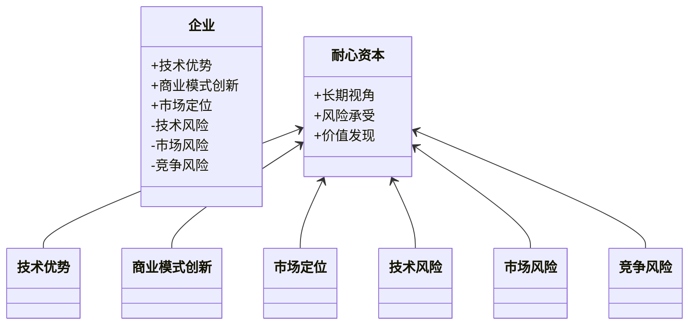
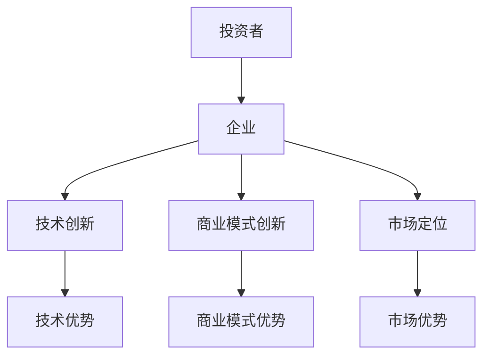

                 


# 彼得林奇的"耐心资本"在颠覆性创新企业中的重要性

> 关键词：耐心资本，彼得林奇，颠覆性创新，长期投资，创新企业

> 摘要：本文深入探讨了彼得林奇提出的“耐心资本”理念在颠覆性创新企业中的重要性。通过分析耐心资本的核心原理、颠覆性创新的特点，以及两者之间的关系，本文揭示了耐心资本如何为创新企业提供长期支持，并推动企业的可持续发展。同时，文章结合实际案例，详细阐述了耐心资本在创新过程中的具体应用和策略。

---

## 第1章 耐心资本与颠覆性创新概述

### 1.1 耐心资本的定义与核心要素

耐心资本（Patient Capital）是一种长期投资理念，强调投资者在投资后给予企业足够的成长时间和空间，不追求短期收益，而是注重企业的长期价值。其核心要素包括：

1. **长期视角**：投资者在决策时以企业的长期发展为目标，而非短期收益。
2. **风险容忍度**：耐心资本能够容忍较高的风险，因为创新企业在成长过程中可能面临不确定性。
3. **资本支持**：在企业需要资金时，耐心资本能够提供持续的支持，帮助企业在创新过程中克服资金短缺的问题。

耐心资本与传统资本的主要区别在于其投资周期和风险承受能力。传统资本更关注短期回报，而耐心资本则更注重企业的长期潜力。

---

### 1.2 彼得林奇的耐心资本理论

彼得·林奇（Peter Lynch）是美国著名的投资经理，他在《彼得林奇的成功投资》等著作中提出了耐心资本的理念。他认为，成功的投资需要对企业有深入的了解，并给予企业足够的成长空间。耐心资本的核心思想是：

1. **长期投资**：投资者应该选择那些具有长期增长潜力的企业，而不是追求短期收益。
2. **价值发现**：耐心资本的核心是发现具有潜在价值的企业，并在其成长过程中提供支持。
3. **风险管理**：耐心资本能够更好地应对市场的波动，因为其投资周期较长，能够在市场低迷时保持稳定性。

彼得林奇的理论强调，耐心资本不仅是资本，更是一种信任和支持，它能够帮助企业在创新过程中克服各种挑战。

---

### 1.3 颠覆性创新企业的定义与特点

颠覆性创新（Disruptive Innovation）是指通过引入新的技术和商业模式，对现有市场格局产生根本性改变的创新。颠覆性创新企业的特点包括：

1. **技术创新**：颠覆性创新企业通常通过技术创新打破市场的现有格局。
2. **商业模式创新**：颠覆性创新企业往往采用新的商业模式，如免费增值模式、订阅模式等。
3. **市场定位**：颠覆性创新企业通常专注于新兴市场或未被满足的需求，从而逐步扩大市场份额。

颠覆性创新与传统创新的主要区别在于其目标是颠覆现有的市场结构，而不是仅仅优化现有产品或服务。

---

## 第2章 耐心资本与颠覆性创新的关系

### 2.1 耐心资本在颠覆性创新中的作用

耐心资本在颠覆性创新企业中的作用主要体现在以下几个方面：

1. **支持创新周期**：颠覆性创新通常需要较长的时间周期，耐心资本能够为企业的成长提供持续的资金支持。
2. **降低融资风险**：耐心资本能够容忍较高的风险，从而降低企业在创新过程中的融资难度。
3. **促进长期合作**：耐心资本通常与企业建立长期合作关系，这种合作关系能够为企业提供稳定的外部支持。

---

### 2.2 颠覆性创新对企业长期价值的影响

颠覆性创新对企业长期价值的影响主要体现在以下几个方面：

1. **市场扩展**：颠覆性创新能够帮助企业在新的市场中获得更大的市场份额。
2. **竞争优势**：通过技术创新和商业模式创新，颠覆性创新企业能够在竞争中获得优势。
3. **长期收益**：颠覆性创新通常能够为企业带来长期的收益增长，从而提升企业的整体价值。

---

### 2.3 耐心资本与企业创新战略的结合

耐心资本与企业创新战略的结合主要体现在以下几个方面：

1. **战略协同**：耐心资本能够与企业的创新战略协同，为企业提供长期的资金支持。
2. **风险共担**：耐心资本能够与企业共同承担创新过程中的风险，从而降低企业的融资成本。
3. **长期收益**：耐心资本能够通过长期投资，实现企业与投资者的双赢。

---

## 第3章 耐心资本的核心原理

### 3.1 耐心资本的原理分析

耐心资本的核心原理包括以下几个方面：

1. **长期视角**：耐心资本的投资周期较长，能够为企业提供持续的资金支持。
2. **风险承受**：耐心资本能够容忍较高的风险，从而降低企业在创新过程中的融资难度。
3. **价值发现**：耐心资本通过深入的企业分析，发现具有潜在价值的企业，并为其提供支持。

---

### 3.2 耐心资本与风险的关系

耐心资本与风险的关系主要体现在以下几个方面：

1. **风险承受能力**：耐心资本能够承受较高的风险，因为其投资周期较长。
2. **风险管理**：耐心资本通过深入的企业分析和市场研究，降低投资风险。
3. **风险与收益的平衡**：耐心资本在追求长期收益的同时，也注重风险的控制。

---

### 3.3 耐心资本的属性特征对比

以下是耐心资本与其他资本形式的对比：

| 特性                | 耐心资本          | 短期资本          |
|---------------------|------------------|------------------|
| 投资周期          | 长期             | 短期             |
| 风险承受能力      | 高               | 低               |
| 投资目标          | 长期价值         | 短期收益         |
| 资金支持          | 持续             | 一次性或短期     |

---

## 第4章 颠覆性创新的核心原理

### 4.1 颠覆性创新的基本原理

颠覆性创新的核心原理包括以下几个方面：

1. **技术创新**：通过引入新技术，颠覆现有的市场格局。
2. **商业模式创新**：通过新的商业模式，改变传统的市场运作方式。
3. **市场定位**：专注于新兴市场或未被满足的需求，逐步扩大市场份额。

---

### 4.2 颠覆性创新的核心要素

颠覆性创新的核心要素包括：

1. **技术优势**：企业需要具备技术优势，能够在市场上提供差异化的产品或服务。
2. **商业模式创新**：通过新的商业模式，实现市场的颠覆。
3. **市场定位**：企业需要在市场中找到一个能够发挥自身优势的位置。

---

### 4.3 颠覆性创新的风险与挑战

颠覆性创新的风险与挑战包括以下几个方面：

1. **技术风险**：技术创新可能失败，导致企业的投资无法收回。
2. **市场风险**：颠覆性创新可能面临市场的抵制，导致企业难以获得预期的市场份额。
3. **竞争风险**：颠覆性创新可能会吸引更多的竞争者，导致市场竞争加剧。

---

## 第5章 系统分析与架构设计方案

### 5.1 系统功能设计（领域模型）

以下是颠覆性创新企业的领域模型：



---

### 5.2 系统架构设计

以下是颠覆性创新企业的系统架构设计：



---

## 第6章 项目实战

### 6.1 环境安装

为了实现颠覆性创新企业的长期价值评估，我们需要安装以下工具：

1. **Python**：用于数据分析和建模。
2. **Jupyter Notebook**：用于数据可视化和模型展示。
3. **Mermaid**：用于绘制系统架构图和流程图。

---

### 6.2 核心实现源代码

以下是长期价值评估的Python代码：

```python
import numpy as np
import pandas as pd

# 定义贴现率和投资周期
discount_rate = 0.05
investment_period = 10

# 计算未来现金流的现值
def calculate_present_value(cash_flows):
    return sum(cash_flows[i] / (1 + discount_rate) ** i for i in range(len(cash_flows)))

# 案例分析：颠覆性创新企业的现金流
cash_flows = [100, 200, 300, 400, 500, 600, 700, 800, 900, 1000]

# 计算现值
present_value = calculate_present_value(cash_flows)
print(f"现值为：{present_value}")
```

---

### 6.3 实际案例分析

以特斯拉为例，分析耐心资本在颠覆性创新中的应用：

1. **技术优势**：特斯拉通过技术创新，推动了电动汽车的普及。
2. **商业模式创新**：特斯拉采用直营模式，改变了传统的汽车销售模式。
3. **市场定位**：特斯拉专注于高端市场，逐步扩大市场份额。

---

## 第7章 最佳实践与小结

### 7.1 小结

耐心资本在颠覆性创新企业中的重要性体现在以下几个方面：

1. **长期支持**：耐心资本能够为企业的成长提供持续的资金支持。
2. **风险承受**：耐心资本能够容忍较高的风险，从而降低企业在创新过程中的融资难度。
3. **价值发现**：耐心资本通过深入的企业分析，发现具有潜在价值的企业，并为其提供支持。

---

### 7.2 注意事项

1. **风险控制**：投资者需要在耐心资本的运用中注重风险控制。
2. **长期规划**：企业在运用耐心资本时，需要制定长期的发展规划。
3. **持续创新**：企业需要在获得耐心资本支持后，持续进行技术创新和商业模式创新。

---

### 7.3 拓展阅读

1. 彼得林奇的《彼得林奇的成功投资》
2. 克里斯·安德森的《长尾理论》
3. 马斯克的《特斯拉故事》

---

## 作者

作者：AI天才研究院/AI Genius Institute & 禅与计算机程序设计艺术 /Zen And The Art of Computer Programming

---

以上是《彼得林奇的"耐心资本"在颠覆性创新企业中的重要性》的技术博客文章的完整目录和内容概览。

