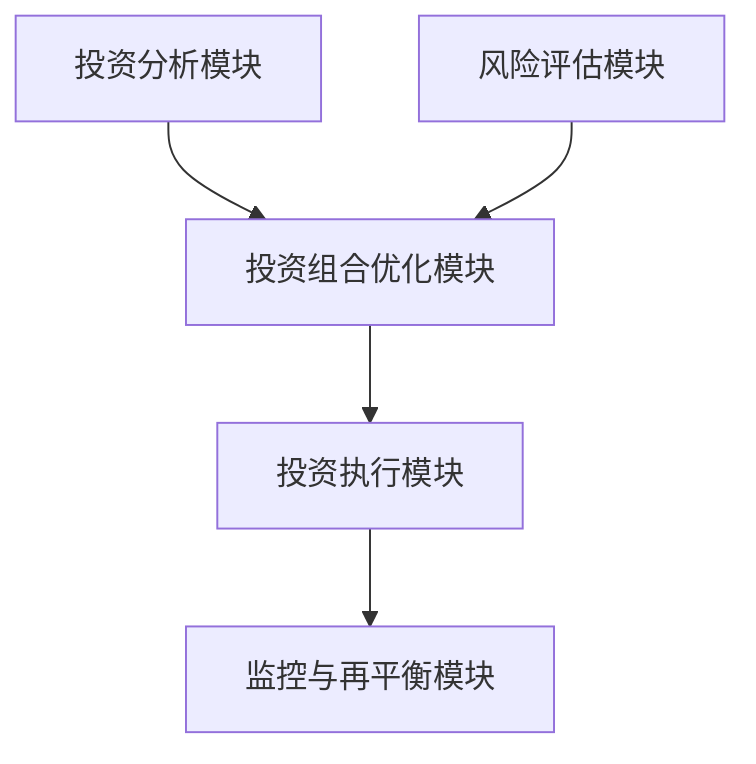

                 


# 彼得林奇的"耐心资本"投资案例

## 关键词
- 彼得林奇
- 耐心资本
- 投资策略
- 股票分析
- 财务模型

## 摘要
本文详细探讨了彼得林奇的“耐心资本”投资理念，通过分析其核心概念、数学模型、系统架构设计以及实际案例，揭示了耐心资本在投资中的重要性。文章从背景介绍、投资哲学、数学模型、系统架构到项目实战，层层深入，帮助读者全面理解并应用这一策略。

---

## 第一部分：耐心资本概述

### 第1章：耐心资本的定义与背景

#### 1.1 耐心资本的定义
耐心资本是指投资者长期持有优质资产，通过时间和复利效应实现财富增长的投资策略。其核心在于选择具有持续竞争优势和良好管理的公司，长期持有，避免频繁交易。

#### 1.2 耐心资本的核心要素
- **时间**：长期持有，复利效应。
- **优质资产**：选择具有持续竞争优势的公司。
- **耐心**：避免短期波动，坚持长期策略。

#### 1.3 耐心资本与传统投资的区别
| 特性 | 耐心资本 | 传统投资 |
|------|----------|----------|
| 持股期限 | 长期 | 短期或中期 |
| 交易频率 | 低 | 高 |
| 风险承受 | 较高 | 较低 |
| 投资目标 | 长期增长 | 短期收益 |

---

## 第二部分：彼得林奇的投资理念

### 第2章：彼得林奇的投资哲学

#### 2.1 彼得林奇的投资理念
彼得林奇强调长期投资和选择优质公司的能力。他认为，成功的投资在于选择那些具有强大竞争优势、良好管理和稳定增长的公司。

#### 2.2 彼得林奇的成功案例
- **案例分析**：以可口可乐为例，长期持有带来的复利效应。
- **成功因素**：选择具有强大品牌和竞争优势的公司。
- **案例启示**：长期持有优质资产的重要性。

---

## 第三部分：耐心资本的数学模型与算法原理

### 第3章：耐心资本的数学模型

#### 3.1 投资回报的数学模型
- **复利计算公式**：
  $$ A = P(1 + r)^n $$
  其中，A为终值，P为本金，r为年收益率，n为年数。

- **风险与回报的关系**：
  $$ E(r) = \beta \cdot E(m) $$
  其中，$\beta$为贝塔系数，衡量资产的系统性风险，$E(m)$为市场预期收益率。

#### 3.2 耐心资本的优化算法
- **算法步骤**：
  1. 确定投资目标和风险承受能力。
  2. 选择具有竞争优势的公司。
  3. 构建投资组合，分散风险。
  4. 长期持有，定期再平衡。

- **流程图**：
  ```mermaid
  graph TD
      A[开始] --> B[确定投资目标]
      B --> C[选择优质资产]
      C --> D[构建投资组合]
      D --> E[长期持有]
      E --> F[定期再平衡]
      F --> G[结束]
  ```

---

## 第四部分：系统架构设计

### 第4章：耐心资本投资系统的架构设计

#### 4.1 系统功能设计
- **投资分析模块**：分析公司基本面，评估投资价值。
- **风险评估模块**：计算系统性和非系统性风险。
- **投资组合优化模块**：基于风险承受能力，构建最优组合。

#### 4.2 系统架构图


---

## 第五部分：项目实战

### 第5章：耐心资本投资系统的实现

#### 5.1 环境安装与配置
- **开发环境**：Python、Jupyter Notebook、数据处理工具。

#### 5.2 核心代码实现
- **股票筛选函数**：
  ```python
  def select_stocks():
      # 筛选具有高ROE和稳定增长的公司
      stocks = [stock for stock in all_stocks if stock.roe > 0.1 and stock.growth > 0.05]
      return stocks
  ```

- **投资组合优化函数**：
  ```python
  def optimize_portfolio(stocks):
      # 使用均值-方差优化模型
      from pypfolio import PortfolioOptimization
      po = PortfolioOptimization(stocks)
      return po.optimize()
  ```

#### 5.3 代码应用解读与分析
- **股票筛选**：通过ROE（净资产收益率）和增长性指标筛选出优质公司。
- **投资组合优化**：使用均值-方差模型构建最优组合，分散风险。

#### 5.4 案例分析与详细讲解
- **案例分析**：以彼得林奇的经典投资组合为例，展示如何通过长期持有实现收益最大化。
- **详细讲解**：分析每一步骤的逻辑和数学原理。

#### 5.5 项目小结
通过实际案例，验证耐心资本策略的有效性，强调长期持有优质资产的重要性。

---

## 第六部分：最佳实践

### 第6章：最佳实践

#### 6.1 小结
耐心资本是一种有效的投资策略，强调长期持有和选择优质资产。通过系统的分析和优化，可以显著提高投资回报。

#### 6.2 注意事项
- **风险控制**：定期监控投资组合，及时调整。
- **持续学习**：关注市场变化，更新投资策略。

#### 6.3 拓展阅读
- 《彼得·林奇的成功投资》
- 《投资学》

---

## 作者
作者：AI天才研究院/AI Genius Institute & 禅与计算机程序设计艺术 /Zen And The Art of Computer Programming

---

通过以上结构和内容，文章详细解析了彼得林奇的耐心资本投资策略，结合数学模型、系统架构和实际案例，帮助读者全面理解和应用这一投资理念。

