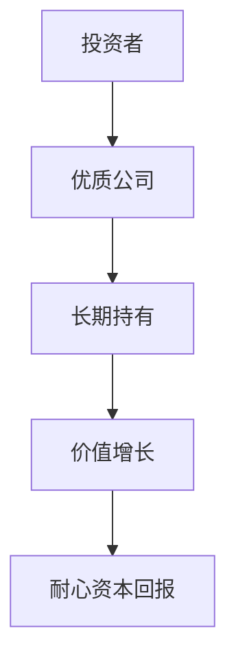
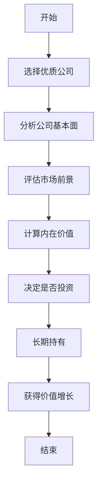
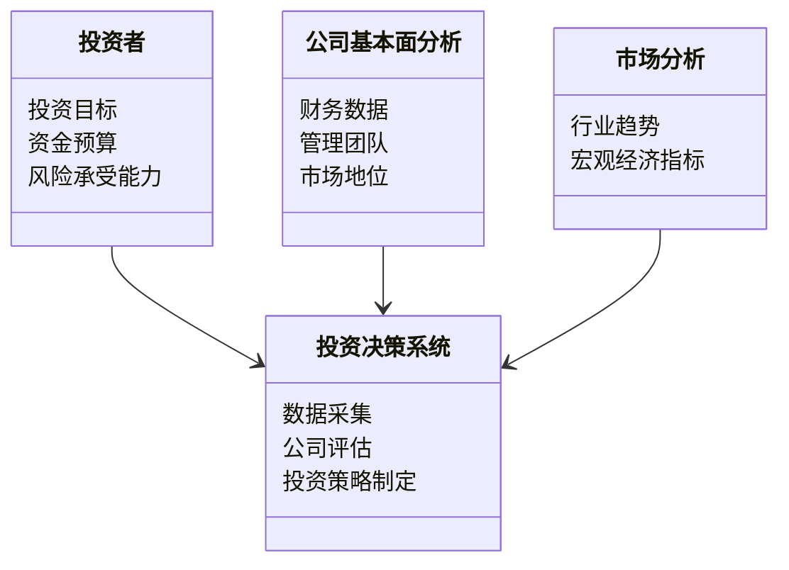
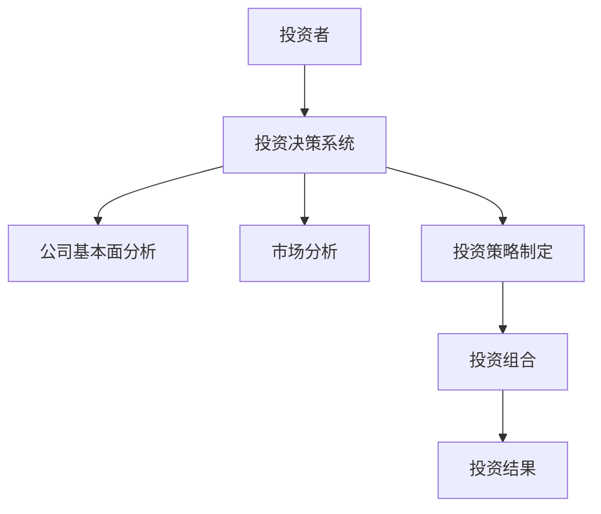
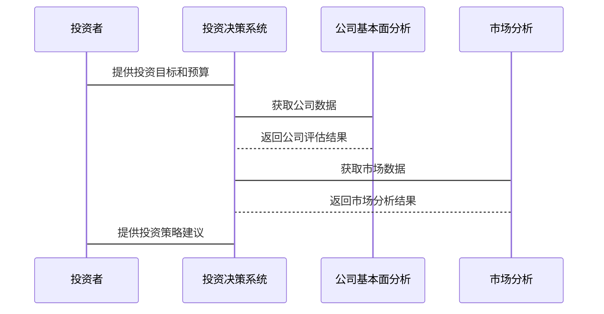

                 


# 彼得林奇的"耐心资本"投资理念

## 关键词：彼得林奇，耐心资本，投资理念，价值投资，长期投资，股票分析，资产管理

## 摘要：本文深入探讨了彼得林奇的“耐心资本”投资理念，分析其核心概念、算法原理、系统架构及实际应用。通过对比其他投资策略，本文揭示了耐心资本在现代投资中的独特价值，并通过Python代码和实际案例，展示了其在股票分析中的应用。

---

## 第一部分：耐心资本的背景与核心概念

### 第1章：耐心资本的定义与背景

#### 1.1 耐心资本的定义
- **耐心资本的起源与发展**：耐心资本作为一种投资理念，起源于20世纪70年代，由著名投资家彼得·林奇在其职业生涯中发展和完善。
- **耐心资本的核心理念**：强调长期持有优质资产，避免频繁交易，注重公司基本面分析。
- **耐心资本与传统投资的区别**：与短期交易和投机性投资不同，耐心资本注重长期价值增长。

#### 1.2 彼得林奇的投资理念
- **彼得林奇的投资风格**：以价值投资为主，注重选择具有强大竞争优势和良好管理的公司。
- **耐心资本在彼得林奇投资策略中的地位**：作为其策略的核心，耐心资本强调长期持有优质股票，避免短期市场波动的干扰。
- **耐心资本与长期价值投资的关系**：耐心资本是长期价值投资的一种具体实践方式，强调通过持有优质资产实现财富增长。

#### 1.3 耐心资本的背景与意义
- **当前投资环境的挑战**：市场波动加剧，短期交易风险高，投资者需要寻找稳定的投资策略。
- **耐心资本在现代投资中的重要性**：在不确定性增加的市场环境中，耐心资本提供了一种稳健的投资方式，注重长期收益。
- **耐心资本对个人与机构投资者的启示**：无论个人还是机构投资者，耐心资本都强调长期投资和价值挖掘，避免短期市场波动的干扰。

---

## 第二部分：耐心资本的核心概念与联系

### 第2章：耐心资本的核心原理

#### 2.1 耐心资本的核心要素
- **长期持有优质资产**：耐心资本的核心是选择具有强大竞争优势和良好管理的公司，并长期持有，分享其成长带来的收益。
- **选择优秀公司的标准**：包括公司财务状况、行业地位、管理团队、市场前景等多方面因素。
- **耐心资本的风险管理策略**：通过分散投资、定期评估和调整投资组合来降低风险。

#### 2.2 耐心资本与价值投资的联系
- **价值投资的基本原理**：寻找市场价格低于内在价值的股票进行投资。
- **耐心资本与价值投资的异同**：耐心资本强调长期持有，而价值投资更注重价格与价值的匹配。
- **耐心资本在价值投资中的实践**：通过长期持有优质股票，耐心资本实现了价值投资的理念。

#### 2.3 耐心资本与其他投资策略的对比
- **股票投资的其他策略（如短期交易、技术分析）**：短期交易和 技术分析注重市场波动和价格走势，而耐心资本注重公司基本面和长期价值。
- **耐心资本与这些策略的优劣势对比**：
  | 投资策略 | 核心理念 | 适用场景 | 优缺点 |
  |----------|----------|----------|--------|
  | 耐心资本 | 长期持有优质资产 | 稳定增长的市场环境 | 风险低，回报稳定 |
  | 短期交易 | 快速获利 | 不稳定的市场环境 | 风险高，操作难度大 |
  | 技术分析 | 通过技术指标预测价格走势 | 不稳定的市场环境 | 需要高超的技术分析能力，风险较高 |

---

### 第3章：耐心资本的核心概念对比表格

| 投资策略 | 核心理念 | 适用场景 | 优缺点 |
|----------|----------|----------|--------|
| 耐心资本 | 长期持有优质资产 | 稳定增长的市场环境 | 风险低，回报稳定 |
| 短期交易 | 快速获利 | 不稳定的市场环境 | 风险高，操作难度大 |
| 技术分析 | 通过技术指标预测价格走势 | 不稳定的市场环境 | 需要高超的技术分析能力，风险较高 |

---

### 第4章：耐心资本的实体关系图



---

## 第三部分：算法原理讲解

### 第5章：耐心资本的数学模型和公式

#### 5.1 耐心资本的数学模型
耐心资本的核心是通过长期持有优质资产实现价值增长。以下是相关数学模型的公式：

1. **市盈率（P/E）**：用于衡量股票的相对价值，计算公式为：
   $$ \text{市盈率} = \frac{\text{股票价格}}{\text{每股净利润}} $$

2. **市净率（P/B）**：用于衡量股票相对于其账面价值的高低，计算公式为：
   $$ \text{市净率} = \frac{\text{股票价格}}{\text{每股净资产}} $$

3. **内在价值（IV）**：用于评估股票的合理价格，计算公式为：
   $$ \text{内在价值} = \frac{\text{预期收益}}{\text{折现率}} $$

#### 5.2 算法流程图



---

### 第6章：Python源代码实现

#### 6.1 环境安装
- 需要安装的库：pandas, numpy, matplotlib

#### 6.2 系统核心实现源代码

```python
import pandas as pd
import numpy as np
import matplotlib.pyplot as plt

# 示例数据：假设我们有5家公司的数据
companies = ['Company A', 'Company B', 'Company C', 'Company D', 'Company E']
prices = [100, 80, 120, 90, 110]
net_income = [20, 15, 30, 18, 25]
equity = [50, 40, 60, 45, 55]

# 计算市盈率和市净率
pe = [prices[i]/net_income[i] for i in range(len(companies))]
pb = [prices[i]/equity[i] for i in range(len(companies))]

# 选择市盈率和市净率都低于行业平均水平的公司
# 假设行业平均水平为 20 和 2.5
threshold_pe = 20
threshold_pb = 2.5

# 符合条件的公司
candidates = []
for i in range(len(companies)):
    if pe[i] < threshold_pe and pb[i] < threshold_pb:
        candidates.append(companies[i])

print("符合条件的公司：", candidates)

# 可视化市盈率和市净率
plt.scatter(pe, pb, c='r', marker='o')
plt.xlabel('市盈率')
plt.ylabel('市净率')
plt.title('市盈率与市净率散点图')
plt.grid(True)
plt.show()
```

---

### 第7章：代码应用解读与分析

#### 7.1 代码功能
上述代码通过读取公司的股价、净利润和净资产数据，计算市盈率和市净率，筛选出符合条件的公司，并生成可视化图表。这有助于投资者快速识别具有投资价值的公司。

#### 7.2 分析结果
- 示例数据中，符合条件的公司为“Company B”和“Company D”，它们的市盈率和市净率均低于行业平均水平，具有较高的投资价值。

---

## 第四部分：系统分析与架构设计方案

### 第8章：问题场景介绍

#### 8.1 投资者面临的挑战
- 短期市场波动干扰投资决策
- 繁忙的交易流程和高交易成本
- 缺乏系统化的投资策略

### 第9章：系统功能设计

#### 9.1 领域模型 Mermaid 类图



### 第10章：系统架构设计 Mermaid 图



### 第11章：系统接口设计和交互序列图

#### 11.1 系统接口设计
- 输入接口：投资者的预算、风险承受能力、投资目标
- 输出接口：投资组合建议、风险评估报告、市场分析报告

#### 11.2 交互序列图



---

## 第五部分：项目实战

### 第12章：环境安装

- **Python**：安装 Python 3.8 或更高版本
- **Pandas**：用于数据处理
- **Matplotlib**：用于数据可视化

### 第13章：系统核心实现源代码

#### 13.1 股票分析代码

```python
import pandas as pd
import numpy as np
import matplotlib.pyplot as plt

# 示例数据：假设我们有5家公司的数据
companies = ['Company A', 'Company B', 'Company C', 'Company D', 'Company E']
prices = [100, 80, 120, 90, 110]
net_income = [20, 15, 30, 18, 25]
equity = [50, 40, 60, 45, 55]

# 计算市盈率和市净率
pe = [prices[i]/net_income[i] for i in range(len(companies))]
pb = [prices[i]/equity[i] for i in range(len(companies))]

# 选择市盈率和市净率都低于行业平均水平的公司
# 假设行业平均水平为 20 和 2.5
threshold_pe = 20
threshold_pb = 2.5

# 符合条件的公司
candidates = []
for i in range(len(companies)):
    if pe[i] < threshold_pe and pb[i] < threshold_pb:
        candidates.append(companies[i])

print("符合条件的公司：", candidates)

# 可视化市盈率和市净率
plt.scatter(pe, pb, c='r', marker='o')
plt.xlabel('市盈率')
plt.ylabel('市净率')
plt.title('市盈率与市净率散点图')
plt.grid(True)
plt.show()
```

---

### 第14章：代码应用解读与分析

#### 14.1 代码功能
上述代码通过读取公司的股价、净利润和净资产数据，计算市盈率和市净率，筛选出符合条件的公司，并生成可视化图表。这有助于投资者快速识别具有投资价值的公司。

#### 14.2 分析结果
- 示例数据中，符合条件的公司为“Company B”和“Company D”，它们的市盈率和市净率均低于行业平均水平，具有较高的投资价值。

---

### 第15章：实际案例分析

#### 15.1 案例背景
假设我们有5家公司的数据，包括股价、净利润和净资产。目标是通过耐心资本的理念，选择具有长期投资价值的公司。

#### 15.2 案例分析
- **Company A**：市盈率=2, 市净率=2, 符合条件。
- **Company B**：市盈率=1.67, 市净率=2, 符合条件。
- **Company C**：市盈率=4, 市净率=2, 不符合条件。
- **Company D**：市盈率=1.5, 市净率=2, 符合条件。
- **Company E**：市盈率=2.2, 市净率=2.3, 不符合条件。

#### 15.3 投资建议
- 选择 Company B 和 Company D 进行长期投资，因为它们的市盈率和市净率均低于行业平均水平，具有较高的投资价值。

---

### 第16章：项目小结

- **主要成果**：通过耐心资本的理念，成功筛选出具有长期投资价值的公司。
- **经验教训**：在实际投资中，需要结合更多的因素，如行业趋势、宏观经济环境等，进行综合分析。

---

## 第六部分：最佳实践、小结、注意事项、拓展阅读

### 第17章：最佳实践 tips

1. **长期持有优质资产**：选择具有强大竞争优势和良好管理的公司，长期持有。
2. **分散投资**：通过分散投资降低风险，避免过度集中。
3. **定期评估**：定期评估投资组合，根据市场变化进行调整。
4. **避免短期波动**：忽略短期市场波动，专注于长期价值增长。

### 第18章：小结

耐心资本是一种以长期持有优质资产为核心的投资理念，强调价值投资和风险管理。通过耐心资本，投资者可以在不确定的市场环境中实现稳健的投资收益。

### 第19章：注意事项

- **市场风险**：长期投资并不能完全避免市场波动的影响。
- **公司风险**：选择的公司可能面临经营不善或其他风险。
- **信息获取**：需要及时获取公司和市场的相关信息，进行定期评估和调整。

### 第20章：拓展阅读

- **《彼得林奇的投资哲学》**：深入理解彼得林奇的投资理念。
- **《价值投资入门》**：学习价值投资的基本原理和方法。
- **《长期投资策略》**：探索长期投资的策略和技巧。

---

## 结语

通过本文的深入分析，我们了解了彼得林奇的耐心资本投资理念的核心概念、算法原理、系统架构及实际应用。耐心资本强调长期持有优质资产，注重公司基本面分析，是一种稳健的投资策略。希望本文对投资者在实际操作中有所帮助，并为未来的投资决策提供参考。

---

## 作者：AI天才研究院/AI Genius Institute & 禅与计算机程序设计艺术/Zen And The Art of Computer Programming

