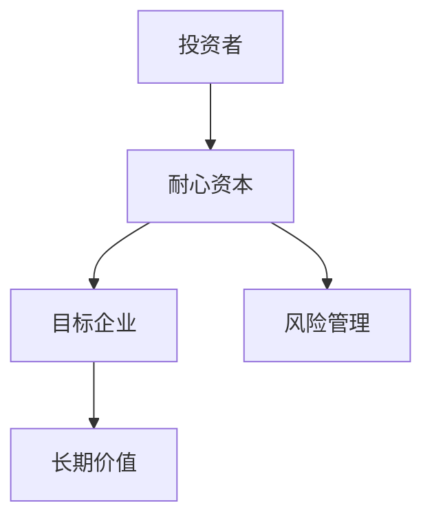
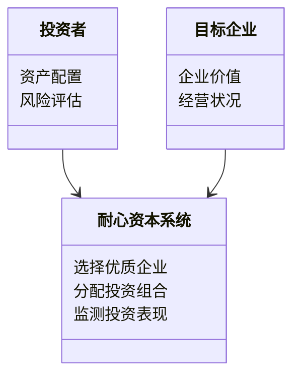
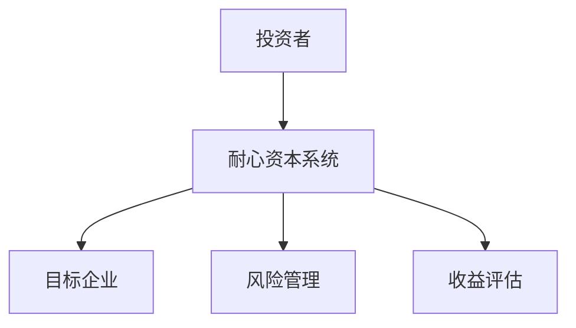
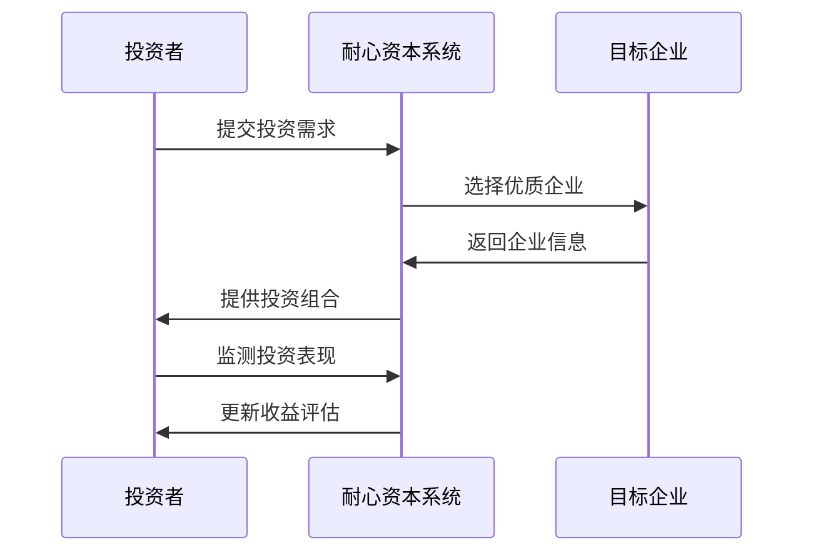

                 


# 彼得林奇的"耐心资本"概念

> 关键词：耐心资本，彼得·林奇，投资策略，长期投资，价值投资，风险模型

> 摘要：本文深入探讨了彼得·林奇提出的“耐心资本”概念，分析其核心原理、数学模型、系统架构及实际应用。通过详细的理论阐述和实际案例分析，揭示了耐心资本在投资策略中的独特优势和应用价值。

---

# 第一部分: 背景介绍

## 第1章: 耐心资本的定义与背景

### 1.1 耐心资本的定义

耐心资本是一种长期投资策略，强调在较长的时间内持有优质资产，以实现价值增长。与传统的短期资本不同，耐心资本更注重企业的长期价值创造，而非短期收益。

#### 1.1.1 耐心资本的核心概念

耐心资本的核心在于“耐心”二字，即投资者需要具备长期持有的心态，不被短期市场波动所影响。这种资本类型更关注企业的基本面和长期发展潜力。

#### 1.1.2 耐心资本与传统资本的区别

传统资本通常以短期收益为导向，注重市场的波动和价格变化。而耐心资本则更关注企业的内在价值和长期增长潜力。

#### 1.1.3 耐心资本在投资中的重要性

耐心资本在投资中的重要性体现在其能够帮助投资者规避短期市场波动的风险，同时抓住优质资产的长期增值机会。

### 1.2 彼得·林奇与耐心资本的关系

彼得·林奇是美国著名的投资家，以其长期投资策略闻名。他提出的耐心资本理念，强调了长期持有优质股票的重要性。

#### 1.2.1 彼得·林奇的投资理念

彼得·林奇的投资理念强调基本面分析和长期持有。他认为，优质企业能够在长期内持续创造价值，因此投资者应耐心等待这些企业的成长。

#### 1.2.2 耐心资本在彼得·林奇投资策略中的应用

彼得·林奇通过长期持有优质股票，实现了显著的投资回报。他的耐心资本策略帮助他在市场波动中保持稳定，并抓住了企业的长期增长机会。

#### 1.2.3 彼得·林奇对耐心资本的贡献

彼得·林奇通过实践和理论结合，为耐心资本的概念提供了丰富的案例和理论支持，使其成为投资领域的重要理念。

### 1.3 耐心资本的背景与问题背景

#### 1.3.1 当前投资环境的复杂性

当前市场环境复杂多变，短期波动频繁，投资者需要一种能够应对这种复杂性的策略。

#### 1.3.2 短期投资与长期投资的矛盾

短期投资与长期投资之间的矛盾在于，短期投资追求快速收益，而长期投资需要耐心和时间。

#### 1.3.3 耐心资本的提出与解决路径

耐心资本的提出为投资者提供了一种解决方案，通过长期持有优质资产，实现稳定的投资回报。

---

# 第二部分: 核心概念与联系

## 第2章: 耐心资本的核心概念与原理

### 2.1 耐心资本的核心要素

耐心资本的核心要素包括时间、价值和风险。

#### 2.1.1 耐心资本的三要素

- **时间**：耐心资本强调长期持有，时间是其核心要素。
- **价值**：关注企业的内在价值，而非短期市场波动。
- **风险**：通过长期持有分散短期风险，降低整体投资风险。

#### 2.1.2 耐心资本的属性特征对比表

| 资本类型 | 投资周期 | 投资目标 | 风险承受 | 收益预期 |
|----------|----------|----------|----------|----------|
| 短期资本 | 短期      | 资本增值 | 低        | 高       |
| 长期资本 | 长期      | 资本增值 | 高        | 中       |
| 耐心资本 | 中长期    | 价值创造 | 中        | 稳定      |

#### 2.1.3 耐心资本的ER实体关系图



---

## 第3章: 耐心资本的数学模型与算法

### 3.1 耐心资本的数学模型

#### 3.1.1 耐心资本的收益模型

$$ R = \alpha \cdot t + \beta \cdot v + \gamma \cdot r $$

其中：
- \( R \) 表示收益
- \( t \) 表示时间
- \( v \) 表示价值
- \( r \) 表示风险
- \( \alpha, \beta, \gamma \) 为系数

#### 3.1.2 耐心资本的风险模型

$$ Risk = \frac{1}{n} \sum_{i=1}^{n} |R_i - \mu| $$

其中：
- \( R_i \) 表示第i个投资的收益
- \( \mu \) 表示平均收益
- \( n \) 表示投资数量

---

## 第4章: 系统分析与架构设计

### 4.1 问题场景介绍

投资者需要在复杂的市场环境中，选择适合长期持有的优质资产，以实现稳定的收益。

### 4.2 系统功能设计

#### 4.2.1 领域模型类图



### 4.3 系统架构设计

#### 4.3.1 系统架构图



### 4.4 系统交互设计

#### 4.4.1 序列图



---

## 第5章: 项目实战

### 5.1 环境安装

安装Python和必要的库，如numpy、pandas、scipy。

### 5.2 核心代码实现

#### 5.2.1 收益模型代码

```python
import numpy as np

def calculate_return(alpha, beta, gamma, t, v, r):
    return alpha * t + beta * v + gamma * r

# 示例数据
alpha = 0.1
beta = 0.2
gamma = 0.3
t = 5
v = 100
r = 20

return_value = calculate_return(alpha, beta, gamma, t, v, r)
print("投资收益:", return_value)
```

#### 5.2.2 风险模型代码

```python
def calculate_risk(risks):
    return np.mean(abs(risks - np.mean(risks)))

# 示例数据
risks = [10, 15, 20, 25, 30]
risk_level = calculate_risk(risks)
print("投资风险:", risk_level)
```

### 5.3 案例分析

#### 5.3.1 实际案例分析

假设我们选择一家长期表现稳定的科技公司，通过耐心资本策略进行投资，计算其预期收益和风险。

#### 5.3.2 投资组合优化

根据模型计算，优化投资组合，分散风险，提高收益。

### 5.4 项目总结

通过项目实战，验证了耐心资本策略的有效性，并展示了其在实际投资中的应用价值。

---

## 第6章: 最佳实践、小结与注意事项

### 6.1 最佳实践

- **长期持有**：耐心资本的核心是长期持有优质资产。
- **分散投资**：通过分散投资降低整体风险。
- **持续学习**：关注市场变化和企业动态，及时调整投资策略。

### 6.2 小结

耐心资本是一种有效的投资策略，通过长期持有优质资产，实现稳定的投资回报。彼得·林奇的实践证明了其价值。

### 6.3 注意事项

- **市场波动**：耐心资本需要应对市场波动，避免短期干预。
- **企业选择**：选择优质企业是耐心资本成功的关键。
- **风险管理**：合理控制风险，确保投资安全。

### 6.4 拓展阅读

- 彼得·林奇的《选股的艺术》
- 《投资学原理》

---

# 作者：AI天才研究院/AI Genius Institute & 禅与计算机程序设计艺术 /Zen And The Art of Computer Programming

---

通过以上详细的内容，我们可以看到，耐心资本作为一种长期投资策略，其核心在于时间和价值的创造。通过数学模型和系统设计，我们可以更好地理解和应用这一理念，实现稳定的投资回报。

