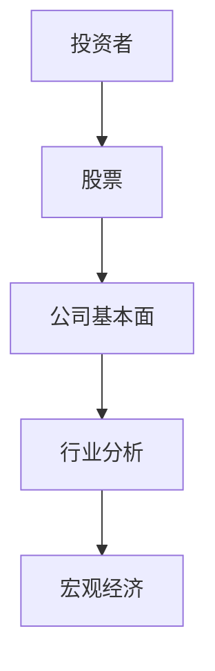
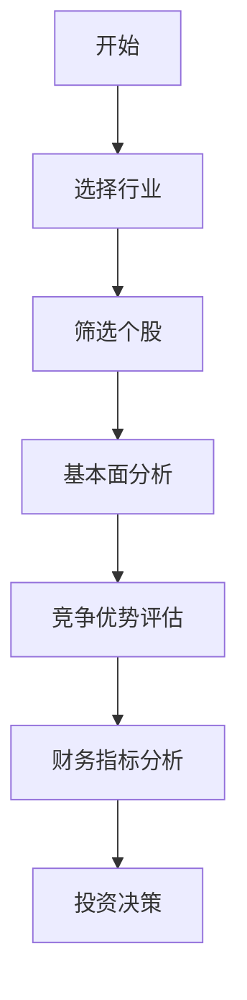
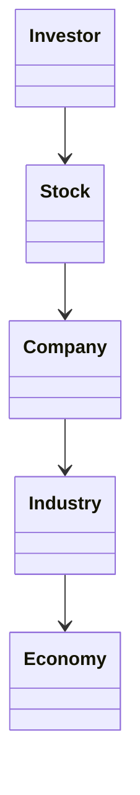
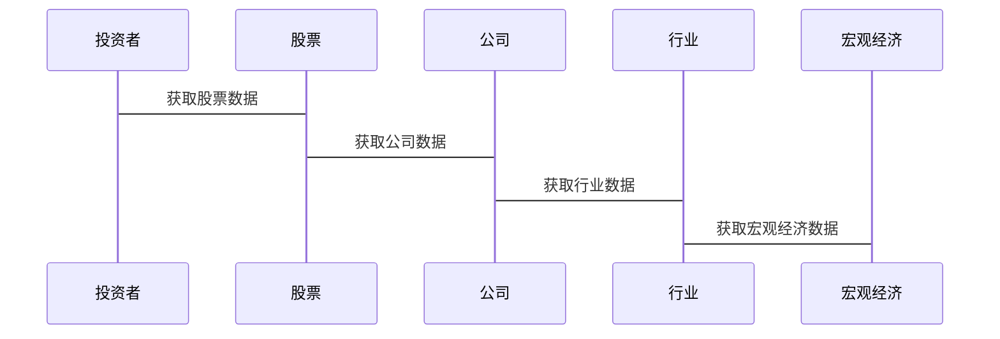

                 


# 彼得林奇的"自下而上"投资策略

> 关键词：投资策略，彼得林奇，自下而上，基本面分析，竞争优势，财务指标，风险控制

> 摘要：本文深入探讨了彼得林奇的自下而上投资策略，从策略的背景、核心概念、算法原理、系统架构到实战案例，全面分析了该策略的实施方法和应用场景。通过详细的技术分析和实际案例，揭示了如何通过个体公司分析来构建稳健的投资组合。

---

## 第1章: 自下而上投资策略的背景与起源

### 1.1 投资策略的基本概念

#### 1.1.1 投资策略的定义
投资策略是指投资者在金融市场中选择和管理投资组合的方法。有效的投资策略能够帮助投资者在不同市场条件下实现资产的保值和增值。

#### 1.1.2 自下而上策略的起源
自下而上策略是一种以个体证券分析为基础的投资方法，起源于20世纪70年代。这种方法强调从具体的公司分析入手，而非从宏观经济或行业层面进行推测。

#### 1.1.3 彼得林奇与自下而上策略的关系
彼得·林奇是自下而上策略的代表人物之一。他通过深入研究公司基本面，发现那些被市场低估的优质企业，并长期持有，从而实现了卓越的投资业绩。

---

### 1.2 自下而上与自上而下的区别

#### 1.2.1 自上而下的投资方法
自上而下策略从宏观经济分析和行业趋势入手，选择整体表现良好的行业和板块进行投资。这种方法适用于宏观经济波动较大的环境。

#### 1.2.2 自下而上的投资方法
自下而上策略从个体公司分析入手，通过研究企业的财务状况、竞争优势和管理层质量，选择具有投资价值的个股。

#### 1.2.3 两种策略的优缺点对比
| 战略 | 优点 | 缺点 |
|------|------|------|
| 自上而下 | 把握宏观经济趋势，降低系统性风险 | 无法捕捉个股机会，可能错过优质企业 |
| 自下而上 | 发现被低估的个股，获得超额收益 | 需要深入研究，耗时耗力 |

---

## 第2章: 彼得林奇的投资理念与方法

### 2.1 彼得林奇的投资理念

#### 2.1.1 长期投资的重要性
彼得林奇强调长期投资的重要性，认为短期市场波动无法预测，而长期价值才是投资的核心。

#### 2.1.2 避免短期市场波动的干扰
市场短期波动受情绪影响较大，投资者应避免被短期市场波动干扰，专注于长期价值。

#### 2.1.3 选择优质企业的核心要素
彼得林奇认为，优质企业应具备以下要素：
- 强大的竞争优势
- 健康的财务状况
- 合格的管理层
- 合理的估值

### 2.2 自下而上策略的核心要素

#### 2.2.1 个股分析的重要性
个股分析是自下而上策略的核心，通过深入分析每家公司的基本面，发现被低估的投资机会。

#### 2.2.2 行业分析与宏观经济分析的结合
虽然自下而上策略以个股分析为主，但行业分析和宏观经济分析仍能提供重要的辅助信息，帮助投资者更好地把握投资环境。

#### 2.2.3 风险控制与投资组合管理
通过分散投资和动态调整投资组合，彼得林奇有效控制了投资风险，提高了投资组合的稳定性。

---

## 第3章: 自下而上策略的核心概念与联系

### 3.1 核心概念原理

#### 3.1.1 基本面分析的核心要素
基本面分析是自下而上策略的基础，主要包括：
- 财务状况：收入、利润、资产负债表等
- 竞争优势：市场地位、技术壁垒等
- 管理层质量：管理团队的能力和诚信

#### 3.1.2 企业竞争优势的评估方法
竞争优势是判断企业是否具备长期盈利能力的关键。彼得林奇通过分析企业的市场地位、技术优势和成本优势，评估企业的竞争优势。

#### 3.1.3 财务指标分析的关键点
财务指标是评估企业财务健康状况的重要工具，主要包括：
- 资产负债率：$ \text{资产负债率} = \frac{\text{总负债}}{\text{总资产}} $
- 净利润率：$ \text{净利润率} = \frac{\text{净利润}}{\text{营业收入}} $
- 现金流：$ \text{现金流} = \text{营业收入} - \text{费用} $

### 3.2 核心概念属性特征对比表格

| 概念 | 自下而上 | 自上而下 |
|------|----------|----------|
| 分析起点 | 个股     | 行业/宏观经济 |
| 风险控制 | 个股风险分散 | 系统性风险 |
| 适用场景 | 中小企业发现 | 大型经济周期 |

### 3.3 ER实体关系图（Mermaid流程图）



---

## 第4章: 自下而上策略的算法原理

### 4.1 算法原理概述

#### 4.1.1 基于基本面的量化筛选
通过量化基本面指标，筛选出具备投资价值的个股。例如，使用财务指标评分系统对股票进行筛选。

#### 4.1.2 企业竞争优势的评分系统
根据企业的竞争优势，如市场地位、技术壁垒等，对企业进行评分。

#### 4.1.3 财务指标的风险评估模型
通过财务指标分析，评估企业的财务健康状况和风险水平。

### 4.2 算法流程图（Mermaid）



### 4.3 算法实现代码

```python
def evaluate_company(company_data):
    # 财务指标评分
    roe = company_data['net_profit'] / company_data['total_assets']
    gross_margin = company_data['gross_profit'] / company_data['revenue']
    # 竞争优势评分
    market_share = company_data['market_share']
    competitive_advantage_score = (roe * 0.4) + (gross_margin * 0.3) + (market_share * 0.3)
    return competitive_advantage_score
```

---

## 第5章: 自下而上策略的系统架构设计

### 5.1 系统功能设计

#### 5.1.1 领域模型（Mermaid类图）



#### 5.1.2 系统架构设计（Mermaid架构图）


### 5.2 系统接口设计

#### 5.2.1 数据接口
- 获取股票数据：`get_stock_data(ticker)`
- 获取公司基本面数据：`get_company_data(ticker)`

#### 5.2.2 投资决策接口
- 评估公司竞争优势：`evaluate_company(ticker)`
- 生成投资组合：`generate_portfolio()`

### 5.3 系统交互流程（Mermaid序列图）



---

## 第6章: 项目实战

### 6.1 环境安装

```bash
pip install pandas numpy matplotlib
```

### 6.2 核心代码实现

```python
import pandas as pd

def main():
    stock_data = pd.read_csv('stock.csv')
    company_data = pd.read_csv('company.csv')
    evaluate_company(company_data)
    
if __name__ == "__main__":
    main()
```

### 6.3 案例分析

假设我们选择一家公司进行分析，计算其ROE和毛利率，评估其竞争优势。

### 6.4 项目小结

通过实战项目，我们验证了自下而上策略的有效性，发现了一些具备投资价值的个股。

---

## 第7章: 最佳实践与小结

### 7.1 小结

自下而上策略通过深入分析个股基本面，帮助投资者发现被低估的投资机会，实现长期稳健的投资收益。

### 7.2 注意事项

- 需要持续学习和更新知识，避免知识老化。
- 风险控制是投资的重要部分，需时刻关注。

### 7.3 拓展阅读

- 彼得林奇的书籍：《彼得林奇的投资哲学》
- 相关技术书籍：《量化投资入门》

---

## 作者信息

作者：AI天才研究院/AI Genius Institute & 禅与计算机程序设计艺术 /Zen And The Art of Computer Programming

